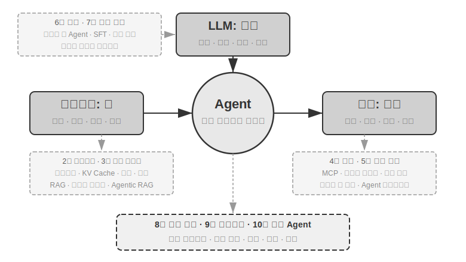

# AI Agent 심층 이해

> 설계 원리와 엔지니어링 실전 — 한국어 학습 안내서

**한국어** · [English](README.en.md) · [中文 원문](book/) · [Tiếng Việt](README.vi.md) · [தமிழ்](README.ta.md)

이 저장소는 《AI Agent 심층 이해: 설계 원리와 엔지니어링 실전》의 본문과 실습 코드를 담고 있습니다. 이 README는 [`book-ko`](book-ko/)의 한국어 번역을 기준으로, 책을 처음 접하는 독자가 **읽기 → 개념 확인 → 실습 → 복습** 순서로 학습할 수 있도록 구성했습니다.

> [!NOTE]
> 한국어 번역은 현재 **들어가며와 1~2장**까지 제공됩니다. 3~10장의 한국어 본문은 번역이 추가되는 대로 이 README에도 반영할 예정입니다. 전체 내용이 필요하면 [중국어 원문](book/) 또는 [영문판](book-en/)을 참고하세요.

## 가장 먼저 읽기

처음 방문했다면 아래 순서만 따라가도 됩니다.

1. [들어가며](book-ko/introduction.ko.md)에서 책의 목표, 전체 구성, 선수 지식을 확인합니다.
2. [1장 · AI Agent 입문](book-ko/chapter1.ko.md)을 읽으며 핵심 공식과 ReAct 루프를 이해합니다.
3. [2장 · 컨텍스트 엔지니어링](book-ko/chapter2.ko.md)에서 메시지 구조, KV Cache, 프롬프트, Skills, 컨텍스트 압축을 익힙니다.
4. [실험 1-1](chapter1/context/)로 컨텍스트 구성 요소를 비교합니다.
5. [실험 1-2](chapter1/web-search-agent/)로 ReAct 궤적을 관찰합니다.
6. [실험 1-3](chapter1/search-codegen/)으로 모델의 네이티브 도구 호출 구조를 확인합니다.
7. 각 장 끝의 **이 장의 요약**과 **생각해 볼 문제**로 스스로 설명해 봅니다.

## 이 책을 관통하는 공식



> **Agent = LLM + 컨텍스트 + 도구**

| 구현 관점 | 직관적인 비유 | 강화 학습 관점 | 하는 일 |
| --- | --- | --- | --- |
| LLM | 두뇌 | 정책(Policy) | 생각하고 다음 행동을 결정합니다. |
| 컨텍스트 | 눈 | 관찰 공간(Observation Space) | Agent가 볼 수 있는 정보의 범위를 결정합니다. |
| 도구 | 손발 | 행동 공간(Action Space) | 검색, 계산, 파일 조작 등 외부 세계에 행동합니다. |

세 요소를 연결하는 기본 동작은 **ReAct 루프**입니다.

```text
생각(Reasoning) → 행동(Acting) → 관찰(Observation)
        ↑                              ↓
        └──────── 작업이 끝날 때까지 반복 ────────┘
```

1장에서는 여기서 한 단계 더 나아가, 모델 밖에서 Agent를 안정적으로 움직이게 만드는 **Harness 엔지니어링**을 설명합니다. 컨텍스트와 도구를 단순히 제공하는 데서 끝나지 않고 제약, 검증, 교정, 가드레일, 사람의 개입까지 함께 설계하는 것이 핵심입니다.

## 한국어판 학습 목차

| 순서 | 읽을 내용 | 학습 목표 | 상태 |
| --- | --- | --- | --- |
| 0 | [들어가며](book-ko/introduction.ko.md) | 책의 문제의식, 전체 구조, 학습 방법 파악 | ✅ 한국어 |
| 1 | [AI Agent 입문](book-ko/chapter1.ko.md) | 핵심 공식, ReAct, Harness, 오케스트레이션, 안전 | ✅ 한국어 |
| 2 | [컨텍스트 엔지니어링](book-ko/chapter2.ko.md) | 메시지 구조, KV Cache, 프롬프트, Skills, 컨텍스트 압축 | ✅ 한국어 |
| 3 | 사용자 기억과 지식 베이스 | 사용자 기억, RAG, 멀티모달 추출, 구조화 인덱스 | 번역 예정 |
| 4 | 도구 | MCP, 인식·실행·협업 도구, 비동기 Agent | 번역 예정 |
| 5 | Coding Agent와 코드 생성 | 코드 생성, 파일 시스템, Agent 부트스트랩 | 번역 예정 |
| 6 | Agent 평가 | 평가 환경, 데이터셋, LLM-as-a-Judge, 개선 폐루프 | 번역 예정 |
| 7 | 모델 사후 학습 | 사전 학습, SFT, 강화 학습, 보상 설계 | 번역 예정 |
| 8 | Agent의 자기 진화 | 경험 학습, 프롬프트 최적화, 도구 발견과 생성 | 번역 예정 |
| 9 | 멀티모달과 실시간 상호작용 | 음성 Agent, Computer Use, 로봇 조작 | 번역 예정 |
| 10 | 다중 Agent 협업 | 협업 구조, 컨텍스트 격리, Agent 사회 | 번역 예정 |

한국어 본문이 아직 없는 장도 [`chapter3`](chapter3/)부터 [`chapter10`](chapter10/)까지의 실습 코드는 먼저 살펴볼 수 있습니다. 각 프로젝트의 실행 조건은 해당 디렉터리의 README를 확인하세요.

## 1장 학습 가이드

### 1. 개념 지도를 먼저 잡기

[1장](book-ko/chapter1.ko.md)을 읽을 때 아래 질문에 답을 붙여 가며 읽으면 핵심을 놓치지 않기 쉽습니다.

| 읽을 부분 | 확인할 질문 |
| --- | --- |
| 현대 Agent = LLM + 컨텍스트 + 도구 | 세 요소 중 하나가 빠지면 어떤 문제가 생기는가? |
| 모델이 곧 Agent다 | 모델의 도구 사용 능력이 좋아질수록 Harness는 왜 더 중요해지는가? |
| Agent의 세 가지 학습 메커니즘 | 사후 학습, 인컨텍스트 학습, 외부화 학습은 지식을 어디에 저장하는가? |
| 컨텍스트와 실험 1-1 | 정적 접두부와 동적 궤적은 각각 무엇으로 구성되는가? |
| ReAct 루프 | 도구 실행 결과가 다음 판단에 어떻게 반영되는가? |
| Harness 엔지니어링 | 제약, 검증, 교정은 모델의 어떤 실패를 보완하는가? |
| 오케스트레이션 패턴 | 워크플로와 자율 Agent는 어떤 조건에서 선택해야 하는가? |
| 가드레일과 안전 | 입력·실행·출력 단계에서 각각 무엇을 보호해야 하는가? |

### 2. 실험으로 확인하기

| 본문 | 실습 | 난도 | 관찰할 것 |
| --- | --- | --- | --- |
| 실험 1-1 · 컨텍스트의 핵심 역할 | [`chapter1/context`](chapter1/context/) | ★★ | 도구 정의, 도구 결과, 사고 과정, 대화 기록을 하나씩 제거했을 때의 행동 변화 |
| 실험 1-2 · Kimi의 네이티브 Agent 역량 | [`chapter1/web-search-agent`](chapter1/web-search-agent/) | ★ | 생각 → 행동 → 관찰이 반복되며 검색 결과가 궤적에 쌓이는 과정 |
| 실험 1-3 · GPT의 네이티브 Deep Research 역량 | [`chapter1/search-codegen`](chapter1/search-codegen/) | ★ | `web_search`와 `code_interpreter`를 모델이 조합하는 방식 |

#### API 없이 먼저 보기

Python 의존성을 설치한 뒤, 네트워크 호출 없이 ReAct 예시 궤적과 도구 요청 구조를 확인할 수 있습니다.

```bash
# ReAct 루프의 예시 궤적 재생
cd chapter1/web-search-agent
python3 -m venv .venv
source .venv/bin/activate
python3 -m pip install -r requirements.txt
python3 main.py --provider offline-demo
```

```bash
# 네이티브 도구 정의와 요청 본문 확인
cd chapter1/search-codegen
python3 -m venv .venv
source .venv/bin/activate
python3 -m pip install -r requirements.txt
python3 main.py --dry-run \
  --request "동남아시아 국가의 수도 중 가장 가까운 두 곳은?" \
  --reasoning high \
  --verbosity high
```

#### 실제 모델로 실행하기

각 실습의 `env.example`과 README를 먼저 확인하세요. 필요한 키와 지원 모델이 서로 다릅니다.

- [컨텍스트 제거 실험 실행 안내](chapter1/context/README.md)
- [Kimi 검색 Agent 실행 안내](chapter1/web-search-agent/README.md)
- [GPT 네이티브 도구 Agent 실행 안내](chapter1/search-codegen/README.md)

API 키는 코드나 커밋에 직접 넣지 말고 환경 변수 또는 로컬 `.env` 파일로 관리하세요.

## 추천 학습 방식

### 처음 배우는 경우

`들어가며 → 1장 개념 → 실험 1-2 오프라인 실행 → 실험 1-1 → 생각해 볼 문제` 순서가 좋습니다. 처음부터 모든 코드를 이해하려 하기보다, 먼저 실행 궤적에서 **모델이 무엇을 보고 어떤 도구를 선택했는지** 찾으세요.

### 시간이 부족한 경우

아래 네 부분을 우선 읽으세요.

1. `현대 Agent = LLM + 컨텍스트 + 도구`
2. `ReAct 루프`
3. `Harness의 다섯 기능과 핵심 원칙`
4. `이 장의 요약`

### 개발 경험이 있는 경우

실험 1-1의 제거 조건을 직접 바꾸거나 새로운 실패 조건을 추가해 보세요. 예를 들어 도구 결과 지연, 잘못된 결과, 반복 호출 제한, 고위험 도구 승인 절차를 넣고 궤적이 어떻게 달라지는지 비교할 수 있습니다.

## 학습 전 준비

### 필수

- Python 기본 문법과 `pip` 패키지 관리
- ChatGPT, Claude 등 LLM 제품 사용 경험
- 명령줄, Git, JSON, REST API에 대한 기초 이해
- Codex, Claude Code, Cursor 같은 AI 보조 프로그래밍 도구 사용 경험

### 있으면 좋은 지식

- 머신 러닝의 학습, 추론, 손실 함수 기초
- 벡터·행렬과 확률·통계에 대한 직관
- HTTP, WebSocket, 프런트엔드·백엔드 구조
- Transformer 아키텍처의 기본 개념

일부 배경지식이 부족해도 1장을 시작하는 데에는 문제가 없습니다. 이 책은 복잡한 수식보다 **왜 그렇게 설계해야 하는지**에 초점을 둡니다.

## 복습 체크리스트

1장을 마쳤다면 다음 항목을 자신의 말로 설명해 보세요.

- [ ] LLM, 컨텍스트, 도구의 역할과 서로의 관계
- [ ] 정적 접두부와 동적 궤적의 차이
- [ ] ReAct의 생각·행동·관찰 루프
- [ ] 모델 성능과 Harness 엔지니어링의 관계
- [ ] 워크플로와 자율 Agent의 선택 기준
- [ ] 입력·실행·출력 가드레일의 차이
- [ ] 사람의 개입이 필요한 실패 임계값과 고위험 작업

권장 노트 형식은 간단합니다.

```text
오늘 배운 핵심:
직접 확인한 실험 결과:
아직 설명하기 어려운 개념:
내 프로젝트에 적용할 한 가지:
```

## 저장소 구조

```text
ai-agent-book/
├── book-ko/          # 한국어 번역 본문과 이미지
├── book/             # 중국어 원문
├── book-en/          # 영문 번역
├── chapter1/         # 1장 실습
├── chapter2/ ...     # 2~10장 실습
└── README.md         # 한국어 학습 안내서
```

## 난도 표기

- ★: 모든 독자가 시도할 수 있는 입문 실험
- ★★: 어느 정도의 엔지니어링 경험이 필요한 중급 실험
- ★★★: 개방형 문제나 복잡한 시스템 설계를 다루는 고급 과제

## 기여

한국어 번역의 오탈자, 어색한 표현, 끊어진 링크, 실습 오류를 발견하면 Issue나 Pull Request로 알려 주세요. 번역을 수정할 때는 [`book-ko`](book-ko/)의 용어 사용을 기준으로 맞춰 주세요. 특히 모델의 사고 과정을 뜻하는 **reasoning은 문맥에 따라 ‘생각’**, 모델 실행 단계의 **inference는 ‘추론’**으로 구분합니다.

## 라이선스

이 프로젝트는 [Apache License 2.0](LICENSE)을 따릅니다. 일부 하위 프로젝트에는 별도의 라이선스가 있을 수 있으므로 해당 디렉터리의 안내도 함께 확인하세요.
