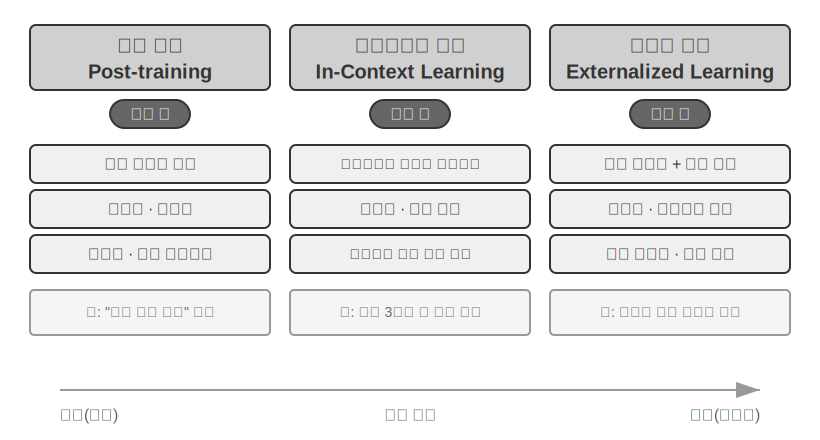
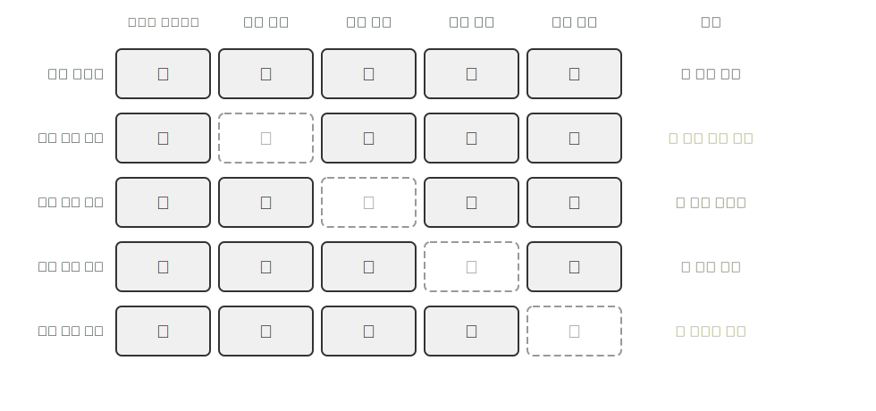
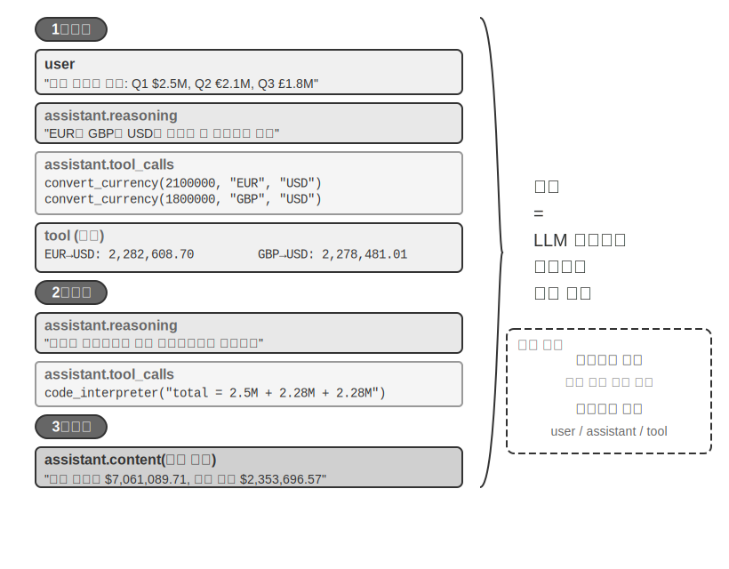
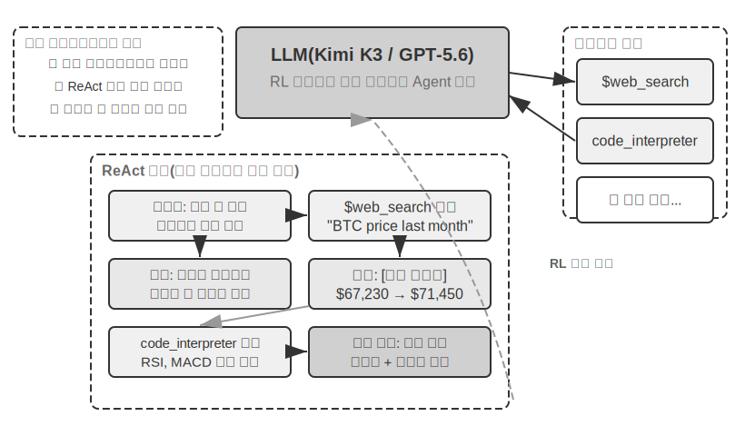
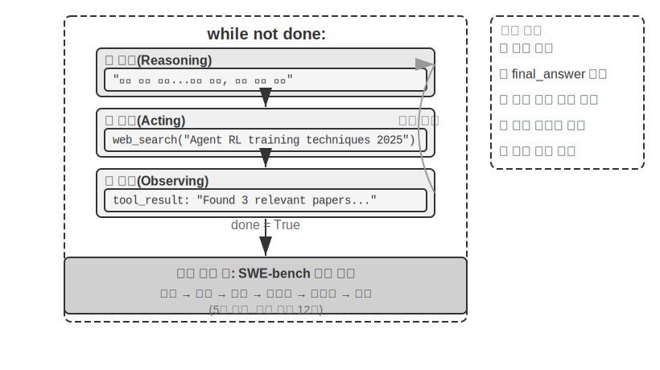
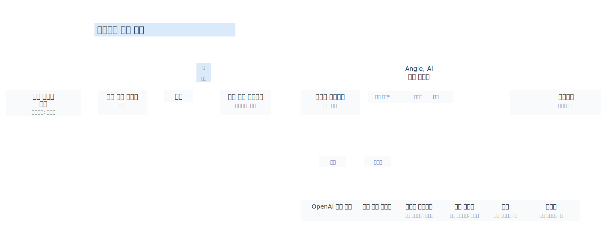

# AI Agent 입문

Cursor로 코드를 작성하면서 코드베이스를 검색하고 여러 파일을 수정한 뒤 테스트가 통과할 때까지 실행하는 모습을 본 적이 있다면, Deep Research로 어떤 주제를 조사하면서 반복해서 검색하고 읽어 완성된 보고서를 만들어 본 적이 있다면, Manus가 브라우저를 조작해 온라인 작업을 대신 처리하게 해 본 적이 있다면, 더우바오(Doubao) 모바일 어시스턴트로 휴대전화에서 표를 예매하거나 메시지를 보내 본 적이 있다면, 또는 Pine AI가 통신사에 대신 전화해 요금 인하를 협상하게 해 본 적이 있다면, 여러분은 이미 AI Agent를 사용하고 있는 셈이다.

이 제품들은 형태가 서로 다르지만 한 가지 공통점이 있다. 더 이상 “한 번 물으면 한 번 답하는” 수동적인 대화형 시스템이 아니라, 실행 단계를 스스로 계획하고 다양한 도구를 호출해 작업을 완수하며 결과에 따라 전략을 계속 조정하는 지능형 시스템이라는 점이다. AI Agent는 우리가 컴퓨터와 상호작용하는 새로운 방식으로 자리 잡고 있다.

이 장에서는 실습을 출발점으로 삼아 AI Agent의 핵심 구성 요소를 이해한다. 현대 Agent의 역량을 직접 경험하고, 그 이면의 아키텍처 원리를 이해하며, Agent 시스템을 구축하기 위한 설계 패턴과 모범 사례를 익힌다.

> **읽기 안내**: 이 장은 책 전체의 개념 지도다. Agent의 핵심 공식, 실행 루프, 엔지니어링 프레임워크, 설계 패턴을 빠르게 소개해 이후 장에서 사용할 공통 용어와 기준점을 마련한다. 처음 읽을 때 모든 개념을 하나씩 외울 필요는 없다. 먼저 전체적인 인상을 잡는 것이 좋다. 이후 각 장에서 여기서 언급한 주제를 하나씩 자세히 다루므로 필요할 때 언제든 다시 돌아와 대조해 볼 수 있다.

## 현대 Agent = LLM + 컨텍스트 + 도구

현대 Agent 시스템의 본질은 간단한 공식으로 표현할 수 있다. **Agent = LLM(대규모 언어 모델, Large Language Model) + 컨텍스트 + 도구**. 간결하고 실용적인 공식이지만, 각 단어는 넓은 의미로 이해해야 한다.

- **LLM은 Agent의 두뇌다**. 단순히 모델 파라미터의 집합이 아니라 의도를 이해하고, 사고하고 계획하며, 판단을 내리는 Agent의 전체 의사결정 핵심부다. 인간의 뇌가 단순한 뉴런의 집합이 아니라 경험으로 형성된 사고방식까지 포함하듯, LLM의 역량도 두 부분에서 나온다. 하나는 **사전 학습**으로 축적한 세계 지식과 언어 능력이고, 다른 하나는 **사후 학습**으로 내재화한 의사결정 전략이다. 후자의 구체적인 기술인 지도 미세 조정과 강화 학습은 7장에서 다룬다.
- **컨텍스트는 Agent의 눈이다**. 모델에 입력되는 텍스트 한 덩어리만을 뜻하지 않는다. 환경 정보, 사용자 기억, 도메인 지식, 자신의 상태, 작업 진행 상황처럼 Agent가 각 의사결정 시점에 볼 수 있는 모든 정보다. 사람이 결정을 내릴 때 현재 상황을 살피고 관련 경험을 떠올리며 참고 자료를 찾아보듯, Agent의 컨텍스트 윈도는 그 순간 Agent가 볼 수 있는 모든 것이다.
- **도구는 Agent의 손발이다**. 호출 가능한 몇 개의 API 함수만을 의미하지 않는다. 미리 정의된 도구 호출부터 필요할 때 불러오는 전문 스킬(Skills), 코드를 동적으로 생성해 새로운 능력을 만드는 일, 하위 Agent에 작업을 위임해 협업하는 일, 사용자와 능동적으로 소통하거나 외부 이벤트에 대응하는 일까지 Agent가 할 수 있는 모든 행동의 집합이다.

더 직관적으로 말하면 **Agent = 두뇌 + 눈 + 손발**이다. 두뇌는 사고와 의사결정을 담당하고, 눈은 사고에 필요한 모든 정보를 제공하며, 손발은 결정을 현실 세계의 변화로 바꾼다.

이 세 구성 요소는 RL(강화 학습, 자세한 내용은 7장 참고)의 세 가지 핵심 개념과 정확히 대응한다. 아래 표는 **선택해서 읽어도 되는 내용**이다. RL 배경지식이 없다면 건너뛰어도 이후 내용을 이해하는 데 지장이 없다. RL에 익숙한 독자가 기존 지식과 이 책의 용어를 연결할 수 있도록 돕기 위한 표다.

| 직관적 이해 | 구현 구성 요소 | 학술 개념(선택 사항) | 의미 |
|-----------|-----------|----------------------------|----------------------------------------------|
| **두뇌** | LLM | **정책**(Policy) | Agent가 “다음에 무엇을 할지” 결정하는 논리. 현재 보이는 정보를 바탕으로 가능한 모든 행동 중 가장 적절한 것을 선택한다. |
| **눈** | 컨텍스트 | **관찰 공간**(Observation Space) | Agent가 볼 수 있는 모든 정보. 무엇을 보고 읽고 기억할 수 있는지, 어떤 시스템에 접근할 수 있는지를 뜻한다. |
| **손발** | 도구 | **행동 공간**(Action Space) | Agent가 할 수 있는 모든 행동의 집합. 메시지 전송, 코드 실행, 인터페이스 조작 등 사용할 수 있는 모든 “수단”을 뜻한다. |

이 세 요소의 역할과 상호 관계를 이해하는 것은 효과적인 Agent 시스템을 구축하는 기초다. 가장 구체적인 손발인 도구에서 시작해 두뇌인 LLM과 눈인 컨텍스트로 차츰 들어가 보자. 먼저 여러 유형의 Agent가 이 세 차원에서 어떻게 구성되는지 살펴본다.

| Agent 제품 | 눈(인지) | 손발(행동) | 전략 |
|----------------|----------------------|----------------------------|------------------------------|
| **Cursor 등의 Coding Agent** | 요구 사항 문서, 코드베이스, 터미널 환경 | 개방형(내부 사고, 코드 검색, 파일 읽기·쓰기, 명령 실행 등) | 점진적 개발: 요구 사항 이해→관련 코드 검색→코드 수정→테스트·검증→디버깅·수정 |
| **Deep Research 등의 검색 Agent** | 웹 자원, 학술 데이터베이스, 로컬 파일 | 개방형(내부 사고, 검색 질의, 웹 페이지 읽기, 요약 생성) | 반복적 심화: 기존 정보에 따라 검색 방향을 조정하고 점차 완성된 보고서로 종합 |
| **Manus 등의 컴퓨터 조작 Agent** | 컴퓨터 화면, 브라우저 페이지, 파일 시스템 | 개방형(내부 사고, 클릭, 입력, 스크롤, 화면 캡처, 코드 실행 등) | 시각 인지+조작: 화면 관찰→대상 요소 식별→작업 실행→결과 검증 |
| **더우바오 등의 모바일 어시스턴트 Agent** | 휴대전화 화면, 설치된 앱 | 개방형(내부 사고, 탭, 스와이프, 입력, 앱 실행 등) | 의도 이해+앱 조작: 사용자 요구 이해→대상 앱 탐색→작업 실행→완료 확인 |
| **Pine AI 등의 개인 업무 대행 Agent** | 사용자 계정 정보, 과거 청구서, 서비스 제공자 지식 베이스 | 개방형(내부 사고, 전화, 이메일, 양식 작성, 사용자 확인) | 다단계 작업 실행: 정보 수집→협상 전략 수립→서비스 제공자 연락→협상→결과 보고 |

이 Agent 시스템들에는 몇 가지 공통점이 있다. 모두 **개방형 행동 공간**을 사용한다. 정해진 몇 개의 버튼 중 하나를 고르는 것이 아니라 임의의 자연어와 코드를 생성할 수 있다. 모두 **내부적으로 사고**해 행동하기 전에 먼저 생각하고 계획할 수 있다. 또한 **지속적으로 상호작용**하며 환경의 피드백에 따라 전략을 계속 조정한다. 이러한 능력은 두뇌, 눈, 손발, 즉 LLM과 컨텍스트와 도구가 함께 작동하기 때문에 가능하다.

### 도구: Agent의 손발

도구는 Agent가 외부 세계와 상호작용하는 다리다. 사람의 손발처럼 Agent를 수동적인 관찰자에서 능동적인 실행자로 바꿔 준다. 도구가 없으면 Agent는 말로만 계획을 늘어놓을 수 있을 뿐이지만, 도구가 있으면 실제로 세상을 바꿀 수 있다.

도구를 체계적으로 논의하기 위해 Agent와 외부 세계가 상호작용하는 방향에 따라 다섯 가지로 분류할 수 있다. 먼저 각 유형의 대표 사례를 빠르게 훑어 전체 그림을 잡아 보자. 이후 장에서 하나씩 자세히 다룬다.

**인지 도구**는 Agent가 정보에 접근하게 한다. 검색 엔진은 실시간 웹 데이터를 제공하고, 파일 시스템은 로컬 문서를 읽으며, API와 데이터베이스는 외부 서비스와 기업의 핵심 데이터에 연결한다.

**실행 도구**는 Agent가 세상을 바꾸게 한다. 코드 실행, 파일 조작, 시스템 명령, 외부 API 호출을 통해 의사결정이 실제 행동으로 이어진다.

**협업 도구**는 Agent가 다른 Agent와 역할을 나눠 협력하게 한다. 하위 Agent에 전문 작업을 맡기거나, 중요한 의사결정 지점에서 사람의 확인을 요청하거나, 다중 Agent 시스템에서 행동을 조율한다.

**이벤트 트리거 도구**는 호출 방식에서 앞의 세 유형과 본질적으로 다르다. Agent가 능동적으로 호출하는 것이 아니라, 외부 입력이 Agent의 작업 시작을 유도한다. 새 이메일 도착, 예약된 시각 도달, 다른 시스템의 Webhook 콜백 같은 이벤트가 Agent를 활성화해 이후의 사고와 행동을 시작하게 한다. 이벤트 트리거가 Agent의 능동적 호출은 아니지만 외부 세계와 상호작용하는 통로 가운데 하나이므로 넓은 의미의 도구 체계에 포함한다.

**사용자 커뮤니케이션 도구**는 Agent가 사용자와 능동적으로 연결되고 정보를 전달하는 채널이다. 외부 세계를 변화시키는 실행 도구와 달리 정보 전달과 상호작용에 집중한다. 문자 메시지, 음성 통화, 이메일 등을 통해 Agent의 작업 진행 상황이나 선제적인 관심과 안내를 사용자에게 전한다.

이 다섯 가지 도구의 전체 분류 체계와 설계 원칙은 4장에서 논의한다. 도구 설계의 품질은 Agent가 어디까지 나아갈 수 있는지를 직접 결정한다. 인터페이스 정의가 불분명하면 모델은 도구를 잘못 사용하고, 오류 처리가 미흡하면 도구가 한 번 실패했을 때 Agent가 교착 상태에 빠지며, 권한 제어가 지나치게 넓으면 Agent가 실수했을 때 되돌리기 어려운 결과를 낳는다. MCP(Model Context Protocol, 모델 컨텍스트 프로토콜) 표준의 확산으로 도구 연결은 점점 플러그인을 설치하는 것과 비슷해지고 있다. 생태계는 빠르게 확장되지만 설계 원칙은 쉽게 낡지 않는다.

**도구 호출**(Tool Calling, Function Calling이라고도 함)은 현대 LLM Agent의 핵심 기능이다. 모델이 구조화된 방식으로 외부 도구를 호출할 수 있게 해 LLM을 순수한 텍스트 생성기에서 실제 작업을 수행하는 지능형 시스템으로 바꾼다. 이 책에서는 이후 “도구 호출”이라는 용어로 통일한다.

도구 호출은 네 단계로 진행된다. 먼저 컨텍스트에서 사용 가능한 도구의 이름, 용도, 파라미터를 모델에 알려 준다. 다음으로 모델이 도구 호출 여부, 사용할 도구, 전달할 파라미터를 스스로 판단한다. 이어 도구 실행이 끝나면 그 결과를 컨텍스트에 추가한다. 마지막으로 모델이 그 결과를 바탕으로 다음 행동을 결정한다. 이 순환이 뒤에서 설명할 ReAct의 기초다.

날씨 조회 사례를 통해 네 단계의 API 수준 표현을 단순화하면 다음과 같다.

```
1단계: 도구 선언                       2단계: 모델이 호출 결정
tools: [{                            assistant: {
  name: "get_weather",                tool_calls: [{
  parameters: {                         function: "get_weather",
    city: "string"                      arguments: {city: "베이징"}
  }                                   }]
}]                                  }

3단계: 결과를 컨텍스트에 추가           4단계: 모델이 결과를 바탕으로 응답
tool: {                              assistant: {
  tool_call_id: "call_1",             content: "베이징은 오늘 28°C이고 맑습니다."
  content: '{"temp":28,"sky":"맑음"}' }
}
```

개발자는 도구를 정의하고 도구 호출을 실행하기만 하면 된다. “도구를 호출할지, 어떤 도구를 고를지, 어떤 파라미터를 전달할지”는 모델이 자율적으로 결정한다. 이 API 구조는 2장에서 자세히 다룬다.

Agent용 도구를 설계할 때는 가능한 한 범용성을 유지해 LLM이 폭넓게 활용할 수 있도록 해야 한다. 예를 들어 전용 계산기 도구를 만드는 대신 Python 코드 인터프리터와 안전한 샌드박스 실행 환경을 제공하는 편이 낫다. 작업 로그 기록 전용 도구를 만드는 대신 파일 읽기·쓰기 도구와 가상 파일 시스템을 제공하는 편이 낫다. 범용 도구가 있으면 Agent는 기본 능력을 조합해 문제를 창의적으로 해결할 수 있다.

### LLM: Agent의 두뇌

대규모 언어 모델(Large Language Model, LLM)은 Agent의 의사결정 핵심부다. 사용자 요청을 받으면 먼저 진짜 의도를 파악해야 한다. 사용자가 말한 것과 실제로 원하는 것이 항상 같지는 않기 때문이다. 그다음 모호하거나 복잡한 작업을 실행 가능한 단계로 나눈다. 실행 중에도 다음에 무엇을 할지, 도구를 호출할지, 어떤 도구를 선택할지, 어떤 파라미터를 전달할지 계속 판단해야 한다. 이러한 “이해-계획-실행” 능력은 사전 학습으로 축적한 지식에서 나오며, 워크플로와 자율 Agent 모두가 의존하는 기반이다.

LLM Agent의 독특한 능력 중 하나는 **내부 사고**다. 실제 행동을 취하기 전에 먼저 계획하고 시뮬레이션할 수 있다. 이 과정은 외부 환경을 바꾸지 않으면서도 이후 행동의 품질을 크게 높인다. LLM이 효과적으로 내부 시뮬레이션을 할 수 있는 것은 사전 학습(Pre-training, 방대한 인터넷 텍스트로 초기 학습해 언어 규칙과 세계 지식을 익히는 과정) 단계에서 얻은 능력 덕분이다. 모델은 수학 법칙, 인과관계, 문제 분해 전략처럼 인간의 지식에 축적된 논리 규칙을 따라 추론한다. 따라서 Agent의 시뮬레이션은 맹목적인 무작위 탐색이 아니라 구조화된 지식 체계 위에서 이루어진다.

구조화된 시뮬레이션 능력 덕분에 LLM Agent는 처음 접하는 작업도 곧바로 처리할 수 있다. 이를 제로샷과 퓨샷이라는 두 개념으로 나누어 살펴보자. 가장 직접적인 예가 **제로샷 일반화**(Zero-shot Generalization)다. 한 번도 보지 못한 작업이라도 예시 없이 기존 지식을 조합해 처리할 수 있다. 가령 양자 물리학에 관한 시를 쓰는 법을 가르친 적이 없어도, 이미 가진 언어와 물리 지식을 바탕으로 그럴듯한 작품을 만들어 낸다.

더 나아가 LLM Agent는 아주 적은 예시만으로도 **퓨샷 적응**(Few-shot Adaptation)을 할 수 있다. 프롬프트에 두세 개의 시범 예시를 제시하면 새로운 작업 패턴을 파악한다. 몇 개의 “사용자 리뷰 → 감정 레이블” 예시를 보여 주면 새로운 리뷰의 감정을 분류하는 법을 익히는 식이다. 간단히 말해 제로샷은 “예시가 없어도 할 수 있음”, 퓨샷은 “몇 개의 예시를 보고 익힐 수 있음”이다.

#### 모델이 곧 Agent다: 모델 자체가 제품이 될 때

“모델이 곧 Agent”(Model as Agent)라는 새로운 패러다임은 AI Agent 발전의 최신 방향을 보여 준다. 고도화된 모델은 사후 학습, 특히 강화 학습을 통해 도구 호출 능력을 네이티브 역량으로 내재화한다. 언제 어떤 도구를 호출하고 어떤 파라미터를 전달할지 모델이 스스로 결정하므로 사람이 따로 오케스트레이션할 필요가 없다. 그렇다고 프레임워크 계층이 중요하지 않다는 뜻은 아니다. 오히려 모델이 강력할수록 주변에 구축하는 Harness가 더 중요하다. Harness는 원래 말에 씌우는 고삐와 마구를 뜻한다. 말의 달리는 힘을 억누르기 위한 것이 아니라 그 힘을 올바른 방향으로 이끌기 위한 장치다. Agent의 맥락에서 모델은 강력하지만 예측하기 어려운 말이고, Harness는 그 능력을 신뢰할 수 있는 작업 수행으로 이끄는 엔지니어링 외피다. 레이싱 드라이버를 둘러싼 안전벨트, 트랙 가드레일, 피트 정비팀 전체로 비유할 수도 있다. 드라이버인 모델이 빠를수록 이 시스템은 더욱 중요해진다. Agent의 Harness에는 컨텍스트 관리, 도구 인터페이스, 안전 제약, 검증과 교정 같은 인프라가 포함된다. 자세한 내용은 이 장의 마지막 절에서 다룬다.

모델이 자율적으로 결정할 수 있는 범위가 커질수록 오류가 미치는 범위도 넓어진다. 따라서 신뢰성을 확보하려면 더 정교한 제약, 검증, 교정 메커니즘이 필요하다. 모델 공급자의 진정한 강점은 “프레임워크를 얇게 만드는 것”이 아니라 모델과 주변 Harness를 함께 최적화하고 지속적으로 개선할 수 있다는 데 있다.

하지만 더 깊은 질문이 남는다. 모델이 계속 강해지면 오늘날의 Harness는 결국 모델에 “먹히게” 될까? Rich Sutton은 「쓰디쓴 교훈」(The Bitter Lesson)에서 70년에 걸친 AI 연구가 되풀이해 온 한 장면을 돌아본다[^ch1-1]. 연구자들은 자신의 도메인 지식을 시스템에 거듭 인코딩해 단기적으로 성과를 냈지만, 장기적으로는 컴퓨팅 자원과 데이터 규모에 따라 계속 확장되는 범용 방법, 즉 탐색과 학습에 늘 뒤처졌다. 이 관점에서 보면 Harness의 제약, 검증, 교정 가운데 얼마나 많은 부분이 “인간의 사전 지식”이며 결국 모델에 내재화될 운명일까? 이 책의 입장은 **방향에는 동의하되 속도에는 현실적으로 대응한다**는 것이다. 방향 면에서 모델이 Harness를 계속 흡수하리라는 점을 의심하지 않는다. 도구 호출과 장기 계획은 과거 외부 오케스트레이션에 의존했지만 이제 모델의 네이티브 역량이 되었다. 그러나 그 속도는 직관보다 훨씬 느리다. 학습에는 수개월이 걸리고, 모델이 실제 비즈니스의 모든 제약과 선호를 한 번에 내재화할 수도 없다. 현재 모델의 능력 경계가 바로 현재 Harness의 가치다. 따라서 Harness 엔지니어링은 쓰디쓴 교훈에 저항하는 일이 아니라 그 교훈을 엔지니어링 시간 척도에서 실천하는 일이다. 모델이 안정적으로 하지 못하는 일은 Harness가 먼저 보완한다. 모델이 한 계층을 내재화할 때마다 Harness는 그 계층을 덜어 내고 새로운 능력의 최전선을 뒷받침한다. 이 주제는 책 전체를 관통한다. 2장에서는 컨텍스트 엔지니어링의 관점에서 현실적인 답을 제시하고, 8장에서는 Agent가 지식과 능력의 구조를 스스로 발견하는 방법을 논의하며, 후기에서는 “모델이 Harness를 흡수할 것인가”라는 질문에 대한 완전한 답으로 돌아온다.

[^ch1-1]: Sutton, Rich. "The Bitter Lesson", 2019. http://www.incompletenessideas.net/IncIdeas/BitterLesson.html

#### Agent의 학습 메커니즘: 사후 학습, 인컨텍스트 학습, 외부화 학습

앞에서는 모델이 강화 학습을 통해 도구 호출을 네이티브 역량으로 내재화하는 방법을 논의했다. 그러나 Agent의 학습은 학습 단계에서만 일어나지 않는다. 일부 독자는 Agent가 경험으로부터 학습한다고 하면 반드시 모델을 학습시켜야 한다고 생각한다. 실제로 사후 학습은 Agent가 경험에서 배우는 유일한 방법이 아니다. Agent의 학습 메커니즘은 서로 보완하는 세 가지 패러다임으로 정리할 수 있다(그림 1-1).



- **사후 학습**(Post-training): 강화 학습으로 경험을 모델 파라미터에 정착시킨다. 작업을 넘어 일반화하는 능력이 가장 강하지만 업데이트 비용이 높다(자세한 내용은 7장 참고).
- **인컨텍스트 학습**(In-Context Learning): 어텐션 메커니즘(Attention Mechanism, 모델이 입력을 처리할 때 “어떤 정보에 주목할지” 결정하는 메커니즘)을 통해 컨텍스트에서 패턴을 검색하듯 빠르게 적응한다. 예를 들어 프롬프트에 “사용자 불만→공감+보상안” 같은 고객 상담 사례를 몇 개 보여 주면 새로운 상담도 비슷한 방식으로 처리한다. 이것이 인컨텍스트 학습이다. 빠르게 적응하지만 일시적이어서 대화가 끝나면 사라진다. 이름에 “학습”이 들어가지만 내부 메커니즘은 **진정한 학습보다는 패턴 매칭에 가깝다**. 같은 유형의 수학 문제 세 개와 답을 보여 준 뒤 네 번째 문제를 주면 대부분 비슷한 방식을 따라 풀 수 있다. 이것이 인컨텍스트 학습이 하는 일이다. 하지만 네 번째 문제에 완전히 새로운 풀이가 필요하다면 앞선 세 문제의 답만으로는 충분하지 않다. 다시 말해 인컨텍스트 학습은 모델이 **이미 본 패턴을 적용**하게 하지만 **완전히 새로운 규칙을 발견**하게 하지는 못한다. 이 점이 사후 학습과 본질적으로 다르다. 2장에서 어텐션 메커니즘의 관점으로 이 주장을 자세히 설명한다.
- **외부화 학습**(Externalized Learning): 지식과 절차를 지식 베이스와 실행 가능한 도구 코드로 외부화해 지속성과 설명 가능성을 함께 확보한다.

이 세 패러다임은 서로 다른 시간 척도에서 보완한다. 사후 학습은 기초 역량을 제공하고, 인컨텍스트 학습은 빠른 적응을 가능하게 하며, 외부화 학습은 신뢰성과 효율을 보장한다. 8장에서 세 패러다임의 협력 관계를 체계적으로 비교한다.

비유하자면 사후 학습은 교과서를 체계적으로 공부하는 것과 같다. 학습 후 능력이 영구적으로 향상되지만 비용이 높다. 인컨텍스트 학습은 현장에서 참고 자료를 찾아보는 것과 같다. 자료가 있으면 잘할 수 있지만 책을 덮으면 잊는다. 외부화 학습은 개인 노트에 내용을 정리하는 것과 같다. 정보가 오래 보존되고 언제든 찾아볼 수 있지만 따로 정리하는 과정이 필요하다.

### 컨텍스트: Agent의 눈

컨텍스트는 Agent가 각 의사결정 시점에 볼 수 있는 모든 정보다. 사람이 결정을 내릴 때 책상 위에 펼쳐진 작업 설명, 참고 설명서, 이전 소통 기록, 최신 데이터를 모두 살펴야 하는 것처럼 Agent의 컨텍스트 윈도는 Agent의 “시야”다. API 관점에서 보면(자세한 내용은 2장 참고) LLM을 호출할 때마다 컨텍스트는 다음 다섯 부분으로 구성된다.

- **시스템 프롬프트**(System Prompt): 사용자가 매번 입력하는 프롬프트와 달리 개발자가 작성하며 대화 내내 유지된다. Agent의 신분, 권한, 행동 규칙을 정의하는 “직무 기술서”에 해당한다. 프롬프트 엔지니어링(Prompt Engineering)으로 시스템 프롬프트를 세심하게 설계해 Agent의 작업 방식을 만들 수 있다. 시스템 프롬프트에는 대화 간에 보존되는 **사용자 기억**(사용자 선호, 과거 행동, 배경 설정 등의 개인화 정보, 자세한 내용은 3장 참고)과 동적으로 주입되는 환경 상태도 포함된다.
- **도구 정의**(Tool Definitions): Agent가 사용할 수 있는 도구의 이름, 기능 설명, 파라미터 형식을 선언한다. 도구 정의가 없으면 Agent는 어떤 도구도 인식하거나 호출할 수 없다. 제거 실험인 실험 1-1에서 이를 확인한다. 도구 정의와 시스템 프롬프트는 대화 내내 변하지 않는 **정적 접두부**를 이룬다.
- **사용자 메시지**(User Messages): 사용자가 입력한 내용이다. 사용자 메시지에는 RAG(검색 증강 생성, Retrieval-Augmented Generation, 자세한 내용은 3장 참고)가 동적으로 검색해 가져온 **외부 지식**도 포함될 수 있다. 이 지식은 학습 데이터 기준일 이후의 정보나 비공개 도메인 지식을 보완한다.
- **모델 응답**(Assistant Messages): 모델이 이전에 생성한 응답이다. 최대 세 부분, 즉 사고 과정(reasoning, 내부 사고의 흐름으로 사고의 일관성과 의사결정의 설명 가능성을 유지), 텍스트 내용(content, 사용자에게 보내는 답변), 도구 호출 요청(tool_calls, Agent가 행동하는 방식)으로 구성된다. 한 번의 구체적인 응답에 세 부분이 모두 들어갈 필요는 없다. 예를 들어 Agent가 도구 호출을 결정하면 보통 reasoning + tool_calls만 있고, 최종 답변을 내놓을 때는 reasoning + content만 있다.
- **도구 실행 결과**(Tool Results): Agent 프레임워크가 도구를 실행한 뒤 반환하는 결과다. Agent가 다음 사고를 진행할 직접적인 근거가 되며, 실행 결과에서 배워 같은 실수를 반복하지 않게 한다.

앞의 두 항목인 시스템 프롬프트와 도구 정의는 정적 접두부이고, 뒤의 세 항목인 사용자 메시지, 모델 응답, 도구 실행 결과는 상호작용하면서 계속 늘어나는 동적 메시지 기록이다. 이 다섯 부분이 LLM이 추론할 때마다 받는 컨텍스트를 함께 구성한다.

각 구성 요소가 모두 필수인지 확인하는 가장 직접적인 방법은 **제거 실험**(Ablation Study)이다. 의사가 진단할 때 원인을 하나씩 배제하듯 A를 제거한 뒤 시스템이 정상인지 살펴보고, 이어 B를 제거해 각 구성 요소의 기여도를 판단하는 방식이다. 실험 1-1은 이 방법으로 다섯 구성 요소를 체계적으로 검증했다. 그 결과 도구 정의를 제거하면 Agent가 행동 능력을 완전히 잃었다. 도구 실행 결과가 없으면 직전 단계의 피드백을 보지 못해 같은 도구를 반복 호출하며 무한 루프에 빠졌다. 모델 응답에서 사고 과정을 제거하자 앞뒤 의사결정이 서로 모순되기 시작했다. 과거 메시지가 없으면 Agent가 기억을 잃고 전체 작업을 처음부터 다시 시작해 이미 끝낸 단계를 반복했다. 각 구성 요소의 역할은 이론적 추정이 아니라 실험 증거로 뒷받침된다.

### 실험 1-1 ★★: 컨텍스트의 핵심 역할

체계적인 **제거 실험**(Ablation Study)을 통해 컨텍스트의 여러 구성 요소가 Agent 행동에 미치는 영향을 살펴보았다. 앞서 설명한 다섯 부분 중 네 구성 요소를 검증 대상으로 골랐다. 시스템 프롬프트는 Agent의 기본 정체성을 정의하므로 제거 대상에서 제외했다. 시스템 프롬프트가 없으면 기본적인 역할 인식조차 없어 실험할 의미가 없기 때문이다. 그림 1-2와 같이 다섯 개의 대조 실험을 수행했다. 모든 구성 요소를 유지한 완전한 기준선 하나와 구성 요소를 하나씩 제거한 네 개의 비교군으로 각 요소가 Agent 성능에 미치는 영향을 관찰했다.



실험 결과 각 컨텍스트 구성 요소를 다른 것으로 대체할 수 없다는 사실이 드러났다. 정적 접두부의 일부인 **도구 정의**(Tool Definitions)는 Agent 행동 능력의 기반이다. 이것이 없으면 Agent는 어떤 도구도 인식하거나 호출할 수 없다. **도구 실행 결과**(Tool Results)는 폐루프 제어의 핵심이다. 결과가 없으면 Agent는 “눈먼” 상태로 실행을 반복하다 무한 루프에 빠진다. 모델 응답의 reasoning 부분인 **사고 과정**은 이전 결정을 내린 이유를 보존해 사고 흐름의 일관성을 높이고 앞뒤가 모순된 결정을 막는다. 이전 라운드의 사용자 메시지, 모델 응답, 도구 실행 결과인 **과거 메시지**는 중복 행동을 막고 작업 수행의 연속성을 유지하며 같은 실수를 되풀이하지 않게 한다.

이 실험의 핵심 통찰은 다음과 같다. **컨텍스트는 Agent가 무엇을 볼 수 있는지 결정하며, Agent는 자신이 볼 수 있는 정보만으로 의사결정을 내릴 수 있다.** 사람이 눈을 가리면 합리적으로 판단하기 어려운 것처럼 컨텍스트 구성 요소 하나라도 없으면 Agent의 의사결정 능력이 심각하게 저하된다. 도구 정의를 보지 못하면 어떤 도구가 있는지 알 수 없고, 이전 실행 결과를 보지 못하면 이미 무엇을 했는지 알 수 없다.

### ReAct 루프

Agent의 세 가지 핵심 요소를 이해했다면 자연스럽게 한 가지 질문이 생긴다. 이들은 어떻게 함께 작동할까? ReAct 루프는 LLM, 컨텍스트, 도구를 연결하는 핵심 메커니즘이다. Agent가 한 단계씩 생각하고 행동하는 과정을 살펴보자.

Agent가 작업을 수행하는 핵심 패턴을 **ReAct**(Reasoning + Acting)라고 한다. 이름에는 추론(Reasoning)과 행동(Acting)만 들어가지만 실제 루프는 세 단계로 이루어진다. 모델은 먼저 현재 무엇을 해야 하는지 **생각**하고, 도구를 호출해 **행동**한 뒤, 도구가 반환한 결과를 **관찰**하고 다음 단계를 다시 생각한다. 이 “생각→행동→관찰→생각→행동→관찰”의 순환은 작업이 끝날 때까지 반복된다.

여러 통화로 들어온 수익을 합산하는 구체적인 사례로 Agent의 **궤적**(trajectory)을 이해해 보자. 궤적은 작업 수행 과정에서 계속 쌓이는 메시지 기록, 즉 사용자 메시지, 모델 응답(사고 과정과 도구 호출 포함), 도구 실행 결과를 뜻한다. LLM을 호출할 때마다 받는 전체 컨텍스트는 **정적 접두부**(시스템 프롬프트 + 도구 정의)와 **궤적**(동적 메시지 기록)으로 구성된다(그림 1-3). 여기서 중요한 사실을 알 수 있다. **Agent의 컨텍스트 = 정적 접두부 + 궤적**이다. 구체적으로 정적 접두부는 앞서 설명한 다섯 구성 요소 가운데 시스템 프롬프트와 도구 정의에 해당하고, 궤적은 상호작용하면서 계속 늘어나는 사용자 메시지, 모델 응답, 도구 실행 결과에 해당한다. LLM은 이 전체 컨텍스트를 바탕으로 다음 응답을 생성하고, 그 응답은 다음 호출에서 사용할 궤적에 다시 추가된다.



의사 코드로 Agent 궤적의 구조를 살펴보자.

```
궤적 = [
  {role: “user”, content: “회사의 분기별 수익이 1분기 250만 달러,
  2분기 210만 유로, 3분기 180만 파운드, 4분기 3억 8천만 엔일 때
  연간 총수익과 분기 평균 수익을 계산하라”},

  # 첫 번째 반복 - LLM이 위 궤적을 보고 응답 생성
  {role: “assistant”,
   reasoning: “모든 통화를 USD로 환산해야 한다...” ,
   content: “”,  # 사용자에게 바로 답하지 않음
   tool_calls: [
     {name: “convert_currency”, args: {amount: 2100000, from: “EUR”, to: “USD”}},
     {name: “convert_currency”, args: {amount: 1800000, from: “GBP”, to: “USD”}},
     {name: “convert_currency”, args: {amount: 380000000, from: “JPY”, to: “USD”}}
   ]},

  # Agent 프레임워크가 도구를 실행하고 결과를 궤적에 추가
  {role: “tool”, content: “EUR->USD: 2282608.7”},
  {role: “tool”, content: “GBP->USD: 2278481.01”},
  {role: “tool”, content: “JPY->USD: 2541806.02”},

  # 두 번째 반복 - LLM이 도구 결과까지 포함한 전체 궤적을 확인
  {role: “assistant”,
   reasoning: “환산 결과를 얻었으므로 이제 합계를 계산해야 한다...” ,
   content: “”,
   tool_calls: [
     {name: “code_interpreter”, args: {code: “total = 2500000 + 2282608.7 + ...”}}
   ]},

  {role: “tool”, content: “Total: $9,602,895.73, Average: $2,400,723.93...”},

  # 세 번째 반복 - LLM이 전체 궤적을 보고 최종 답변 생성
  {role: “assistant”,
   reasoning: “모든 계산이 끝났으므로 결과를 정리한다...” ,
   content: “FINAL ANSWER: 총수익은 $9,602,895.73...”}
]
```

궤적에는 시스템 프롬프트와 도구 정의가 표시되지 않는다는 점에 주의하자. 이들은 정적 접두부로서 LLM을 호출할 때마다 궤적 앞에 자동으로 붙는다.

실험에서 이 루프는 선명하게 드러났다. 첫 번째 라운드에서 Agent는 작업을 분석한 뒤 통화 환산 도구 세 개를 병렬로 호출했다. 두 번째 라운드에서는 환산 결과를 바탕으로 코드 인터프리터를 호출해 복잡한 계산을 수행했다. 세 번째 라운드에서는 모든 계산이 끝났음을 확인하고 최종 답변을 생성했다. 전체 과정은 반복 3회와 도구 호출 4회만으로 복잡한 다단계 작업을 완료했다.

이 설계의 정교함은 **컨텍스트의 누적성**에 있다. LLM을 호출할 때마다 전체 궤적을 볼 수 있으므로 Agent는 현재 작업의 어느 단계에 있는지, 이전에 무엇을 시도했고 어떤 결과를 얻었는지 이해한다. 사람이 문제를 해결하면서 계속 되돌아보고 정리하듯 Agent는 궤적을 통해 전체 작업을 전반적으로 인식한다. 또한 궤적의 구조화된 특성 덕분에 시스템은 설명하고 디버깅하기 쉽다. 사용자 메시지, 모델 응답(사고 과정 + 도구 호출), 도구 실행 결과가 명확하게 구분되기 때문이다.

궤적은 실행 기록일 뿐만 아니라 Agent 역량의 표현이기도 하다. 많은 궤적을 분석하면 Agent의 행동 패턴을 발견하고, 의사결정 경로를 최적화하며, 도구 설계를 개선할 수 있다. 궤적 데이터를 지식 베이스에 요약해 넣거나 강화 학습으로 더 나은 Agent 모델을 학습하는 데 사용할 수도 있어 경험에서 배우는 폐루프 최적화가 가능하다.

이제 Agent의 실행 루프를 이해했으므로 두 가지 실험을 통해 서로 다른 모델이 이 루프를 어떻게 구동하는지 살펴보자.

#### 실험 1-2 ★: Kimi K3의 네이티브 Agent 역량

이 실험은 **Kimi K3**의 네이티브 Agent 역량을 보여 주며 “모델이 곧 Agent”라는 새로운 패러다임을 드러낸다. Kimi K3는 Moonshot AI가 2026년에 공개한 약 2.8조 파라미터 규모의 전문가 혼합(MoE, Mixture of Experts) 모델이다. MoE는 전문가 팀에 비유할 수 있다. 서로 다른 유형의 문제를 만났을 때 모든 전문가를 동시에 투입하지 않고 시스템이 가장 적합한 몇 명을 자동으로 골라 답하게 함으로써 역량과 효율을 함께 확보한다. 100만 토큰의 컨텍스트 윈도와 네이티브 시각 이해 능력을 갖췄고, “사고 모드”(thinking mode)가 항상 켜져 있다. 강화 학습을 통해 도구 호출을 네이티브 역량으로 내재화했으므로 웹 검색 같은 작업을 자율적으로 결정하고 실행할 수 있다.

핵심 관찰 결과는 다음과 같다. 모델은 RL 학습을 통해 별도의 오케스트레이션 계층 없이도 자연스럽게 도구 사용법을 익혔다. 검색 시점과 검색 내용을 스스로 결정해 진정한 자율성을 보였고, 검색 결과에 따라 전략을 동적으로 조정하며 정보가 충분한지도 스스로 판단했다. 도구 사용 능력은 모델에 직접 “가르친” 것이 아니라 환경과 반복적으로 상호작용하면서 습득한 것이다.

Kimi K3의 Agent 작업에서 두드러지는 강점은 **긴 도구 호출 연쇄의 안정성**이다. 대부분의 모델이 수십 번의 호출 뒤 성능이 떨어지기 시작하는 것과 달리, 200~300회의 도구 호출을 연속으로 수행하면서도 사고의 일관성을 유지한다. K3는 장시간 프로그래밍과 Agent 워크로드에 최적화되었으며, 공개 당시 대화와 Agent 작업을 위한 K3 Max와 대규모 병렬 처리를 위한 K3 Swarm Max 두 가지 사양으로 제공되었다. 오픈 소스 모델이면서도 소프트웨어 엔지니어링 및 Agent 벤치마크에서 최고 수준의 폐쇄형 시스템과 견줄 만한 성능을 보여, 강화 학습으로 모델에 네이티브 Agent 역량을 부여하는 접근의 유효성을 입증했다.

#### 실험 1-3 ★: GPT-5.6의 네이티브 Deep Research 역량

두 번째 실험은 **OpenAI GPT-5.6**을 사용해 고도화된 모델이 **Deep Research** 역량을 어떻게 네이티브로 내재화하는지 보여 준다. GPT-5.6은 플래그십 프런티어 모델 Sol, 일상 업무를 위한 균형형 모델 Terra, 빠르고 경제적인 경량 모델 Luna의 세 가지 사양으로 제공된다. 모두 별도의 외부 프레임워크 없이 도구 호출을 네이티브 역량으로 사용한다. 가장 혁신적인 특징은 **자유 형식 도구 호출**(Freeform Tool Calling)이다. 기존에는 모델이 도구를 호출할 때 모든 파라미터를 엄격한 JSON 형식, 즉 구조화된 데이터 형식에 맞춰야 했다. 여러 형식 제약이 있는 양식을 채우는 것과 같았다. 자유 형식 도구 호출은 Python 코드나 SQL 쿼리 같은 원시 내용을 도구에 직접 보낼 수 있게 해 형식 변환의 번거로움을 줄이고 유연성과 효율을 높인다. GPT-5.6은 출력의 상세도를 조절하는 Verbosity 파라미터와 사고 깊이를 조절하는 Reasoning Effort 파라미터도 도입했다. Sol에는 추론 시간을 최대한 확보하는 max 단계가 추가되어 개발자가 작업 복잡도에 따라 모델 행동을 세밀하게 제어할 수 있다.

GPT-5.6은 강력한 네이티브 **웹 검색과 코드 인터프리터** 역량을 갖췄다. 이것이 바로 Deep Research의 핵심이다. 모델은 실시간 정보를 얻기 위해 웹을 자율적으로 검색하고, 코드를 작성해 심층 분석하며, “검색 → 읽기 → 분석 → 재검색”의 반복 연구 과정을 수행한다. 예를 들어 “아세안 10개국의 수도 가운데 서로 가장 가까운 두 수도의 거리는 얼마인가?”라는 질문을 받으면 각 수도의 지리 좌표를 자동으로 검색하고 Python 코드로 모든 수도 쌍의 대권 거리를 계산해 가장 가까운 쌍을 찾는다. “최근 한 달간 비트코인 추이를 검색해 기술적 분석을 하라”는 작업에서는 여러 금융 데이터 소스에서 실시간 가격 데이터를 얻고, 전문 기술 분석 라이브러리로 이동 평균선, RSI, MACD 등의 기술 지표를 계산하며, 시각화 차트와 매매 제안을 생성할 수 있다.

더 중요한 점은 GPT-5.6이 **OpenAI Deep Research** 제품의 설계 철학을 모델 계층에 내재화하고 **의도 명확화 과정**을 도입했다는 것이다. 사용자가 연구 요청을 하면 즉시 실행에 들어가지 않고 먼저 일련의 질문으로 진짜 의도를 분명히 한다. “최근 한 달간 비트코인 추이를 검색해 기술적 분석을 하라”는 요청이라면 “어떤 데이터 소스를 선호하십니까? 어떤 기술 지표를 분석해야 합니까?”라고 먼저 묻는다. 이러한 대화형 의도 명확화를 통해 GPT-5.6은 더 정확하고 사용자 요구에 잘 맞는 연구 보고서를 만들 수 있다.

GPT-5.6은 “모델이 곧 Agent”라는 개념이 성숙한 사례다. Deep Research 역량이 모델 계층에 내재화되어 외부 오케스트레이션 프레임워크에 의존하지 않는다. 특히 주목할 부분은 의도 명확화 메커니즘이다. 모델은 작업을 받자마자 실행하지 않고 먼저 질문을 통해 사용자의 진정한 요구를 확인한 뒤 연구 전략을 수립한다. 이로써 “사용자가 말한 것”과 “사용자가 실제로 원하는 것” 사이의 간극을 작업 실행 전에 좁힌다.

그림 1-4는 “모델이 곧 Agent” 패러다임에서 네이티브 도구 호출의 전체 아키텍처와 Kimi K3 및 GPT-5.6이 실제 작업에서 수행하는 ReAct 과정을 보여 준다.



## Harness 엔지니어링: 모델 밖의 경쟁력

지금까지 Agent의 핵심 작동 원리를 이해했다. LLM은 ReAct 루프 안에서 컨텍스트의 도움을 받아 도구를 사용하고 작업을 완수한다. 앞선 실험은 이 기본 메커니즘이 효과적임을 입증했지만 명백한 취약점도 드러냈다. 모델은 환각을 일으켜 존재하지 않는 도구나 파라미터를 만들어 내거나, 잘못된 도구를 선택하거나, 오류를 만났을 때 스스로 복구하지 못할 수 있다. 실행되는 데모와 신뢰할 수 있는 제품 사이에는 큰 간극이 있으며, Harness 엔지니어링은 바로 이런 취약점을 해결한다. 이 장의 전반부가 Agent란 무엇인지 답했다면 후반부는 Agent를 프로덕션 환경에서 어떻게 안정적으로 운영할지 답한다.

앞 절에서는 **Agent = LLM + 컨텍스트 + 도구**라는 핵심 공식을 세웠다. 이 공식은 Agent의 **내부 구성**, 즉 두뇌와 눈과 손발을 무엇이 담당하는지 설명한다. Harness 엔지니어링 관점에서는 **엔지니어링 구현**이라는 또 다른 시각이 필요하다. LLM을 핵심 구성 요소인 Model로 보고, 그 주위에 구축한 모든 지원 코드를 Harness라고 부른다. 두 관점은 서로를 대체하지 않는다. 같은 시스템을 서로 다른 추상화 수준에서 설명할 뿐이다. 더 일반적인 “Model”이라는 말을 쓰는 이유는 Harness 엔지니어링 원칙이 특정 모델 유형에 한정되지 않고 추론 및 도구 호출 능력을 갖춘 모든 모델에 적용되기 때문이다. Harness의 핵심은 원래 공식의 “컨텍스트 + 도구”에 세 가지 보호 계층을 더한 것이다. **제약**은 Agent가 할 수 있는 일과 할 수 없는 일을 제한하고, **검증**은 결과가 올바른지 확인하며, **교정**은 잘못됐을 때 복구한다.

프로덕션 형태의 전체 구성을 방정식으로 펼치면 다음과 같다.

> **Agent = LLM + [컨텍스트 + 도구 + 제약 + 검증 + 교정] = Model + Harness**

최소한으로 작동하는 Agent는 LLM, 컨텍스트, 도구만 있으면 실행할 수 있다. 그러나 프로덕션 환경에서 오랫동안 안정적으로 운영하려면 제약, 검증, 교정이라는 세 겹의 엔지니어링 외피를 완성해야 한다. 제약은 경계를 벗어나지 못하게 하고, 검증은 오류를 발견하며, 교정은 비정상 상태에서 복구한다. 이 세 메커니즘은 새로 추가된 “독립 모듈”이 아니라 컨텍스트와 도구를 둘러싼 보호 계층이다. 다시 말해 최소 공식은 데모의 관점이고 확장 공식은 프로덕션의 관점이다. 후자는 전자를 완전히 포함하며 그 바깥에 안전망을 하나 더 두른다.

예를 들어 컨텍스트에 환불 정책을 넣는 것은 “컨텍스트”의 영역이고, 환불 금액이 주문 금액을 넘지 않는지 확인하는 것은 “제약”에 해당한다. 도구가 API를 호출하는 것은 “도구”의 영역이고, API가 타임아웃되었을 때 자동으로 재시도하는 것은 “교정”에 해당한다. 모델은 기본적인 이해와 추론 능력을 제공하고, Harness는 그 능력을 안내하고 제한하며 증폭해 신뢰할 수 있는 작업 수행으로 바꾼다. 모델 밖의 이 인프라를 설계하고 최적화하는 엔지니어링 실천이 바로 **Harness 엔지니어링**(Harness Engineering)이다.

구체적인 사례로 Harness의 가치를 이해해 보자. Agent에게 사용자가 3일 전에 주문한 상품을 환불해 달라고 요청했다고 하자. **Harness가 없을 때** 모델은 환불 정책을 볼 수 없고(컨텍스트 부재), 어떤 API를 호출해야 할지 모르며(도구 부재), 환불이 완료됐다는 거짓 결과를 만들어 사용자에게 답한다(검증 부재). 사용자가 실제로는 환불되지 않았음을 발견해도 시스템은 이를 바로잡지 못한다(교정 부재). **Harness가 있을 때**는 시스템 프롬프트에 7일 이내 환불 정책이 명시되고(컨텍스트), Agent가 `query_order`와 `process_refund` 도구로 작업하며(도구), 프레임워크가 환불 금액이 주문 금액을 넘지 않는지 확인하고(제약), 데이터베이스 상태를 검사해 환불 성공을 확인하며(검증), API 호출이 타임아웃되면 자동으로 재시도한다(교정). 같은 모델이라도 Harness가 있느냐에 따라 결과가 완전히 달라진다.

앞에서 든 마구의 비유로 돌아가면 Harness 없는 모델은 고삐 풀린 야생마와 같다. 놀라운 힘을 가졌지만 작업을 안정적으로 완수할 수 없다.

더 정확히 말하면 모델 밖의 모든 인프라가 Harness에 속한다. Harness의 핵심은 컨텍스트와 도구이며, 그 주위에 세 종류의 엔지니어링 보호 메커니즘이 구축된다.

| 기능 | 한 문장으로 표현한 책임 | 컨텍스트·도구와의 관계 |
|--------------------|----------------------------------------|-----------------------------------|
| **Context(컨텍스트)** | 모델에 인지 정보를 제공한다. | 핵심 능력 |
| **Tools(도구)** | 모델에 행동 수단을 제공한다. | 핵심 능력 |
| **Constrain(제약)** | 행동의 경계를 정한다. 무엇을 할 수 있고 할 수 없는지를 결정한다. | 컨텍스트와 도구를 둘러싼 안전 경계 |
| **Verify(검증)** | 작업 결과가 옳은지 자동으로 판단한다. | 도구 실행 결과를 둘러싼 검사 메커니즘 |
| **Correct(교정)** | 문제를 발견하면 자동으로 수정하거나 되돌린다. | 도구 호출 실패를 둘러싼 복구 메커니즘 |

컨텍스트와 도구는 Agent가 작업을 “할 수 있게” 한다. 작업을 이해하고 행동을 취하게 하는 것이다. 제약, 검증, 교정은 Agent가 “잘못된 일을 하지 않게” 한다. 이들은 컨텍스트와 도구에서 독립된 별개의 요소가 아니라, 컨텍스트와 도구가 프로덕션 환경에서 안정적으로 작동하도록 보장하는 엔지니어링 실천이다. Agent 제품이 성숙하는 과정에서 두 그룹의 중요도는 비대칭적으로 달라진다.

초기 Agent 프레임워크는 컨텍스트와 도구에 집중했다. 모델에 도구와 컨텍스트를 주어 작업을 “할 수 있게” 하는 데 초점을 맞췄다. 그러나 프로덕션급 Agent 시스템의 중심은 제약, 검증, 교정으로 이동했다. 도구 호출이 안전하고, 컨텍스트가 관리되며, 오류에서 복구할 수 있음을 보장하는 것이다.

Claude Code를 예로 들면 Harness 코드의 대부분은 컨텍스트와 도구 자체가 아니라 제약, 검증, 교정에 해당한다. 도구 자체인 파일 읽기·쓰기, 명령 실행, 검색은 작은 일부에 불과하고, 도구를 둘러싼 보호 메커니즘이 진정한 핵심이다. 여기에는 다음이 포함된다.

- **프로세스 상태 관리**: Agent가 현재 어느 단계까지 수행했는지 추적한다.
- **다층 컨텍스트 압축**: 정보가 너무 많아지면 자동으로 줄인다.
- **권한 분류**: 어떤 작업에 사용자 확인이 필요한지 제어한다.
- **서킷 브레이커**(Circuit Breaker): 오류가 연속으로 발생하면 자동으로 “전원을 끊어” 재시도를 멈춘다. 집에서 누전이나 합선이 발생했을 때 차단기가 내려가 전체 시스템의 손상을 막는 것과 같다.
- **오류 복구 메커니즘**: 예외를 포착하고 이전의 안정된 상태로 롤백한 뒤 재시도하거나 사람에게 제어를 넘긴다.

**산업의 초점은 “작업을 할 수 있음”에서 “작업을 안정적으로 수행함”으로 이동하고 있으며, 이에 따라 Harness 엔지니어링이 Agent 시스템의 핵심 경쟁력이 되고 있다.**

### 프롬프트 엔지니어링에서 Harness 엔지니어링으로: 엔지니어링 패러다임의 진화

AI 애플리케이션 엔지니어링의 발전을 돌아보면 명확한 진화의 궤적이 보인다.

**소프트웨어 엔지니어링**(Software Engineering)은 기반이다. 전통적인 시스템 설계, 아키텍처, 테스트, 배포 실천을 뜻한다. **프롬프트 엔지니어링**(Prompt Engineering)은 첫 번째 혁신의 물결이었다. 모델에 입력하는 자연어 명령을 최적화해 출력 품질을 높였다. **컨텍스트 엔지니어링**(Context Engineering)은 두 번째 물결이다. 프롬프트만 최적화해서는 충분하지 않으며, 시스템 명령, 도구 정의, 대화 기록, 외부 지식 등 모델이 볼 수 있는 모든 정보를 체계적으로 관리해야 한다는 사실을 깨달았다. **Harness 엔지니어링**은 현재의 최전선이다. 관심 범위를 “모델이 무엇을 볼 수 있는가”에서 “모델이 어떤 시스템 안에서 실행되는가”로 확장해 제약 메커니즘, 검증 수단, 피드백 루프, 오류 복구 등 모델 밖의 모든 인프라를 포괄한다.

이 네 단계는 서로를 대체하지 않고 층층이 포함한다. 프롬프트 엔지니어링은 컨텍스트 엔지니어링의 부분집합이고, 컨텍스트 엔지니어링은 Harness 엔지니어링의 부분집합이다. 각 계층은 이전 계층을 기반으로 엔지니어가 관심을 기울이고 영향을 미칠 수 있는 범위를 넓힌다. **여러 업체의 모델 역량이 비슷해져 더 이상 결정적인 차별화 요소가 되지 않을 때 경쟁 우위는 모델 밖의 엔지니어링 실천으로 이동한다.** 이 판단은 최근의 엔지니어링 사례에서 확인되었다. LangChain의 Terminal Bench 2.0(Agent가 터미널 환경에서 복잡한 작업을 수행하는 능력을 평가하는 벤치마크) 사례가 강력한 증거다. 이들의 Coding Agent 성능은 52.8%에서 66.5%로 향상되어 순위표 30위권 밖에서 5위권 안으로 올라갔다. 바꾼 것은 모델이 아니라 Harness였다. Agent가 자신의 실행 결과를 자동으로 확인하게 하고, 반복 루프에 빠졌는지 탐지하며, 사고 전략을 최적화하는 등의 엔지니어링 수단을 적용했다. OpenAI 엔지니어링 팀도 비슷한 경험을 공개했다. 엔지니어 3명이 5개월 동안 약 100만 줄의 코드와 1,500건에 가까운 PR을 완성해 전통적인 개발 속도의 약 10배를 달성했다. 이러한 효율의 배경은 모델의 강력함이 아니라 올바른 Harness였다.

### Harness의 다섯 기능과 핵심 원칙

앞의 표에서는 Harness의 다섯 가지 기능을 정리했다. 아래 표는 각 기능의 핵심 설계 원칙과 실제 사례, 이 책의 관련 장을 더 자세히 펼쳐 개념에서 실천으로 이어지는 대응 관계를 보여 준다.

| 기능 | 핵심 원칙 | 실제 사례 | 자세한 내용 |
|------|-----------------------------------------------|-----------------------------------|-------|
| **컨텍스트** | 정보의 충분성: Agent가 모든 의사결정 지점에서 충분한 정보를 바탕으로 판단하게 한다. | 시스템 프롬프트, 지식 베이스, Agent 상태 표시줄, Sidecar 우회 조회 | 2장, 3장 |
| **도구** | 명확한 인터페이스: 도구 이름은 직관적이고, 파라미터에는 예시가 있으며, 경계가 설명되어야 한다. | MCP 도구, 코드 인터프리터, 검색 도구 | 4장 |
| **제약** | 안전한 기본값: 모든 능력은 기본적으로 꺼져 있고 명시적으로 허용해야 한다. 휴대전화 앱의 권한 관리와 비슷하다. | Claude Code에서 각 도구는 기본적으로 사용자 승인을 받아야 실행된다. | 4장 |
| **검증** | 입력 격리: 안전 검사는 모델이 자유롭게 생성한 텍스트가 아니라 도구가 반환한 JSON 필드 같은 구조화된 데이터만 본다. 공격자가 프롬프트 인젝션으로 모델 출력을 조작할 수 있기 때문이다. | Linter 검사, 타입 시스템, 도구 호출 결과 검증 | 5장, 6장 |
| **교정** | 복구할 수 없다고 확인되기 전에는 중간 상태를 노출하지 않는다. 예를 들어 도구 호출이 실패하면 미완성 결과를 사용자에게 보여 주기 전에 조용히 재시도한다. | 조용한 재시도, 이어서 생성, 연속 실패 시 사람의 판단으로 폴백하는 서킷 브레이커 | 2장, 5장 |

다섯 기능은 하나의 폐루프를 이룬다. 컨텍스트와 도구는 의사결정을 지원하고, 제약은 오류를 예방하며, 검증은 편차를 발견하고, 교정은 루프를 닫는다. 어느 하나라도 없으면 시스템의 신뢰성에 빈틈이 생긴다. 구체적인 오케스트레이션 패턴과 가드레일 설계로 들어가기 전에 Agent 구축의 핵심 원칙과 모델 선택 전략을 먼저 분명히 하자. 이는 이후 모든 설계 결정의 기반이다.

### 효과적인 Agent를 구축하는 핵심 원칙

Anthropic의 경험에 따르면 성공적인 Agent 시스템은 세 가지 핵심 원칙을 따른다.

**단순하게 유지하라.** 가장 간단한 해법에서 시작하고 꼭 필요할 때만 복잡성을 추가한다. 복잡한 프레임워크보다 직접적인 API 호출이 낫고, 영리한 추상화보다 명확한 코드가 낫다. 추상화 계층을 하나 추가할 때마다 나중에 디버깅해야 할 새로운 사각지대가 생기기 때문이다.

**투명하게 유지하라.** Agent의 계획 단계, 실행 로그, 의사결정 궤적을 명확하게 보여 줘야 한다. 디버깅 편의를 위해서만이 아니라 사용자의 신뢰를 얻기 위한 전제 조건이다. 블랙박스 안에서 오류가 발생하면 외부 관찰자는 원인을 찾을 수도, 바로잡을 수도 없다.

**도구 인터페이스(ACI, Agent-Computer Interface)를 잘 설계하라.** ACI는 전통적인 API처럼 프로그래머의 관점이 아니라 Agent가 이해하고 사용하기 쉬운 관점에서 인터페이스를 설계하는 데 초점을 둔다. 도구 이름과 파라미터는 직관적이어야 하고, 잘못 사용하기 쉬운 부분은 능동적으로 실수를 방지해 설계 단계에서 오류가 일어날 수 없게 해야 한다. USB 커넥터를 한 방향으로만 꽂게 만들어 거꾸로 꽂는 실수를 막는 것과 같다. “설계로 오류를 제거한다”는 사고방식은 제조업에서 **포카요케**(Poka-yoke, 실수 방지)라는 전문 용어로 불리며 도요타 생산 방식에서 유래했다. 아무리 강력한 모델이라도 도구가 잘못 설계되면 자주 실수한다. 모델과 도구 사이의 유일한 소통 채널이 인터페이스이므로 모호한 인터페이스는 모델을 거치면서 시스템 전체의 오류로 확대되기 때문이다.

이제 Harness 엔지니어링에서 서로 독립적이지만 중요한 세 주제인 모델 선택, 오케스트레이션 패턴, 가드레일과 안전을 살펴본다. 이들은 Harness의 다섯 요소 자체에는 속하지 않지만 엔지니어링 실무에서 피할 수 없는 결정이다.

### 모델을 선택하는 방법

오케스트레이션 패턴을 논의하기 전에 먼저 실무적인 질문에 답해 보자. Agent를 구동하려면 어떤 모델을 선택해야 할까?

모델은 Agent 지능의 기반이므로 올바른 모델을 고르는 것이 프롬프트를 최적화하는 것보다 더 효과적인 경우가 많다. 모델은 매우 빠르게 발전하므로 여기서는 특정 버전을 추천하지 않고 선택 기준을 제시한다.

**“빅 3”를 이해하라.** 현재 Agent 개발에서 가장 널리 쓰이는 3대 폐쇄형 모델 공급자는 OpenAI(GPT/o 계열), Anthropic(Claude 계열), Google(Gemini 계열)이다. 각자 강점이 다르다. Claude는 복잡한 추론, 프로그래밍, 도구 호출에서 뛰어난 성능을 보여 현재 Agent 개발에서 인기 있는 선택지다. Gemini는 매우 긴 컨텍스트 윈도와 강력한 멀티모달 역량을 갖춰 긴 텍스트와 이미지, 비디오 같은 멀티미디어 시나리오에 적합하다. GPT/o 계열은 여러 능력이 균형을 이루며 사용자 수가 가장 많다. 모델을 선택할 때 순위표만 보지 말고 **자신의 작업에서 직접 평가해야 한다**(6장 참고).

**중국 내 모델.** 애플리케이션을 중국에 배포하거나 비용 예산이 엄격하다면 중국 모델이 실용적인 선택이다. ByteDance의 더우바오 계열은 중국 내 지연 시간이 매우 짧아 실시간 상호작용에 적합하다. Moonshot AI의 Kimi는 중국 모델 중 Agent 역량이 강하다. Qwen과 DeepSeek 같은 오픈 소스 모델은 비용과 맞춤화 측면에서 강점이 있다. 단, 도구 호출 역량은 모델에 따라 차이가 크므로 선택 전에 실제 시나리오에서 반드시 테스트해야 한다. 중국 모델은 보통 Volcengine(더우바오), SiliconFlow(오픈 소스 모델) 등의 플랫폼 API로 접근하고, 해외 모델은 OpenRouter를 통해 통합적으로 접근할 수 있다.

**오픈 소스와 폐쇄형.** 폐쇄형 모델은 일반적으로 역량이 앞서지만 비용이 높고 공급자의 API 정책에 제약을 받는다. 오픈 소스 모델은 비용이 낮고 비공개 환경에 배포할 수 있으며 미세 조정이 가능해 비용에 민감하거나 데이터 규정 준수가 필요한 상황에 적합하다.

**대부분의 Agent에는 사고(Reasoning)를 지원하는 모델이 필요하다.** Agent는 다단계 사고, 도구 선택 같은 복잡한 결정을 내려야 하므로 사고 능력이 없는 모델은 이런 작업에서 대체로 성능이 좋지 않다. 예외는 극히 일부뿐이다. 한 단계의 단순 작업만 실행하거나 Computer Use에서 정해진 위치를 클릭하는 간단한 GUI 조작 정도라면 사고 모델이 아니어도 충분하다. 그러나 다단계 사고나 동적 의사결정이 들어간다면 반드시 사고를 지원하는 모델을 선택해야 한다.

**출력 속도와 멀티모달 역량을 확인하라.** 비용 외에도 놓치기 쉬운 두 가지 차원이 있다. 첫째는 **출력 토큰 속도**다. Agent는 여러 라운드에 걸쳐 추론하는 경우가 많고, 매번 모델 출력이 끝나야 다음 단계를 실행할 수 있다. 따라서 출력 속도는 종단 간 응답 지연을 직접 결정한다. Agent 작업에 추론 20회가 필요하고 각 라운드가 2초씩 느리면 전체 대기 시간이 40초 늘어난다. 둘째는 **멀티모달 지원**이다. Agent가 이미지, 오디오, 비디오를 이해해야 한다면 멀티모달 역량은 필수 조건이며 모델 간 차이도 매우 크다.

### 오케스트레이션 패턴: 워크플로와 자율성

오케스트레이션 패턴은 Harness의 “컨텍스트와 도구” 계층을 구성하는 방식이다. 컨텍스트가 LLM 호출 사이에서 어떻게 흐르고, 도구가 어떻게 스케줄링되며, Agent의 실행 경로가 미리 정해지는지 동적으로 생성되는지를 결정한다. Agent 시스템의 오케스트레이션은 단순한 형태에서 복잡한 형태로 발전해 왔으며, 각 패턴에는 적합한 상황과 고려해야 할 절충점이 있다. Anthropic이 수십 개 팀과 함께 LLM Agent를 구축한 경험에 따르면 가장 성공적인 구현은 복잡한 프레임워크보다 단순하고 조합 가능한 패턴을 사용하는 경우가 많다.

LLM 애플리케이션을 구축할 때는 “단순한 것에서 복잡한 것으로” 나아가야 한다. 먼저 단일 LLM 호출을 고려한다. 프롬프트와 인컨텍스트 예시를 개선하는 것만으로 문제를 해결할 수 있다면 Agent 시스템을 도입하지 않는다. 여러 단계가 필요하고 고정된 하위 작업으로 명확하게 분해할 수 있다면 워크플로를 사용한다. 동적 의사결정과 유연한 실행 경로가 필요할 때만 자율 Agent를 선택한다. Agent 시스템은 보통 더 나은 작업 성능을 얻는 대신 지연 시간과 비용이 증가한다는 사실을 기억하고, 이 교환이 가치 있는지 신중히 따져야 한다.

#### 워크플로 패턴: 결정론적 오케스트레이션

**워크플로**(Workflow)는 미리 정의된 코드 경로를 따라 LLM과 도구를 오케스트레이션하는 시스템이다. 실행 경로는 개발자가 사전에 설계한 결정론적 구조다. 각 단계에서 무엇을 하고 다음에는 어디로 갈지 코드에 고정되어 있으며, LLM은 각 노드 내부의 이해와 생성만 담당한다.

항공권 예약 Agent를 예로 들면 워크플로를 네 개의 고정 노드로 설계할 수 있다.

1. **사용자 신원 확인**—신원 확인 API를 호출해 사용자가 누구인지 확인한다.
2. **예약 가능한 항공편 검색**—사용자 요구에 따라 항공편 데이터베이스를 조회한다.
3. **결제 완료**—결제 인터페이스를 호출해 금액을 결제한다.
4. **예약 확인**—예약 API를 호출해 좌석을 확정하고 사용자에게 확인 메시지를 보낸다.

각 노드 안에서는 LLM을 사용할 수 있다. 예를 들어 자연어로 사용자의 여행 요구를 이해할 수 있다. 그러나 노드 사이의 흐름은 코드로 고정되어 있다. 결제가 끝나기 전에 좌석을 예약하지 않고, 신원을 확인하기 전에 항공편 검색을 시작하지 않는다.

워크플로 패턴에는 두 가지 핵심 장점이 있다. 첫째, **엄격한 프로세스 제어**가 가능하다. 개발자는 중요한 단계가 생략되거나 순서가 뒤바뀌지 않게 보장할 수 있다. “결제 전에 예약할 수 없다” 같은 비즈니스 규칙을 LLM의 판단에 맡기지 않고 코드로 강제한다. 둘째, **안전성**이 높다. 실행 경로가 결정론적이므로 프롬프트 인젝션이나 모델 오류가 발생해도 현재 노드 내부의 처리에만 영향을 미칠 뿐 Agent가 실행해서는 안 되는 분기로 건너뛸 수 없다. 공격 표면이 하나의 노드 안으로 제한된다.

워크플로의 가장 큰 한계는 **유연성 부족**이다. 결제 도중 사용자가 갑자기 예약을 변경하려 하거나 항공편이 취소되어 대안을 추천해야 하는 등 미리 예상하지 못한 일이 생기면 고정된 노드 경로는 유연하게 대응하지 못한다. 미리 정한 예외 처리 분기로 이동하거나 사람에게 제어권을 넘길 수 있을 뿐이다.

#### 자율 Agent: 동적인 자율 의사결정

워크플로의 고정 경로로 요구 사항을 충족할 수 없을 때는 **자율 Agent**(Autonomous Agent)가 필요하다. 자율 Agent와 워크플로의 핵심 차이는 실행 경로가 미리 정의되지 않고 Agent가 **환경 피드백**을 바탕으로 실시간으로 결정한다는 점이다.

항공권 사례로 돌아가 보자. 자율 Agent에는 네 개의 고정 노드를 미리 정의할 필요가 없다. 사용자가 “다음 주 수요일 상하이행 항공권을 예약해 줘”라고 말하면 Agent가 진행하면서 방법을 정한다. 먼저 항공편을 검색하고, 로그인이 필요하다는 것을 발견하면 신원을 확인한 뒤 검색으로 돌아온다. 가장 저렴한 항공편에 경유가 있다는 것을 알아내 사용자에게 괜찮은지 묻고, 사용자가 직항을 원한다고 답하면 검색 조건을 조정한다.

따라서 자율 Agent는 실행 단계를 스스로 정하는 계획 능력이 필요하다. 실패를 인식하고 전략을 바꿀 수 있어야 하며, 오류가 발생했다고 단순히 멈추기만 해서는 안 된다. 그렇다고 자율성이 무제한이라는 뜻은 아니다. 작업 완료, 최대 반복 횟수 도달, 복구 불가능한 오류 발생 같은 명확한 **중지 조건**을 설계해야 한다. 그렇지 않으면 Agent가 무한 루프에 빠지거나 필요 이상으로 작업하기 쉽다.

구현 관점에서 자율 Agent의 본질은 루프 안에서 도구를 사용하는 LLM이다. 환경 피드백을 계속 받아 작업을 진행하는 앞서 설명한 ReAct 루프다. 일반적인 종료 조건에는 최종 출력 도구 호출, 모델이 도구 호출 없는 응답을 반환하는 경우, 오류 발생, 최대 라운드 수 도달이 있다.



자율 Agent는 필요한 단계 수를 예측하기 어렵거나 예측할 수 없는 개방형 문제에 특히 적합하다. 대표적인 사례로는 Coding Agent가 SWE-bench(Software Engineering Benchmark, Agent가 실제 GitHub Issue를 자동으로 수정하는 능력을 평가하는 벤치마크) 작업을 해결하는 경우, “컴퓨터 사용”(Computer Use) Agent가 사람처럼 컴퓨터 인터페이스를 조작하는 경우, 반복적인 검색과 분석이 필요한 연구 작업이 있다.

그러나 자율성이 높으면 비용도 커지고 오류가 누적될 위험도 생긴다. 따라서 자율 Agent를 배포할 때는 샌드박스 환경에서 충분히 테스트하고, 적절한 가드레일과 모니터링 메커니즘을 마련하며, 중요한 의사결정 지점에 사람의 검토 체크포인트를 두어야 한다.

#### 두 패턴의 선택과 혼합

실무에서 워크플로와 자율 Agent는 양자택일의 관계가 아니다. 두 패턴을 혼합하는 시스템이 많다. 규정 준수가 엄격하게 요구되는 중요 프로세스에는 신뢰성을 보장하는 워크플로를 사용하고, 유연한 의사결정이 필요한 부분은 자율 모드로 전환할 수 있다. 예를 들어 n8n은 성숙한 오픈 소스 워크플로 자동화 프레임워크다. 개발자는 시각적 캔버스에서 기능 구성 요소를 드래그해 Agent를 구축하며, 하나의 시스템 안에 워크플로 노드와 자율 Agent 노드를 함께 배치할 수 있다.



#### 주요 Agent 프레임워크 간략 비교

아래 표는 현재 널리 쓰이는 Agent 프레임워크와 플랫폼을 정리해 상황에 맞는 선택지를 빠르게 찾을 수 있게 돕는다.

| 프레임워크/플랫폼 | 핵심 포지셔닝 | 오케스트레이션 패턴 | 개발 방식 | 적합한 상황 |
|---------------|---------------|-------------------|---------------|--------------------------------|
| **OpenAI Agents SDK** | 경량 Agent 개발 라이브러리 | 자율형(도구 루프) | 코드 우선 | 빠른 프로토타이핑, 단일 Agent 애플리케이션 |
| **Claude Agent SDK** | 프로덕션급 Agent 개발 프레임워크 | 자율형(도구 루프 + 하위 Agent) | 코드 우선 | 복잡한 자율 작업, Coding Agent |
| **LangChain / LangGraph** | 범용 LLM 애플리케이션 프레임워크 | 워크플로 + 자율형 | 코드 우선 | 복잡한 연쇄 사고, 다단계 워크플로 |
| **n8n** | 시각적 워크플로 자동화 | 워크플로 + 자율형 | 로우코드(시각적 드래그 앤 드롭) | 비즈니스 자동화, 비기술 팀 |
| **Dify** | LLM 애플리케이션 개발 플랫폼 | 워크플로 + 대화형 | 로우코드(시각화 + API) | 엔터프라이즈급 RAG, 지식 베이스 애플리케이션 |
| **CrewAI** | 역할 기반 다중 Agent 오케스트레이션 | 다중 Agent 협업 | 코드 우선 | 팀 단위 작업 분해와 실행 |
| **OpenClaw** | 오픈 소스 올인원 개인 Agent | 자율형 + 이벤트 기반 | 설정 + 코드(자체 호스팅) | 개인 비서, Deep Research, Computer Use, 다중 플랫폼 메시지 연동 |

“모델이 곧 Agent”라는 흐름이 깊어지면서 프레임워크의 핵심 가치는 더 이상 “LLM 호출 오케스트레이션”에만 있지 않다. 모델은 점점 더 자율적으로 결정하지만, 모델 주위의 컨텍스트 관리, 도구 생태계, 안전 제약, 오류 복구 같은 Harness 엔지니어링은 오히려 더 중요해지고 있다. 프레임워크를 선택할 때는 복잡성 자체보다 가장 얇은 추상화 계층으로 비즈니스 로직에 집중할 수 있게 해 주는지를 봐야 한다.

앞에서 살펴본 오케스트레이션 패턴은 Harness 안에서 컨텍스트와 도구를 구성하는 문제, 즉 LLM 호출과 도구와 데이터 흐름을 연결하는 방법을 해결한다. 그러나 작업을 할 수 있는 것만으로는 부족하다. 올바르고 안전하게 수행해야 한다. 이제 컨텍스트와 도구를 둘러싼 제약, 검증, 교정 메커니즘이 실무에서 주로 구현되는 방식인 가드레일을 살펴보자.

### 가드레일과 안전

이 절에서는 전체 그림을 잡을 수 있도록 가드레일을 높은 수준에서 개괄한다. 구체적인 구현과 실습은 2장의 프롬프트 인젝션 방어, 4장의 도구 권한 제어, 5장의 코드 실행 보안에서 각각 다룬다. 처음 읽을 때 세부 사항을 모두 파고들 필요는 없다.

가드레일은 Harness의 “제약, 검증, 교정” 계층을 구현하는 핵심 수단이며, Agent의 행동을 안전하고 통제 가능하게 만드는 다층 방어선을 구성한다. 잘 설계된 **가드레일**(Guardrails)은 시스템 프롬프트 유출 같은 데이터 프라이버시 위험이나 모델 행동이 브랜드 이미지와 어긋나는 평판 위험을 관리한다. 먼저 이미 파악한 위험에 가드레일을 설치하고, 새로운 취약점이 발견될 때마다 추가할 수 있다.

가드레일을 심층 방어 메커니즘으로 이해할 수 있다. 하나의 가드레일만으로 충분히 보호하기는 어렵지만, 여러 전문 가드레일을 조합하면 훨씬 더 복원력 있는 Agent 시스템을 구축할 수 있다.

#### 가드레일 유형

보호 위치에 따라 입력 측, 실행 측, 출력 측의 세 유형으로 나뉜다.

**입력 측** 가드레일은 요청이 Agent에 도달하기 전에 차단하며 보통 네 가지 메커니즘을 포함한다. **관련성 분류기**는 주제에서 벗어난 질의를 표시한다. 프로그래밍 도우미에게 “엠파이어 스테이트 빌딩의 높이는 얼마인가?”라고 묻는 경우가 예다. **안전 분류기**는 탈옥(Jailbreak, 모델이 안전 제한을 우회하게 유도하는 행위)과 프롬프트 인젝션(Prompt Injection, 입력에 악의적 명령을 삽입하는 행위)을 탐지한다. 둘의 핵심 차이는 탈옥은 사용자가 직접 모델의 안전 제한을 우회하려는 시도인 반면, 프롬프트 인젝션은 공격자가 웹 페이지 내용이나 문서 같은 외부 데이터를 통해 모델 행동을 간접적으로 조작한다는 점이다. **콘텐츠 조정**은 폭력적이거나 차별적인 내용처럼 유해하거나 부적절한 입력을 표시한다. **규칙 기반 보호**는 블랙리스트, 입력 길이 제한, 정규 표현식 필터 같은 결정론적 조치로 SQL 인젝션 등의 알려진 위협을 방어한다.

**실행 측** 가드레일은 도구 호출을 검증한다. 핵심은 **도구 위험 등급**이다. 작업을 되돌릴 수 있는지, 권한 수준이 어떠한지, 재정적 영향이 얼마나 되는지에 따라 각 도구에 낮음·중간·높음의 위험 등급을 부여하며, 고위험 작업에는 추가 검토나 사람의 확인을 요구한다.

**출력 측** 가드레일은 응답을 사용자에게 반환하기 전에 검사한다. **PII 필터**는 주민등록번호나 전화번호 같은 개인 식별 정보가 출력에 포함됐는지 확인해 불필요한 노출을 막는다. **출력 검증**은 콘텐츠 검사를 통해 응답이 브랜드 가치에 부합하는지 확인한다.

규칙 기반 정규식 필터 같은 일부 메커니즘은 입력 측과 출력 측 모두에서 사용할 수 있다. 위 분류는 가장 일반적인 배치 위치를 기준으로 했다.

#### 사람의 개입

**사람의 개입**(Human in the loop, 휴먼 인 더 루프)은 Agent가 사용자 경험을 해치지 않으면서 실제 성능을 높이게 하는 중요한 보호 수단이다. 특히 배포 초기에는 실패 패턴을 파악하고, 엣지 케이스를 발견하며, 견고한 평가 주기를 만드는 데 도움이 된다.

사람이 개입하는 메커니즘을 구현하면 Agent가 작업을 완료하지 못했을 때 제어권을 자연스럽게 넘길 수 있다. 고객 서비스에서는 상담원에게 문제를 에스컬레이션하고, Coding Agent에서는 개발자에게 제어권을 돌려준다.

일반적으로 사람의 개입을 촉발하는 상황은 두 가지다.

**실패 임계값 초과**

Agent의 재시도 횟수나 작업 횟수에 상한을 둔다. 여러 번 시도했는데도 고객의 의도를 이해하지 못하는 등 제한을 넘기면 사람에게 에스컬레이션해야 한다.

**고위험 작업**

민감하거나 되돌릴 수 없거나 위험이 큰 작업은 사람이 감독하게 해야 한다. 적어도 팀이 Agent의 신뢰성에 충분한 확신을 쌓기 전까지는 그렇다. 사용자 주문 취소, 큰 금액의 환불 승인, 결제 처리 등이 대표적인 사례다.

이제 Harness의 다섯 요소라는 중심 줄기로 돌아가 이 책의 각 장이 이 프레임워크 안에서 어떻게 전개되는지 살펴보자.

### Harness 엔지니어링 실전 안내서로서의 이 책

Harness 엔지니어링 관점에서 이 책의 구조를 다시 보면 각 장이 Harness의 한 구성 요소를 체계적으로 구축한다는 사실을 알 수 있다. 한편 안전은 어느 한 장만의 독립된 주제가 아니라 책 전체를 관통하는 횡단 관심사(Cross-cutting Concern)다. 횡단 관심사는 시스템의 여러 부분에 동시에 영향을 주는 문제로, 소프트웨어 엔지니어링에서 로깅이 모든 모듈에 걸쳐 적용되어야 하는 것과 비슷하다. 아래 표는 Harness의 기능, 안전 측면, 관련 장을 한눈에 보여 준다.

| Harness 중점 | 관련 장 | 핵심 내용 | 안전 관련 고려 사항 |
|---------------|-----------------|------------------------------------|---------------------------|
| 컨텍스트 설계 | 2장(컨텍스트 엔지니어링) | 프롬프트 엔지니어링, Agent 상태 표시줄, 컨텍스트 압축, Agent Skills | 프롬프트 인젝션과 정보 유출 |
| 컨텍스트 확장(지식 지속성) | 3장(지식 베이스) | 사용자 기억, RAG, 구조화된 인덱싱, Agentic RAG | 민감한 정보 노출, 프라이버시 보호 |
| 도구 설계와 안전 제약 | 4장(도구 설계) | 도구 분류, 권한 제어, MCP 표준, 비동기 아키텍처 | 오작동, 무단 접근, 되돌릴 수 없는 작업 |
| 도구 검증과 교정 | 5장(코드 생성) | Coding Agent의 Harness, 테스트 주도 개발, 코드로 만든 규칙 | 신원 도용, 책임 귀속 |
| 시스템 수준 검증 | 6장(평가) | 평가 환경, 데이터셋, 자동화 평가, 관측 가능성 | — |
| 모델 수준 교정 | 7장(사후 학습) | SFT(지도 미세 조정), 강화 학습—Harness에 쌓인 피드백 신호를 모델 파라미터에 기록하며 Harness 엔지니어링의 확장으로 볼 수 있다. | 목표 이탈, 정렬과 견고성 |
| 시스템 수준 교정 | 8장(자기 진화) | 외부화 학습, 도구 생성, 경험 축적 | — |
| 멀티모달 컨텍스트와 도구 | 9장(멀티모달과 실시간 상호작용) | Voice Agent, Computer Use, 로봇 조작 | 멀티모달 입력의 안전 필터링, 실시간 상호작용의 권한 제어 |
| 다중 Agent 사이의 제약과 교정 | 10장(다중 Agent 협업) | 협업 아키텍처, 실패 패턴, Agent 사회 | Agent 사이의 신뢰 경계 침범, 공유 자원 충돌 |

Anthropic의 장시간 실행 Agent 구축 사례는 Harness 설계가 모델 자체로는 해결할 수 없는 문제를 어떻게 해결하는지 보여 준다. 이들은 복잡한 작업을 “초기화 Agent”(환경 설정, 작업 목록 분해)와 “실행 Agent”(각 세션에서 점진적으로 작업을 진행하고 명확한 인계 산출물을 남김)로 나누고, 구조화된 Harness로 장기 작업에서 발생하는 두 가지 실패 패턴인 “컨텍스트 고갈”과 “성급한 완료 선언”을 해결했다. 이후 장에서는 Harness의 각 구성 요소를 하나씩 깊이 살펴본다. 2장은 가장 핵심적인 컨텍스트 엔지니어링에서 시작하고, 5장은 Coding Agent에서의 Harness 엔지니어링 전체 실천을 집중적으로 설명한다.

## 이 장의 요약

이 장은 실습을 출발점으로 AI Agent를 이해하고 구축하기 위한 기본 프레임워크를 세웠다.

**Agent = 두뇌 + 눈 + 손발**: LLM은 두뇌인 의사결정 핵심부이고, 컨텍스트는 볼 수 있는 것을 결정하는 눈이며, 도구는 할 수 있는 것을 결정하는 손발이다. 셋 모두 필수다.

**눈인 컨텍스트가 결정적 요소다**: 컨텍스트는 정적 접두부(시스템 프롬프트 + 도구 정의)와 동적 궤적(메시지 기록)으로 구성된다. 제거 실험은 어느 구성 요소를 빼더라도 시스템 성능이 크게 저하됨을 보여 주었다. ReAct 루프의 본질은 궤적을 계속 추가해 모델이 작업을 전진시키게 하는 것이다.

**경쟁력은 Harness에 있다**: 모델 역량은 점차 범용 상품이 되고 있다. 진정한 차별점은 컨텍스트와 도구 주위에 구축한 제약, 검증, 교정 메커니즘인 Harness다. Harness는 Agent가 “안정적으로 작업을 수행하게” 한다. 프로덕션급 Agent 시스템에서 Harness 코드의 대부분은 컨텍스트와 도구 자체가 아니라 이러한 보호 메커니즘을 구현한다.

**워크플로에서 자율 Agent로**: 먼저 프롬프트를 개선하고, 다음으로 워크플로를 고려하며, 마지막에 자율 Agent를 도입하는 순서가 예상치 못한 위험을 줄이는 가장 실용적인 접근이다. 모든 오케스트레이션 패턴에는 적합한 상황이 있으며 어디서나 가장 좋은 하나의 해법은 없다.

**안전은 아키텍처 문제다**: 가드레일, 사람의 개입, 정렬(alignment, 모델 행동을 인간의 의도에 맞추는 것)을 첫 번째 코드 줄부터 고려해야 하며 출시 직전에 덧붙여서는 안 된다. 안전은 모델, 컨텍스트, 도구, 협업, 사회라는 다섯 수준을 관통한다.

다음 장에서는 Harness의 가장 핵심적인 구성 요소인 컨텍스트 엔지니어링을 깊이 살펴본다. Agent 개념이 강화 학습에서 시작된 학술적 배경과 전통적 RL과 현대 LLM Agent의 심층 비교는 7장에서 체계적으로 다룬다.

아래의 생각해 볼 문제는 이 장의 핵심 개념을 한 단계 더 깊이 탐구하기 위한 것이다.

## 생각해 볼 문제

1. ★★ Agent 시스템에 더 강한 모델, 더 풍부한 컨텍스트, 더 많은 도구 가운데 하나의 능력만 추가할 수 있다면 무엇을 선택하겠는가? 어떤 조건에서 선택이 달라질까?
2. ★★★ ReAct 루프에서는 Agent가 LLM을 호출할 때마다 전체 과거 궤적을 본다. 궤적이 길어질수록 이 설계의 비용은 제곱으로 증가한다. 핵심 정보를 잃지 않으면서 이 제곱 증가를 깨뜨릴 방법이 있을까?
3. ★★ “모델이 곧 Agent”라는 패러다임은 도구 호출 의사결정에서 모델의 자율성이 점점 커짐을 뜻한다. 그러나 이 장에서는 오히려 Harness 엔지니어링의 중요성이 높아진다고 주장했다. 두 흐름은 어떻게 공존할 수 있을까? 미래 Agent 프레임워크의 핵심 가치는 어디에 있을까?
4. ★★ 제거 실험에서는 “도구 결과 피드백”이 없어서 Agent가 무한 루프에 빠졌다. 프로덕션 환경에서 도구 결과 누락 외에 어떤 상황이 Agent의 무한 루프를 일으킬 수 있을까? 어떤 탐지 및 종료 메커니즘을 설계하겠는가?
5. ★ 이 장은 다섯 가지 Agent 제품을 인지, 행동, 전략이라는 세 차원에서 분석했다. 매일 사용하는 AI 제품 하나를 골라 같은 세 차원으로 분석하고 아키텍처가 합리적인지 판단해 보라. 직접 설계한다면 무엇을 개선하겠는가?
6. ★★ 항공권 예약만 처리하는 고객 서비스 시스템을 설계한다면 워크플로 패턴과 자율 Agent 패턴 중 무엇을 선택하겠는가? 한 시스템에서 두 패턴을 혼합할 수도 있을까?
7. ★★★ 가드레일 절에서는 도구 위험 등급을 언급했다. 대체로 위험이 낮은 도구가 특정 파라미터 조합에서 고위험으로 바뀐다면, 예를 들어 `delete_file`로 일반 파일을 삭제할 때와 시스템 파일을 삭제할 때 위험이 달라진다면 동적 위험 평가를 어떻게 설계하겠는가?
8. ★★ 이 장의 Agent 제품 표에서 모든 Agent는 “개방형” 행동 공간을 갖는다. 미리 정의된 선택지만 고를 수 있는 제한된 행동 공간이 개방형 행동 공간보다 더 나은 상황은 언제일까?
9. ★★ 사람의 개입 메커니즘은 Agent가 “자연스럽게 제어권을 넘길” 것을 요구한다. 그러나 실제로 사용자가 오프라인이거나 응답이 늦거나 모호하게 지시할 수 있다. 이런 경우 Agent는 어떻게 해야 할까?
10. ★★★ 서론에서는 “좋은 설계 원칙은 모델의 반복 발전 주기를 뛰어넘어야 한다”고 말한다. 모델의 발전에 따라 낡을 수 있다고 생각하는 현재의 Agent 설계 원칙 하나를 예로 들고 그 이유를 설명해 보라.
