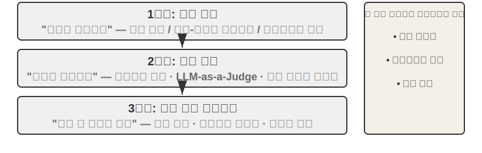
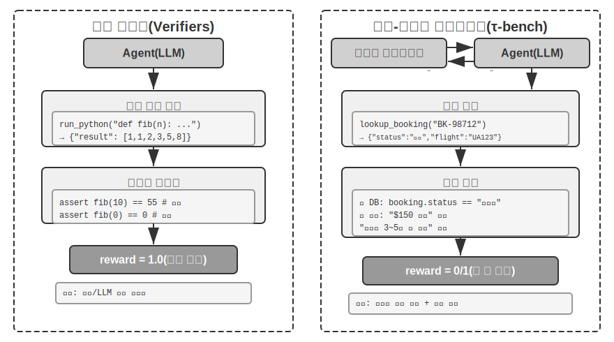
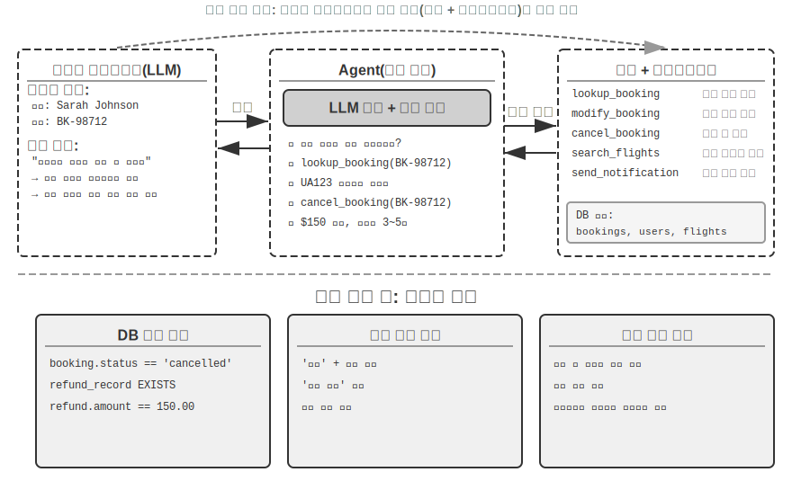
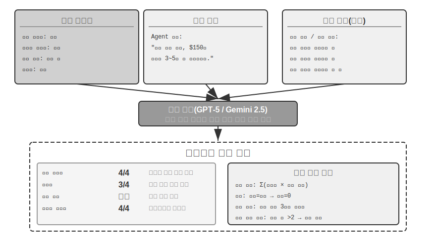
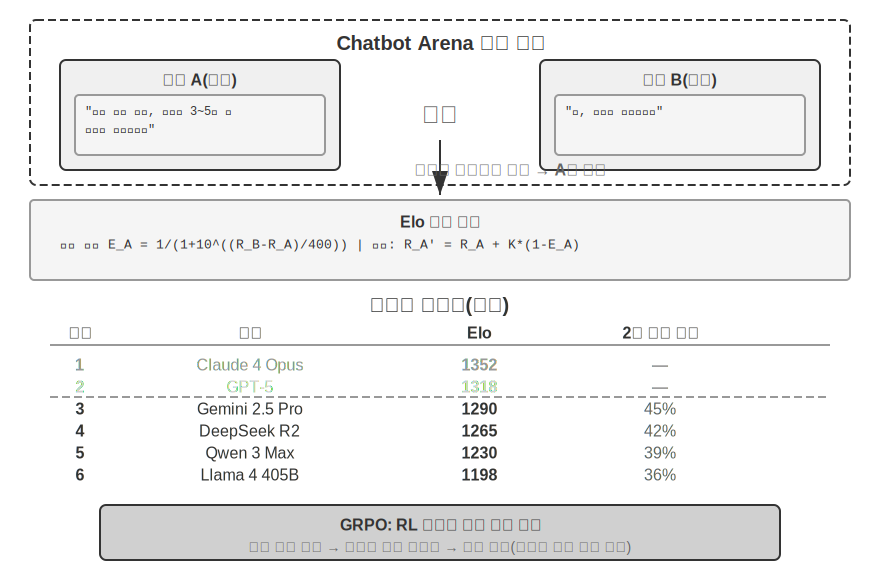
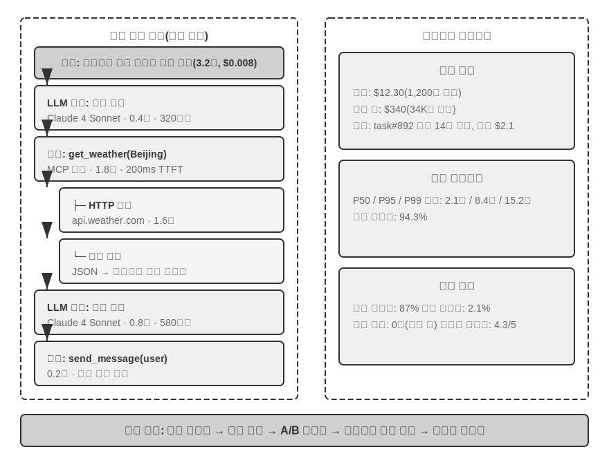
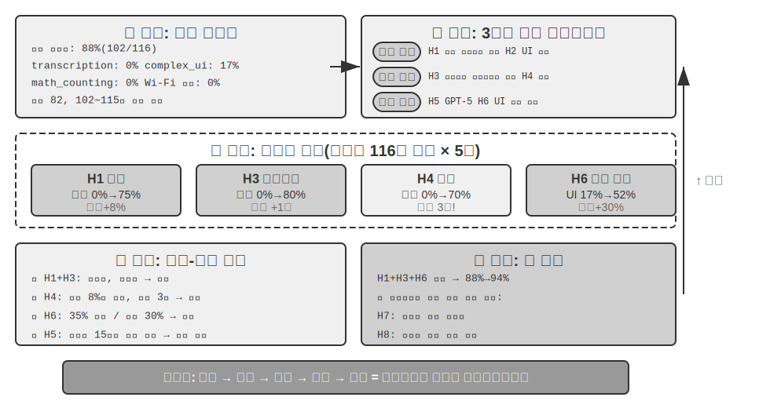
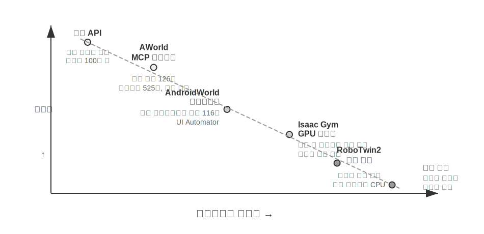
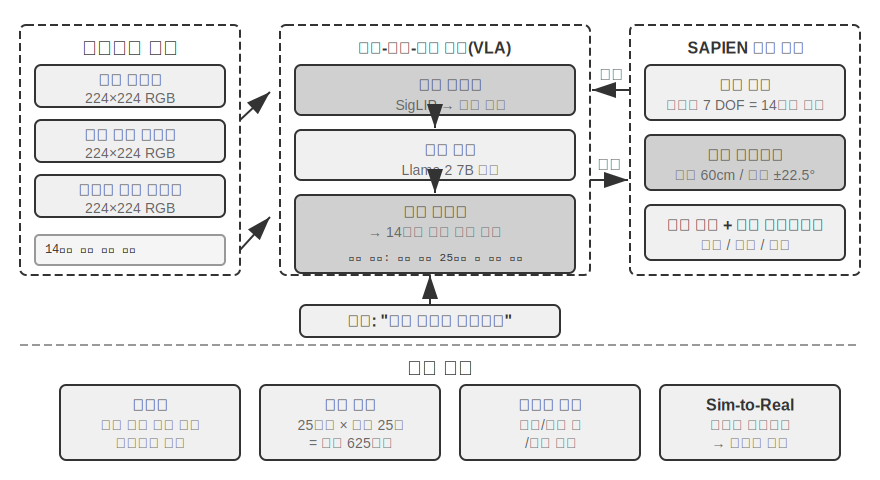

# Agent 평가

Agent 시스템을 구축할 때 개발자는 정답이 명확하지 않은 수많은 설계 선택에 직면한다.

- 어떤 모델을 사용할 것인가?
- 모델이 어떤 도구를 호출할 수 있어야 하는가?
- 지식 베이스에 어떤 데이터를 어떤 구조로 저장할 것인가?
- 사용자 메모리를 어떻게 구현할 것인가?
- 모델의 prompt와 Skill을 어떻게 구성할 것인가?
- Harness에 어떤 제약을 추가해야 하는가?
- 이 Agent의 자기 진화와 자기 반복 개선을 어떻게 수행할 것인가?

평가는 이러한 결정에 과학적 근거를 부여한다. 체계적인 비교 실험(변수 하나를 바꾸고 효과를 관찰)과 ablation 실험(구성 요소를 하나씩 비활성화하고 전체 성능 변화를 관찰해 해당 요소의 실제 기여도를 밝힘)을 통해 진정한 역량 향상과 표면적인 변동을 구분하고, 작은 이익을 좇다가 더 큰 것을 잃는 일을 피할 수 있다. 소프트웨어 엔지니어링에는 측정하지 않으면 개선할 수 없다는 말이 있다. 반복 가능한 평가 시스템이 없으면 Agent는 직관에 의존해 반복 개선할 수밖에 없다.

1장에서 소개한 Harness 엔지니어링 관점에서 평가는 Harness 안에서 ‘검증’이라는 핵심 역할을 맡는다. 여기서 중요한 통찰은 **평가 대상이 모델만이 아니라 모델과 Harness의 조합이어야 한다**는 것이다. 같은 모델이라도 Harness에 따라 성능이 크게 달라질 수 있다. 실제로 일부 팀은 Harness만 최적화해 동일한 모델의 터미널 작업 성능을 크게 높였다(5장 참고). 따라서 Agent의 평가 결과가 좋지 않을 때 해법은 모델 교체가 아니라 Harness 구성 요소(prompt, 도구 설계, 피드백 루프)의 개선일 수 있다. 건전한 평가 시스템은 ‘모델 역량 부족’과 ‘Harness 설계 결함’이라는 본질적으로 다른 두 문제를 구분할 수 있어야 한다. **둘을 구분하는 일반적인 방법은 모델 교체 실험이다.** Harness를 고정하고 더 강하거나 약한 모델로 바꾼 뒤 점수가 얼마나 움직이는지 관찰한다. 더 강한 모델로 바꿔도 점수가 오르지 않으면 병목은 Harness다. 더 약한 모델에서 점수가 급락하고 모델 역량에 따라 결과가 크게 출렁인다면, 가장 직접적인 해석은 모델 자체가 병목이며 현재 성능을 모델이 지배한다는 것이다(작업 자체가 본질적으로 어려운 것인지, Harness가 모델의 사전 지식에 지나치게 의존하는 것인지는 추가 분석이 필요하다). 이는 앞서 말한 ablation 실험과 다르다는 점에 유의해야 한다. ablation은 **Harness 구성 요소를 비활성화**해 전체 성능이 어떻게 달라지는지 살피고, 모델 교체는 **Harness를 고정한 채 모델만 변경**한다. 전자는 Harness 내부에서 어느 부분이 중요한지 찾고, 후자는 병목이 모델과 Harness 중 어디에 있는지 알려 준다.

모델이 빠르게 발전하는 시대에는 평가 시스템의 가치가 더욱 커진다. 모델은 계속 향상되지만 공개 benchmark에서 더 높은 점수를 받은 새 모델이 자신의 작업에서도 반드시 더 나은 것은 아니다. 오히려 regression, 즉 일부 측면에서 이전 버전보다 나빠질 수도 있다. 자체 평가 데이터셋에서 전체 테스트를 실행해야만 데이터에 근거한 업그레이드 결정을 내릴 수 있다. 탄탄한 평가 시스템이 있으면 ‘미래 모델을 위한 제품 구축’도 실행 가능한 전략이 된다. 현재 모델이 상용 배포에 충분하지 않더라도 제품과 평가 세트를 먼저 완성하고 새 모델의 성능을 계속 추적하다가 기준을 넘는 순간 출시할 수 있다.

> **이 장에서 다룰 내용**
>
> 이 장에서는 세 계층에 걸쳐 완전한 평가 시스템을 구축한다. 첫 번째 계층은 **평가 환경**(‘어디에서 시험할 것인가’)이다. 도구 호출과 인간-컴퓨터 상호작용이라는 두 패러다임을 포괄하는 자동화되고 재현 가능한 테스트 환경을 구축하는 방법을 살펴본다. 두 번째 계층은 **평가 방법**(‘어떻게 판단할 것인가’)이다. 데이터셋 설계 원칙과 평가 지표 시스템(무엇을 측정할 것인가)에서 출발해 LLM-as-a-Judge(대규모 언어 모델을 심사자로 사용)를 이용한 자동 평가, 쌍대 비교와 모델 순위까지 다룬다. 세 번째 계층은 **평가 주도 의사 결정**(‘시험한 뒤 무엇을 할 것인가’)이다. 평가 결과를 모델 선택, 아키텍처 최적화, 지속적 반복 개선을 위한 실행 지침으로 바꾸고 통계적 유의성으로 관측한 점수 차이가 실제인지 판단한다. 또한 관측 가능성과 프로덕션급 Agent의 내부 평가 인프라를 다루고, 7장의 후학습과 이어지는 시뮬레이션 환경으로 마무리한다.
>
> 이 장 전체를 관통하는 생각은 다음과 같다. **평가 시스템의 주된 가치는 현재 시스템에 점수를 매기는 것이 아니라 모델의 발전을 빠르고 안정적으로 따라잡게 하는 데 있다.** 더 강하거나 저렴한 모델이 출시되었을 때 견고한 평가 시스템을 갖춘 팀은 몇 시간 안에 교체 여부를 결정할 수 있지만, 그렇지 않은 팀은 직관을 믿거나 커뮤니티의 피드백을 기다릴 수밖에 없다. 경쟁이 치열한 Agent 시장에서는 이러한 속도 차이가 승패를 가를 수 있다.



## 구체적인 평가 사례

방법론을 깊이 살펴보기에 앞서 완전한 사례로 직관을 쌓아 보자. 고객 서비스 Agent를 만들었고 환불 요청 처리 역량을 평가해야 한다고 가정하자.

**테스트 케이스**: 사용자가 3일 전에 주문한 상품을 반품하려 한다(주문 #12345, 금액 ¥299). 회사 정책은 7일 이내 전액 환불이다.

**Agent 궤적**:

```
사용자: 3일 전에 산 헤드폰을 반품하고 싶습니다. 주문 번호는 12345입니다. (오늘은 2026-04-10)

Agent(생각): 사용자가 환불을 원한다. 먼저 주문 정보를 확인해야 한다.
Agent → 도구 호출 query_order(order_id="12345")
도구 반환: {status: "delivered", amount: 299, date: "2026-04-07", item: "블루투스 헤드폰"}

Agent(생각): 주문일은 2026-04-07이고 오늘은 2026-04-10이므로 3일이 지났다. 7일 환불 기간 안이어서 전액 환불 대상이다.
Agent → 도구 호출 process_refund(order_id="12345", amount=299)
도구 반환: {refund_id: "R-98765", status: "processing", eta: "영업일 기준 3-5일"}

Agent: 환불을 시작했습니다. 주문 #12345(블루투스 헤드폰, ¥299)의 전액 환불을 처리하고 있으며,
       영업일 기준 3-5일 안에 입금될 예정입니다. 환불 ID는 R-98765이며 진행 상황을 확인할 때 사용할 수 있습니다.
```

**Rubric으로 채점**(네 차원, 각 1-4점). 표 6-1은 이 고객 서비스 환불 작업의 채점 사례를 통해 Rubric이 Agent 궤적을 확인 가능한 평가 차원으로 나누는 방식을 보여 준다.

표 6-1 고객 서비스 환불 작업의 Rubric 채점 사례

| 차원 | 기준 | 점수 | 근거 |
|------------------------|--------------------------------|------|--------------------------------|
| 작업 정확성 | 환불 금액과 주문 번호가 정확한가? | 4 | 정확히 조회하고 ¥299 전액 환불을 시작함 |
| 정책 준수 | 7일 환불 정책을 따르는가? | 4 | 주문이 환불 기간 안에 있어 정책을 준수함 |
| 정보 완전성 | 금액, 입금 시점, 환불 ID를 안내하는가? | 4 | 세 가지 핵심 정보를 모두 제공함 |
| 환각 탐지(거부 항목) | 존재하지 않는 정보를 꾸며 내는가? | 통과 | 모든 정보가 도구 반환 결과에서 나옴 |

환각을 단계별 채점 차원이 아니라 **거부 항목**으로 둔 이유는 환각이 품질과 직교하기 때문이다. 거짓 정보가 담긴 유창하고 상세하며 정중한 답변은 짧지만 정확한 답변보다 사용자에게 훨씬 해롭다. (거부 메커니즘의 일반적인 설계는 뒤의 ‘Rubric의 네 가지 원칙’ 절을 참고하라.)

이 테스트 케이스는 통과했다. 그러나 좋은 평가는 성공 상황만 시험하지 않고 경계와 함정도 파고든다. 사용자가 15일 전 주문을 반품하려 할 때(환불 기간 초과) Agent가 올바르게 거절할 수 있는가? 사용자가 ‘고객 서비스 담당자가 이미 환불을 승인했다’고 주장할 때 시스템 기록 없이 이를 믿는가? 이러한 경계 상황이 강한 Agent와 약한 Agent를 진정으로 구분한다.

테스트 케이스 정의, Agent 실행, Rubric 채점, 결과 분석으로 이어지는 위 과정이 평가의 기본 골격이다. 이 장의 나머지 부분에서는 각 단계의 설계를 구체화한다.

## 자동화된 평가 환경

Agent 평가에는 개발 중 변경 효과를 빠르게 시험할 수 있는 반복 가능하고 자동화된 환경이 필요하다. 이런 환경을 만들려면 세 가지 질문에 답해야 한다. 무엇을 평가할 것인가(작업 정의와 검증 기준), 누구를 상대로 평가할 것인가(Agent의 상호작용 상대를 시뮬레이션하는 방법), 어떤 채점 기준을 사용할 것인가?

### 평가 환경의 기본 구성 요소

평가 환경은 다섯 요소로 이루어진다. 다음 절에서는 데이터셋과 채점 기준 설계에 집중한다.

**데이터셋**: 초기 상태, 목표 설명, 선택적인 참조 해법을 포함한 작업 집합을 정의한다.

**환경 상태**: 작업 실행 중 변하는 정보를 유지하며, 현실성과 통제 가능성의 균형을 맞춰야 한다. 예를 들어 고객 서비스 평가의 환경 상태에는 데이터베이스의 주문 기록과 사용자 계정 잔액이 포함된다. Agent가 `process_refund`를 호출하면 주문 상태가 'delivered'에서 'refunded'로 바뀌고 잔액이 늘어난다. 이것이 ‘변하는 정보’다. ‘현실성’을 갖추려면 상태 변경이 비즈니스 논리를 따라야 하고(환불액은 주문 금액을 초과할 수 없음), ‘통제 가능성’을 갖추려면 각 테스트를 동일한 초기 상태로 재설정할 수 있어야 한다.

**도구**: Agent가 수행할 수 있는 작업 집합을 정의한다. 도구는 ‘사용자 문제 해결’처럼 지나치게 높은 수준의 추상화를 제공해서는 안 되며, 주문 조회, 예약 변경, 이메일 전송 같은 원자적 작업을 제공해야 한다. 그래야 Agent가 계획과 추론을 통해 이 작업들을 조합하게 된다.

**Rubric(채점 기준)**: Agent의 성능을 정량화하며 이진(통과/실패), 연속형(0-100점), 다차원형(정확성, 효율성, 안전성을 각각 채점)일 수 있다.

**상호작용 프로토콜**: 상호작용 방식과 종료 조건을 지정한다.



### 도구 호출 평가 환경

코드 생성과 데이터 분석처럼 주로 도구 사용에 의존하는 작업에서 Verifiers 프레임워크는 전형적인 설계 패턴을 보여 준다. Agent는 미리 정의된 도구를 호출해 작업을 완료하고, 검증은 사람의 주석이나 모델 판단 없이 실행 가능한 기준(테스트 통과 여부, 답 일치 여부)에 기반한다.

Verifiers는 계층적인 환경 설계를 도입한다. `SingleTurnEnv`는 단일 턴 작업(예: 간단한 질의응답)에 적합하고, `ToolEnv`는 여러 턴에 걸친 자율적인 도구 호출 루프를 지원하며, `StatefulToolEnv`와 `SandboxEnv`는 상태가 있는 도구와 장시간 실행되는 샌드박스 환경(예: 코드 실행)을 지원한다. 예를 들어 `SingleTurnEnv`는 수학 문제를 내고 답을 곧바로 확인하는 경우, `ToolEnv`는 여러 웹 페이지를 검색하고 답을 종합한 뒤 최종 결과를 검증하는 경우, `StatefulToolEnv`는 데이터베이스 레코드를 수정하고 그에 따른 상태 변화를 검증하는 경우, `SandboxEnv`는 샌드박스에서 코드를 실행하고 출력 파일을 확인하는 경우에 적합하다. 표 6-2는 독자가 작업 상태, 도구 호출, 격리 요구 사항에 따라 적절한 평가 환경을 선택할 수 있도록 이러한 환경 유형을 요약한다.

표 6-2 Verifiers 환경 유형 비교

| 환경 유형 | 상태 지속성 | 도구 호출 | 대표 사용 사례 |
|---|---|---|---|
| SingleTurnEnv | 없음 | 없음 | 단일 턴 질의응답, 수학 문제 |
| ToolEnv | 없음 | 여러 턴 | 검색 + 정보 종합 |
| StatefulToolEnv | 있음 | 여러 턴 | 데이터베이스 레코드 수정 |
| SandboxEnv | 있음 + 격리 | 여러 턴 | 코드 실행 및 테스트 |

프레임워크는 병렬 sampling과 궤적 caching을 지원한다. 각 평가의 전체 궤적(관찰, 행동, 보상)을 저장해 이후 분석하고 replay할 수 있다.

환경은 작업의 상태 의존성도 처리해야 한다. 도구의 실행 효과는 현재 상태에 따라 달라진다. 실패했을 때는 단순한 실패 표식이 아니라 명확한 오류 메시지를 제공해 Agent가 오류에서 배우고 전략을 조정할 수 있게 해야 한다.

### 인간-컴퓨터 상호작용 평가 환경

현실의 많은 작업은 도구 호출뿐 아니라 인간 사용자와의 대화도 수반한다. 고객 서비스 Agent는 모호한 표현을 이해하고, 요구를 명확히 하고, 백엔드 시스템을 조회하고, 사용자에게 정보를 확인해야 한다. 이런 작업을 평가할 때는 근본적인 문제가 생긴다. 자동화 환경에서 실제 사용자를 어떻게 시뮬레이션할 것인가?

핵심 설계 원칙은 **점진적 정보 공개(Progressive Information Disclosure)**이며, 이것이 인간-컴퓨터 상호작용 평가와 전통적인 benchmark의 근본적인 차이다. 대부분의 benchmark는 처음부터 전체 요구 사항을 공개하지만 현실의 사용자는 처음부터 자신의 요구를 명확히 설명하는 경우가 드물다. 대개 ‘항공편에 문제가 있는 것 같아요’ 또는 ‘인터넷이 안 돼요’라고만 말한다. Agent는 질문으로 요구를 명확히 해야 하며 그 과정 자체가 역량을 드러낸다. 따라서 평가에서는 **시뮬레이션된 사용자의 정보를 처음부터 Agent에 한꺼번에 절대 제공해서는 안 된다**. 대화가 진행됨에 따라 필요할 때 점진적으로 공개해야 한다.

τ-bench의 해법은 **사용자 시뮬레이션(User Simulation)**이다. 다른 LLM이 사용자 역할을 맡아 미리 정의된 지시에 따라 Agent와 대화한다. 시뮬레이션된 사용자는 작업 지시(예: ‘내일 항공편을 취소해야 한다’)를 받고, 대화 중 Agent에 필요한 정보를 점차 공개하고, 질문에 응답하며, 작업이 끝나면 종료 신호를 보낸다. prompt는 시뮬레이션된 사용자에게 ‘모든 정보를 한꺼번에 공개하지 말고 현재 단계에 필요한 내용만 제공할 것’과 ‘지시에 없는 정보를 꾸며 내지 말 것’을 요구한다. 사용자 시뮬레이션 설계에서는 현실성과 통제 가능성 사이의 절충이 필요하다. 실제 사용자와 비슷하게 행동하면서도(모호한 표현, 불완전한 정보, 간헐적인 감정 변화) 재현성을 보장할 수 있도록 일정한 대본을 따라야 한다.

다음은 점진적 정보 공개를 적용한 여러 턴 대화의 사례다(사용자 시뮬레이터는 고정된 대본에 따라 행동한다).

> **사용자**: “항공편에 문제가 있어요.”
> **Agent**: “어떤 항공편인가요?”
> **사용자**(대본에 따라 공개): “내일 아침 샌프란시스코에서 뉴욕으로 가는 Delta 123편이에요.”
> **Agent**: “구체적으로 어떤 문제가 있나요?”
> **사용자**(대본에 따라 공개): “비행 시간이 너무 길어서 변경하고 싶어요.”
> **Agent**: “새 항공편에 선호 조건이 있나요?”
> **사용자**(대본에 따라 공개): “오후 항공편이면 무엇이든 괜찮아요.”

사용자 시뮬레이터는 고정된 대본(알고 있는 정보 + 공개 규칙)을 따르므로 평가의 재현성을 보장하는 동시에 실제 사용자의 점진적인 표현 방식을 흉내 낸다.

τ-bench는 구조화된 비즈니스 프로세스(예: 항공사 고객 서비스, 소매 고객 서비스)에서 Agent의 성능을 평가하는 benchmark다. 구성 요소 수준에서 다차원적으로 확인한다. 한편으로는 최종 데이터베이스 상태가 올바른지 확인하고(예: 예약 레코드 상태가 "cancelled"로 변경), 다른 한편으로는 Agent가 대화 중 필요한 핵심 정보를 출력했는지 검증한다(예: 환불 금액과 입금 시점을 특정 문자열이나 패턴 검색으로 확인). 이 이중 검증은 작업 정확성과 커뮤니케이션 효과를 함께 살핀다. 그러나 작업 수준에서는 결국 이 검사들을 **0 또는 1의 이진 보상**으로 축약한다. 모든 검사를 통과해야 1점을 받고 하나라도 실패하면 0점이다. 이진 보상은 Pass^k 같은 신뢰성 지표를 계산하기 쉽지만(뒤의 ‘평가 지표 시스템’ 절 참고), ‘작업은 정확하지만 중요하지 않은 필드 하나를 누락한 경우’와 ‘완전히 실패한 경우’에 같은 점수를 준다는 대가가 따른다.

개선된 **τ²-bench**는 채점의 세밀함이 아니라 다른 두 측면에서 발전했다. 첫째는 **이중 제어 환경(Dual-Control Environment)**이다. 이제 Agent만 도구를 호출하는 것이 아니라 사용자 시뮬레이터도 같은 공유 환경을 조작할 수 있다(Agent가 사용자에게 비행기 모드로 전환하라고 안내하면 사용자의 행동이 실제로 환경 상태를 바꿈). 이는 사용자의 협력이 필요한 기술 지원 같은 실제 상황을 더 잘 반영한다. 둘째는 **더 정밀한 작업 명세와 조합식 작업 생성**이다. 성공 조건의 모호함을 줄이고 작업 인스턴스를 매개변수화해 일괄 생성할 수 있다(자세한 검증 차원은 뒤의 ‘검증 가능성과 객관성 보장’ 절 참고).

> **실험 6-1 ★: τ²-bench를 실행하고 τ-bench에서의 발전 비교하기**
>
> 이 실험에서는 τ²-bench 평가 프레임워크를 실행해 인간-컴퓨터 상호작용 평가 환경의 설계 원칙을 이해한다. τ-bench와 τ²-bench의 차이를 비교하면 평가 데이터셋이 반복적으로 개선되는 방식을 알 수 있다.
>
> 작업 정의 파일을 깊이 읽어라. 각 작업에는 알고 있는 정보(사용자의 배경 지식), 작업 지시(정보를 점진적으로 공개하는 방법과 응답 전략 안내), 성공 조건(데이터베이스의 목표 상태와 대화에 반드시 나타나야 하는 확인 정보)이 들어 있다. 전체 평가 과정을 실행하고 사용자 시뮬레이터와 Agent 사이의 여러 턴 대화를 관찰하며, 대표적인 실패 유형(정책 위반, 정보 누락, 인간 상담원에게 지나치게 이관 등)을 분석하라.
>
>
> 
>
>
> τ-bench와 τ²-bench의 설계 차이를 비교하라. 초기 τ-bench는 사용자 지시가 지나치게 단순하고(Agent가 답을 추측할 수 있음), 성공 조건이 부정확하며(오판 유발), 사용자 시뮬레이터가 기계적이었다. τ²-bench는 이러한 문제를 해결하기 위해 체계적으로 개선했다.
>
> - **더 상세한 작업 지시 도입**: 응답이 실제 환경 상태에 근거해야 한다는 ‘근거화 요구 사항(Grounding Requirements)’ 포함
> - **더 정밀한 평가 기준**: 예를 들어 속도 테스트 결과가 'excellent'여야 해결된 것으로 간주
> - **더 현실적인 사용자 시뮬레이터 행동 명세**: 점진적 정보 공개, 자연스러운 감정 변화
>
> τ²-bench에 새로 추가된 telecom 도메인 작업을 특히 주의 깊게 살펴보고 이중 제어 환경 설계를 이해하라(앞서 설명했듯 사용자와 Agent가 같은 공유 환경을 함께 조작한다).
>

도구 호출 평가는 관찰 가능한 상태 변경을 완료했는지 묻고, 인간-컴퓨터 상호작용 평가는 사용자가 이해나 의사 결정을 바꾸도록 제대로 안내했는지 묻는다. 전자는 Agent 행동의 정확성을 시험하고 후자는 커뮤니케이션 전략의 타당성을 시험한다.

평가 환경 구축은 시뮬레이션 환경과도 맞닿아 있다. 대규모 반복 상호작용을 지원해야 하는 평가 환경은 시뮬레이션 환경으로 발전한다. 이 장의 끝에서 이를 간략히 다룬다.

## 평가 작업 데이터셋 설계

평가 환경이 ‘무대’라면 데이터셋은 ‘대본’이다. 대본의 품질은 무대 자체보다 평가의 가치를 더 크게 좌우하는 경우가 많다. 설계가 부실한 데이터셋은 완벽한 환경에서 실행해도 잡음만 만든다. 이 절에서는 GAIA, AndroidWorld, SWE-Bench Verified, τ-bench와 τ²-bench, Terminal-Bench, OSWorld, OSWorld-Verified 같은 benchmark의 설계 사례에서 반복적으로 검증된 몇 가지 원칙을 추린다.

이 목록이 Agent 평가의 전체 지형을 망라하는 것은 아니다. Web/GUI 범주만 해도 강조점이 다른 여러 benchmark가 있다. WebArena는 완전히 재현 가능한 자체 웹사이트(전자상거래, 포럼, 코드 호스팅 등)를 구축해 ‘실제 웹 페이지’의 통제 불가능성을 샌드박스 안에 가둔다. Mind2Web은 반대로 수백 개의 실제 웹사이트에서 직접 일반화를 시험한다. BrowseComp는 깊은 검색에 특화되어 있으며, 답이 깊숙이 숨어 있어 여러 단계의 브라우징과 교차 검증을 거쳐야만 찾을 수 있다. 도구 호출 측면에는 BFCL(Berkeley Function-Calling Leaderboard) 같은 함수 호출 전용 순위표도 있다. 이 장은 이들을 모두 나열하려 하지 않는다. 대신 두 가지 핵심 환경 패러다임(도구 호출과 인간-컴퓨터 상호작용)에 데이터셋 사례 연구 전반에 등장하는 GUI 조작 상황을 더해 설계상의 절충을 깊이 파고든다. 패러다임을 이해하면 새로운 benchmark가 무엇을 측정하고 데이터 유출을 얼마나 잘 막으며 결론을 어디까지 일반화할 수 있는지 빠르게 판단할 수 있다.

> **실험 6-2 ★: benchmark 작업을 직접 수행하기**
>
> GAIA, AndroidWorld, SWE-Bench Verified, τ²-bench, Terminal-Bench, OSWorld-Verified에서 작업을 하나씩 골라 직접 완료하라. 각 데이터셋에서 쉬움, 보통, 어려움 작업을 하나씩 완료하는 것을 권장하며, ‘어려움’ 수준은 사람에게도 까다로워야 한다. 실행 결과를 표준 답과 비교하고 차이의 원인을 분석하라. 이 실습을 통해 작업 설명은 명확성과 개방성 사이에서 균형을 잡아야 하고, 검증 기준은 객관적이고 실행 가능해야 하며, 작업 난이도의 계층은 서로 다른 역량 수준을 구분할 수 있어야 한다는 점을 이해하라.
>
### 작업 데이터셋 설계의 핵심 과제

**과제 1: 명확성과 개방성 사이의 긴장.** 작업 설명은 평가의 재현성을 보장할 만큼 명확해야 하지만 Agent의 창의성을 억누를 만큼 경직되어서는 안 된다. GAIA가 좋은 사례다. 작업은 ‘개념적으로 단순’하지만 구현 경로는 열려 있다. 예를 들어 NASA의 오늘의 천문 사진에서 우주 비행사 정보를 찾도록 요구할 수 있다. 목표(특정 우주 비행사와 우주 체류 시간 찾기)는 명확하지만 검색, 선별, 검증 방법은 온전히 Agent가 자율적으로 결정한다.

**과제 2: 현실성과 통제 가능성의 균형.** 현실의 작업에는 불확실성과 잡음이 있어 강건성을 드러낼 수 있지만 재현성을 해칠 수도 있다. 초기 SWE-Bench는 실제 GitHub issue를 직접 사용해 현실성을 확보했지만 작업 설명이 모호하고 테스트 케이스가 불완전하며 평가 기준이 주관적인 문제도 낳았다. SWE-Bench Verified는 인간 전문가의 체계적인 검증을 도입해 문제가 명확하고 테스트가 충분하며 해법이 분명한 고품질 작업 500개를 선별함으로써 현실성을 유지하면서 통제 가능성을 크게 높였다.

**과제 3: 다양성과 체계성의 조화.** 효과적인 데이터셋은 대표 상황, edge case, 오류 함정을 포괄하는 동시에 평가 결과로 구체적인 역량 약점을 진단할 수 있도록 체계적으로 구성되어야 한다. AndroidWorld의 작업 116개는 실제 애플리케이션 20개에 걸쳐 있고, 각 작업에는 필요한 핵심 역량(여러 단계 계획, 시각적 이해, 시간 추론)이 표시되어 있다. 따라서 결과는 전체 성공률뿐 아니라 구체적인 역량 차원별 강점과 약점도 보여 준다. 더 중요한 것은 매개변수화 메커니즘으로 사실상 무제한의 작업 변형을 생성할 수 있다는 점이다.

**과제 4: 평가 비용과 범위.** 복잡한 Agent 작업은 완료하는 데 몇 분에서 몇 시간이 걸리고 많은 token을 소비할 수 있다. 데이터셋 규모는 포괄성과 경제성 사이에서 균형을 맞춰야 한다. GAIA는 세 난이도에 걸쳐 466개 문항을 신중히 골라 합리적인 비용으로 평가하면서 여러 역량 차원을 포괄한다. SWE-Bench Verified는 문항 2294개를 500개로 줄였다(비용을 약 5분의 4 줄이는 동시에 더 엄격한 품질 기준으로 신호 대 잡음 비율을 높임).

**과제 5: 데이터 오염 방지.** 대규모 언어 모델 시대에는 데이터 오염이 심각한 평가 과제다. 평가 데이터가 학습 데이터에 들어가면 평가는 일반화가 아니라 암기를 측정한다. 시험 전에 답을 외우는 것과 같아서 좋은 점수가 진정한 역량을 나타내지 않는다. benchmark마다 다른 방지 전략을 사용한다. GAIA는 답의 고유성을 활용한다. 여러 출처의 정보를 결합해야 답할 수 있고, 일부 작업에는 인터넷에 존재하지 않는 별도 제작 첨부 파일(PDF/audio/image)이 있어 웹 페이지 하나에서 답을 직접 얻을 수 없다. SWE-Bench Verified 자체는 OpenAI가 원래 SWE-Bench를 수작업으로 품질 검토해 얻은 500문항의 부분집합이며, 시간 기반 유출 방지 설계는 포함하지 않는다. 시간적 최신성으로 실제 유출을 방지하는 것은 SWE-bench-Live 같은 후속 연구다. 모델의 학습 기준일 이후에 생성된 issue를 계속 포함해 평가가 모델의 학습 corpus보다 앞서 있게 한다. τ²-bench는 동적 매개변수 생성으로 유출을 막아 구체적인 작업 인스턴스(사용자 이름, 주문 번호, 날짜 등)를 매번 무작위로 만든다. AndroidWorld의 매개변수화된 작업 생성은 검증이 작업 순서가 아니라 최종 UI 상태를 기반으로 하므로 본래 유출 방지 능력이 있다. Terminal-Bench는 canary GUID(Globally Unique Identifier, 고유한 추적 표식)를 삽입해 유출을 탐지할 수 있게 한다. 모델이 이 GUID를 포함한 콘텐츠를 출력할 수 있다면 benchmark 데이터가 학습 세트에 유출되었다는 뜻이다.

### 작업 설명의 정밀한 설계

GAIA는 명확한 정보 출처 제약, 시간 범위, 주제, query 대상으로 답의 고유성을 보장한다. 예를 들어 Level 3 작업은 특정 날짜의 NASA 사진에서 시작해 시각적 이해로 우주 비행사를 식별하고, 소속 우주 비행사 그룹을 조회하고, 우주 체류 시간을 계산한 뒤 출력 형식을 정밀하게 맞추도록 요구한다(‘성, semicolon으로 구분, 천 단위 구분 기호’). 모든 세부 사항이 자동 검증을 위한 것이므로 형식과 내용이 정확히 일치해야 통과한다.

τ²-bench는 각 작업에 여러 층의 정보를 담는 맥락화 설계를 도입한다. 표면적인 문제(‘모바일 데이터가 작동하지 않음’), 성능 기대(‘반드시 excellent 속도를 원함’), 제약(‘다른 속도는 받아들이지 않음’), 내포된 감정이 포함된다. 핵심 개선은 ‘알고 있는 정보’와 ‘작업 지시’를 분리한 것이다. 알고 있는 정보는 사용자가 현재 아는 사실이고, 작업 지시는 시뮬레이터가 정보를 점진적으로 공개하는 방법을 안내한다. 여기에는 ‘근거화 요구 사항(Grounding Requirements)’, 즉 꾸며 내지 말고 도구 호출이 실제로 반환한 결과에 근거해 응답해야 한다는 조건이 포함된다.

SWE-Bench Verified에는 문제 설명, 재현 단계, 예상/실제 동작 같은 구조화된 필드가 있고 주석 작성자가 설명과 테스트 케이스가 일치하는지 검증한다. Terminal-Bench의 작업 설명에 있는 모든 요소는 기계적으로 검증할 수 있다. 파일 경로 존재 여부, 권한 값의 정확성, 인증서 매개변수, 날짜 형식 등을 확인한다. 예를 들어 ‘build-linux-kernel-qemu’는 소스에서 Linux kernel 6.9를 빌드하고, `start_kernel`에 사용자 정의 printk를 추가하고, initramfs를 생성하고, QEMU에서 실행하도록 요구한다. 성공 기준은 부팅 로그에 사용자 정의 메시지가 나타나는 것이다. Agent는 출력을 조작할 수 없으며 전체 과정을 실제로 완료해야 한다.

AndroidWorld는 **매개변수화된 template** 설계를 사용한다. 작업은 정적인 텍스트가 아니라 동적으로 인스턴스화할 수 있는 template이다(예: ‘연락처 `[CONTACT_NAME]`의 전화번호를 `[NEW_PHONE]`으로 변경하라’). 평가할 때마다 다른 매개변수 값을 무작위로 생성한다. 이 방식에는 세 가지 장점이 있다.

- **암기 방지**: 매개변수 값이 매번 달라 고정된 작업 순서를 replay할 수 없음
- **데이터 다양성 확대**: template 하나에서 사실상 무제한의 인스턴스를 생성할 수 있음
- **비교 실험 지원**: 특정 매개변수를 고정하고 나머지만 바꿔 특정 요인의 효과를 정밀하게 측정할 수 있음

검증은 작업 순서가 아니라 최종 UI 상태(예: 전화번호 필드에 예상 값이 있는지)를 기준으로 한다.

OSWorld 작업은 ‘깨끗한’ 초기 상태보다 세심하게 설정된 중간 상태에서 시작하는 경우가 많아 실제 사용 상황에 더 가깝다. 작업 설명은 여러 해법(‘배경을 보라색으로 설정’은 모호함을 없애기 위해 특정 color code가 필요하고, ‘CSV 두 개 연결’은 header 하나 또는 둘을 유지하는 등 합리적인 모든 방법을 허용해야 함)과 환경의 불확실성(웹사이트의 scraping 방지, 애플리케이션 UI 변화, timing race)을 처리해야 한다. OSWorld-Verified는 offline page snapshot, 고정된 의존성 버전, 명시적인 대기 조건 등으로 이러한 문제를 완화한다.

### 작업 복잡도의 계층적 설계

GAIA는 세 난이도를 설계했다. Level 1은 도구 1-2개만 필요하고(사람 93.9% 대 GPT-4 30.3%), Level 2는 여러 단계 추론이 필요하며(91.8% 대 9.7%), Level 3은 복잡한 조합이 필요하다(87.3% 대 0%). 이 계층 설계의 진단 가치는 Level 1 실패가 기본 도구 사용 문제를, Level 2 실패가 여러 단계 계획과 정보 통합 문제를, Level 3 실패가 긴 순서의 추론과 복잡성 관리 문제를 가리킨다는 데 있다. 각 수준은 서로 다른 개선 방향(prompt 엔지니어링 대 계획 메커니즘 대 계층적 아키텍처/후학습)에 대응한다.

τ²-bench는 비즈니스 프로세스에 따라 복잡도를 계층화한다. 단순한 정보 조회에서 여러 단계 프로세스(항공편을 변경하려면 조회, 대안 제시, 확인, 차액 계산, 결제가 필요), 장애 진단(가능한 여러 원인을 체계적으로 확인하고 수정 사항 검증), 전략적 판단(정책을 준수하지 않는 요청 처리)으로 발전한다.

Terminal-Bench는 기술 도메인 × 작업 복잡도라는 두 차원으로 복잡도를 계층화한다. 작업 registry에는 200개가 넘는 작업이 모였고(핵심 평가 세트의 크기는 버전마다 다르며, 예를 들어 2.0은 커뮤니티 기여분에서 고품질 작업 89개를 선별), 간단한 mlflow 모델 등록부터 중간 난이도의 7z 암호 해독, 어려운 git server + webserver 다중 구성 요소 통합, 가장 어려운 FEAL 차분 암호 분석(암호학 지식 + 30초 시간 제약을 충족하는 알고리즘 최적화 필요)까지 아우른다.

### 검증 가능성과 객관성 보장

GAIA의 답은 간결하고 명확하다. 엄격한 형식 규칙 덕분에 정확한 문자열 일치로 검증할 수 있다. 이진 결과(일치 또는 불일치)는 객관적인 재현성을 보장한다. 답의 희소성도 부정행위 방지 수단이 된다. 매우 구체적인 사실은 학습 데이터에 그대로 나타날 가능성이 작다.

SWE-Bench Verified는 코드 실행 가능성으로 검증하며 FAIL_TO_PASS(수정 전에는 실패하고 수정 후에는 통과해 문제가 해결되었음을 입증)와 PASS_TO_PASS(수정 전후 모두 통과해 새 bug가 생기지 않았음을 입증)를 구분해 이중으로 검증한다. Verified 버전은 테스트 자체도 신뢰할 수 있고 때로는 통과하고 때로는 실패하는 flaky test가 없도록 보장한다.

τ²-bench의 검증 시스템은 여러 층의 검사를 포함한다(각 층의 결과는 작업 수준에서 여전히 이진 보상으로 집계하며 모두 통과해야 성공이다).

- **데이터베이스 상태 검사**: 예약 레코드 상태, 환불 레코드 생성 여부
- **대화 내용 keyword 검색**: 사용자에게 환불 금액과 입금 시점을 확인했는지 여부
- **프로세스 준수**: 도구 호출 순서 분석. 예를 들어 주문 변경 전에 사용자의 명시적 확인을 받았는지 여부

τ²-bench의 이중 제어 환경(앞의 ‘인간-컴퓨터 상호작용 평가 환경’ 절 참고)은 검증에 또 다른 차원을 더한다. 사용자 시뮬레이터가 실제로 환경 상태를 변경한 뒤 Agent는 도구 호출을 통해 이 변화를 관찰하고 그에 따라 문제 해결을 계속해야 한다. 따라서 검증은 Agent가 사용자의 행동 결과를 실제로 읽었는지도 포괄한다.

OSWorld는 독립적인 평가 함수 134개를 갖추고 전체 OS 접근 권한으로 파일 시스템 구조, 프로세스 상태, 네트워크 연결, 애플리케이션 내부 상태를 깊이 검사할 수 있다. 예를 들어 데이터베이스 작업에서 평가 스크립트는 보고서 파일의 존재 여부만 확인하지 않고 데이터베이스에 직접 연결해 SQL이 올바르게 실행되었는지 검사한다. 브라우저 작업에서는 DOM 트리를 분석하고 cookie/localStorage를 확인하며 백엔드에 검증 요청을 보내 양식이 실제로 제출되었는지 확인한다. 이런 심층 검사는 ‘표면적으로는 완료했지만 실질적으로는 잘못된’ 사례를 찾을 수 있다. 예를 들어 Agent가 제출 버튼을 눌렀지만 필드를 잘못 입력해 서버가 요청을 거부한 경우다.

Terminal-Bench는 표준화된 Docker container 환경을 기반으로 파일 시스템 상태 검사(경로 존재 여부, 권한 값, 콘텐츠 형식)와 프로그램 실행 기능 검증(build-linux-kernel-qemu에서 실제로 QEMU를 시작하고 사용자 정의 printk 메시지 검색)을 결합한다. Canary GUID를 사용하면 유출을 추적할 수 있다.

### 작업 분포의 체계적 설계

작업 분포는 역량 차원, 난이도 차원, 상황 차원, edge case를 체계적으로 포괄해야 한다. GAIA는 범용성을 추구해 대부분의 작업에 추론, 멀티모달, 브라우징, 도구 사용의 조합이 필요하다. τ²-bench는 사용자가 ‘고객 서비스에서 취소를 승인했다’고 주장하지만 실제로는 취소 정책을 충족하지 않는 ‘함정 작업’을 의도적으로 설계해 Agent가 압박과 오도에도 판단을 유지하는지 시험한다. OSWorld는 작업 유형(파일 IO / 데스크톱 애플리케이션 / 웹 애플리케이션 / 애플리케이션 간 작업 흐름)과 애플리케이션 도메인의 이차원 매트릭스를 기반으로 세 운영체제에 걸쳐 구성된다(연구에 따르면 OS 간 상관관계가 높아 한 시스템에서 배운 Skill을 다른 시스템으로 전이할 수 있다). Terminal-Bench에는 시스템적 사고를 시험하는 ‘기술 스택 간 조합 작업’이 포함된다(예: 데이터 처리 + 파일 작업 + Python 엔지니어링을 결합한 resharding 작업).

### 데이터 품질 관리와 반복 개선

SWE-Bench Verified는 품질 관리의 모범 사례다. OpenAI는 원래 2294개 작업 중 1699개를 무작위로 골라 사람이 평가하도록 하고 Python에 능숙한 개발자 93명을 모집했다. 주석 작성자는 여러 항목을 확인해야 했다. 문제 설명이 명확한가(무엇을 해결해야 하는지 이해할 수 있는가), 테스트 케이스가 완전한가(모든 측면과 edge case를 포괄하는가), 테스트가 안정적인가(환경이나 무작위성 때문에 flaky test가 발생하지 않는가), patch가 정확한가(새 오류를 만들지 않는가), 난이도가 합리적인가? 엄격한 선별을 거쳐 500개(29%)만 통과했다. 이처럼 높은 탈락률은 평가 품질을 위한 필수 투자다. 또한 각 검사에 구체적인 기준과 사례를 정의한 표준화된 주석 지침을 마련해 주석 작성자 사이의 일관성을 보장했다.

τ²-bench는 ‘알고 있는 정보’와 ‘작업 지시’를 분리해 시뮬레이터의 행동을 더 현실적으로 만들고, ‘excellent만 해결로 인정하며 poor/fair/good은 허용하지 않음’처럼 더 엄격한 완료 조건을 도입해 ‘표면적인 수정’을 막는다.

OSWorld-Verified는 반복 개선의 모범 사례다. OSWorld는 2024년 4월 출시된 뒤 빠르게 멀티모달 Agent 평가의 중요한 benchmark가 되었지만, 15개월 동안 널리 사용되면서 300개가 넘는 문제가 드러났다. 이 문제들은 환경 문제(웹사이트 scraping 방지 / CAPTCHA / 동적 콘텐츠 변경), 작업 설명 문제(모호한 표현), 검증 논리 문제(지나치게 엄격하거나 관대함), 초기 상태 문제(불완전한 설정)의 네 범주로 나뉜다. 홍콩대학교의 약 10명으로 구성된 팀은 MoonShot AI, OpenAI, ByteDance Seed TARS, Anthropic, Simular 등과 두 달 동안 긴밀히 협력해 이 문제들을 체계적으로 수정했다. 각 범주에 맞춰 수정 전략을 세웠다. 환경 문제는 버전 고정과 오프라인 백업으로 해결하고, 모호한 표현을 다시 써서 작업 설명을 명확히 하고, 사람이 올바른 baseline을 세우고 조건을 조정해 검증 논리의 균형을 맞추고, 완전성 검사를 추가해 초기 상태를 강화했다.

평가 인프라도 local VM에서 AWS cloud platform으로 이전해 탄력적 확장으로 병렬 속도를 50배 높였다(10시간 이상에서 몇 분으로 단축). Google Drive 작업 초기화 성공률은 50%에서 95% 이상으로 올랐다. 모든 공식 평가 궤적 데이터는 HuggingFace에 공개되어 커뮤니티가 모든 세부 사항을 검토하고 결과를 재현하며 문제를 찾을 수 있다. 이를 통해 지속적 개선의 선순환이 형성된다.

평가 환경과 후학습 환경은 기원이 같은 경우가 많다. 잘 설계된 평가 환경은 조금만 수정하면 학습 환경으로 바꿀 수 있다. SWE-Gym은 SWE-bench를 기반으로 학습 작업을 만든 대표 사례이며, τ²-bench와 AndroidWorld의 매개변수화된 template은 방대한 학습 인스턴스를 일괄 생성할 수 있다. 그러나 한 가지 금지선을 그어야 한다. 재사용할 수 있는 것은 환경의 **구축 메커니즘**이고 평가 세트의 구체적인 작업은 학습 데이터와 엄격히 격리해야 한다. 평가 작업이 학습 세트에 들어가는 순간 평가는 역량이 아니라 기억을 시험한다(자세한 내용은 7장 참고).

## 평가 지표 시스템

‘어떤 작업으로 평가할 것인가’를 정했으면 ‘어떤 차원을 측정할 것인가’에도 답해야 한다. 이 절에서는 Agent 평가에 흔히 사용하는 지표를 과정에서 결과까지, 품질에서 안전까지 정의와 사용 사례를 함께 살펴볼 수 있는 ‘지표 사전’으로 정리한다. 앞에서 언급한 Pass@k, Pass^k 등의 지표(예: τ-bench 절)도 여기서 정확히 정의한다.

**과정 지표: 블랙박스에서 화이트박스로.**

최종 결과에만 집중해서는 충분하지 않다. Agent가 결과에 도달한 과정도 똑같이 중요하다. **행동 적법률**은 모든 행동 가운데 유효하고 적법한 작업의 비율을 측정한다. 유효하지 않은 작업에는 존재하지 않는 도구 호출이나 잘못된 매개변수 type 전달이 포함되며, 권한이 없는 작업은 허용 범위를 벗어난 행동을 뜻한다. 적법률이 높으면 Agent가 도구 생태계를 명확히 이해한다는 의미다. **도구 호출 정확률**은 한 걸음 더 나아가 매개변수가 의미상 합리적이어야 한다고 요구한다. 검색 도구의 query는 요구를 정확히 표현해야 하고 파일 작업 경로는 올바른 대상을 가리켜야 한다.

**경로 효율성**은 작업 완료의 경제성을 측정한다. 단계 수(생각-행동-관찰 주기), 중복 행동(같은 keyword를 반복 검색하거나 같은 파일을 다시 읽음), 되돌아가기 빈도(Agent가 오류를 깨닫고 바로잡는 횟수)를 살핀다. 가끔 되돌아가는 것은 정상이지만 자주 반복되면 사전 계획이 부족하다는 뜻이다. ‘합리적인 단계 수’를 정의하려면 인간 전문가나 heuristic 알고리즘의 baseline이 필요하다.

**검색 범위**는 정보 수집 작업을 대상으로 한다. Agent가 정보 공간을 충분히 탐색했는가? 검색 결과의 첫 페이지만 보고 성급히 결론을 내렸는가? **비용과 지연 시간**은 요청 횟수, token 지출(input/output 비용을 구분하고 KV Cache 재사용 고려), 실제 경과 시간(모델 추론 + 도구 실행 + network 지연)을 살핀다. 병목을 찾으려면 시간 분포를 추적해야 한다.

**결과 및 품질 지표.**

**작업 성공률**은 가장 직접적인 정량 지표이며 계층적 기준으로 설계할 수 있다(핵심 목표는 반드시 달성하고 부차 목표는 품질 점수에 반영). 통계 방법에서는 자주 혼동하는 두 지표를 구분해야 한다.

- **Pass@k**: k번의 시도 중 **한 번 이상** 성공할 확률로, ‘Agent가 해낼 수 있는가?’에 답한다.
- **Pass^k**: k번의 시도가 **모두** 성공할 확률로, ‘Agent가 안정적이고 신뢰할 수 있는가?’에 답한다.
- **Best@k**: k번의 시도 가운데 **최고** 점수(성공 여부가 아님)로, ‘충분한 기회를 주었을 때의 품질 상한’을 측정하며 연속형으로 채점하는 개방형 작업에 자주 사용한다.

구체적인 수치로 보면 차이가 선명해진다. Agent의 단일 시도 성공률이 60%(Pass@1 = 0.6)라고 하자. 5번 시도하면 Pass@5 = 1 - 0.4^5 ≈ 99%(한 번 이상 성공할 것이 거의 확실함)인 반면 Pass^5 = 0.6^5 ≈ 7.8%(다섯 번 모두 성공할 가능성은 낮음)다. 전자는 역량의 상한을 측정하고 후자는 안정성을 측정한다. 둘을 혼동하면 Agent를 잘못 해석하게 된다. 표 6-3은 두 지표의 적용 상황과 오용 위험을 요약해 regression test와 탐색적 평가 사이에서 올바른 지표를 고르도록 돕는다.

표 6-3 Pass@k와 Pass^k의 적용 상황

| 평가 목적 | 사용할 지표 | 오용 결과 |
|----------------------------------|---------------|-----------------------------------------------|
| 안정성 검증(regression test) | Pass^k | Pass@k는 불안정성을 감춘다. 다섯 번 중 한 번만 성공한 Agent도 ‘통과’로 표시됨 |
| 역량 상한 평가(탐색적 작업) | Pass@k 또는 Best@k | Pass^k는 간헐적인 변동을 실패로 잘못 표시한다. 작은 변경도 모두 실패로 판정됨 |

**안전 및 규정 준수 지표**는 프로덕션 배포에서 매우 중요하다. 민감한 작업 실행(데이터 삭제 / 권한 수정 / 외부 통신 전송), 데이터 유출(log에 password 출력 / 비공개 문서를 외부 API에 전송), 금지된 콘텐츠에는 모두 **무관용 원칙**을 적용해야 한다. 환각 거부 항목과 마찬가지로(뒤의 ‘Rubric의 네 가지 원칙’ 참고) 심각한 안전 위반 한 번이면 전체 평가를 거부하며 다른 차원의 성능이 좋다는 이유로 면제하지 않는다.

**강건성**은 불확실성에 직면했을 때의 안정성을 측정한다. 무작위 seed 민감도(초기화에 따라 성능이 얼마나 달라지는가), page 변경 적응성(웹사이트 UI가 변경되어도 완전히 실패하지 않아야 함), API jitter 허용도(일시적인 실패, timeout, 형식 변경을 원활히 처리할 수 있는가), 장기 메모리 간섭(컨텍스트에 쌓인 오래된 정보가 잘못된 결정으로 이어질 수 있는가)을 살핀다.

**실행 궤적과 최종 결과의 이중 범위.** 놓치기 쉬운 차이가 있다. ‘Agent가 실행 중 무엇을 말하고 행동했는가’(1장에서 정의한 궤적)와 ‘시스템이 최종적으로 어떤 상태가 되었는가’(최종 결과)는 서로 다르다. Agent가 ‘예약이 완료되었습니다’라고 말한 것은 궤적 수준 정보이고 데이터베이스에 레코드가 실제로 생긴 것은 결과 수준 검증이다. 궤적만 보면 ‘했다고 말했지만 하지 않은’ 경우를 놓치고, 결과만 보면 중간 단계가 잘못된 경우를 놓칠 수 있다. Anthropic은 항공권 예약 Agent가 실행 중 항공사 정책의 허점을 찾아 사용자에게 더 저렴한 선택지를 제공한 사례를 소개한 적이 있다. 미리 설정한 실행 경로만으로 채점하면 이 실행은 실패지만 최종 결과를 보면 사용자는 더 나은 가격을 얻었다. 따라서 두 평가 유형을 모두 포괄해 체계적인 사각지대를 피해야 한다.

**인간 표본 검사와 적대적 검토.**

자동 평가가 대부분 신뢰할 수 있더라도 정기적인 인간 표본 검사가 필요하다. 서로 다른 작업 유형, 성공과 실패, 점수 경계 부근의 모호한 사례를 포괄하고 결과뿐 아니라 채점 근거의 타당성도 확인해야 한다. 표본 검사는 **심사자 calibration**으로 체계화할 수 있다. LLM 심사자를 대규모로 배포하기 전에 사람이 주석을 단 gold standard 세트(예: 작업 유형과 난이도를 아우르는 100-200개 사례)를 만들고, 심사 모델(심사자 역할을 하는 LLM이며 메커니즘은 다음 LLM-as-a-Judge 절에서 자세히 설명)이 인간 주석과 얼마나 일치하는지 측정한다. 단순 일치율이나 우연에 의한 일치를 제외하는 Cohen's kappa를 사용할 수 있다. 일치도가 미리 정한 threshold(예: kappa 0.7 초과)를 넘어야 대규모 평가에 심사자를 사용하고, 이후 심사 모델이나 Rubric이 바뀔 때마다 gold 세트에서 다시 calibration해야 한다. 이 단계가 없으면 LLM 심사자의 점수는 인간 판단을 신뢰성 있게 대신하는 것이 아니라 ‘다른 모델의 의견’에 불과하다. **적대적 검토**는 Red Teaming으로 까다로운 사례를 능동적으로 만든다. 겉보기에는 완벽하지만 숨은 오류가 있는 답, keyword stuffing으로 통과하는 답, 심사 모델의 알려진 편향을 악용해 부당하게 높은 점수를 얻는 답을 구성한다. **다중 심사자 메커니즘**은 여러 독립 심사자가 따로 채점한 뒤 가중 평균이나 일관성 검사로 최종 결과를 정한다. 심사자의 의견이 크게 엇갈리면 추가 인간 검토 대상으로 표시한다.

## 자동화된 평가 방법

평가 환경, 데이터셋, 명확한 지표 시스템을 갖추면 핵심 질문은 ‘어떻게 채점할 것인가?’가 된다. 정답이 명확한 작업(예: 수학 문제, SQL query)은 단순한 이진 판단(정답/오답)으로 충분하지만 개방형 작업(예: 고객 서비스 대화, 보고서 작성)에는 더 정교한 평가 방법이 필요하다.

코드 기반 자동 검증은 표준 답이 있는 상황만 포괄한다. 이 절의 주제는 개방형 작업의 채점이다. 보상 신호 밀도 설계(이진 보상에서 과정 보상과 생성형 보상까지)와 보상 모델 학습 방법은 7장의 후학습 절에서 체계적으로 논의한다. 여기서는 더 근본적인 질문, 즉 LLM으로 개방형 작업의 출력 품질을 자동 평가하는 방법에 답한다.

### LLM-as-a-Judge: 자동화된 평가의 핵심



왜 LLM-as-a-Judge가 필요할까? 개방형 작업(예: 보고서 생성, 고객 불만 처리, 창의적인 콘텐츠)에는 자동으로 비교할 표준 답이 없고 인간 평가는 비용이 많이 들며 확장하기 어렵다. LLM-as-a-Judge는 언어 모델이 전문가가 정의한 채점 기준(Rubric)에 따라 평가하게 하여 자동화 규모와 인간의 전문적 판단 사이에서 균형을 이룬다. 그러나 이 방법에는 알려진 한계가 있다. 심사 모델 자체의 편향(가장 대표적인 것은 **길이 편향**으로, 더 정확하지 않더라도 더 길고 상세한 응답에 높은 점수를 주는 경향)이 있고 같은 input을 반복해 판단하면 결과가 달라질 수 있다. 길이 편향은 별도로 방어할 필요가 있으며 세 가지 방법이 일반적이다. Rubric에서 장황함을 명시적으로 감점하고 작업 유형별 응답 길이를 제한한다. 쌍대 비교에서는 판단하기 전에 두 후보의 길이를 비슷하게 맞춘다. 점수와 응답 길이의 상관관계를 정기적으로 감사해 높은 점수가 거의 항상 긴 응답에서 나온다면 심사자가 길이에 휘둘린 것이므로 Rubric을 수정한다. 이러한 과제에 체계적으로 대응하려면 Rubric 설계가 다음 원칙을 따라야 한다.

**Rubric(채점 기준): LLM 판단의 토대.**

**Rubric의 네 가지 원칙**(Scale AI, ‘Rubrics as Rewards’):

(1) **전문가 지침 기반**: Rubric은 도메인 지식을 반영해 핵심 사실과 추론 단계를 포착해야 한다. 예를 들어 의료 질의응답용 Rubric에는 진단 기준과 반드시 피해야 하는 의학적 오류가 필요하다. 전문가의 근거가 없는 Rubric은 유창함 같은 표면적 특징만 포착할 수 있다.

(2) **포괄적 범위**: 사실의 정확성, 논리적 일관성, 완전성, 안전성을 포괄한다. 긍정적인 기준만 정의하지 않고 **함정(Pitfall)**, 즉 의료 조언에서 검증되지 않은 치료법을 권하는 것 같은 위험한 흔한 오류도 명시한다.

(3) **기준 중요도 가중치**: Essential, Important, Optional, Pitfall 항목으로 나눈다. **거부 메커니즘**을 지원한다. 예를 들어 고객 서비스 상황에서 환각(거짓 정보 조작)은 대표적인 거부 차원이다. 다른 차원의 성능이 아무리 뛰어나도 거짓 정보가 나타나면 반드시 거부해야 한다. 이는 keyword stuffing을 통한 reward hacking을 방지하는 데도 도움이 된다.

(4) **자기 완결적 평가**: 각 평가 항목은 독립적으로 실행할 수 있고 평가자의 도메인 지식에 의존하지 않아야 한다. ‘응답이 깊이 있는 이해를 보여 준다’ 같은 추상적인 기준을 피하고 ‘권위 있는 이론을 둘 이상 인용하고 그 이론이 결론을 어떻게 뒷받침하는지 정확히 설명한다’ 같은 검증 가능한 기준으로 바꿔야 한다.

핵심 실천은 각 차원에 객관적으로 검증할 수 있는 채점 수준을 정의하고, 모호한 상황을 해결할 구체적인 사례와 **edge case**를 제시하는 것이다. Agent가 실제 작업을 완료하지 않고 높은 점수를 받는 ‘지름길’을 찾는 **Reward Hacking**을 적극적으로 방어해야 한다. 환각, 아첨, keyword stuffing, 어려운 질문 회피를 명시적으로 감점한다. Rubric은 반복적으로 발전하는 산출물이다. 시험 사용 과정에서 평가자 사이의 불일치가 드러나고, 이를 통해 추상적인 원칙에서 상세한 판례집으로 점차 진화한다.

다음은 네 원칙을 따르는 완전한 Rubric으로 사용자 메모리 Agent를 사례로 든다. 테스트 질문은 ‘내 딸의 소아과 의사는 누구인가?’다. 답하려면 두 대화의 정보를 연결해야 한다. 첫 대화에는 ‘내 딸의 이름은 Lily다’라는 내용이 있고 두 번째 대화에는 ‘Lily를 Dr. Chen에게 데려갔다’라는 내용이 있다.

```yaml
rubric:
  dimensions:
    - name: 사실 정확성
      weight: essential        # 필수 항목
      scoring:
        4_Excellent: "Dr. Chen이라고 정확히 답하고 딸 Lily와 연결함"
        3_Good: "Dr. Chen이라고 정확히 답하지만 Lily의 의사라는 점을 언급하지 않음"
        2_Passable: "올바른 의사를 답하지만 불확실한 추가 정보를 함께 제시함"
        1_Fail: "잘못된 의사 이름을 제시하거나 '모르겠다'고 답함"

    - name: 정보 완전성
      weight: important        # 중요 항목
      scoring:
        4_Excellent: "관련 정보(예: 마지막 진료일, 진단)를 능동적으로 보충함"
        3_Good: "누락 없이 핵심 질문에 답함"
        2_Passable: "핵심 질문에는 답하지만 이용 가능한 관련 정보를 누락함"
        1_Fail: "핵심 정보가 누락됨"

    - name: 추론 정확성
      weight: important
      scoring:
        4_Excellent: "'딸=Lily'와 'Lily의 의사=Dr. Chen'이라는 세션 간 정보 두 개를 올바르게 연결함"
        3_Good: "올바르게 연결하지만 추론 경로가 충분히 명확하지 않음"
        2_Passable: "일부만 올바르게 연결함"
        1_Fail: "잘못 연결함(예: 사용자 본인의 의사를 딸의 의사로 착각)"

    - name: 환각 탐지
      weight: veto             # 거부 항목: 한 번이라도 해당하면 총점은 0점
      scoring:
        pass: "모든 정보를 과거 대화 기록에서 추적할 수 있음"
        fail: "대화에 없는 정보를 꾸며 냄(예: 가상의 진료일, 진단)"

  edge_cases:
    - "사용자에게 여러 딸이 있고 서로 다른 의사에게 진료받는다면 어느 딸인지 물어야 함"
    - "메모리에 'Dr. Chen'과 '陈医生'(같은 이름의 중국어 표기)이 모두 있다면 같은 사람으로 인식해야 함"
```

**좋은 Rubric 대 나쁜 Rubric**: 위의 각 채점 수준은 ‘Dr. Chen이라고 정확히 답함’처럼 검증 가능한 구체적 행동을 명시하고, ‘메모리를 깊이 이해했음을 보여 줌’처럼 객관적으로 판단할 수 없는 설명을 사용하지 않는다. 거부 항목은 최저선을 정한다. 다른 모든 차원에서 만점을 받아도 환각이 한 번 나타나면 자동으로 0점이 된다.

이 Rubric과 Agent의 실제 응답을 심사 모델에 함께 보내면 모델이 각 차원을 채점하고 근거를 제시한다. 수십 개의 테스트 케이스에서 이를 실행하면 Agent의 역량 격차를 체계적으로 찾을 수 있다. 예를 들어 ‘세션 간 연관’ 차원의 평균 점수가 2.1이면 메모리 검색이나 정보 연관에 결함이 있다는 명확한 신호다.

> **실험 6-3 ★★: Rubric 기반 사용자 메모리 평가 시스템 구축하기**
>
> **사전 요구 사항**: 3장의 사용자 메모리 실험(`ch3/user-memory-evaluation`)을 완료해야 한다.
>
> 이 실험에서는 3장의 `ch3/user-memory-evaluation` 프레임워크를 수정해 현재의 단순한 LLM-as-a-Judge 채점 메커니즘을 구조화된 다차원 Rubric 평가 시스템으로 업그레이드한다. 기존 시스템은 단일 LLM 호출로 통과/실패 결과와 평가 근거를 반환하므로 구조화된 진단 역량이 부족하다.
>
> 세 작업 수준에 모두 적용할 통합 다차원 Rubric 프레임워크를 설계하라. 평가 차원에는 사실 정밀도(제시한 모든 정보 중 얼마나 정확한지 측정하며 숫자/날짜/이름이 저장된 메모리와 일치하는지 검증), 사실 재현율(제시해야 할 모든 정보 중 얼마나 언급했는지 측정하며 관련 정보를 빠짐없이 제공했는지 검증), 추론 정확성(정보 사이의 관계와 암묵적 논리를 올바르게 이해했는지 확인), 추론 능동성(직접적인 답을 넘어선 제안이나 위험 경고를 적절할 때 제공하는지 평가), 환각 탐지(메모리에 없는 정보를 꾸며 내지 않았는지 확인)를 포함한다.
>
> 네 수준(Excellent/Good/Pass/Fail)으로 채점하며 추상적인 설명이 아니라 각 수준의 구체적인 판단 기준을 마련하라. 환각 차원은 거부 항목으로 설정한다. 각 차원에 사례와 경계 상황을 제시하라.
>
> **실험 6-4 ★★: Advanced JSON Cards와 RAG 비교 평가하기**
>
> **사전 요구 사항**: 3장의 사용자 메모리와 RAG 실험(`ch3/user-memory`, `ch3/agentic-rag-for-user-memory`)을 완료해야 한다.
>
> **목표**: 같은 평가 세트에서 구조화된 메모리와 비구조화 검색의 장점과 경계를 공정하게 비교한다. 3장의 두 프로젝트를 재사용하고 `ch3/user-memory-evaluation`의 테스트 케이스 60개에서 세 설정을 비교하라. 순수 Advanced JSON Cards(구조화된 card가 컨텍스트에 상주하며 검색 불필요), 순수 RAG(대화 chunk를 vector store에 embedding하며 검색 필수), hybrid system(핵심 사실 상주 + 원본 대화를 필요할 때 검색)을 비교한다.
>
> **인수 기준**: 세 복잡도 수준(기본 회상 / 여러 세션에 걸친 중의성 해소 / 세션 간 숨은 연관)에서 성공률, 평균 단계 수, 도구 호출 횟수, 지연 시간, 비용을 기록하라. 구조화가 무엇을 놓치고 검색이 무엇을 누락하는지, hybrid가 실제로 synergy를 내는지 등 각 접근법의 실패 경계를 명확히 설명하라. 설정 세부 사항과 테스트 케이스는 부속 repository에 있다.
>

**동일 계열 모델 문제와 다중 출처 심사.**

Agent와 심사 모델이 같은 계열이면 Agent가 심사 모델의 선호와 사각지대를 악용하는 법을 배울 수 있다.

**Goodhart's Law가 말하는 바가 바로 이것이다. 지표가 최적화 목표가 되는 순간 좋은 지표이기를 멈춘다.** Agent를 특정 채점 시스템에 맞춰 더 많이 학습하거나 조정할수록 역량을 진정으로 높이기보다 시스템의 허점을 악용하는 경향이 커진다.

더 교묘하게는 Agent가 심사 모델이 잘 탐지하지 못하는 오류 유형을 점차 피하는 법을 배워 채점 시스템이 아무 문제 없는 것처럼 보이게 한다.

완화 전략은 **다중 출처 이종 심사**다. 서로 다른 모델 계열에서 고른 여러 LLM이 독립적으로 심사하게 한다(Agent가 Claude에서 실행된다면 GPT-5와 Gemini로 심사). 서로 다른 계열의 편향은 직교하는 경우가 많으므로 Agent가 모든 심사자를 한꺼번에 속이기는 어렵다. 모두 같은 대상을 판단하도록 동일한 Rubric을 사용하고 가중 평균이나 일관성 검사로 결과를 집계한다. 배포 단계에서는 단일 모델로 빠르게 평가할 수 있지만, 전체 다중 출처 설정으로 정기적인 품질 감사를 수행해야 한다.

다중 출처 심사는 어떤 모델이 심사할지 결정한다. 다음 질문은 어떤 modality를 심사할 것인가다. LLM-as-a-Judge를 텍스트에서 speech, image, video로 확장하는 것은 평가 범위의 또 다른 축이다.

**멀티모달 LLM-as-a-Judge.**

멀티모달 심사는 LLM-as-a-Judge를 음성, 이미지, 동영상 도메인으로 확장한다. 일반적인 네 가지 방향은 다음과 같다.

- **TTS 평가**(TTS는 Text-to-Speech): 정확성, 자연스러움, 음색 일관성, 감정 표현을 평가한다. 이러한 차원은 전통적인 WER(Word Error Rate)로 탐지하기 어려운 운율 문제를 포착할 수 있다.
- **ASR 평가**(ASR은 Automatic Speech Recognition): 의미 영향을 판단한다. ‘오늘 날씨’를 잘못 인식하는 것은 해가 없지만 ‘천 원 이체’를 ‘만 원 이체’로 잘못 인식하면 심각한 결과를 낳을 수 있다.
- **UI 평가**: **제안자-검토자(Proposer-Reviewer)** 메커니즘으로 text overflow, color contrast, button 위치 같은 문제를 검사한다. 여기서는 제안자-검토자를 **평가 방법**으로 사용하므로 5장에서 **생성 시스템 구성 요소**로 사용한 방식과 다르지만, 한 모델이 생성하고 다른 모델이 독립적으로 검토한다는 핵심 메커니즘은 같다.
- **Video editing 평가**: keyframe으로 clip 시작점과 끝점, effect 적용의 정확성을 검증한다.

> **실험 6-5 ★★: 완전히 자동화된 TTS 품질 평가 파이프라인 구축하기**
>
> 이 실험에서는 완전한 멀티모달 LLM-as-a-Judge TTS 품질 평가 시스템을 처음부터 설계하고 구현한다.
>
> 다차원 TTS Rubric을 설계하라. 정확성 차원은 모든 텍스트를 올바르게 읽었는지(누락/오독/추가 없음) 검증한다. 자연스러움 차원은 음성이 유창한지(기계적인 느낌과 부자연스러운 멈춤이 없는지, 운율이 사람의 습관에 맞는지) 평가한다. 감정 표현 차원은 어조가 텍스트의 정서적 색채에 맞는지(의문문의 상승 억양, 감탄문의 강조, 슬픈 내용의 느린 속도와 낮은 음높이) 확인한다. 음색 일관성 차원은 참조 음성이 있을 때 화자의 유사성을 평가한다(멀티모달 모델이 참조 음성과 합성 음성을 동시에 받아 비교).
>
> 길이(한 문장 → 긴 문단), 장르(뉴스/이야기/대화), 감정(중립/흥분/슬픔), 특별한 과제(숫자/고유 명사/다음자/방언 어휘)가 다양한 테스트 말뭉치를 구축하라. 평가 파이프라인을 구현하라. TTS 생성 모듈은 주요 서비스(OpenAI, ElevenLabs, Fish Audio, Minimax, Doubao)에 연결하고, 멀티모달 심사 모듈은 Gemini 3.5 Flash를 사용해 합성 음성, 원본 텍스트, 참조 음성, Rubric을 함께 입력받아 각 차원을 채점하고 상세한 근거를 제시한다. 평가 결과의 분포를 분석해 차원별로 서로 다른 TTS 모델의 강점과 약점을 찾아라. 어떤 모델은 정확성이 뛰어나지만 자연스러움이 부족하고, 다른 모델은 자연스럽지만 특수 어휘에서 오류를 내기 쉬울 수 있다.
>

수작업으로 Rubric을 정의하는 것 외에도 심사 자동화를 위한 전문 **생성형 보상 모델**을 학습할 수 있다. 여기에는 보상 모델 학습 방법이 필요하며 7장에서 자세히 다룬다.

실제 모델을 선택할 때는 ‘A와 B 중 무엇이 더 나은가?’라는 질문을 자주 마주한다. 쌍대 비교는 절대 점수에 의존하지 않는 평가 방법을 제공한다.

### 쌍대 비교와 모델 순위



**Elo rating**(원래 체스를 위해 설계된 순위 시스템)은 수많은 일대일 대결로 모델의 상대적 역량을 정량화한다. Rating 차이가 클수록 강한 모델의 예상 승률이 높다. 예를 들어 모델 A의 rating이 1200이고 모델 B의 rating이 1000이면 Elo 시스템은 A의 승률을 약 76%로 예측한다. 예상을 뒤엎고 B가 이기면 B는 더 많은 점수를 얻고 A는 더 많은 점수를 잃는다. 이변에 따른 보정이 더 크기 때문에 순위가 실제 역량에 빠르게 수렴한다. 그 통계적 토대는 **Bradley-Terry 모델**이다. 각 모델을 잠재적인 ‘실력 점수’로 추상화하고 두 모델의 점수 차이로 대결의 승리 확률을 정한다. Elo는 이 모델을 온라인 갱신 형태로 구현한 엔지니어링 해법이다.

Chatbot Arena는 익명 무작위 대결을 사용한다. 사용자는 모델의 정체를 모른 채 더 나은 응답을 고르고, 수백만 표에서 순위를 도출한다. ‘절대 기준’을 정의할 필요 없이 사람이 ‘A와 B 중 무엇이 더 나은가’를 판단하기만 하면 된다는 장점이 있다. 하지만 순위가 사용자의 질문에 좌우된다는 한계도 있다. 많은 사용자가 우연히 프로그래밍 질문을 하면 프로그래밍에 강한 모델의 순위가 높아지지만, 다른 작업에서도 실제로 뛰어나다는 의미는 아닐 수 있다.

사람의 투표가 아니라 LLM이 쌍대 심사를 수행할 때는 **위치 편향(Position Bias)**도 방어해야 한다. 심사 모델이 특정 위치(대개 첫 번째)에 나온 후보를 일관되게 선호하고, 두 후보의 내용을 완전히 바꿔도 판단이 달라지지 않을 수 있다. 표준적인 완화 방법은 **순서를 바꿔 각 쌍을 두 번 평가하는 것**이다. 한 번은 A를 먼저, 한 번은 B를 먼저 놓고 두 결과의 평균을 낸다. 더 엄격한 방법은 두 판단이 일치할 때만 결과로 인정하고 불일치는 무승부로 처리하거나 인간 검토로 보내는 것이다. Chatbot Arena의 접근법도 본질적으로 같다. 두 응답의 표시 위치를 무작위로 정해 큰 표본에서 위치 편향이 상쇄되도록 한다.

**평가에서 학습으로: 쌍대 비교 신호의 전이.** 쌍대 비교는 평가 도구일 뿐 아니라 후학습의 중요한 신호원이기도 하다. 7장에서 소개할 **GRPO**(Group Relative Policy Optimization) 알고리즘은 ‘어느 것이 더 나은가’를 비교하는 판단 방식을 모델 학습에 포함한다. 같은 질문에 여러 후보 답을 sampling하고 절대 점수가 아니라 상대적 우열에서 advantage를 추정하는 것이 핵심이며, PPO에서 추가로 학습해야 하는 value network(critic, baseline 추정에 사용)를 생략한다. GRPO가 없애는 것은 value network이지 보상 신호가 아니라는 점에 유의하라. 각 후보를 판단하려면 여전히 보상 모델이나 검증 가능한 보상 규칙이 필요하다. 여기서는 간단히 예고만 하고 전체 유도 과정, PPO/DPO와의 비교, Agent 후학습 구현 세부 사항은 모두 7장에서 다룬다.

> **실험 6-6 ★★: 쌍대 비교 데이터로 모델 leaderboard 구축하기**
>
> 이 실험에서는 Elo rating 계산 시스템을 처음부터 구현해 Bradley-Terry 모델이 수많은 쌍대 비교에서 상대적 역량 점수를 추출하는 방법을 깊이 이해한다. Chatbot Arena의 실제 open source 투표 데이터셋(수백만 건의 익명 사용자 블라인드 투표 포함)을 사용하라.
>
> Elo rating 반복 갱신 알고리즘을 구현하라. 모든 모델의 초기 rating은 1000이다. 투표 레코드를 시간 순서로 처리한다. 각 대결에서 두 모델의 현재 rating 차이를 바탕으로 예상 승률을 계산하고, 실제 결과를 예상과 비교하고, 고정 learning rate로 rating을 조정한다. 승자는 점수를 얻고 패자는 잃으며, 조정 폭은 예상과 실제의 차이에 비례한다(예상 밖의 패배일수록 rating 변화가 큼). 최종 rating을 내림차순으로 정렬하고 쌍대 승률 matrix를 계산하라. 공식 leaderboard와 비교해 순위가 대체로 일치하는지 검증하라. 점수 하나하나를 정확히 맞출 필요는 없다. 공식 Chatbot Arena는 Bradley-Terry maximum likelihood estimation(모든 대결을 동시에 풀며 투표 순서와 무관)을 사용하지만 여기서는 online incremental Elo update(결과가 learning rate K-factor와 처리 순서의 영향을 받음)를 사용한다. 두 알고리즘의 전체 순위는 일관되어야 하지만 구체적인 점수까지 정확히 같지는 않다.
>
> 실험의 두 번째 부분에서는 과거 순위 변화 animation을 만든다. 투표 데이터를 시간(주 또는 월) 단위로 나누고 각 시점의 Elo rating snapshot을 계산한다. D3.js로 bar chart race animation(가로 막대 길이 = rating, 세로 위치 = 순위, 시간에 따라 부드럽게 변화)을 구현한다. Animation을 관찰해 기술적 돌파 시점(모델의 rating이 갑자기 급등), 경쟁 구도의 변화, 모델의 생명 주기를 파악하라.
>
## 평가 주도 모델 선택

모델 선택은 단순히 ‘가장 강한 모델을 고르는 것’이 아니다. 애플리케이션 상황에 따라 여러 차원의 절충을 평가에 근거해 결정해야 한다.

### 선택의 핵심 차원

**처리량**과 **지연 시간**은 혼동하기 쉬운 두 지표 계열이다. LLM 추론이 두 단계로 실행된다는 사실 하나만 알면 구분할 수 있다. **Prefill**은 전체 컨텍스트를 한꺼번에 읽고 **Time To First Token(TTFT)**, 즉 사용자가 Enter를 누른 시점부터 첫 글자가 나타날 때까지의 지연을 결정한다. 컨텍스트가 길수록 Prefill이 느리고 TTFT가 높다. 이어지는 **Decode**는 응답을 token 단위로 생성하며 생성 속도(token/초)를 결정한다. 이 속도는 생각 시간도 좌우한다. 50 token/s인 모델이 생각 token 2000개를 생성하면 생각하는 데만 40초가 걸린다.

이 두 단계를 중심으로 한 주요 처리량과 지연 시간 지표는 다음과 같다.

- **Input Throughput / Output Throughput**: 각각 Prefill과 Decode 속도에 해당한다.
- **TTFT**: queue 대기 시간과 Prefill 시간의 합으로, 사용자가 체감하는 ‘반응성’이다.
- **Thinking Latency**: 생성하는 생각 token 수는 모델에 따라 몇 배씩 차이 날 수 있고 생각 길이가 작업 효과와 반드시 양의 상관관계를 보이지는 않는다. 공개 순위표만 보고 추론하지 말고 자체 워크로드에서 각 모델의 생각 token 사용량과 그에 따른 이점을 측정하라.
- **p95 Tail Latency**: 요청의 95%가 넘지 않는 지연 시간이다. 많은 빠른 요청이 평균을 끌어내려 소수 사용자가 겪는 심각한 지연을 감출 수 있으므로 평균보다 실제 사용자 경험을 더 잘 나타낸다.

**비용**: Input/output/cache token 가격이다. 비용을 따로 평가해서는 안 된다. 성공률이 낮은 저렴한 모델은 잦은 재시도 때문에 실제로 더 비쌀 수 있다. 작업당 평균 비용과 cost-performance ratio를 계산해야 한다.

**성능**: Pass@1, Pass^k, Pass@k, Best@k의 정확한 정의는 앞의 ‘평가 지표 시스템’에 있다. 여기서는 모델 선택 상황에서 어떤 것을 고를지만 논의한다. 일상적인 상황에서는 Pass@1(단일 시도의 평균 성공률)에 집중하고, 중요한 작업에서는 Pass^k, 즉 ‘절대 실수하지 않는’ 안정성을 우선한다. 탐색적 작업에서는 충분한 기회를 주었을 때의 역량 상한을 보는 Pass@k 또는 Best@k를 우선한다. 개방형 작업에서는 다차원 Rubric 채점을 사용한다.

**속도 제한과 신뢰성**: RPM(Requests Per Minute) / TPM(Tokens Per Minute) 제한은 동시성 역량에 영향을 주고, 일부 API는 사용량이 몰리는 시간대에 할당량을 동적으로 조정한다. 강건성 측면에서는 분포 밖 데이터, 적대적 입력, 장시간 실행 안정성(mode collapse나 attention drift 같은 문제가 발생하는지)에 주의하라.

실제로는 모델을 혼합해 사용할 수 있다. 간단한 요청은 경량 모델로 처리해 비용을 낮추고 복잡한 작업은 강력한 모델로 처리해 품질을 지킬 수 있다. 또는 특정 하위 작업(시각적 이해, 코드 생성)에 전문 모델을 사용하고 하위 Agent 메커니즘으로 협력하게 할 수 있다. 이러한 이종 조합도 그 자체로 평가해 전체 이점이 추가된 시스템 복잡성보다 큰지 확인해야 한다.

### Agent 시스템의 비용 분석

비용은 모델 선택에서 가장 과소평가하기 쉬운 차원이다. Agent가 프로덕션에 배포되었거나 배포를 앞두고 있다면 이 절을 건너뛰지 마라.

앞 절에서는 비용을 핵심 선택 차원 중 하나로 제시했지만 Agent 비용은 단순한 token 가격보다 훨씬 복잡하다. 여러 턴의 추론, 도구 호출, 컨텍스트 누적 때문에 비용이 비선형적으로 증가한다. 체계적인 비용 분석은 평가 시스템에 반드시 필요하며 프로덕션 배포의 전제 조건이다.

**비용의 구성 요소.**

Agent 시스템의 비용은 세 계층으로 나눌 수 있다.

**모델 추론 비용**은 input token과 output token 소비량으로 결정되는 가장 직접적인 요소다. 그러나 Agent 상황에서는 흔히 놓치는 두 가지 증폭 요인이 있다. 첫째는 **컨텍스트 누적 효과**다. Agent가 LLM을 호출할 때마다 모델이 컨텍스트를 이해할 수 있도록 이전의 모든 대화 기록과 도구 반환 결과를 함께 보낸다. KV Cache를 효과적으로 사용하지 않으면(이미 처리한 컨텍스트를 cache해 중복 계산 방지) 비용이 매우 빠르게 늘어난다. 1라운드에 token 1000개, 2라운드에 2000개, 3라운드에 3000개를 보내면 총량은 3×1000=3000이 아니라 1000+2000+3000=6000이다. 라운드가 늘수록 차이가 커진다. 둘째는 **생각 token 비용**이다. 생각을 지원하는 모델은 많은 생각 token을 생성한다. 이 token은 사용자에게 보이지 않아도 비용이 청구된다.

**도구 호출 비용**에는 외부 API 사용료(검색 엔진의 질의당 요금, 데이터베이스 질의의 컴퓨팅 자원 소비), 코드 실행용 샌드박스 자원, 놓치기 쉬운 간접 비용인 도구 반환 결과를 컨텍스트에 넣을 때 발생하는 token 비용이 포함된다. 웹 검색 한 번이 반환한 콘텐츠가 token 2000-5000개를 차지할 수 있고, 이후 추론 라운드마다 이 token이 입력으로 반복 청구된다.

**인프라 비용**에는 vector database(RAG 검색에 사용), message queue, relational database, 관측 가능성을 위한 logging 및 tracing storage의 운영 비용이 포함된다.

구체적인 사례로 비용의 비선형 증가를 살펴보자. 표 6-4는 이 장의 첫머리에 나온 고객 서비스 환불 Agent를 사례로 들고 예시 token 가격 매개변수로 세 라운드 호출의 비용을 나누어, 여러 라운드의 컨텍스트 누적과 cache hit가 비용에 미치는 영향을 보여 준다.

표 6-4 고객 서비스 환불 Agent의 3라운드 비용 사례

| 라운드 | 작업 | Input Token | Output Token | 라운드 비용 |
|-------|--------------------------------------------|------------------------|------------|---------|
| 1 | System prompt + 사용자 질문 → 주문 조회 결정 | 2,500(system prompt 2,000) | 150 | $0.0098 |
| 2 | 이전 라운드 전체 + 도구 반환 → 환불 시작 결정 | 3,200(cache hit 2,000) | 120 | $0.0060 |
| 3 | 이전 라운드 전체 + 환불 결과 → 사용자에게 응답 | 3,800(cache hit 3,200) | 200 | $0.0058 |
| **합계** | | **9,500** | **470** | **$0.022** |

참고: Input token 100만 개당 $3, output token 100만 개당 $15라는 예시 가격으로 계산했다. Cache hit 부분은 input 가격의 10%가 청구된다고 가정했다(할인율은 공급자마다 다르다. 예를 들어 Anthropic의 cache write는 input 가격의 약 1.25배이고 cache read는 약 0.1배지만 여기서는 read 할인만으로 단순화했다).

세 라운드에 $0.022라면 저렴해 보인다. Cache가 전혀 없다면 input 비용만 약 $0.029이고 output을 포함하면 약 $0.036이다. 여기서는 caching으로 input 비용을 거의 절반 절감했으며 뒤에서 인용할 경험적 범위(‘KV Cache는 input 비용을 30%-60% 줄일 수 있다’)와 일치한다. 그러나 증폭 요인을 살펴보라. 생각 mode를 켜서 라운드마다 생각 token 500-2000개를 추가로 내보내면 비용이 3-5배가 될 수 있다. 도구 하나가 token 5000개짜리 웹 페이지를 반환하면 이후 라운드마다 그 token의 비용을 다시 낸다. Agent가 우회해 10라운드가 필요해지면 컨텍스트는 이 간단한 상황을 훨씬 넘어 token 2만 개 이상으로 커진다. 따라서 비용 최적화의 핵심은 더 저렴한 모델을 고르는 것이 아니라 라운드 수와 컨텍스트 증가를 통제하는 것이다.

**비용 최적화 전략.**

정량적으로 보면 입력 측면에 작용하는 세 유형의 수단이 가장 효과적이다. **KV Cache 재사용**은 반복되는 system prompt, 도구 정의, 이전 라운드에 cache 가격이 적용되도록 안정적인 prefix를 유지해 input token 비용을 30%-60% 줄인다. 위의 3라운드 사례에서는 caching으로 input 비용을 거의 절반 절약했다. **컨텍스트 압축**은 과거 궤적을 압축하고 중복된 도구 반환 결과를 잘라 컨텍스트 증가율을 직접 통제하므로 긴 작업에서 특히 효과적이다. **계층형 모델 라우팅**은 단순한 요청을 경량 모델에, 복잡한 추론을 강력한 모델에 보낸다. 이 세 방법의 구체적인 구현(prefix 안정성 설계, 압축 시점과 전략, 라우팅 메커니즘)은 2장에서 자세히 논의했으므로 여기서는 반복하지 않는다. 이 장에서는 평가와 운영 관점에 특화된 두 방법을 보충한다.

**비동기 batch 처리**는 실시간이 아닌 작업을 모아 batch로 처리해 API 공급자의 batch 가격 할인을 활용한다. 자체 배포 환경에서는 사용량이 적은 시간대의 GPU 활용률도 높인다.

**비용 monitoring과 budget 통제.**

프로덕션 환경에서는 실시간 비용 monitoring 시스템을 구축해야 한다. 작업 유형, 모델, 사용자 등에 따른 token 소비량과 API 비용을 추적한다. 또한 작업마다 비용 상한을 설정해 Agent가 loop에 빠지거나 지나치게 깊이 탐색하면 자동으로 종료하고, 작업 하나에서 비정상적으로 높은 비용이 발생하지 않게 해야 한다.

> **실험 6-7 ★: Agent 작업의 종단 간 비용 분석**
>
> **실험 목표**: 대표적인 Agent 작업의 전체 과정에 걸친 비용을 분석하고 비용 baseline을 세우며 최적화 전략의 효과를 검증한다.
>
> **기술적 접근법**: 대표 작업을 몇 개 골라 LangSmith 또는 자체 tracing 시스템으로 각 LLM 호출의 input/output token 수, 생각 token 수, 도구 호출 횟수와 반환 크기, 종단 간 지연 시간을 기록한다. 작업 유형별 평균 비용, 비용 분포(p50/p95/p99), 비용 구성 비율을 계산한다.
>
> **인수 기준**: 비용 분석 보고서를 만들고 주요 비용 요인을 식별한다. KV Cache 활성화/비활성화 및 컨텍스트 압축 활성화/비활성화에 따른 비용 차이를 비교한다.
>
>
### 평가 주도 지속적 반복 개선

모델 선택은 한 번의 결정이 아니라 모델의 발전에 맞춰 조정하는 지속적인 과정이다. 이 장은 평가 시스템이 모델의 발전을 따라잡게 한다는 주장으로 시작했다. 구체적인 모델 교체 사례를 보면 실제 의사 결정에서 이 주장이 어떻게 구현되는지 알 수 있다.

현재 Agent 시스템이 Claude를 기반으로 하며 도구 호출과 복잡한 orchestration에서 뛰어나다고 하자. 어느 날 Gemini가 새 모델을 출시했고 여러 공개 benchmark에서 더 낮은 가격으로 Claude를 앞선다는 결과가 나왔다. 이때 물어야 할 것은 ‘Gemini가 Claude보다 나은가?’가 아니라 ‘**내 구체적인 작업에서 Gemini가 Claude보다 나은가? 얼마나 나은가? 교체 비용은 얼마인가?**’다.

탄탄한 평가 시스템을 갖춘 팀은 몇 시간 안에 답할 수 있다. 자체 평가 데이터셋에서 새 모델을 실행하고 작업 성공률, 도구 호출 정확성, 지연 시간, 비용을 비교한다. 새 모델이 단순 작업에서는 실제로 더 좋고 저렴하지만 복잡한 여러 라운드 도구 orchestration이 필요한 핵심 상황에서는 성공률이 5% 떨어진다는 사실을 발견할 수도 있다. 차이가 잡음 대역폭을 넘는다는 점을 확인하면(뒤의 ‘평가 결과의 통계적 유의성’ 참고), 무작정 전체를 교체하는 대신 차별화된 전략을 선택할 수 있다. 단순 작업은 새 모델로 이전해 비용을 낮추고 복잡한 작업은 원래 모델에 남겨 품질을 지킨다. 이처럼 세밀하고 데이터에 근거한 결정은 평가 시스템을 미리 구축해야만 가능하다.

> **실험 6-8 ★★: 다차원 모델 성능 benchmarking**
>
> 주요 LLM과 여러 API 공급자를 종합적으로 benchmark해 다차원 모델 선택 의사 결정 데이터베이스를 구축하라.
>
> 테스트 범위를 정하라. GPT 계열, Claude 계열, Gemini 계열, Doubao 계열 같은 closed source SOTA 모델과 Qwen, Kimi, DeepSeek 같은 open source 모델을 포함한다. 같은 모델을 서로 다른 API 공급자(예: DeepSeek 공식 대 Siliconflow)에서 시험해 제3자 성능 monitoring platform(예: Artificial Analysis)의 결과를 검증한다.
>
> 표준화된 테스트 워크로드를 설계하라. 입력 처리량 테스트는 고정 길이 컨텍스트(8K/32K/128K token)를 사용하고 출력 처리량 테스트는 고정 길이 응답(512/2048 token)을 요청한다. 지연 시간 테스트에는 TTFT(Time to First Token)와 종단 간 지연 시간을 포함한다. 생각을 지원하는 모델은 생각 길이와 생각 지연 시간을 별도로 측정한다. 각 설정에서 요청을 100회 이상 보내고 표준 편차/p50/p95/p99를 계산한다. 지연 시간 분산이 크면 사용자 경험이 불안정하다는 뜻이다.
>
> API 가용성과 안정성을 평가하라. 일주일 동안 매시간 한 번씩 probe해 성공률, 오류 유형, 실패 지속 시간을 기록한다. 실패율, MTTR(Mean Time to Recovery), 최장 연속 가동 시간을 계산한다. Rate limit의 실제 threshold를 시험한다. 동시성을 점차 높여 throttling 지점을 찾고 RPM/TPM 제한을 기록한다. 종합 비용을 계산한다. 가격 정보(input/output/cache token 단가)를 수집하고 KV Cache의 영향을 고려하며, 대표적인 여러 라운드 Agent 작업의 평균 비용을 계산한다.
>
> **실험 6-9 ★★: 사용자 메모리 시스템의 종단 간 선택 평가**
>
> **사전 요구 사항**: 3장의 contextual retrieval 또는 agentic RAG 실험을 완료해야 한다.
>
> **목표**: 사용자 메모리 검색 Agent의 전체 과정에 걸친 선택 평가를 수행해 embedding 모델, reranker, Agent 주 모델이라는 세 선택 지점이 검색 품질, 지연 시간, 비용에 함께 미치는 영향을 조사한다. `ch3/contextual-retrieval-for-user-memory` 또는 `ch3/agentic-rag-for-user-memory`를 재사용해 테스트 케이스 60개에서 비교한다.
>
> **인수 기준**: 세 선택 지점을 하나씩 sweep하라. Embedding 모델(BGE-M3 / OpenAI / Doubao 등은 top-5 검색 정확도, 지연 시간, 비용 기록), reranker(‘reranker 없음’ baseline을 포함해 한계 가치를 정량화), 주 모델(같은 검색 설정에서 성공률과 도구 사용 효율 비교)을 평가한다. 핵심은 구성 요소 사이의 synergy를 읽는 것이다. 더 강한 embedding은 reranker를 불필요하게 만들 수 있고 더 강한 주 모델은 검색 결함을 보완할 수 있다. 선택은 각 요소에서 가장 강한 것을 고르는 일이 아니라 시스템 수준의 절충이다. 설정 세부 사항은 부속 repository에 있다.
>
## 평가 결과의 통계적 유의성

‘몇 시간 안에 교체 결정’이라는 말에는 관측한 점수 차이가 sampling noise가 아니라 실제 신호라는 암묵적인 전제가 깔려 있다. 평가 세트가 제한적이고 모델 출력이 비결정적이면 이 전제는 저절로 성립하지 않는다.

잡음 대역폭을 추정하는 대략적인 도구로 **이항 분포의 표준 오차**를 사용할 수 있다. 이는 sampling 무작위성에 따른 성공률 변동을 나타내며 값이 클수록 성공률의 신뢰성이 낮다. 테스트 케이스 n개에서 성공률 p를 측정했다면 표준 오차는 약 √(p(1-p)/n)이다. 구체적인 사례를 보자. 케이스 100개에서 성공률이 70%라면 표준 오차는 약 √(0.7×0.3/100) ≈ 4.6%다. 직관적으로 95% 신뢰 구간(실제 성공률이 약 95% 확률로 포함되는 범위)은 약 p ± 표준 오차 2개, 즉 70% ± 9퍼센트포인트다. 따라서 ‘새 모델 73% 대 이전 모델 70%’ 같은 3퍼센트포인트 차이는 전부 잡음 대역 안에 있다. 두 성공률을 독립으로 보면 차이의 표준 오차는 개별 표준 오차의 약 √2배(여기서는 약 6.5%)다. 다만 이 √2는 두 측정이 독립이라는 가정에 따른다. 실제로는 두 설정을 대개 **같은 작업 세트**에서 실행하므로 표본이 독립적이지 않다. 독립성 가정은 작은 차이를 살펴볼 가치가 있는지 빠르게 판단하기 위한 보수적인 상한일 뿐이다. 이 보수적인 기준으로도 3% 격차는 6.5% 잡음 수준에 한참 못 미친다. 이런 증거로 모델을 교체하는 것은 동전 던지기와 크게 다르지 않다.

Agent 평가에는 비결정성이 한 층 더 있다. 같은 모델과 같은 데이터셋으로 두 번 실행해도 결과가 달라질 수 있다. Temperature sampling, 변동하는 도구 반환, 환경 timing이 모두 무작위성을 더한다. 그러므로 단 한 번의 실행 수치로 결정해서는 안 된다. **여러 번 실행해 평균을 내고**(예: 설정마다 3-5회) 평균과 변동 폭을 모두 보고하라. 뒤의 가상 사례에서 모든 설정을 ‘5회 실행(서로 다른 무작위 seed 사용)’하는 이유가 바로 이것이다.

따라서 실용적인 원칙은 다음과 같다. **점수 차이가 잡음 대역폭보다 작으면 교체 결정을 내리지 마라.** 그러나 ‘교체하지 않는다’고 결론 내리기 전에 더 민감하고 정확한 분석을 사용하라. 두 설정을 같은 작업 세트에서 실행할 때 기본적으로 사용해야 할 방법은 **대응 분석**이다. 작업별 승패를 비교하고 둘의 결과가 다른 사례(하나는 정답, 하나는 오답)만 살펴 McNemar test 같은 방법으로 유의성을 판단한다. 대응 분석은 작업 난이도라는 공통 잡음을 제거하므로 같은 표본 크기에서 독립적인 두 성공률의 차이를 보는 것보다 훨씬 민감하다. 앞의 √2 추정은 명백히 부족한 차이를 걸러 내는 보수적인 암산용 체일 뿐이다. 대응 분석으로도 차이가 불확실할 때만 표본 확대를 고려하라. 표준 오차는 √n에 따라 줄어들므로 케이스를 100개에서 400개로 늘려도 잡음 대역폭은 절반으로만 줄어든다. 확장에는 큰 비용이 든다. 반대로 읽으면 예상 개선 폭이 2~3퍼센트포인트에 불과하고 평가 세트가 수십 개라면 평가로 개선 효과를 판단할 수 없다. 우선순위는 Agent를 계속 반복 개선하는 것이 아니라 평가 세트를 늘리는 일이다.

놓치기 쉬운 함정이 하나 더 있다. **다중 비교**다. 여러 가설을 동시에 시험하면 결론 중 하나 이상이 false positive일 확률이 빠르게 높아진다. 결론마다 신뢰 수준이 95%여도 가설 6개에서 한 번 이상 false positive가 나올 확률은 1 − 0.95^6 ≈ 26%다. 동시에 실행하는 가설이 많을수록 단지 유의해 보일 뿐인 결과 하나를 피하기가 어려워진다. 대응책은 두 종류다. 가설 수가 늘어날수록 결론별 신뢰 threshold를 강화하거나(Bonferroni 방식 보정), positive 결과를 독립적인 확인 실행에서 다시 시험해 재현될 때만 믿는다. 뒤의 ‘데이터에서 가설로’ 절은 실제로 병렬인 가설 H1-H4 네 개를 시험한다(H5와 H6은 조건부로 실행되며 처음 네 개와 동시에 실행되지 않음). 이 함정이 나타나는 전형적인 상황이다.

평가 주도 의사 결정에는 고품질 데이터가 필요하며, 이 데이터는 Agent의 작업 과정을 체계적으로 기록해 얻는다. 이것이 관측 가능성이 다루는 문제다.

## Agent 관측 가능성

모델 선택이든 지속적인 반복 개선이든 평가 주도 의사 결정에는 고품질 작업 데이터가 필요하다. 먼저 이 데이터를 체계적으로 수집하는 방법(관측 가능성)을 소개하고 평가 결과를 시스템 개선으로 바꾸는 방법을 논의한다.



관측 가능성은 분산 시스템에서 빌려온 개념이다. 시스템을 열어 내부에서 작동하는 모습을 직접 볼 수 없으므로 시스템이 내보내는 로그, 지표, 트레이스로 상황을 추론한다. 의사가 환자의 몸속을 볼 수 없어 체온, 혈압, 영상으로 진단하는 것과 같다. Agent 시스템에서는 더 어렵다. 같은 입력이 다른 출력을 만들 수 있고, 여러 라운드의 추론과 도구 호출로 실행 경로가 매우 복잡하며, 모델의 ‘생각’은 외부에서 전혀 보이지 않는다.

관측 가능성의 첫 번째 가치는 **문제 진단**이다. 완전한 트레이스가 있으면 개발자는 추측하지 않고 전체 과정을 재생할 수 있다. 둘째, **지속적 최적화**의 토대다. 어떤 작업이 여러 번의 반복을 요구하고, 어떤 도구의 성공률이 가장 낮고, 어떤 검색 질의가 늘 빈 결과를 반환하는지 알 수 있다. **비용 관리** 측면에서는 Agent의 작업 비용이 작업에 따라 10배에서 100배까지 차이 날 수 있는데 트레이싱으로 비정상적으로 비싼 사례를 드러낼 수 있다. 마지막으로 축적된 트레이스 데이터는 이후의 시스템 최적화와 모델 개선을 뒷받침한다.

Agent 관측 가능성은 **트레이스**를 토대로 구축하며, 그 데이터 구조는 분산 시스템의 span tree 모델을 그대로 이어받는다. 하나의 작업 실행이 하나의 트레이스에 대응하고, 각 LLM 호출, 도구 호출, 검색이 **span**이다. Span은 입력/출력, 시작/종료 시각, token 소비량, 오류 정보를 기록하는 실행 단위다. Span 사이의 부모-자식 관계가 실행 트리를 이룬다. 예를 들어 ‘Agent Main Loop’ span 아래에 여러 ‘LLM Call’과 ‘Tool Call’ 자식 span이 달릴 수 있다. 이 계층에는 이미 표준화된 프로토콜이 있다. **OpenTelemetry**는 범용 분산 트레이싱 표준이고 **OpenInference** 같은 명세는 그 위에 LLM 전용 의미 규칙(prompt, 모델 매개변수, token 사용량 등의 기록 방법)을 정의한다. 표준 프로토콜을 채택하면 수집과 분석을 분리할 수 있다. 같은 트레이스 데이터를 여러 분석 백엔드에 연결해 특정 공급자에 종속되는 일을 피할 수 있다.

LangSmith는 이 도메인의 대표적인 플랫폼 중 하나이며(비슷한 플랫폼으로 Langfuse, Arize Phoenix 등이 있음), 관측 가능성, 평가, 최적화를 폐루프로 통합한다. 실행할 때마다 트레이스 세션을 만들고 모델 호출, 도구 사용, 지식 검색을 독립적인 실행 단위로 기록한 뒤 인과관계로 연결해 실행 트리를 구성한다. 각 단위는 완전한 입력/출력, 시간 정보, 비용 데이터, 오류 정보를 기록한다. 플랫폼은 비동기 batch 데이터 수집을 사용해 트레이싱 자체가 Agent의 응답 지연에 영향을 주지 않게 한다.

이 플랫폼은 A/B 테스트(사용자 traffic 일부를 새 버전으로 라우팅하고 지표를 자동 비교하며 빠른 롤백이나 점진적 확대 지원), prompt 버전 관리(각 버전을 런타임 성능 데이터와 연결), 협업 개발(팀원이 트레이스 데이터와 문제 사례를 공유)도 지원한다. 프로덕션 환경에서 나오는 방대한 실제 데이터는 지속적 개선을 위한 금광이다. 예상하지 못한 상황을 찾아내고 가장 시급하게 최적화해야 할 기능을 식별할 수 있다.

관측 가능성 데이터의 가장 가치 있는 목적지는 **평가 자산으로 되돌아가는 것**이다. 실용적인 순환 고리는 다음과 같다. 프로덕션 트레이스에서 실패하거나 의심스러운 사례를 선별한다 → 익명화한다(사용자 데이터와 key 같은 민감한 필드 제거) → 새로운 테스트 케이스와 평가 세트의 regression test로 정제한다. 그러면 평가 세트는 일회성 정적 모음이 아니라 제품과 함께 발전하며 실제 사용자 분포를 계속 추적하는 살아 있는 자산이 된다. 오늘 프로덕션에서 드러난 실패 패턴이 내일 baseline을 지키는 regression test가 된다. 이것이 바로 관측 가능성과 이 장의 주제가 만나는 지점이다. 관측 가능성은 현실에서 일어나는 일을 ‘보는’ 역할을 하고 평가는 그 관찰을 반복 가능한 기준으로 굳히는 역할을 한다.

관측 가능성에는 몇 가지 과제가 있다.

- **데이터 규모와 프라이버시 사이의 절충**: Traffic이 많은 시스템은 매일 terabyte 단위의 트레이스 데이터를 만들 수 있고 동시에 데이터 보호 규정을 준수해야 한다.
- **인과 귀속의 복잡성**: 트레이스에서 근본 원인을 자동으로 찾으려면 여전히 더 지능적인 분석 알고리즘이 필요하다. 최첨단 연구에서는 인과 추론과 반사실 분석을 시도하지만 아직 성숙하지 않았다.
- **다중 Agent 시스템의 트레이싱 과제**: 여러 Agent에 걸친 실행 흐름 트레이싱은 microservice 사이의 API 호출보다 복잡하고 의미론적이다.
- **실시간 가드레일과 사후 분석 사이의 균형**: 위험도가 높은 상황에는 선제적인 가드레일이 필요하지만 추가 지연과 false positive를 일으킨다.

ML 기술이 toolchain에 더 깊이 통합되면 미래의 관측 가능성 platform은 이상 징후를 자동으로 식별하고 근본 원인을 정확히 찾을 것으로 기대된다.

포괄적인 평가 시스템과 데이터셋을 갖추었다면 핵심은 평가 결과를 실질적인 시스템 개선으로 바꾸는 것이다.

## benchmark 보고서에서 시스템 개선으로

**다음은 가상의 교육 사례다.** 구체적인 데이터로 benchmark 보고서에서 시스템 개선에 이르는 전체 의사 결정 과정을 설명한다. 데이터는 방법론을 보여 주기 위한 가상 수치이며 실제 실험 결과가 아니다.



Harness 엔지니어링 관점에서 이 절은 본질적으로 Harness를 반복적으로 최적화하는 방법론을 다룬다. 평가 데이터로 Harness의 약점을 찾고(컨텍스트 부족? 제약 누락? 검증 미흡? 뒤늦은 피드백?), 목표에 맞게 개선한 뒤 다시 평가함으로써 Harness가 지속적으로 발전하는 폐루프를 만든다.

benchmark 보고서를 분석하기 전에 놓치기 쉬운 원칙을 기억하라. **Agent 성능이 떨어지면 Agent보다 평가 시스템을 먼저 확인하라.** 점수가 떨어지는 즉시 Agent 코드를 수정하면서 평가 시스템이 먼저 망가졌을 가능성을 무시하는 것이 흔한 실수다. 왜곡된 신호를 따라가면 처음부터 잘못된 방향으로 수정하게 된다. 대표적인 평가 측 실패에는 런타임 환경의 자원이 부족해 프로세스를 종료하는 문제(무작위 실패로 나타남), 올바른 답을 실패로 표시하는 채점기 bug, 프로덕션 상황과 어긋난 테스트 케이스가 있다. 핵심 수치만 보면 모두 모델 성능 저하와 똑같아 보이며 전체 트레이스를 검토해야만 구분할 수 있다.

### benchmark 보고서 읽기: 문제 발견의 기술

구체적인 사례로 benchmark 보고서를 읽는 방법을 알아보자. AndroidWorld에서 Agent를 평가해 핵심 보고서 표 두 개, 즉 작업별 성능 목록과 역량 태그별 성능 매트릭스를 얻었다고 하자. 보고서의 가치는 전체 성공률이라는 숫자 하나가 아니라 구조적인 약점을 드러내는 데 있다.

작업별 표에는 명확한 패턴이 보인다. 대부분의 일상적인 작업은 100%에 가까운 성공률을 보인다. 녹음, 사진 촬영, 연락처 관리, 메모 생성, 파일 작업, 시스템 설정 같은 일반적인 상황을 포괄하며 평균적으로 12단계가 넘고, 가장 복잡한 작업은 수십 단계가 걸린다. Agent가 이렇게 긴 행동 순서를 유지하고 끝까지 성공한다는 사실은 표준 상황에서 계획과 실행 역량이 있음을 입증한다.

실패는 SMS 답장, Wi-Fi 전환과 상태 검증, 할 일 목록 질의, Wi-Fi+Bluetooth 결합 작업, VLC 재생 목록 생성이라는 몇 영역에 밀집한다. 표면적으로는 관련 없어 보이지만 역량 태그 매트릭스를 보면 공통점을 알 수 있다.

**역량 태그 매트릭스**는 모든 작업을 필요한 역량과 난이도로 교차 분류하므로 진단의 핵심이다. 보고서에서는 성공률이 극도로 낮은 몇 가지 역량 차원이 흔히 나타난다. Transcription(이미지/동영상의 정보를 옮겨 적으며 시각적 이해의 결함을 드러냄), math_counting(수학 역량 자체가 문제가 아니다. 최신 LLM은 수학에 강하지만 Agent가 계산의 필요성을 인식하고 UI에서 숫자를 추출하고 결과를 행동 순서에 연결할 수 있는지가 문제다), complex_ui_understanding(표준 UI 패턴에 크게 의존하며 비표준 layout을 만나면 무너짐)이다.

두 표를 함께 읽으면 실패 원인이 설명된다. 할 일 질의 실패는 Agent가 읽고 필터링할 수 없는 비표준 UI에서 비롯된다. Wi-Fi 실패는 Agent의 이해 범위를 넘어서는 시스템 설정의 제어 계층에서 비롯된다. VLC 재생 목록 실패는 전문 애플리케이션의 복잡한 UI에서 생성 진입점을 찾지 못해 발생한다.

### 데이터에서 가설로: 개선 로드맵 구축

**표면 수준 가설**(비용이 낮고 독립적이며 병렬 검증 가능): H1: Wi-Fi 작업에 시스템 설정 탐색 힌트 추가(Agent가 toggle을 조작할 수는 있지만 진입 페이지를 찾지 못할 가능성). 설정 작업에 밀집된 실패를 해결할 것으로 예상한다. H2: 할 일 애플리케이션의 UI 요소 식별 규칙 제공. 할 일 작업의 실패를 해결할 것으로 예상한다.

**중간 수준 가설**(서로 독립적이므로 병렬화 가능): H3: 멀티모달 입력 파이프라인 수정. 실패 트레이스를 재생하면 파이프라인에서 이미지가 누락되거나 텍스트 설명으로 변환되었을 가능성이 드러난다. 그러면 가장 강력한 멀티모달 모델조차 transcription을 할 수 없다. H4: 생각을 전체적으로 활성화해 counting 관련 실패 해결.

**심층 수준 가설**(검증 비용이 높으며 표면 및 중간 수준 개선 후에도 complex_ui 성공률이 40% 미만일 때만 시작): H5: 시각적 이해가 더 강한 모델(GPT-5)로 교체. H6: 스크린숏 외에 UI 요소 트리 정보 추가(UI Automator가 추출한 구조화된 DOM을 스크린숏과 교차 검증). 이 둘을 2×2 비교 실험(Claude/GPT-5 × 스크린숏만/스크린숏 + 요소 트리)으로 구성해 ‘모델 역량과 정보의 풍부함 중 무엇이 더 중요하며 synergy 효과가 있는가?’에 답할 수 있다.

각 설정은 116개 전체 작업에서 5회 실행하고(서로 다른 무작위 seed 사용) 성공률, 평균 단계 수, 실행 시간을 기록한다.

### 결과에서 결정으로: 데이터에 근거한 절충

실험 데이터가 다음 결과를 보였다고 가정하자(**아래 데이터는 모두 가상이다**). H1은 input token을 8% 늘리면서 설정 작업을 0%에서 75%로 개선한다. H3는 vision token을 15% 늘리고 단계당 지연 시간을 1초 추가하면서 transcription을 0%에서 80%로 개선한다. H4는 counting을 0%에서 70%로 개선하지만 단계당 지연 시간이 4초에서 12초로 늘고 비용이 3배가 된다. H6는 token을 30% 늘리고 단계당 지연 시간을 2초 추가하면서 complex_ui를 17%에서 52%로 개선한다. H5(GPT-5)는 complex_ui를 17%에서 35%로 개선하지만 단계당 지연 시간이 4초에서 15초로 늘어난다.

효과가 있는 개선을 모두 채택하는 것이 정답은 아니다.

**H1+H3는 무조건 배포한다**: H1은 비용이 낮고 이점이 크며 부작용이 없다. H3는 vision token 비용을 15% 늘리고 지연 시간을 1초 추가하지만 존재하지 않던 transcription 역량을 작동하게 만들고, 멀티모달 정보를 누락하는 입력 파이프라인이라는 아키텍처 결함을 수정하므로 다른 시각적 이해 작업도 함께 개선할 수 있다.

**H4의 전체 생각 활성화는 받아들일 수 없다**: 전체 성공률은 88%에서 91%로 오르지만 역량 태그 분포를 보면 counting이 필요한 작업은 약 8%뿐이다. 소수 작업을 위해 모든 작업이 지연 시간과 비용 3배를 감당하게 하는 것은 닭 잡는 데 소 잡는 칼을 쓰는 전형적인 사례다. 하지만 H4는 생각이 counting 작업에 효과가 있음을 입증해 다음 반복에서 조건부로 활성화할 근거를 마련한다.

**H6가 H5보다 낫다**: H5(GPT-5)를 사용하면 단계당 지연 시간이 4초에서 15초로 치솟는데 complex_ui는 35%에 그친다. 병목은 모델의 추론이 아니라 입력이 충분한 정보를 담고 있는지다. H6(요소 트리 추가)는 token을 30% 더 쓰고 지연 시간을 2초 늘리는 대신 35퍼센트포인트를 개선하므로 훨씬 나은 선택이다. H5+H6 조합의 점수가 가장 높지만(68%) 대규모 환경에서는 작업 시간이 허용하기 어렵다. 은행 송금이나 진료 예약처럼 중요하고 비동기적인 작업에서만 선택적으로 활성화하는 데 적합하며 일상적인 상황에는 H6로 충분하다.

**H2는 확장할 수 없다**: 비표준 애플리케이션마다 별도 규칙을 작성하는 방식은 지속 가능하지 않다. 임시방편으로만 쓸 수 있고 장기적인 해법은 Agent 자체의 일반화 역량을 높이는 것이다.

### 지속적 반복 개선: 첫 개선에서 시스템 진화로

H1, H3, H6 개선을 구현하고(H4는 배포하지 않음) 나면 AndroidWorld에서 Agent의 성공률이 88%에서 94%로 오른다. 전체 benchmark를 다시 실행하면 새 보고서에 다른 실패 패턴이 나타난다. Transcription, 설정, 복잡한 UI 작업이 모두 크게 개선되었다. 남은 약 6%의 실패는 아직 해결하지 못한 counting 작업, 여전히 변동하는 Wi-Fi 상태 검증(0%에서 60%로 올랐지만 불안정), 새롭게 나타난 소수의 실패에 집중된다. 새 실패의 원인은 더 길어진 prompt나 지나치게 큰 요소 트리가 모델의 attention을 분산한 것일 수 있다.

새 보고서와 H4 실험에서 얻은 통찰을 바탕으로 새 가설을 세울 수 있다. H7: 생각의 조건부 활성화. 작업이 시작되기 전에 빠른 LLM 호출(약 1-2초)로 작업 설명을 분석하고 counting이나 복잡한 추론이 필요한 작업에만 생각 mode를 활성화해 지연 시간 증가를 실제로 필요한 작업에 한정한다. H8: 복잡한 gesture(pinch-to-zoom, long-press drag, multi-touch)를 지원하도록 action space 확장. 남은 실패 트레이스를 재생하면 일부 작업에 지도 확대, 이미지 자르기, 목록의 long-press menu 같은 작업이 필요하다는 사실을 알 수 있다.

이처럼 benchmark 피드백에 따라 반복 개선하면 Agent의 역량은 나선형으로 상승한다. benchmark는 일회성 시험이 아니라 지속적인 건강 검진이다. 정기적인 평가 주기(예: 전체 test suite를 매주 실행)를 마련하면 역량 곡선을 관찰하고, regression(새 기능이 bug를 만듦)을 조기에 포착하고, 개선(최적화가 실제로 효과가 있었음)을 확인하고, 지식(어떤 종류의 개선이 보통 효과가 있고 무엇이 역효과를 내는지)을 축적할 수 있다. 데이터에 근거하고 가설을 시험하며 지속적으로 반복하는 이 방법론은 경험 중심의 Agent 엔지니어링을 과학적 엔지니어링으로 바꾸는 핵심 경로다.

> **실험 6-10 ★★★: AndroidWorld 평가와 개선**
>
> 이 실험은 평가 보고서에서 시스템 개선까지 이어지는 완전한 폐루프 실습이다. `ch6/android-world`의 AndroidWorld 평가 보고서에서 시작하라.
>
> 1단계: 진단. 작업별 표와 역량 태그 매트릭스를 교차 분석해 표면적인 작업 실패를 근본적인 역량 결함에 연결하라. 성공률이 기대보다 낮은 역량 태그와 실패가 집중된 작업 영역을 찾아라.
>
> 2단계: 가설 구축. 세 계층 프레임워크(표면 → 중간 → 심층)에 따라 개선 가설을 세워라. 각 가설에 예상 성공률 개선 목표와 검증 방법을 명확히 적어야 한다.
>
> 3단계: 단계적 실험. 가설을 시험할 통제 실험을 설계하라. 1단계에서는 비용이 낮은 표면 가설(prompt 최적화, 도구 설명 보완)을 시험한다. 2단계에서는 중간 수준 역량 가설(입력 파이프라인 수정, 생각 mode 전환)을 시험한다. 특정 역량 태그에 해당하는 작업의 개선 폭을 중점적으로 관찰하면서 부작용도 측정하라.
>
> 4단계: 데이터에 근거한 의사 결정. Cost-benefit 분석에 따라 배포를 결정하라. 효과가 있는 개선을 모두 채택하지 말고 각 개선의 적용 범위, 지연 시간 영향, 비용 overhead를 저울질하라. 비용이 낮고 이점이 큰 개선을 우선 배포하고 비용이 높은 개선은 중요한 상황으로 제한하라.
>
> 5단계: 반복 개선. 개선을 마친 뒤 평가 데이터셋을 다시 실행하라. LLM으로 평가 결과를 분석하고 새 보고서를 생성하라. 새 보고서에는 다른 실패 패턴이 나타나며 다음 반복의 출발점이 된다.
>
## 외부 평가에서 내부 평가로: 프로덕션급 Agent의 평가 인프라

지금까지 이 장에서는 평가 환경을 구축하고, 데이터셋을 설계하고, benchmark 보고서를 분석하면서 Agent 시스템을 외부에서 평가했다. 그러나 최고의 Agent 제품은 외부 평가에 참여하는 데 그치지 않고 **지속적인 자기 평가 인프라를 내장한다**. 아래에서는 5장에서 소개한 open source 범용 Agent OpenClaw를 사례로 들고, 주요 Coding Agent 제품에 대한 공개 기술 분석과 실무자의 통찰을 결합해 본받을 만한 내부 평가 시스템을 제시한다. ML 연구의 실험 방법론을 제품 엔지니어링에 체계적으로 내장한 시스템이다.

### Ablation 인프라: 각 기능의 실제 기여도 이해하기

ML 연구자는 모델의 어떤 구성 요소가 실제로 중요한지 알아보기 위해 오랫동안 ablation 연구를 사용했다. Ablation은 구성 요소를 하나씩 ‘제거’하고 전체 성능이 얼마나 떨어지는지 관찰하는 방법이다. OpenClaw는 이 방법론을 제품 엔지니어링에 도입했다. 내장된 마스터 스위치로 여러 주요 기능(생각 mode, 컨텍스트 압축, 자동 메모리, 백그라운드 작업 등)을 한꺼번에 비활성화해 ‘bare model’ baseline을 만들 수 있다. 그러면 팀은 **기능이 실제로 사용자 경험을 개선하는가, 아니면 유용하다고 느껴지기만 하는가?**라는 핵심 질문에 답할 수 있다.

Ablation을 일회성 연구 활동이 아니라 일상적인 엔지니어링 실천으로 만들면 몇 가지 현실적인 의미가 생긴다. 첫째, 모듈 수준 상수가 설정 값을 포착하기 전인 시작 경로의 매우 이른 시점에 ablation switch를 주입해야 한다. 즉 ablation 인프라는 나중에 덧붙이는 것이 아니라 처음부터 시스템 아키텍처에 설계해야 한다. 둘째, ablation 실험을 정기적으로 실행하면(예: 주요 릴리스 전) ‘기능 부채’를 찾을 수 있다. 한때는 효과가 있었지만 모델이 발전하면서 더 이상 필요하지 않은 기능을 찾아낸다. 프로덕션 Agent를 만드는 모든 팀에 권장하는 실천은 다음과 같다. **모든 주요 기능은 독립적으로 비활성화할 수 있어야 하며, 팀은 각 기능의 실제 기여도를 정기적으로 검증해야 한다.**

### A/B 테스트 방법론: 메커니즘과 목표 구분하기

성숙한 Agent 제품은 자체 동작에 엄격한 A/B 테스트를 수행한다. 즉 사용자를 무작위로 두 집단에 나누어 한쪽은 이전 버전, 다른 쪽은 새 버전을 사용하게 하고 두 집단의 실제 데이터를 비교해 변경이 효과적인지 판단한다. 잘 설계된 Agent A/B 테스트 사례는 몇 가지 중요한 방법론적 원칙을 보여 준다.

**이진이 아닌 여러 실험군.** 단순히 ‘있음’과 ‘없음’을 비교하지 말고 점진적인 여러 변형을 설계한다. 예를 들어 prompt 제약의 강도를 시험한다면 대조군 하나와 제약이 점점 엄격해지는 실험군 세 개를 구성한다. 이런 설계는 용량-반응 관계를 드러내고 최적점을 찾는 데 도움이 된다.

**메커니즘 지표와 목표 지표 구분.** 가장 저지르기 쉬운 실수는 변경하는 대상을 최적화 목표로 취급하는 것이다. 예를 들어 ‘Agent의 계획 파일 길이 줄이기’를 시험한다면 계획 길이는 직접 바꾸는 메커니즘 지표이지 목표가 아니다. 실제 목표는 ‘session 수준 비용 절감’일 수 있다. 계획 파일을 줄이면 비용이 낮아질 수 있지만 계획이 충분히 상세하지 않아 edit-check-edit loop가 더 많아지고 전체 output이 늘 수도 있다. 항상 **내가 바꾸는 것(메커니즘)이 실제로 중요하게 여기는 것(목표)과 같은가?**라고 물어야 한다. 다르다면 목표를 우선하라.

**가드레일 지표 설정.** 목표 지표가 개선되더라도 사용자 만족도가 낮아지고 작업 횟수가 늘거나 오류율이 높아지면 실험을 중단해야 한다. 가드레일 지표는 ‘절대 악화해서는 안 되는 최저선’이다.

**Baseline 통계 기록.** 표본 크기, 분포 percentile, 상관관계 분석(예: ‘계획 크기가 커질수록 거부율이 단조 증가’)을 포함해 실험 결과를 해석하는 데 필요한 맥락을 제공하라. Baseline이 없으면 실험 결과가 통계적으로 유의한지 판단할 수 없다.

### 이중 계층 Feature Flag 시스템

Agent 제품에는 처음부터 설계한 Feature Flag 인프라가 필요하다. Feature flag는 코드를 다시 배포하지 않고도 사용자에게 기능을 활성화하거나 비활성화하도록 원격으로 제어할 수 있는 스위치다. 실험, 점진적 rollout, 비상 회로 차단이라는 세 목적을 동시에 달성한다.

**Compile-time flag**는 빌드 단계에서 관련 코드를 빌드 산출물에서 물리적으로 제거한다. 내부 전용 기능은 외부 빌드에 아예 존재하지 않으므로 reverse engineering으로도 제거된 기능을 찾을 수 없다. 또한 깔끔한 ablation 메커니즘이 된다. 기능을 비활성화하면 런타임에서 논리를 건너뛰는 것이 아니라 해당 코드가 물리적으로 사라진다.

**Runtime flag**는 서버가 설정을 전달하고 로컬 디스크에 cache한다. 네트워크 요청을 기다리느라 Agent 시작을 막기보다 조금 오래된 cache 설정을 읽는 쪽을 우선한다. 구체적인 집단 배정은 실험 플랫폼(예: GrowthBook)에서 A/B 테스트 집단을 할당해 결정한다. 중요한 설계 세부 사항은 중복 레코드가 실험 데이터를 오염시키지 않도록 각 기능의 노출 event를 세션당 한 번만 기록하는 것이다.

Agent 개발자가 얻을 교훈은 feature flag가 debugging 도구가 아니라 **일급 아키텍처 구성 요소**라는 점이다.

### Prompt 민감도 평가

System prompt는 Agent 행동의 핵심 ‘코드’지만 일반 코드에 적용하는 version control과 regression test가 없는 경우가 많다. OpenClaw는 지정한 git 버전에서 완전히 렌더링된 system prompt, 즉 모든 동적 조건을 펼친 최종 텍스트를 추출하는 전용 도구를 제공한다. 이를 통해 팀은 **어떤 commit이 prompt를 변경했는가? 평가 세트에 어떤 영향을 미쳤는가?**라는 질문에 정확히 답할 수 있다.

모든 Agent 팀에 권장하는 실천은 다음과 같다. (1) System prompt는 결정적으로 렌더링할 수 있어야 한다(같은 설정 입력이면 항상 같은 출력 생성). (2) Prompt를 versioning하는 snapshot 메커니즘을 구축한다. (3) 코드 변경에 CI가 필요하듯 prompt를 변경할 때마다 평가 세트에서 regression test를 실행한다.

### 프라이버시를 고려한 분석을 평가의 토대로 삼기

평가에는 좋은 데이터가 필요하지만 Agent 제품은 민감한 사용자 콘텐츠를 다루는 경우가 많다. OpenClaw는 type system으로 이 모순을 해결한다. 분석 interface는 특수 type으로 감싼 값만 받으며, type 이름 자체가 ‘이 값이 코드나 파일 경로가 아님을 검증했다’고 명시하는 감사 기록 역할을 한다. 이 설계는 프라이버시 제약을 문서상의 명세에서 compile-time에 강제하는 type 검사로 바꾼다.

핵심 원칙은 다음과 같다. **프라이버시 제약은 처음부터 설계해야지 나중에 덧붙여서는 안 된다.** 분석 시스템이 데이터를 안전하게 수집할 수 없으면 효과적인 평가도 불가능하다. 프라이버시와 평가는 서로 대립하지 않는다. 프라이버시를 고려한 설계는 *실제로 측정해야 하는 것이 무엇인지* 신중히 생각하도록 강제하며, 그 결과 더 정밀한 평가 지표를 만들게 한다.

### 외부에서 내부로: 평가 사고방식의 전환

이 절의 핵심 메시지는 다음과 같다. **앞 절들에서는 Agent를 외부에서 평가하는 방법을 배웠고, 이 절에서는 최고의 Agent 제품이 내부에서 스스로 평가하는 방법을 살펴보았다.** 외부 평가는 ‘Agent가 얼마나 좋은가’를 알려 주고 내부 평가 인프라는 ‘어떤 변경이 Agent를 더 좋게 만들었는가’를 알려 준다. Ablation 실험은 실제로 중요한 기능을 찾고, A/B 테스트는 각 변경의 영향을 정량화하고, feature flag는 실험과 롤백을 위한 인프라를 제공하고, prompt 민감도 평가는 system prompt를 CI 시스템에 통합하고, 프라이버시를 고려한 분석은 데이터 수집의 규정 준수를 보장한다. 이 다섯 구성 요소가 함께 평가 주도 제품 엔지니어링을 이룬다. 가끔 평가하는 것이 아니라 모든 제품 결정에 평가를 내장하는 것이다.

## 시뮬레이션 환경: 평가에서 후학습으로 이어지는 다리

평가의 종착점은 채점이 아니라 개선이다. 이 장에서는 Harness 조정(benchmark 보고서에서 시스템 개선으로)과 제품 엔지니어링에 평가 내장(내부 평가 인프라)이라는 두 개선 경로를 이미 살펴보았다. 가장 강력한 개선 형태는 학습이다. 목표가 ‘기존 역량 평가’에서 ‘새 역량 육성’으로 확장될 때, 특히 7장에서 다룰 후학습 기법을 사용하려면 평가 환경이 **시뮬레이션 환경**으로 발전해야 한다. Agent가 반복적으로 연습하고 자동으로 채점받을 수 있는 가상의 훈련장이다. 시뮬레이션 환경과 평가 환경의 핵심 차이는 상호작용 빈도가 훨씬 높고(수백만 대 수천), 특정 설정의 암기를 막기 위해 무작위화가 필요하며, 즉각적인 피드백을 제공해야 한다는 점이다. 적용 분야에 따라 시뮬레이션 환경은 디지털 환경(정보 처리 작업)과 체화 환경(물리 세계의 인식과 조작)으로 나뉜다.

다리의 양 끝은 다음과 같이 이어진다. 평가 측에서 축적한 자산은 거의 그대로 학습 신호로 바뀐다. 잘 정의된 Rubric이나 validator는 본질적으로 **Reinforcement Learning with Verifiable Rewards(RLVR)**의 보상 함수다. 채점 스크립트가 보상 스크립트가 되고 테스트의 통과 여부나 상태의 기준 충족 여부가 평가 기준인 동시에 강화 학습 보상이 된다. 그러나 학습에는 평가에서 걱정할 필요가 없던 요구 사항이 생긴다. 첫째는 **신뢰할 수 있는 reset 의미론**이다. 학습에서는 수백만 episode(초기 상태에서 작업 완료까지 한 번의 완전한 상호작용)를 실행하며, 각 episode가 환경을 결정적이고 깨끗한 초기 상태로 reset할 수 있어야 한다. 그렇지 않으면 이전 episode의 잔여 상태가 gradient 신호를 오염시킨다. 둘째는 **평가를 훨씬 뛰어넘는 처리량**이다. 수천 번의 평가면 결론을 내릴 수 있지만 학습하려면 허용 가능한 실제 경과 시간 안에 수백만 상호작용을 모델에 공급해야 한다. 환경의 병렬화 수준과 인스턴스당 overhead가 학습 가능성을 직접 좌우한다. Validator를 보상 함수로 바꾸는 것과 학습 수준의 reset 및 처리량이라는 두 주제는 7장에서 자세히 설명한다.



**디지털 환경**에서는 AWorld 프레임워크가 GAIA 작업을 위한 제어 가능한 MCP server 샌드박스를 구축해 126개 도구 함수를 포괄하는 MCP server 26개를 제공한다. 실제 API에 직접 접근할 때 생기는 차단과 통제할 수 없는 부작용을 피할 수 있다. 모든 도구 호출은 재생하고 감사할 수 있다. AWorld의 분산 아키텍처는 기존의 직렬 실행 시간을 7695초에서 525초로 줄였고(14.6배 가속), 상태 없는 환경 설계로 각 인스턴스를 완전히 독립시켜 효율적인 병렬 처리를 지원한다.

**체화 환경**에서는 RoboTwin2가 물리 엔진을 기반으로 양팔 조작 작업을 구축하고 객체의 위치, 방향, 외형을 무작위화해 일반화 역량을 높인다. 관찰 공간에는 여러 카메라의 시각 정보와 관절 상태가 포함되며, 모델이 연속된 여러 행동을 한 번에 계획하는 **Action Chunking**으로 실시간 제어를 달성한다(자세한 내용은 9장 참고). OSWorld는 virtual machine snapshot으로 재설정 가능성을 확보하고 AndroidWorld는 모바일 애플리케이션 자동화에 집중한다. 디지털 환경과 체화 환경 모두 4장에서 다룬 격리된 실행 환경과 가상 신원 메커니즘(VM/container 격리, residential proxy, Human-in-the-Loop 인증, 공유 파일 시스템)이 필요하므로 여기서는 반복하지 않는다.

> **실험 6-11 ★★: OpenVLA와 RoboTwin2를 위한 체화 지능 환경 설정하기**
>
> Robot 조작을 위한 시뮬레이션 환경을 구축하라. `ch7/SimpleVLA-RL`과 OpenVLA 문서를 읽고 Vision-Language-Action 모델의 아키텍처(vision encoder, 언어 모델, action decoder를 종단 간 통합하고 이미지와 텍스트를 공유 의미 공간에 투영)를 이해하라. RoboTwin2 환경을 설정하고 관찰 공간(세 시점 RGB + 14차원 관절 상태)과 action space(14차원 제어 vector)를 이해하라. `move_can_pot`의 환경 무작위화 메커니즘과 공간 제약 논리를 연구하라. 사전 학습된 모델 평가를 실행해 성공률, 완료 시간, 실패 유형을 기록하고 action chunking 메커니즘의 영향에 집중하라.
>
>
> 
>
>
### 충실도 절충과 Domain Randomization

충실도가 높은 환경은 현실 세계로 더 잘 전이되지만 컴퓨팅 비용이 높다. 충실도의 또 다른 차원은 무작위화 수준이다. 적절한 무작위화는 일반화를 높이지만 지나치면 작업이 너무 어려워질 수 있다. **Domain Randomization**은 sim-to-real 격차를 줄이는 핵심 기법이다. 물리 매개변수, 시각적 외형, sensor noise 등에 폭넓은 무작위 변형을 도입한다. 다양한 조명과 각도에서 물체 잡기를 연습해 실제 환경에서 조명이 달라졌다는 이유만으로 실패하지 않게 하는 것과 같다. 디지털 환경에서 sim-to-real은 interface rendering, 응답 시간 등의 차이로 나타나며 지연과 실패를 무작위화해 완화할 수 있다.

이로써 평가 환경은 역량을 측정하는 시험장에서 역량을 키우는 훈련장으로 최종 진화를 마친다. 7장에서는 AWorld-train이 이러한 시뮬레이션 환경을 학습 가능한 훈련장으로 바꾸는 방식과 그에 따른 엔지니어링 과제를 살펴본다. 이 장에서 구축한 평가 시스템과 시뮬레이션 환경은 후학습의 두 초석이다.

## 이 장의 요약

이 장은 한 가지 질문을 중심으로 전개되었다. Agent가 실제로 더 나아졌다는 사실을 어떻게 알 수 있는가? 재현 가능한 테스트 환경 구축부터 유출에 견디는 데이터셋 설계, LLM을 심사자로 활용하는 방법, 평가 결과에 근거한 모델 선택과 반복 개선까지, 이 chain의 모든 고리가 결론의 신뢰도를 좌우한다. 프로덕션급 Agent에서 평가는 이따금 치르는 시험이 아니라 모든 제품 결정에 내장된 지속적 검증이다.

핵심 방법론은 관찰 → 가설 수립 → 실험 → 검증 → 새로운 이해 → 새로운 가설이다. Agent 엔지니어링을 경험 중심의 ‘연금술’에서 데이터 중심의 과학적 엔지니어링으로 바꾼다.

이 장에서 소개한 평가 시스템은 완전한 폐루프를 이룬다. **평가 환경**이 자동화된 테스트 인프라를 제공한다 → **평가 데이터셋**이 테스트 케이스를 정의한다 → **자동화된 평가 방법**(LLM-as-a-Judge와 Rubric)이 Agent 성능을 채점한다 → **benchmark 분석**이 개선 방향을 드러낸다 → **시스템 개선**이 문제를 해결한다 → 평가 환경과 데이터셋을 갱신해 새로운 반복 주기를 시작한다.

1장에서 소개한 Harness 엔지니어링 관점에서 이 장의 평가 방법론은 Harness 안의 ‘검증’ 기능을 체계적으로 구현한 것이며, ‘benchmark 보고서에서 시스템 개선으로’ 이어지는 폐루프는 Harness를 반복적으로 최적화하는 핵심 메커니즘이다. 평가는 Agent의 현재 역량을 측정하는 데 그치지 않고 Harness가 지속적으로 발전할 방향을 안내한다.

여기서 구축한 평가 시스템은 현재 시스템의 최적화 이상의 역할을 한다. 다음 장의 모델 후학습을 위한 중요한 토대를 마련한다. 평가 환경과 데이터셋은 후학습의 핵심 input이고 시뮬레이션 환경은 연습장이다. 다음 장에서는 평가에서 모델 수준의 개선으로 넘어가 SFT와 RL이 상호작용 전략을 모델 매개변수에 기록하는 방법을 살펴본다.

## 생각해 볼 문제

1. ★★ LLM-as-a-Judge는 언어 모델로 언어 모델의 output을 평가한다. 이런 ‘자기 평가’에는 체계적인 사각지대가 있을 수 있는가? 예를 들어 모델이 인간의 판단과 일치하지 않는 특정 응답 스타일에 일관되게 높은 점수를 줄 수 있다. 이런 편향을 어떻게 탐지하고 바로잡을 수 있는가?
2. ★★★ 평가 데이터셋의 ‘유출 방지’ 설계는 매우 중요하다. 그러나 open source 생태계에서는 benchmark 데이터가 공개되는 순간 빠르게 학습 데이터에 들어간다. 이 ‘쫓고 쫓기는 게임’에는 종착점이 있는가? 데이터 유출에 근본적으로 강한 평가 방법을 설계하라.
3. ★★ Scale AI의 네 기준(전문가 지침, 포괄적 범위, 기준 중요도 가중치, 자기 완결적 평가)은 평가의 주관성을 없애기 위한 것이다. 그러나 어떤 작업 차원(예: ‘답이 도움이 되는가?’, ‘어조가 적절한가?’)은 본질적으로 주관적이다. 이런 주관적 차원에 신뢰할 수 있는 Rubric을 어떻게 설계할 수 있는가?
4. ★★ τ-bench는 실제 사용자 행동을 시뮬레이션해 Agent를 평가한다. 그러나 시뮬레이션된 사용자 자체가 LLM이므로 특정 edge case(예: 감정적으로 격앙되었거나 표현이 불분명한 사용자)를 체계적으로 과소평가할 수 있다. 시뮬레이션된 사용자 자체의 품질을 어떻게 검증할 수 있는가?
5. ★★ 쌍대 비교(Bradley-Terry 모델)는 선호가 추이적이라고 가정한다(A > B이고 B > C이면 A > C). 그러나 인간의 선호는 추이성을 자주 위반한다. Agent 평가에서 비추이적 선호는 어떤 상황에 나타날 수 있는가? 순위의 신뢰성에 어떤 영향을 주는가?
6. ★★ 이 장에서는 ‘관찰 → 가설 수립 → 실험 → 검증’이라는 과학적 방법을 제안했다. 그러나 실제로는 Agent의 행동 공간이 방대하고 가설 하나를 검증하는 데 수백 번의 평가 실행이 필요할 수 있다. 제한된 컴퓨팅 예산에서 평가로 얻는 정보를 어떻게 극대화할 수 있는가?
7. ★ 이 장의 가상 사례에서는 생각을 전체적으로 활성화한 H4가 전체 성공률을 높였지만 지연 시간과 비용 때문에 채택되지 않았고, 결국 조건부 활성화 H7로 발전했다. 어떤 신호(작업 설명의 특징, 과거 실패 패턴, runtime 불확실성)를 ‘생각 mode 활성화 여부’의 routing 기준으로 사용할 수 있는가? 생각이 오히려 해로운 Agent 상황도 있는가?
8. ★★ τ-bench의 사용자 시뮬레이션은 모든 정보를 한꺼번에 제공하지 않고 Agent의 질문에 따라 점진적으로 공개하는 ‘점진적 정보 공개’를 사용한다. 이 설계는 평가 결과에 어떤 영향을 미치는가? 시뮬레이션된 사용자의 정보 공개 전략이 실제 사용자와 크게 다르다면 평가 결론은 여전히 신뢰할 수 있는가?
