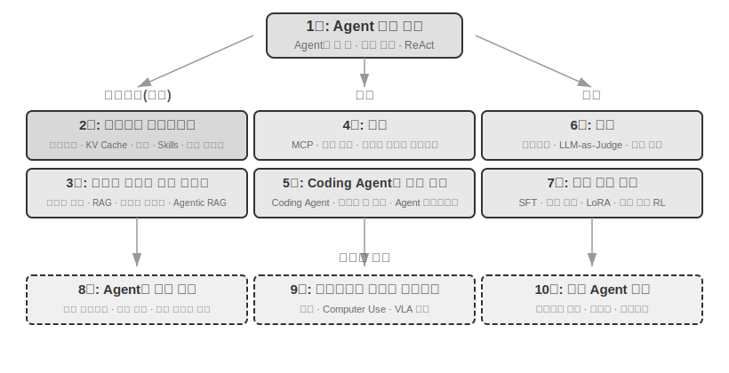

# 들어가며 {.unnumbered}

2025년 8월부터 10월까지 나는 튜링의 《AI Agent 실전 캠프》에서 일련의 기술 강연을 진행했다. 강연의 취지는 단순했다. AI Agent 설계를 “감각 중심”에서 “원칙 중심”으로 바꾸는 것이었다. 단지 데모 하나를 실행하는 방법만 가르치는 것이 아니라 Agent를 왜 그렇게 설계해야 하는지, 아키텍처의 각 결정 뒤에는 어떤 절충점이 있는지를 깊이 이해하게 하고 싶었다. 이 책은 바로 그 강연의 원고와 실험을 정리하고 확장한 결과물이다.

한 가지 흥미로운 점은 이 책이 최초의 구상부터 완성에 이르기까지 그 자체로 **위스퍼 코딩**(whisper coding, 구술식 협업)이라 부를 만한 방식으로 만들어졌다는 사실이다. 내가 말을 건넨 상대는 우리가 직접 만든 음성 Agent인 Pine이었다. 강연을 준비할 때마다 먼저 대략적인 개요를 말해 주고 조사를 맡긴 뒤 초안을 정리하게 했다. 강연이 끝나면 AI Agent 실전 캠프 수강생들의 피드백을 반영해 Pine과 여러 차례 토론하고 다듬었다. 이런 반복을 거쳐 강연 원고를 확장하고 재구성한 것이 오늘날의 이 책이다. 이 과정에서 나는 대부분 타자를 치지 않고 생각을 말로 전달했다. 음성의 대역폭은 타자보다 훨씬 높으며, 보통 말하기 속도는 타자 속도의 약 네 배에 이른다. 덕분에 “구술→조사→토론→수정”의 순환을 매우 빠르게 돌릴 수 있었다. 어떤 의미에서 이 책은 Agent를 설명하는 책인 동시에 Agent가 제작에 참여한 작품이기도 하다.

2025년 초 DeepSeek R1이 공개된 이후 AI 분야는 단순한 기반 모델, 즉 범용 대규모 언어 모델이라는 토대를 넘어 엔지니어링 실전이라는 깊은 영역으로 진입했다. 모델 계층의 발전은 두 방향에서 확인할 수 있다. 한편으로 모델은 에이전트 환경에서의 강화 학습(Agentic Reinforcement Learning)을 통해 도구 호출 능력을 모델 파라미터에 내재화했고, 프로그래밍(coding), 수학, 그래픽 인터페이스 조작(computer use) 등의 영역에서 범용 역량을 익혔다. 모델의 발전 속도도 갈수록 빨라져 GPT-5.2에서 GPT-5.5까지, Claude Opus 4.5에서 4.8까지 모두 불과 반년밖에 걸리지 않았다. 제품 계층에서는 Manus, Claude Code, OpenClaw 같은 범용 Agent가 인간과 컴퓨터의 상호작용 방식을 새롭게 정의하면서 “코드 생성 + 파일 시스템”이라는 아키텍처 패러다임을 주류로 끌어올렸다.

거의 1년 전 강의에서 정리했던 Agent 아키텍처 설계 원칙을 되돌아보며 반갑고도 놀라운 사실을 발견했다. **이 원칙들은 낡기는커녕 오히려 더욱 고전적인 원칙으로 자리 잡았다.** 이후 Agent 업계에는 Skill, Harness, 루프 엔지니어링(loop engineering) 같은 새로운 용어가 잇달아 등장했지만 실제 순서는 정반대다. Anthropic 같은 회사들이 이런 개념을 먼저 발명하고 수많은 Agent가 뒤따라 사용한 것이 아니다. 오히려 많은 Agent가 이미 이런 방식으로 작동하고 있었고, Anthropic이 이를 추출하고 정리해 아키텍처 설계 원칙으로 이름 붙였다. 실천이 먼저였고 명명은 나중이었다.

이 원칙에 대한 확신은 Agent를 실제로 장기 프로세스와 고위험 상황에 적용한 경험에서 비롯됐다. Pine AI의 수석 과학자로서 나는 팀과 함께 Pine을 만들었다. 내가 아는 한 Pine은 실제 사람과 자율적으로 상호작용하며 돈이 관련된 민감하고 복잡한 장기 작업을 신뢰성 있게 독립적으로 처리할 수 있는 최초의 범용 Agent다. 사용자를 대신해 통신사에 전화해 요금을 협상하고, 판매자와 환불이나 민원을 조정하며, 구독을 취소한다. 이 모든 과정에서 사람의 개입은 필요하지 않다. 이런 작업은 협상이 수십 차례 오가기도 하며 어느 한 단계에서라도 실수하면 실제 금전적 손실로 이어진다. 신뢰성에 대한 이처럼 엄격한 요구가 이 책에서 거듭 강조하는 아키텍처 원칙을 하나씩 만들어 냈다. 다음은 그 실천에서 나온 사례다.

- Skill 개념이 유행하기 훨씬 전부터 우리는 프롬프트가 끝없이 늘어나는 문제를 해결하기 위해 프롬프트를 동적으로 불러왔고, 도구 목록이 무한히 길어지는 문제를 해결하기 위해 명령줄로 도구를 실행했으며, Agent가 실행 환경과 사용자의 시간 및 작업 상태를 인식하지 못하는 문제를 해결하기 위해 시스템 상태 표시줄 기술을 사용했다.
- Harness 개념이 유행하기 훨씬 전부터 우리는 Claude Code와 유사한 방법으로 모델 도구 호출의 불안정성, 환각, 위험한 작업, 권한 밖의 작업, 지시 불이행 문제를 해결해 왔다.
- 루프 엔지니어링 개념이 유행하기 훨씬 전부터 우리는 이 책에서 제안자-검토자(proposer-reviewer)라고 부르는 방법으로 모델이 너무 일찍 작업 완료를 선언하는 문제를 해결했다. Agent가 스스로 만든 산출물(artifact)을 검토하고 반복해서 개선하게 한 것이다.

물론 이것들이 우리만의 발명인 것은 아니다. 내가 아는 한 대부분의 선도적인 모델 회사와 Agent 회사도 비슷한 방법을 스스로 찾아냈다. 이것이 내가 2025년 8월 튜링에서 《AI Agent 실전 캠프》를 개설하고 2024년부터 2026년까지 중국과학원대학에서 AI Agent 실습 과목을 계속 개설한 이유다. 이 책을 닫아 두고 인세를 받는 대신 오픈 소스로 공개하기로 한 것도 이 지식이 더 많은 실무자에게 전해지기를 바랐기 때문이다.

**실천이 먼저였고 명명은 나중이었다.** 이 순서는 기업용 Agent 개발에 매우 실질적인 의미가 있다. **어떤 Agent 용어가 업계에서 유행할 때까지 매번 기다렸다가 실천한다면 이미 한발 늦은 것이다.** 한 용어가 유행할 즈음이면 선도 기업들은 대개 그 용어가 가리키는 문제를 이미 한 차례 해결해 본 뒤다. 그렇다면 용어가 유행하기 전에 무엇을 해야 하는지 어떻게 알 수 있을까? 나는 다음 두 가지가 가장 중요하다고 생각한다.

**첫째, Agent의 역량 한계에 매우 높은 수준을 요구하는 실제 비즈니스가 있어야 하며, 그 비즈니스에서 진짜 피드백을 계속 얻을 수 있어야 한다.** Pine을 예로 들면 하나의 일을 처리하는 데 몇 시간, 때로는 몇 주가 걸리며 그 과정에서 여러 이해관계자와 거듭 소통해야 할 수 있다. 몇 시간 동안 전화를 하고, 컴퓨터로 여러 페이지에 달하는 복잡한 양식을 작성하며, 이메일을 여러 차례 주고받기도 한다. 처음부터 끝까지 어떤 숫자도 틀려서는 안 되며 모든 소통에서 항상 신중하게 사용자의 이익을 지켜야 한다. 이처럼 충분히 복잡한 상황에 놓여야만 실천이 자연스럽게 Harness를 구축하도록 압박하고, 지금의 모델 자체로는 할 수 없지만 비즈니스에서는 반드시 해야 하는 일을 해결하게 만든다. 반대로 비즈니스가 역량 한계에 높은 수준을 요구하지 않고 모델이 조금만 업그레이드되어도 충분하다면 이런 아키텍처 원칙을 다듬을 동기도 생기지 않는다.

**둘째, 반드시 평가(Evaluation) 메커니즘을 구축해야 한다.** 이것 역시 이 책에서 거듭 강조하는 점이다. 평가가 없으면 발전도 없다. 평가는 한 번의 변경이 정말 개선을 가져왔는지, 아니면 단지 운이 좋았는지를 구별하게 해 준다. 그 결과 Agent의 개선 방향이 더 이상 직감에 의존하지 않게 된다. 결국 우리가 주장하는 것은 과학적 방법론으로 엔지니어링을 수행하고 Agent를 만드는 것이며, 평가는 그 방법론의 토대다. 6장에서 이 체계를 자세히 설명한다.

기반 모델이 어떻게 업그레이드되고 제품 형태가 어떻게 혁신되더라도 거의 모든 성공적인 Agent 시스템은 같은 아키텍처 패턴을 따른다. 이는 우연이 아니다. **좋은 설계 원칙은 본래 모델의 발전 주기를 뛰어넘어야 한다.** 그 원칙이 설명하는 대상은 특정 모델의 사용법이 아니라 지능형 시스템이 세계와 상호작용하는 기본 패턴이기 때문이다.

튜링상 수상자이자 강화 학습의 아버지인 Richard Sutton은 우주의 진화가 먼지에서 별로, 별에서 생명으로, 생명에서 에이전트로(원문에서는 설계된 존재(designed entities)) 이어지는 네 단계를 거쳤다고 말한 바 있다. 생물학적 진화는 맹목적이다. 무작위로 변이가 일어나고 자연 선택이 뒤따른다. 대부분의 생물은 자신의 작동 원리를 이해하지 못하며 생물을 스스로 설계하거나 개조하지도 못한다. 반면 Agent는 우주 진화의 역사에서 완전히 새로운 존재다. 코드를 생성해 부트스트랩(bootstrap)하고 스스로 진화할 수 있다. 한 프로그래머가 또 다른 프로그래머를 만들고, 새로 만들어진 프로그래머가 그다음 프로그래머를 계속 만드는 것과 같다. 다시 말해 Agent는 자신의 작동 메커니즘을 이해하고 목표에 따라 완전히 새로운 Agent를 만들며 심지어 자기 자신을 개선할 수도 있다. 이 책의 사명은 독자가 이런 창조의 원리를 이해하고 익히도록 돕는 것이다.

이 책의 핵심 공식은 단 하나다. **Agent = LLM + 컨텍스트 + 도구**. 셋 중 어느 하나도 빠질 수 없다.

더 직관적으로 말하면 **두뇌 + 눈 + 손발**이다. 두뇌(LLM)는 생각하고 결정하며, 눈(컨텍스트)은 Agent가 어떤 정보를 볼 수 있는지 결정하고, 손발(도구)은 Agent가 무엇을 할 수 있는지 결정한다. 엄밀히 말해 “눈”은 대략적인 비유일 뿐이다. 컨텍스트에는 환경 정보와 대화 기록뿐 아니라 도구 정의도 포함된다. 즉 Agent가 “보는” 정보에는 “어떤 손발을 사용할 수 있는가”도 들어 있다. 이 비유의 목적은 컨텍스트가 모델이 인식할 수 있는 모든 정보라는 핵심 직관을 전달하는 데 있다.

강화 학습에 익숙한 독자라면 이 세 요소를 RL의 형식 언어에 대응시킬 수도 있다. 구체적으로 LLM은 정책(Policy), 컨텍스트는 관찰 공간(Observation Space), 도구는 행동 공간(Action Space)에 해당한다. 세 가지 표현은 서로 다른 추상화 수준에서 같은 대상을 설명한다.

그러나 이 세 단어가 지닌 의미는 글자 그대로의 뜻보다 훨씬 풍부하다. 1장에서는 실천을 출발점으로 삼아 각 요소를 하나씩 분해하고 직관적 이해부터 학술 개념까지 완전한 대응 관계를 세운다.

## 책의 구성 {.unnumbered}

이 책은 모두 10개 장이며 세 부분으로 나뉜다(그림 0-1, 그림 0-2). 1장은 기초로서 Agent에 관한 전체적인 인식을 세운다. 2장부터 7장까지는 세 가지 핵심 축인 컨텍스트(2~3장), 도구(4~5장), 모델(6~7장, 평가와 사후 학습)을 차례로 설명한다. 8장부터 10장까지는 심화 내용과 응용을 다루며 Agent의 자기 진화, 멀티모달과 실시간 상호작용, 다중 Agent 협업을 보여 준다.

- **1장(Agent 기초 지식)**은 여러 실제 Agent 제품을 통해 Agent에 관한 직관적인 이해를 세운다. 구현 계층의 LLM + 컨텍스트 + 도구, 직관 계층의 두뇌 + 눈 + 손발, 학술 계층의 정책(Policy), 관찰 공간(Observation Space), 행동 공간(Action Space)으로 이어지는 Agent의 핵심 공식을 깊이 분석한다. 또한 실험을 통해 “생각→행동→관찰”의 반복 과정인 ReAct 루프의 작동 메커니즘을 해부하고, Agent의 세 가지 학습 패러다임인 사후 학습(Post-training), 인컨텍스트 학습(In-Context Learning), 외부화 학습(Externalized Learning)을 소개한다. 마지막으로 워크플로부터 자율 Agent까지 이어지는 오케스트레이션 설계 패턴을 논의해 이후 장을 위한 통일된 개념 체계를 세운다.
- **2장(컨텍스트 엔지니어링)**은 이 책에서 가장 중요한 장으로, Agent의 “눈”에 해당하는 컨텍스트를 체계적으로 설명한다. 먼저 API 메시지 구조와 Agent의 핵심 루프에서 출발해 “컨텍스트는 메시지 목록이다”라는 토대를 세우고, KV Cache(대규모 모델 추론 과정에서 과거 계산 결과를 재사용하는 메커니즘)의 근본 원리를 깊이 살펴본다. 이어 프롬프트 엔지니어링(Prompt Engineering, 프로세스 설계, 도구 설명, 비즈니스 규칙 구체화 포함)과 프롬프트 인젝션(Prompt Injection) 공격 및 방어, Agent Skills의 주문형 로딩 메커니즘, Agent 상태 표시줄 기술, 컨텍스트 압축(Context Compression) 전략을 차례로 다룬다. 각 용어의 완전한 정의는 본문에서 처음 등장할 때 제시한다.
- **3장(사용자 기억과 지식 베이스)**은 컨텍스트 관리를 세션을 넘나드는 영속적인 지식 체계로 확장한다. Agent가 현재 대화의 내용만 기억하는 데 그치지 않고 여러 대화에 걸쳐 지식을 축적하고 불러오게 한다. 사용자 기억을 위한 네 가지 점진적 전략, RAG(검색 증강 생성, 먼저 관련 문서를 검색한 뒤 모델이 답변을 생성하게 하는 방식)의 전체 기술 스택(다양한 텍스트 검색 방법과 검색 결과 순위 최적화 포함), 멀티모달 정보 추출, 더 고도화된 지식 구성 방법, 에이전틱 RAG(Agentic RAG, Agent가 언제 무엇을 검색할지 자율적으로 결정하는 방식)를 다룬다.
- **4장(도구)**은 Agent와 외부 세계를 잇는 다리를 살펴본다. 도구는 Agent의 “손발”과 같아서 웹을 검색하고 API를 호출하며 데이터베이스를 조작할 수 있게 한다. MCP 도구 상호운용성 표준과 다섯 종류의 도구(인식, 실행, 협업, 이벤트 트리거, 사용자 소통)에 관한 설계 원칙을 소개하고, 실행 도구의 안전 메커니즘과 이벤트 기반 비동기 Agent 아키텍처를 중점적으로 설명한다.
- **5장(Coding Agent와 코드 생성)**은 Coding Agent와 파일 시스템의 결합이 모든 범용 Agent에서 가장 핵심적인 기술 기반임을 논증한다. OpenClaw 아키텍처를 중심으로 Coding Agent의 작업 흐름과 구현 기법을 분석하고, 사고 보조와 지식 베이스 구축에서 새로운 도구의 동적 생성과 Agent 부트스트랩에 이르기까지 프로그래밍을 넘어선 코드 생성의 폭넓은 가치를 보여 준다.
- **6장(Agent 평가)**은 과학적인 평가 방법론을 구축한다. 평가 환경(도구 호출형과 인간-컴퓨터 상호작용형이라는 두 핵심 패러다임 및 장 마지막에서 별도로 논의하는 시뮬레이션 환경), 데이터셋 설계 원칙, LLM-as-a-Judge 자동 평가 방법, 평가 기반 모델 선정, 평가 결과를 시스템 개선으로 바꾸는 완전한 폐루프를 다룬다.
- **7장(모델 사후 학습)**은 SFT(지도 미세 조정, 레이블이 있는 데이터로 모델이 “예시를 따라 배우게” 하는 방식)와 RL(강화 학습, 모델이 시행착오와 보상 피드백을 통해 스스로 발전하게 하는 방식)이라는 두 가지 사후 학습 기술을 깊이 살펴본다. “SFT는 기억하고 RL은 일반화한다”와 “알고리즘보다 데이터와 환경이 더 중요하다”라는 핵심 주장을 중심으로 사전 학습/SFT/RL의 세 단계 전체상, 고전적인 RL 이론, 보상 신호 설계(이진 보상에서 과정 보상, 다시 “결과에는 보상을, 과정에는 제약을” 적용하는 검증 경로 페널티까지), 단일 라운드와 다중 라운드 강화 학습 알고리즘, 샘플 효율 최적화 같은 최신 연구를 다룬다.
- **8장(Agent의 자기 진화)**은 모델 가중치를 수정하지 않고 Agent를 계속 강화하는 방법을 살펴본다. 두 가지 주요 진화 경로는 경험에서 학습하는 방법(전략 요약, 워크플로 기록, 시스템 프롬프트 자동 최적화, Skills 지식의 외부화)과 도구를 능동적으로 발견하고 만드는 방법(MCP-Zero, 오픈 소스 도구 통합, 코드로 새 도구 만들기)이다.
- **9장(멀티모달과 실시간 상호작용)**은 Agent가 텍스트 세계에서 물리 세계로 나아갈 미래를 전망한다. 음성 Agent(직렬 파이프라인에서 종단 간 모델까지), 컴퓨터 사용(Computer Use, Agent가 사람처럼 그래픽 인터페이스를 조작하게 하는 기술), 로봇 조작(VLA(비전-언어-행동 모델) 제어와 Sim2Real 전이)을 다루며 멀티모달과 실시간성이 가져오는 공통적인 아키텍처 과제를 밝힌다.
- **10장(다중 Agent 협업)**은 AI Agent 시스템의 궁극적인 형태인 여러 Agent의 분업과 협업을 논의한다. 다중 Agent 협업의 분류 체계(컨텍스트 공유/독립 × 동등/관리자/탈중앙화)를 체계적으로 설명하고, 번역 Agent와 전화+컴퓨터 Agent 등의 사례를 통해 협업 아키텍처의 설계 방법을 보여 주며, Agent 사회와 Agent 경제라는 최신 방향을 전망한다.

## 이 책을 읽는 방법 {.unnumbered}

이 책의 각 장은 비교적 독립적이므로 필요에 따라 서로 다른 독서 경로를 선택할 수 있다.

- **Agent 개발자라면** 책 전체를 순서대로 읽기를 권한다. 1장부터 5장까지가 핵심 지식 체계를 이루며 6장의 평가 방법론도 빼놓을 수 없다. 7장은 모델을 맞춤화해야 하는 독자를 위한 내용이고, 8장부터 10장까지는 심화 방향을 보여 준다.
- **시간이 부족하다면** 전체적인 인식을 세우는 1장과 가장 중요한 컨텍스트 엔지니어링을 익히는 2장을 먼저 읽기 바란다. 2장에 나오는 KV Cache의 근본 원리는 기술적 성격이 강하다. 처음 읽을 때는 원리 부분을 건너뛰고 도입부의 세 가지 핵심 결론만 기억해도 이후 내용을 이해하는 데 지장이 없다.
- **모델 학습에 관심이 있다면** 7장(모델 사후 학습)부터 바로 읽어도 된다. 평가 방법(6장)은 학습의 전제 조건이므로 함께 읽기를 권하며, 전체적인 인식을 세우기 위해 먼저 1장과 2장을 읽는 것이 좋다.

각 장에는 수많은 **실험**과 **생각해 볼 문제**가 포함되어 있으며 “실험 X-Y” 형식으로 번호를 붙였다. X는 장 번호이고 Y는 해당 장 안의 일련번호다. 실험과 생각해 볼 문제의 제목에는 별표로 난도를 표시했다. ★는 모든 독자에게 적합한 입문 수준, ★★는 어느 정도의 엔지니어링 실무 경험이 필요한 중간 수준, ★★★는 대개 개방형 문제나 복잡한 시스템 설계를 다루는 고급 도전 과제를 뜻한다. 대부분의 실험에는 완전한 실행 가능 코드가 있으며 함께 제공되는 오픈 소스 저장소에 정리되어 있다.

> **실습 코드 저장소**: [https://github.com/bojieli/ai-agent-book](https://github.com/bojieli/ai-agent-book)

저장소의 프로젝트 이름은 책의 실험과 일대일로 대응하며 각 프로젝트에는 완전한 실행 안내와 의존성 설정이 들어 있다. 직접 이 실험들을 실행해 보기를 강력히 권한다. AI Agent는 실천이 매우 중요한 분야이며 많은 설계 직관은 직접 디버깅하는 과정에서야 비로소 제대로 형성된다.

**용어에 관한 규칙 한 가지**: 영어 기술 용어 중에는 중국어로 직역하면 모호해지는 말이 있다. 중국어 원서에서는 자주 쓰이는 두 단어를 특별히 구분한다. reasoning, 즉 모델이 중간 추론을 전개하며 “생각하는” 과정은 ‘思考’로, inference, 즉 모델의 순전파 계산과 배포 실행은 ‘推理’로 옮긴다. ‘추론’을 뜻할 수 있는 중국어 단어 하나에 두 개념이 함께 담겨 독자가 구별하지 못하는 일을 피하기 위해 서로 다른 단어를 사용한 것이다. 이 한국어판도 같은 원칙을 따라 모델의 사고 사슬(Chain-of-Thought), 사고형 모델(OpenAI o 시리즈와 DeepSeek-R1 등, 이 책에서는 ‘사고 모델’, ‘사고자’라고 부름), 사고 토큰, 사고 과정을 가리킬 때는 일관되게 **생각**을 사용한다. 모델의 실행과 배포(추론 시점, 추론 비용, 추론 스택, 추론 시점 확장 등)를 가리킬 때는 **추론**을 사용한다. 다만 한국어에서 이미 널리 쓰이는 **논리적 추론, 다중 홉 추론, 공간 추론, 시간적 추론** 및 ‘추론 게임’ 같은 일상적 표현은 관례에 따라 ‘추론’을 유지한다. 문맥에 따라 이해하기 바라며, 이런 표현은 앞에서 말한 inference의 기술적 의미가 아니라 연역적 추론이라는 일반적 의미를 가리킨다. 그 밖의 핵심 용어는 본문에서 처음 등장할 때 한국어와 영어를 함께 제시한다.

## 선수 지식 {.unnumbered}

이 책은 어느 정도 기술적 배경이 있는 독자를 대상으로 하지만 특정 분야의 전문가일 필요는 없다. 독자가 준비 정도를 판단할 수 있도록 선수 지식을 “필수”와 “권장”의 두 수준으로 나누어 정리했다.

**필수: 책 전체를 읽기 위한 기초**

- **Python 프로그래밍**: 책의 거의 모든 실험은 Python을 기반으로 한다. Python의 기본 문법, 자주 쓰는 데이터 구조, 패키지 관리(pip) 등의 기초 개념에 익숙해야 한다. 능숙할 필요까지는 없지만 중간 정도 복잡도의 Python 코드를 읽고 수정할 수 있어야 한다.
- **LLM의 기본적인 사용 경험**: ChatGPT, Claude 또는 이와 비슷한 제품을 사용해 본 적이 있고 “프롬프트(Prompt)→모델 응답”이라는 기본 상호작용 방식을 이해해야 한다.
- **AI 보조 프로그래밍 도구 한 가지**: Claude Code, Codex, Cursor, Trae 같은 AI 보조 프로그래밍 도구를 적어도 하나 설치하고 익숙해지기를 강력히 권한다. 한편으로 이 도구들은 실험의 개발 효율을 크게 높여 준다. 책의 실험에는 많은 코드 작성과 디버깅이 필요하기 때문이다. 다른 한편으로 이런 프로그래밍 도구 자체가 성숙한 Coding Agent다. 이를 사용하면서 이 책에서 거듭 논의하는 ReAct 루프, 도구 호출, 컨텍스트 관리 등의 핵심 메커니즘을 직관적으로 경험할 수 있다. 이러한 직접 경험은 Agent의 설계 원칙을 이해하는 데 매우 큰 가치가 있다.
- **소프트웨어 엔지니어링 상식**: 명령줄 조작, Git 버전 관리, JSON 데이터 형식, REST API 등의 기본 개념에 익숙해야 한다. 이는 실험을 실행하고 Agent의 도구 호출 메커니즘을 이해하기 위한 토대다.

**권장: 특정 장의 이해를 돕는 지식**

- **머신 러닝 기초**(7장): 학습과 추론, 손실 함수, 경사 하강법, 과적합 등의 기본 개념을 알면 모델 사후 학습을 이해하는 데 도움이 된다.
- **기초 수학**(2~3장, 7장): 선형대수에 대한 직관적 이해, 예를 들어 벡터가 방향과 크기를 나타내고 행렬이 일괄 연산을 수행할 수 있다는 사실을 알면 임베딩과 어텐션 메커니즘을 이해하는 데 도움이 된다. 확률과 통계에 대한 기초 지식은 평가 지표와 강화 학습의 기대 보상을 이해하는 데 유용하다. 책의 수학은 복잡한 유도보다 직관적인 설명에 초점을 둔다.
- **웹 개발 기초**(4장, 9장): HTTP, WebSocket, 프런트엔드와 백엔드를 분리한 아키텍처 등의 개념을 알면 이벤트 기반 비동기 Agent 아키텍처와 음성 Agent의 실시간 통신 실험을 이해하는 데 도움이 된다.
- **Transformer 아키텍처에 대한 기본 지식**(2장, 7장): Transformer는 오늘날 거의 모든 대규모 언어 모델의 기반 아키텍처다. 대규모 모델의 기초 지식을 체계적으로 보충하고 싶은 독자에게는 튜링에서 출판한 《그림으로 이해하는 대규모 모델》을 권한다. 이 책은 Transformer 아키텍처, 사전 학습, 미세 조정 등의 핵심 개념을 직관적인 그림으로 설명하며, 이 책의 Agent 엔지니어링 관점과 좋은 보완 관계를 이룬다.

일부 선수 지식이 부족하더라도 주저할 필요는 없다. 이 책의 핵심 가치는 특정 알고리즘이나 기법이 아니라 **아키텍처 설계 원칙과 엔지니어링 실천의 방법론**에 있다. 7장의 사후 학습을 제외하면 책 전체에서 요구하는 수학과 머신 러닝의 수준은 낮으므로 충분히 출발점으로 삼을 수 있다.

Agent 기술은 지금도 빠르게 발전하고 있지만 **좋은 아키텍처 설계 원칙에는 시간을 뛰어넘는 힘이 있다.** “왜 이렇게 설계해야 하는가”를 익히면 기술의 물결이 변해도 명확한 판단력을 유지할 수 있다. 이 책이 AI Agent를 구축하는 독자에게 믿을 만한 안내서가 되기를 바란다.

## 감사의 말 {.unnumbered}

성실하게 책을 편집하고 튜링의 《AI Agent 실전 캠프》를 조직하기 위해 애써 준 튜링의 멍거 선생님과 류메이잉 선생님께 감사드린다. 중국과학원대학에서 AI Agent 실습 과목을 개설해 준 류쥔밍 선생님께도 감사드린다. 튜링 《AI Agent 실전 캠프》의 모든 수강생과 중국과학원대학 AI Agent 실습 과목의 모든 학생에게도 특별히 감사드린다. 강의 과정에서 여러분은 가치 있는 피드백과 제안을 많이 전해 주었고, 나 역시 이런 개념을 더 명확히 이해할 수 있었다.

Pine AI의 모든 동료에게 감사드린다. Pine AI라는 훌륭한 제품과 그 제품이 제기한 여러 도전이 없었다면 Agent 분야에서 이처럼 깊이 이해하고 실천할 수 없었을 것이다. 수많은 생각의 교류 속에서 동료들도 귀중한 통찰을 아낌없이 보태 주었다.

AI 업계의 많은 친구에게도 감사드린다. 여기에서 이름을 일일이 밝히지는 않지만 여러 업계 토론에서 내 관점에 솔직한 피드백을 주었고, 잘못된 판단을 여럿 바로잡아 주었으며 모델과 Agent에 관한 내 이해를 한층 높여 주었다.

무엇보다 가족, 특히 아내 멍자잉에게 가장 깊이 감사드린다. 아내는 이 책을 완성하는 동안 늘 나를 지지했고 책을 위한 소중한 의견도 많이 전해 주었다.
